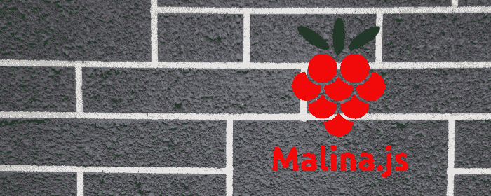
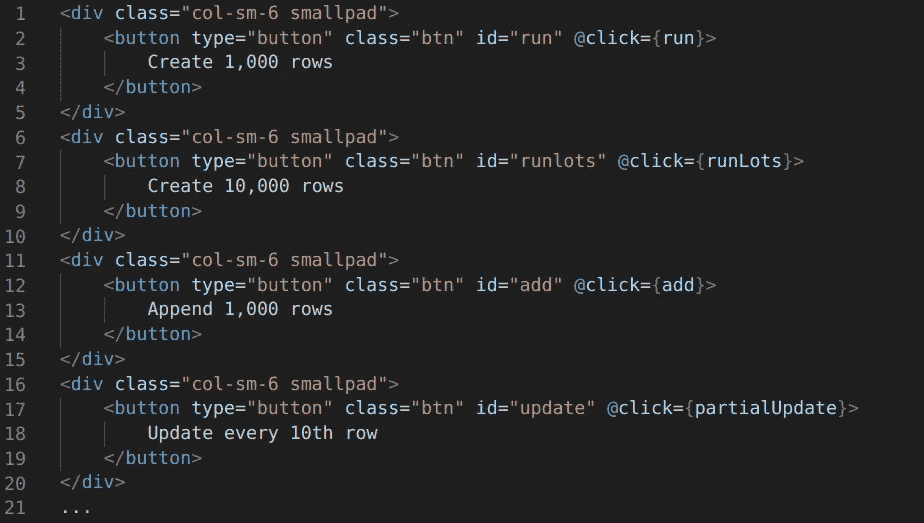
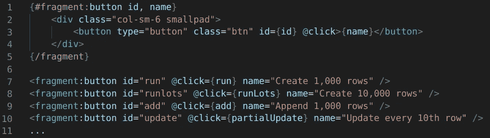
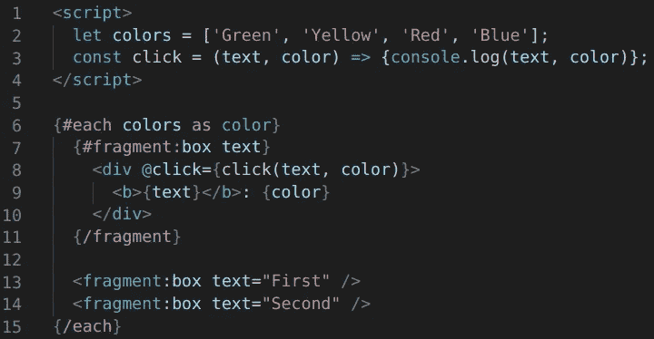
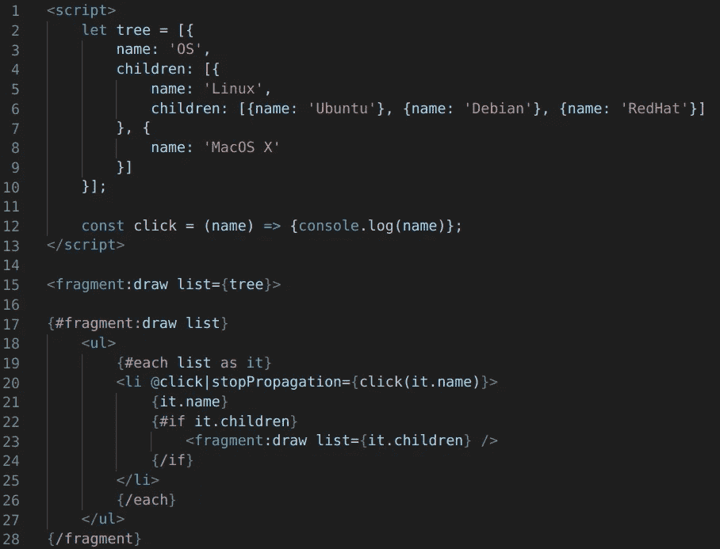

# “片段”如何帮助你的网站开发

> 原文：<https://javascript.plainenglish.io/how-fragments-can-help-in-your-web-development-5efc4d10f9da?source=collection_archive---------3----------------------->

没有人会问为什么我们需要可能性来编写函数，这在编程中是显而易见且非常有用的事情。函数有助于生成可重用的代码，它为您的应用程序提供了更好的模块化。

为什么不在组件的模板中使用同样的东西，现在许多框架提供了在组件中包含子组件的可能性。但更像是单独的模块，而不是这样的功能。一个组件不仅有模板，它还可以有自己的 JavaScript 代码，自己的风格，自己的作用域，所以它是一个更重更独立的部分。

这也是为什么`*function for template*`是在 [**Malina.js**](https://github.com/malinajs/malinajs) 开发的。名为“ **fragment** ”，它比一个完整的组件要轻，不需要将它分离到另一个文件中，并且它具有一些普通函数所具有的能力，如递归和闭包，因为它在最后被编译成一个函数。

## 1.重用模板的片段

当你制作一个模板时，特别是一些表单，你可以有可重复的模块，比如按钮、输入、面板等等。，在这种情况下你可以重用相似的模板片段。下面是来自 *js-framework-benchmark* 的一个片段，其中有一系列类似的按钮:

使用*片段*可以将其重写为:

所以我们在这里声明了一个片段`button`，它有两个参数`id, name`和来自按钮`@click`的转发事件`click`。虽然这一部分可以用可重复的指令(for/each)来完成，但是片段并不总是放在一行中。

## 2.关闭

由于片段是一个函数，它可以在任何地方声明，例如在循环内部，这意味着它可以有闭包。在下面的例子中，片段`box`有一个来自循环的参数`text`和闭包变量`color`，以及一个来自根作用域`@click={click(text, color)}`的函数`click`的链接

## 3.递归

片段可以调用自身，这有助于进行递归，例如用于构建元素树，此外，片段可以在组件的底部声明，因为 JavsScript 中的函数在作用域级别上可用，在调用自身的片段`draw`的示例下

## 结论

Fragment 是组件中一个轻量级的、可重用的模板，它有助于制作结构更好、更紧凑的组件。

所有的例子你都可以在[在线 REPL](https://malinajs.github.io/repl/) 中尝试，它们被储存在[这里](https://gist.github.com/lega911/22128e750fef5361837e4696162d6d36)。

感谢阅读。

# 链接

*   [在线编辑 REPL](https://malinajs.github.io/repl/)
*   [Malina.js](https://github.com/malinajs/malinajs)
*   [malina . js 的文档](https://malinajs.github.io/docs/)
*   [举例说明](https://gist.github.com/lega911/22128e750fef5361837e4696162d6d36)