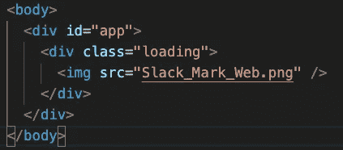

# 我如何在我的 React 应用程序中添加加载屏幕

> 原文：<https://javascript.plainenglish.io/how-i-added-a-loading-screen-to-my-react-slack-clone-a87a80c703aa?source=collection_archive---------5----------------------->

周末，我决定重访我构建的一个全栈 Slack 克隆。我想给它添加一些新功能，如添加表情符号的信息和所有当前用户的查看页面。但我也想为应用程序的初始加载添加一个加载屏幕。通过增强用户体验，加载屏幕可以是对应用程序的有益补充。在这篇文章中，我将回顾一下我是如何做到的。

我想添加一个加载屏幕的原因是我不满意初始加载的速度。如果你像我一样，你可能正在使用 Heroku 的免费版本，或者类似的东西来托管你的项目。这是一个很好的服务，但因为它是免费的，你的应用程序可能不在 Heroku 的服务器优先列表上哈哈。因此，在我进入实际代码之前，我想提供一个 web 应用程序加载事件的概述。

下面是一个简单的图表:

该网站的文件存储在一个服务器(Heroku)上，通过互联网发送给你所要求的用户。很简单，对吧？现在有不同的方式将这些文件发送给用户。

一种是服务器端渲染，另一种是客户端渲染。我不打算深入探讨这个问题，但是已经有很多很棒的文章了。

我的 app 是客户端渲染；哪个更适合像我这样的互动网站。

如你所见，浏览器完成了客户端渲染的所有工作。当浏览器下载 js 并执行 react 时，我想为用户提供内容。这就是加载屏幕出现的地方！

由于我的应用程序是客户端渲染，也是一个全栈应用程序，这意味着有一个前端和一个后端，加载事件可以分为两部分。首先为初始构建提供加载屏幕，其次在前端从后端加载数据时提供加载屏幕。

## 初始版本:

如果你正在进行客户端渲染，DOM 首先会看到你的公共文件夹中的根 HTML 文件。这就是加载屏幕要去的地方。现在，您可以将加载元素放在 React 应用程序的根 DOM 元素之外，并在 React 应用程序的初始装载中删除它们，但您也可以将它们放在根 Dom 元素内，React 会在装载后自动删除它。无论哪种方式浮动你的船！

试着让加载屏幕尽可能简单。我的只是一个单一的图像和一些 CSS 动画。

现在添加了这个内容，加载事件看起来像这样:

As a side note, this gif was taken off my site loading locally; that’s why it is so fast.

如果你注意到有一个我不想要的观点的快速闪现。特别是，如果没有消息存储在状态中，那么该视图将被有条件地呈现。造成这种情况的原因是视图在 API 调用完成之前就呈现出来了。这是我们可以为 API 调用添加第二个加载屏幕的地方。

## **API 调用:**

这是我最初的 React 主要组件。我正在获取组件中的应用程序的所有数据。

我想补充的是这样的:

在等待 API 调用之后，我可以调用 handleLoad 函数来改变主要组件的状态，呈现应用程序的其余部分，并清除任何更改，例如将我的 Body 标记的背景色从紫色改为白色。此外，我将该函数的主体包装在 setTimeout 中。这增加了加载事件的一致性。

下面是最终的结果！我希望你会发现这些信息很有用，欢迎在下面留下你的评论！

