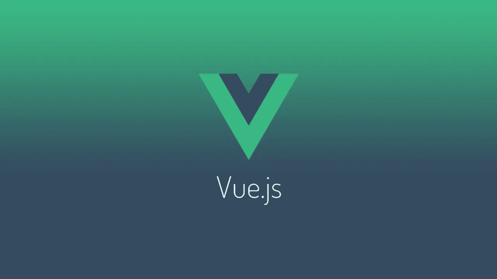
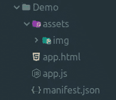
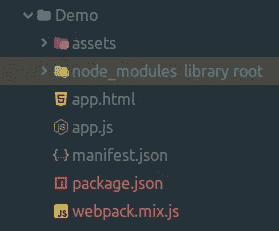
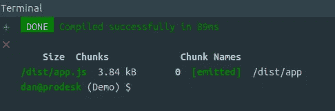
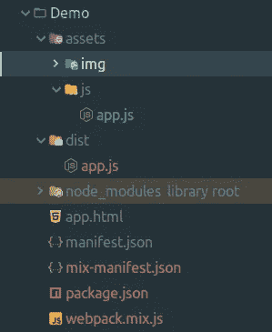
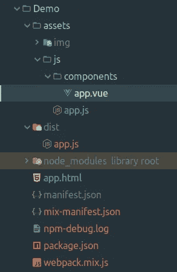
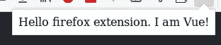
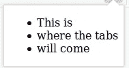
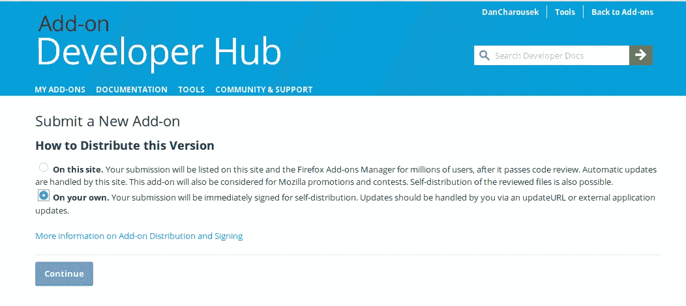
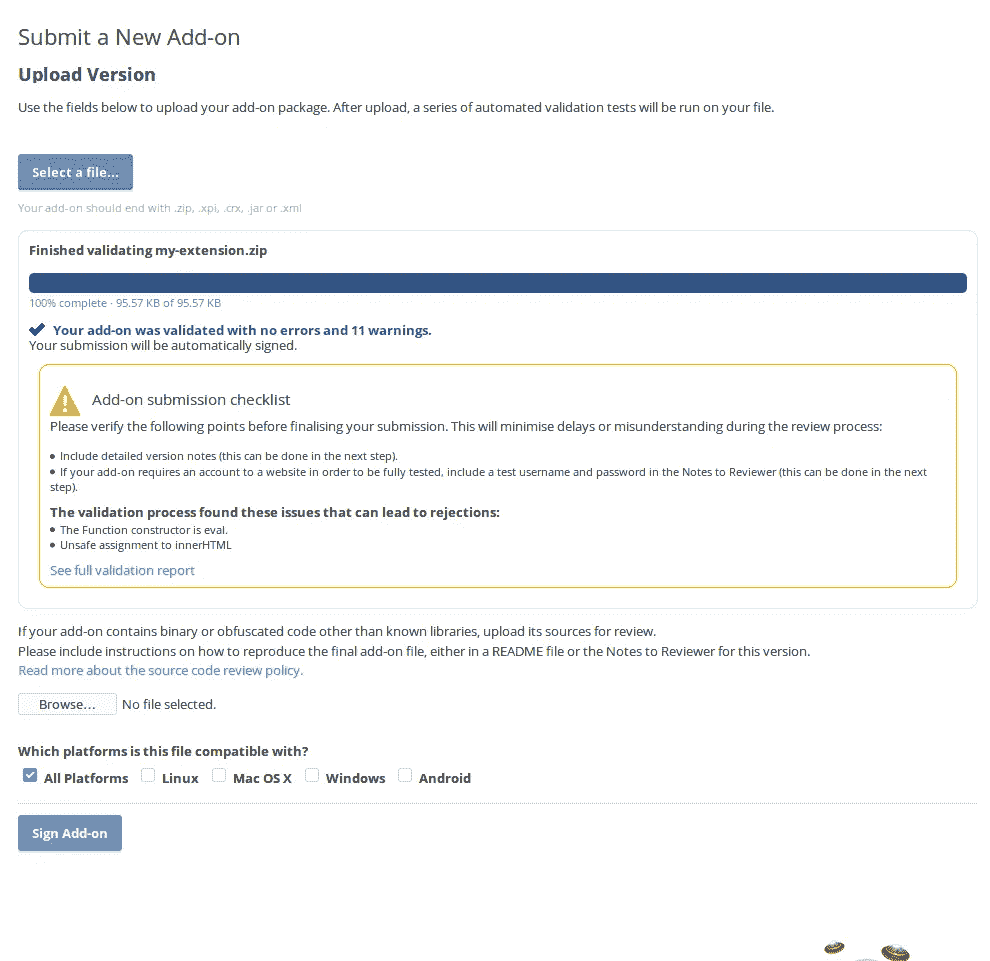

# 我如何用 Vue 构建浏览器扩展(第 2 部分)

> 原文：<https://javascript.plainenglish.io/how-i-built-a-browser-extension-with-vue-part-2-2c4ab2dd752d?source=collection_archive---------0----------------------->

在本文的第 2 部分，我将向您展示如何使用我们在第 1 部分开始构建的浏览器扩展。

还没读第一部分吗？去看看这里的。



Let’s get Vueified!

# 先决条件

```
$ npm -v
3.5.2
$ node -v
v8.10.0
```

如果您已经完成了第 1 部分，那么您现在应该有一个类似如下的扩展项目:



我们扩展的核心是由一个 html 文件`app.html`和`app.js`中的脚本组成的，它为我们的扩展提供了一些基本的功能。

这意味着在开发一个常规网站时，我们可以使用我们习惯的所有工具。

如果您不熟悉 **Webpack** 或 **Laravel Mix** ，不要担心，只要按照步骤操作，我相信一旦我们开始使用 **Vue** 本身，您就会跟上。

现在让我们初始化`package.json`并拉入**拉拉夫**混音:

```
npm init -y
npm i --save-dev laravel-mix
```

Laravel Mix 带有一个默认的配置文件，所以让我们把它复制到我们的根目录。

```
cp node_modules/laravel-mix/setup/webpack.mix.js .
```

我们的扩展现在看起来像这样:



如果您查看了 **Laravel Mix** 的[安装指南](https://github.com/JeffreyWay/laravel-mix/blob/master/docs/installation.md)，其中有针对`package.json`的推荐脚本，那么让我们也添加这些脚本:

```
{
    ...
    "main": "app.js",
    "scripts": {
        "dev": "NODE_ENV=development node_modules/webpack/bin/webpack.js --progress --hide-modules --config=node_modules/laravel-mix/setup/webpack.config.js",
        "watch": "NODE_ENV=development node_modules/webpack/bin/webpack.js --watch --progress --hide-modules --config=node_modules/laravel-mix/setup/webpack.config.js",
        "hot": "NODE_ENV=development webpack-dev-server --inline --hot --config=node_modules/laravel-mix/setup/webpack.config.js",
        "production": "NODE_ENV=production node_modules/webpack/bin/webpack.js --progress --hide-modules --config=node_modules/laravel-mix/setup/webpack.config.js"
    },
    "keywords": [],
    ...
}
```

让我们做一些快速清理并将`app.js`移动到`assets/js`文件夹中。我们还需要适当地调整到`app.html`中`app.js`的路径，但我们将在稍后讨论。

如果你打开`webpack.mix.js`文件，你会看到它包含了来自 **Laravel Mix** 的完整 API。我们只需要一个方法调用，如下所示:

```
let mix = require('laravel-mix');
mix.js('assets/js/app.js', 'dist/');
```

如果你跑了

```
npm run dev
```

您应该看到您的构建通过，并且一个`dist`文件夹应该出现在您的根文件夹中:



`app.js`的 dist 版本是我们将在`app.html`中链接的版本。

*注:dist 是 distribution 的简称，顺便说一下。Laravel Mix 负责缩小我们的 JS 代码，以及执行可能需要的其他任务，例如从 ES6/7/8 向下转换到 ES5，以便旧浏览器可以处理代码。如果我们刚刚说的听起来有点混乱，请让我们知道，也许我们会写一篇文章来更好地解释它🤓*

让我们现在就这样做，同时在那个文件中，让我们也清除那个文件一点:

```
<!DOCTYPE html>
<html>
    <head>
        <meta charset="utf-8">
    </head>
    <body>
        <div id="my-app"></div>
        <script src="dist/app.js"></script>
    </body>
</html>
```

如您所见，我从第 1 部分中删除了按钮和列表。我们现在唯一需要的是一个包装器，用于装载我们的 **Vue** 实例，在本例中是带有`id` 和`my-app`的`div`。还要注意到`app.js`的路径，它现在正确地指向`dist`目录中的编译版本。

# 维菲。

首先，拉进 **Vue** 作为依赖关系:

```
npm i --save-dev vue
```

现在我们已经准备好创建一个 **Vue** 实例并挂载它。由于`app.js`是我们应用程序的入口点，我们就在那里做吧。我们可以完全删除前面的代码，因为它现在不是那么重要。

我们的`assets/js/app.js`现在看起来像这样

```
import Vue from 'vue';
import App from './components/app.vue'new Vue({
    el: '#my-app',
    components: {
        App
    },
    render(h) {
        return h('app');
    }
});
```

我们需要使用 **Vue** 渲染功能，因为 **Firefox** 不允许 **Vue** 注入渲染脚本。所以让我们创建根`app.vue`组件:

在`assets/js/components/app.vue`中:

```
<template>
    <div>
        Hello firefox extension. I am Vue!
    </div>
</template>
<script>
    export default { }
</script>
```

您的项目结构应该如下所示:



不要忘记运行`npm run dev`，这样修改就会应用到您的 **Javascript** 中。或者运行`npm run watch`，你的资产会在你每次修改时自动编译。

测试一下，您应该会看到与本文第一部分非常相似的结果。



现在你已经成功地创建了你的第二个 **Firefox** 扩展。这次使用 **Vue** 。干得好！🎉

# 快到了！

实际上，这可能是这篇文章的结尾，因为如果你知道 **Vue** ，你现在几乎可以做任何你想做的事情。

但是我还是会在 **Vue** 中向你展示[第 1 部分](https://medium.com/javascript-in-plain-english/i-built-a-browser-extension-with-vue-76779d0a6238)的功能。为了刷新我们的记忆，我们访问了浏览器关于当前窗口中打开的选项卡的信息，并将它们的标题附加到一个无序列表中。

没那么复杂，就这么办吧。

我们所有的工作现在都将集中在`app.vue`上，因为没有必要修改`app.js`。

首先，让我们准备 HTML:

```
<template>
    <div>
        <ul class="tab-list">
            <li class="tab-item">This is</li>
            <li class="tab-item">where the tabs</li>
            <li class="tab-item">will come</li>
        </ul>
        <button @click="getTabs()" class="button">Get tabs!</button>
    </div>
</template>
<script>
    ...
</script>
<style lang="scss">
    ...
</style>
```



这将工作，但我会添加一点点的造型，所以它看起来不是默认的。

```
<template>
...
</template>
<script>
...
</script>
<style lang="scss">
    * { box-sizing: border-box; }
    body { min-width: 300px; font-family: sans-serif; padding: 1em; } .tab-list {
        list-style: none;
        margin: 0 0 1em 0;
        padding: 0;
    } .tab-item {
        padding: .6em;
        border-bottom: 1px dashed #eee;
    } button {
        border-radius: 2px;
        background: dodgerblue;
        color: white;
        font-weight: bold;
        text-align: center;
        padding: .6em .8em;
        border: 0;
        box-shadow: 0 1px 2px gray;
    }
</style>
```

所以现在看起来是这样的:


这很好，但是现在列表项是硬编码的。让我们通过创建一个带有选项卡数组的数据属性并在模板中列出它们来解决这个问题。

```
<template>
    <div>
        <ul class="tab-list">
            <li class="tab-item" v-for="tab in tabs">{{ tab }}</li>
        </ul>
        <button @click="getTabs()" class="button">Get tabs!</button>
    </div>
</template>
<script>
    export default {
        data() {
            return {
                tabs: []
            }
        }
    }
</script>
<style lang="scss">
...
</style>
```

很好，现在我们终于可以创建`getTabs`方法了，它将从浏览器中获取选项卡并显示它们:

```
<template>
...
</template>
<script>
    export default {
        data() {
            return {
                tabs: []
            }
        },
        methods: {
            async getTabs() {
                try {
                    // Await the tabs (since query method returns a promise)
                    const fetchedTabs = await browser.tabs.query({ currentWindow: true });
                    // Clear current tabs
                    this.tabs = [];
                    // Push new tabs
                    fetchedTabs.forEach(tab => {
                        this.tabs.push(tab.title);
                    })
                } catch (e) { console.log(e); }
            }
        }
    }
</script>
<style lang="scss">
...
</style>
```

`getTabs`方法与本文的第一部分非常相似，但是这次我决定用**异步/等待**方法来处理`query`方法返回的承诺。

差不多就是这样了。现在你有了一个全功能的 **Firefox** 扩展和 **Vue！**

但是如果我们想向全世界发布我们的扩展呢？好吧，让我们也来看看！

# 如何发布你的 Firefox 扩展

首先，您需要从您的项目创建一个单独的`.zip`档案。不要包含 **node_modules** 目录，它只包含开发过程中需要的依赖项，而且相当大。您也不需要包含`assets/js`文件夹，因为所有必要的脚本都已经编译到了`dist`文件夹中。

使用**终端**我将创建一个 **zip 存档**，如下所示:

```
zip -r my-extension.zip app.html assets/img dist manifest.json
```

这将创建一个名为`my-extension.zip`的`.zip`档案

在[mozilla.org](http://mozilla.org)点击“提交新插件”按钮，进入[开发者](https://addons.mozilla.org/en-GB/developers/)插件页面。

在这里你可以选择是使用 Firefox 附加组件管理器来分发你的扩展还是手动分发。



我现在用手动选项。提交您的存档，您将看到它是否通过了签名流程:



点击“Sign Add-on ”,你应该到达最后一步，在那里你可以下载一个代表你的扩展名的`.xpi`文件。

现在进入 firefox 的`about:addons`页面，点击右边的齿轮，从文件中选择**安装插件。**

打开`.xpi`文件，你会发现你已经成功安装了一个有效的、已签名的 **Firefox** 扩展，内置于 **Vue** 中。

正如我在本文第 1 部分中所承诺的。系统将提示您授予扩展访问选项卡的权限。

文章到此结束！

## 这篇文章和其中使用的演示可以在 Github 上作为开源项目获得。所以请随意投稿！

## 有问题吗？在[推特](https://twitter.com/DanCharousek)上让我知道。