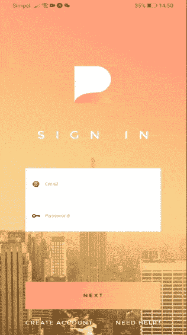
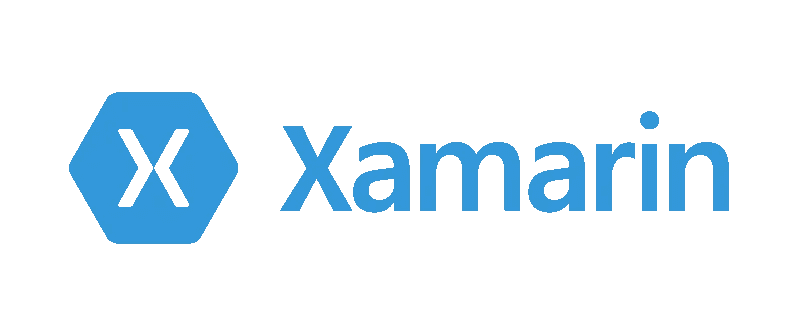
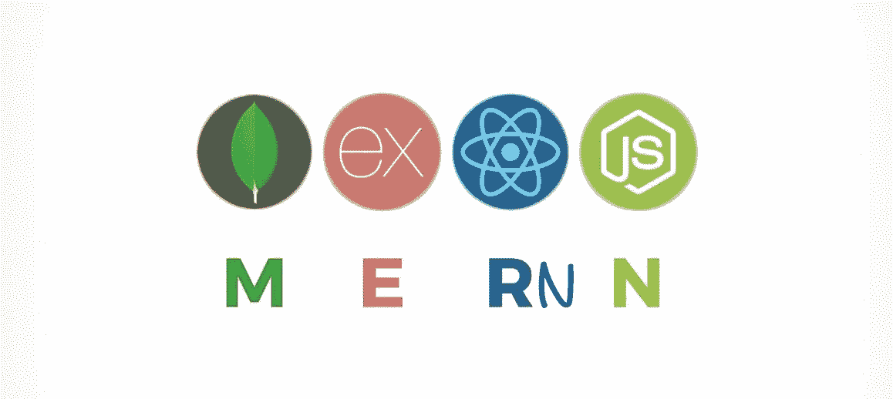
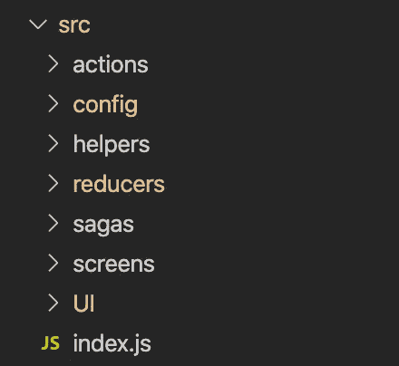
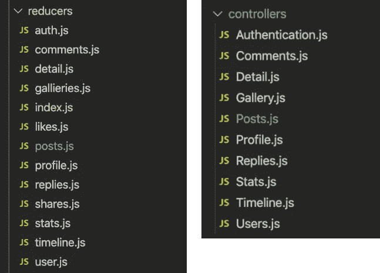

# 我如何用 React Native 和 NodeJS 构建一个全功能的社交媒体应用程序

> 原文：<https://javascript.plainenglish.io/how-i-built-a-full-featured-social-media-application-with-react-native-and-nodejs-6b7179858a69?source=collection_archive---------0----------------------->

## 开发 React 本机 NodeJS 全栈应用的 5 个最佳实践

在过去的几年里，对社交媒体应用程序安全使用的关注已经成为我们新闻的一大亮点。最近，我想起了美国政府对中国抖音和微信的禁令，以及脸书因错误处理私人用户数据而受到政府和公众的公开审查。

所以我决定开发自己的社交媒体应用程序:

S H A R E

SHARE is a 是 Twitter、Snapchat 和 Instagram 之间的全功能交叉，但有自己的外观和感觉，随时可以由任何人、公司或组织部署在他们自己的私人服务器上。

这个应用的实现让我踏上了一段未知的旅程，在这篇文章中，我将更详细地讲述一些帮助这个应用成为现实的最重要的决定。

**想要查看应用程序？** Share 现已上线，可通过此链接测试和购买[。](https://market.nativebase.io/view/react-native-social-networking-backend-app)

# **选择正确的技术组合**

SHARE 由一个 React 本机支持的移动应用程序组成，该应用程序连接到 NodeJS api 服务器应用程序。选择这一技术组合并非一朝一夕的决定。让我解释一下…

我并不总是一个 React 本地开发人员。之前，我在一家为当地企业开发定制移动应用程序的公司工作。在那段时间里，我们有时会讨论同事之间的自然反应，这往往会导致即兴评论，如:

> “我们的应用程序需要离线运行。我不相信 React Native 能做到。”
> → [*可以做*](https://github.com/rt2zz/redux-persist)
> 
> “我们提供本地通知。有可能用 React Native 吗？”
> → [*有可能*](https://docs.expo.io/versions/latest/sdk/notifications/)
> 
> “我们将数据视图模型与视图呈现逻辑分开。React Native 能做到这一点吗？”
> → *继续读！*

同时，我们公司有一个人在开发我们的应用程序。Net 核心功能，另一个人编写 Android 应用程序，第三个人编写 iOS 应用程序。最重要的是，Xamarin(非 XAML)仍然缺乏热重装能力，它的文档也很糟糕。

*我一直在想，一定有更好的方法来开发应用程序。因此，在熟悉 React 之后，我尝试了 React Native。*

This doesn’t have to be a three-men job

在 SHARE 上工作带回了开发移动应用程序的乐趣。但是更有趣的是，使用

> **MongoDB—Express—React—Native—NodeJS**

tech stack 将过去三个人的工作变成了一个人的工作。

MERNN

# **先完成前端，然后构建后端**

第一次涉足全栈开发，很容易就开始同时编写前端和后端代码。你希望看到那些在纸上看起来很漂亮的功能变成现实。

我认为这是个坏主意。

对我来说，开发的乐趣在于创建漂亮的屏幕、视图和元素。这是关于看到你的劳动成果，看着你的应用成为现实。

Dat feeling…

每一个新的屏幕都让你相信你的应用很快就会成为现实。

因此，花太多时间考虑后端问题的后端解决方案无助于取得重要的初步进展。它确实分散了创建原型应用程序的注意力，该原型应用程序可用于:

*   创建一个测试人员池来测试你的用户界面，功能和收集反馈。
*   发起促销活动，聚集一群潜在买家，一旦你的最终应用完成，你就可以向他们寻求首次销售。
*   也许最重要的是，关注尽可能少的任务，这将极大地提高您的应用程序的质量，并为您节省大量时间和以后的痛苦经历。

Nobody likes badly written applications…

因此，如果这意味着你需要创建一堆虚拟数据来帮助你更快地完成你的前端应用程序，那么这就是你应该做的。

就我而言，一旦我完成了前端应用程序，我就把它作为一个 [UI 初学者工具包](https://market.nativebase.io/view/react-native-share-app-theme)出售，同时继续开发后端应用程序。

# **将显示与数据分离**

在 SHARE 手机 app 中存储和转换数据以及处理数据调用由 *Redux* 和 *Redux-Saga* 处理。

[Boilerplate code](https://www.mentalfloss.com/article/26087/why-it-boilerplate-text)

经常听到的关于使用 Redux 存储数据的抱怨是伴随这种类型的设置的样板代码的数量。

在我看来，一些人眼中的样板代码可以(也应该)被视为区分应用程序视图层和业务逻辑(传输、修改和存储数据)的有用方式。

这种结构也被称为*模型-视图-视图模型* (MVVM)，是一种公认的软件架构模式，通过这种模式，可以以独立于应用程序显示逻辑的方式管理数据。

How a React Native app separates displays from data handling

支持 Redux store 的每个*动作*文件、 *reducer* 文件和 *saga* 文件都是实现 MVVM 的好方法。设置这种类型的文件结构有助于实现两件重要的事情:

*   文件被设置成只关注一件重要的事情。例如，带有呈现特定视图的代码的文件将只包含影响该特定视图呈现方式的引用。
*   一个有经验的开发人员在应用程序中打开任何文件时，从一开始就知道这个特定文件的用途。这使得应用程序非常易于管理。

The type of situation we hope to avoid…

# **结构化后端代码**

保持命名约定的一致性是创建易于理解、易于调试的后端应用程序的关键。

SHARE api 服务器应用程序中的一致性包含两层方法:

*   所有的*模型*、*控制器*和*助手*功能都以完全相同的名称引用。
*   所有“get”、“build”、“find”和“delete”函数都是异步的，并且遵循相同的模式。

后端文件结构几乎完全类似于如何在前端建立数据模型。

91.7% equality

此外，整个后端应用程序中的所有*mongose*调用都是可等待的。这里的总体思想是避免过长的瀑布回调函数，这些函数似乎永远不会结束，调试起来很痛苦。

[一篇有趣的文章](https://www.codepedia.org/ama/cleaner-code-in-nodejs-with-async-await-mongoose-calls-example)展示了从回调到异步等待函数的好处，我从中获得了灵感。按照这个逻辑，所有 api 请求现在都可以按照一个简单的模型进行跟踪:

> MobileApp API 调用→路由器→控制器→服务助手(get/build/find/deleteFromRequest(req))→控制器→ MobileApp

考虑到这种模式，修改和调试后端应用程序已经成为一种几乎没有痛苦的体验。

# **与你的受众一起发展**

放大分享应用的技术实现可能会引发这样的担忧，即该应用可能不适合非开发人员。没有什么比这更偏离事实了。

任何能够按照一组清晰的逐步说明进行操作的人都将能够安装和部署这个应用程序。

Is this you? No worries. I got you covered!

对于非程序员，我创建了一个易于定制的应用程序，包括定制选项，如:

*   字体、颜色和风格特征
*   动画类型
*   屏幕名称
*   众多应用功能的简单启用或禁用

对于初级程序员，我创建了一个充满代码示例和最佳实践的应用程序，以学习以下任何内容:

*   如何使用 React Hooks 和 React Native 创建灵活的、可重用的定制组件。
*   如何用 React Native 的动画组件实现简单动画？
*   如何应用 Redux 进行状态管理？
*   如何避免并发 api 调用带来的不必要的副作用。
*   如何构造一个 MongoDB 支持的高性能且易于管理的后端应用程序。
*   如何用 NodeJS 创建一个安全的认证流？
*   如何用 NodeJS 和第三方图片存储来上传、存储和显示图片和视频？
*   还有更多。

对于高级程序员，我创建了一个应用程序，其中包含结构清晰简单的代码，易于理解，并且易于修改或扩展附加功能。

最终，这款应用是否适合你取决于你自己。在开发这个应用程序的过程中，我获得了乐趣并学到了一些有用的新技能，这对我来说(几乎)和在这个应用程序上向你推销一样重要。

如果您决定购买 SHARE，我很乐意帮助您解决在安装、部署和测试应用程序的过程中可能遇到的任何问题。

最后但同样重要的是，一定要记得[试试我的应用](https://market.nativebase.io/view/react-native-social-networking-backend-app)！感谢阅读！

## 简单英语的 JavaScript

喜欢这篇文章吗？如果有，通过 [**订阅获取更多类似内容解码，我们的 YouTube 频道**](https://www.youtube.com/channel/UCtipWUghju290NWcn8jhyAw) **！**