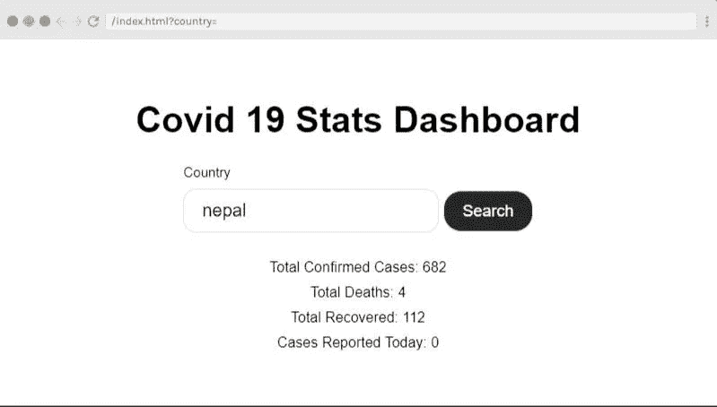

# 我如何建立一个简单的新冠肺炎追踪器应用程序

> 原文：<https://javascript.plainenglish.io/how-i-built-simple-covid-19-tracker-app-with-react-js-f6359a458f79?source=collection_archive---------12----------------------->

嗯，大约一个月前，在对 JavaScript 的基础有点熟悉之后，我开始学习 React。在博客和视频上看到“边做边学”是最好的学习方法后，我开始寻找简单的、初学者友好的项目来测试我的技能。这就是为什么我决定在新冠肺炎更新网站工作。

我创建的 tracker 应用程序是一个简单的网站，它从 API 获取数据并在网站上显示数据。你实际上可以搜索一个国家，它会显示国旗，总确诊，恢复病例，以及因 Covid 19 死亡。我使用简单的 CSS 来设计网站的风格，这也是非常基本的。

我在这篇文章中记录了我如何创建这个简单的应用程序的过程，以防有人试图学习 React，并自己创建这个简单的项目。

下面是一个预览，如果你跟着做，你会得到什么:



有一个小小的免责声明，我大约一个月前才开始学习 React，这是我的第一个项目。我知道还有很大的改进空间，这绝不是你用 React JS 创建的最好的追踪器应用。

让我们开始吧。

# 要求

在开始之前，请确保您的系统中已经安装了 Node JS。我使用 create-react-app，这是一个样板文件，让我们设置环境，以便我们可以使用最新的 JS 特性，并优化我们的应用程序以用于生产。

要使用 create-react-app 创建项目，请在您的终端上运行以下命令

```
npx create-react-app covid-tracker
```

它将创建一个名为“covid-tracker”的目录，并在上面安装 create-react-app。您可以在该文件夹中导航，并在其中打开代码编辑器。

```
cd covid-tracker 
code .
```

然后，您可以使用 npm start 运行应用程序，以启动将显示默认 react 起始页的应用程序。

# 清理

在这一步，我清理了一些代码，删除了一些不必要的文件。

我删除了 src 文件夹中除 index.js、App.js 和 index.css 文件以外的所有文件。另外，我从 *index.js* 文件中清除了所有不必要的导入语句。

我清除了 index.css 文件，这样所有的样式都可以按照我们喜欢的方式完成。

# 创建第一个组件

使用 React 的最大好处是您可以在组件中工作。

为了创建我们的第一个组件，我在`src`文件夹中添加了一个组件文件夹，并创建了一个名为`SearchCountry.js`的组件。这是一个功能组件，我在这个文件中用 JSX 创建了一个简单的框架，如下所示

JSX 上的类名用于样式，我将在下面添加其他属性。

我在 App.js 文件中包含了上面的组件，它在浏览器上显示了一个简单的搜索表单。

# 获取数据

下一步也是最重要的一步是从 API 获取数据。我使用下面的 API 来获取数据。

```
[https://corona.lmao.ninja/v2/countries/](https://corona.lmao.ninja/v2/countries/)
```

如果它不工作，你可以用你自己的代码替换它(根据 API，代码可能会有变化)

我将代码添加到 return 语句的正上方。

在这里你可以看到我使用了 useState 钩子来设置国家和细节状态，它们分别被初始化为空字符串和对象。

要在您的项目中使用 useState 挂钩，您必须更新上面的 import 语句，以包含 useState 挂钩，如下所示。

```
import React, { useState } from 'react';
```

当用户在搜索框中输入国家/地区时，将设置国家/地区状态，提取的数据将存储在详细信息状态中。

现在我们已经准备好向用户显示数据了。

# 显示数据

在这一步中，我们将创建一个新的组件，它将包含向 dom 显示数据的元素。

我在`src`文件夹中创建了一个新的功能组件`DisplayData.js`。

让我们先把数据从`SearchCountry.js`传到`DisplayData.js`。为此，在`SearchCountry.js`中的 return 语句的末尾添加以下代码

```
<DisplayData 
 cases = {details.cases} 
 deaths={details.deaths} 
 recovered={details.recovered} 
 todayCases={details.todayCases} 
/>
```

另外，不要忘记在 SearchCountry 中导入 DisplayData 组件。

然后，您可以创建 DisplayData 组件，如下所示:

我们从 SearchCountry 组件获取数据，并在 DisplayData 组件中将它们作为道具进行传递和访问。

现在我们有了工作应用程序，可以用来搜索有效的国家并获取数据。

# 式样

我创建了一个简单的 CSS 文件，并不太关心样式。你可以利用自己的造型能力让它看起来更花哨。

这是我为这个项目设计的简单样式表

```
*{
    margin: 0;
    padding: 0;
    box-sizing: border-box;
    font-size: 10px;
}

.container {
    margin: 40px;
   display: flex;
   flex-direction: column; 
   align-items: center;
   justify-content: center;
}

.label{
    font-size: 1.5rem;
    display: block;
    margin-bottom: 10px;
}

.input {
    font-size: 2rem;
    padding: 1.2rem 2rem;
    border-radius: 15px;
    border: 1px solid #e1e1e1;
    margin-bottom: 10px;
    margin-right: 5px;
}

.button {
    font-size: 1.8rem;
    padding: 1.2rem 2rem;
    border-radius: 20px;
    border: 1px solid #e1e1e1;
    background-color: rgba(0,0,0,0.85);
    color: #fff;
}

h1{
    font-size: 4rem;
}

.display{
margin-top: 20px
}

.display p {
    font-size: 1.6rem;
    margin-bottom: 1rem;
    text-align: center
}
```

我知道这是最重要的部分之一，我在创建这个应用程序时并没有太在意。基本上，这个应用程序有两个错误:

1.  当用户试图搜索空字符串时，应用程序无法工作
2.  当出现拼写错误或零病例报告的国家时，该应用程序无法工作

# 包扎

这是我用 React 做的第一个简单项目。

如果你作为一个初学者喜欢这个，一定要分享这个，也试试这个。

你可以在 [GitHub](https://github.com/neupanedipen/covid-19-tracker) 上找到实际的项目。你可以根据你的需要来定制它。

更新:正如你在 GitHub repo 上看到的，我对这个项目做了一些修改。您可以参考代码来查看更改。

另外，查看 [live app 这里](https://corona-tracker-dash.netlify.app/)。

我已经尝试用一个简单的方法解决了第一个 bug，并且还在处理第二个 bug。

感谢您的阅读！

*原载于 2020 年 5 月 26 日 https://neupanedipendra.com.np*[](https://neupanedipendra.com.np/simple-covid-19-tracker-app-with-react-js/)**。**