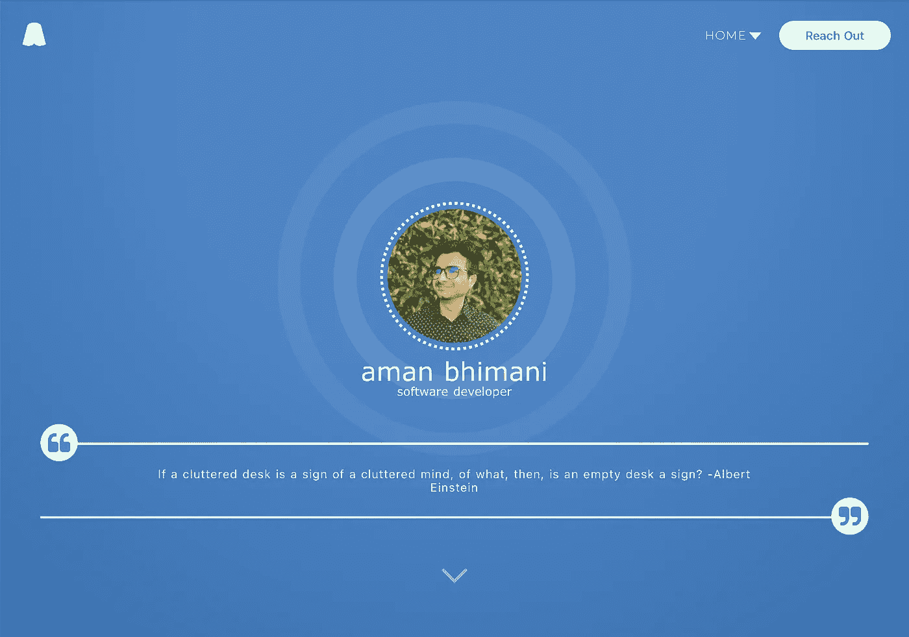
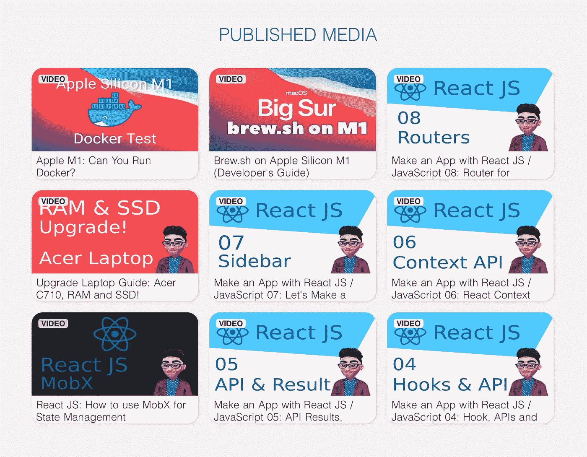
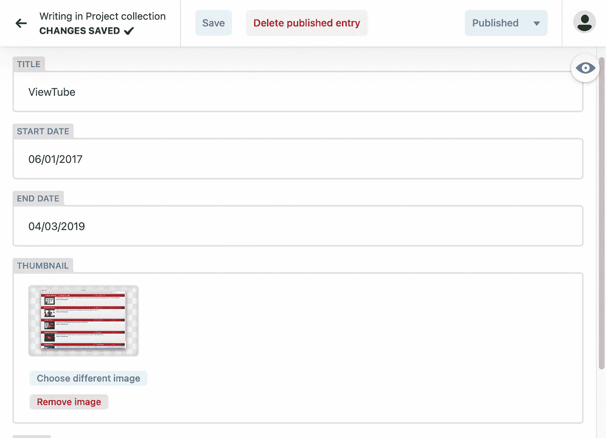

# 如何轻松更新您的网络开发人员文件夹

> 原文：<https://javascript.plainenglish.io/how-i-easily-keep-my-web-developer-portfolio-up-to-date-7d4f4dc4ac7c?source=collection_archive---------17----------------------->

当你忙于 100 个不同的项目时，很难让你自己的网站保持最新。这是我让这个过程更容易在网络上保持最新状态的方法。

这绝不是你的网站，甚至我的网站的完美解决方案。也许明年它会改变和发展。这只是为了让我放下我的想法，帮助您实现工作流程的自动化，就像我对我的工作所做的那样！



Website: [https://amanbhimani.com](https://amanbhimani.com)

# 什么是建筑？

对于托管解决方案，我选择了 [Netlify](https://netlify.com) 。托管您的网站是一种负担得起、现代且对开发人员友好的解决方案。他们有免费和付费计划，您可以将其用于个人和专业托管。他们的许多服务实际上帮助我实现了这个目标，即保持我的网站与时俱进，而无需我付出太多努力(当然除了创建网站)。

## 用什么制作网站？

我使用了一个静态的网站生成器，具体来说就是 **Nuxt.js** 。它使用 **vue.js** (2.0)作为模板，并创建了一系列。提供的 html 文件。静态网站有一个特殊的特点，因为它们速度非常快，因为大部分内容已经被创造出来了。

> N 注意:如果你有很多每隔几分钟就会更新的动态内容，静态网站生成器可能不适合你的用例。更新静态网站的唯一方法是用新内容重建整个网站。

因为这个事实，网页被服务可以很容易地缓存，并有惊人的搜索引擎优化的搜索引擎。其他一些流行的静态站点生成器包括:

*   Next.js(反应模板)
*   Hugo (Go lang 模板)
*   盖茨比(反应模板)

## 您还能拥有动态内容吗？

是的，当然！我的网站上有几篇充满活力的文章。第一个是主页上的报价。每次更新时，您都会收到新的报价！这些是我生活中最喜欢的名言，所以我想让它们在主页上动态显示。

我拥有动态内容的第二个地方是出版的媒体，就像这篇文章。每次我建立网站时，最近的 9 篇文章或视频都会作为卡片放在主页上。这是通过在建立网站之前调用 YouTube 和 Medium 的 RSS 源来实现的。您可以在以下功能中看到这一点:

```
async function getMediaFeed() {
  **// get RSS feeds from Medium and YouTube**
  const responses = await Promise.all([
    getMediumFeed(), 
    getYoutubeFeed()
  ]);

  **// combine two lists of media**
  const media = [...responses[0], ...responses[1]];

  **// sort list based on date**
  media.sort((a, b) => b.date - a.date); **// Write to JSON file which can be read later when building the website**
  FilesWorker.WriteJSONToFile(
    "./../content/media.json",
    media.slice(0, 15),
    print.bind(this, "published media.")
  );
}
```

由于网站的构建需要已经具备所有要求的内容，我们需要从 YouTube 和 Medium 收集所有信息，并保存到 JSON 文件中。构建站点时，它从同一个 JSON 文件中读取。结果是:



Recently published media automatically placed on the website homepage

## 项目怎么样？

将项目自动放入代码有时很麻烦，因为它们通常是手动更新的。这就像写一篇博客，你不能自动生成一篇新的博客——你实际上必须写它。因此，我决定用 CMS 系统。幸运的是，Netlify 也有自己的 CMS 系统，可以很容易地配置成拥有自己的数据结构。

您可以通过编辑存储库根目录下的文件`static/admin/config.yml`来添加自己的结构。这个文件包含您想要的所有集合，例如在这个例子中，一个`Project`有一个`title`和`start_date`，它们可以为 Netlify CMS 中的每个项目进行更新。

```
collections:
  - name: project
    label: Project
    folder: content/projects
    create: true
    slug: "{{slug}}"
    fields:
      - label: Title
        name: title
        widget: string
      - label: Start Date
        name: start_date
        widget: date
```

设置管理页面后，您可以使用下面的 UI 进行更新。如您所见，Netlify 提供了草稿、保存和发布等功能。因为您的内容都是静态的，所以这些转而在您的 Git 存储库中拉取请求和分支，所有内容都在这个存储库中。



我的主页上也有一些“特色”项目的字段。没有展示的只在项目的“展示更多”页面上展示。

## 伸出

联系表单也是我网站的另一个动态元素，Netlify 接收提交的表单，并将它们放在他们的[仪表板](https://www.netlify.com/products/forms/)上的一个漂亮的列表中。它还内置了无需验证码的垃圾邮件过滤器。所以你只能在网站上看到真实的投稿。这适用于任何简单的 HTML 表单元素，或者 JavaScript AJAX 提交；所以如果你愿意，你也可以用普通的 HTML 来编码。

# 为什么要经历这一切？

作为一名网站开发人员，你喜欢创建网站。但更多的时候，你是在忙着给别人做网站。事实上，这是你成为网页开发者的唯一原因，对吗？所以，如果你能让更新网站的过程变得更容易，那么你的网站就会一直保持更新。你可以选择网站建设者，但那样你就不是一个网站开发者了。

作为一名网站开发人员，我在自己的网站上投入了大量的心血，所以它也可以成为我投资组合的一部分。我的投资组合网站只是我工作的另一个项目，在互联网上展示我的技能或推销我自己。

# 源代码

我的网站是完全开源的，如果你愿意，你可以看看。如果你有任何建议，也请让我知道，我一直在努力改进它！你可以在 GitHub 上找到网站源码[。(来源](https://github.com/amanb014/portfolio-sep-18)[https://amanbhimani.com](https://amanbhimani.com))