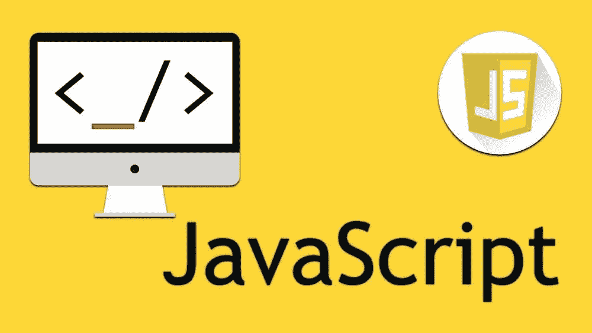
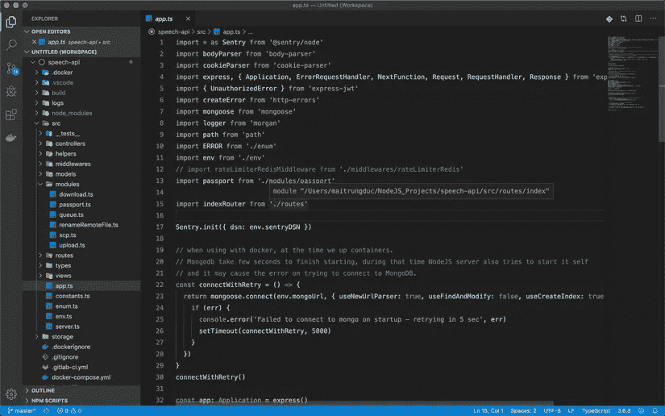
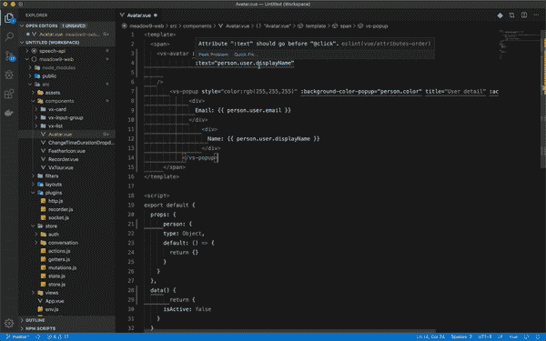
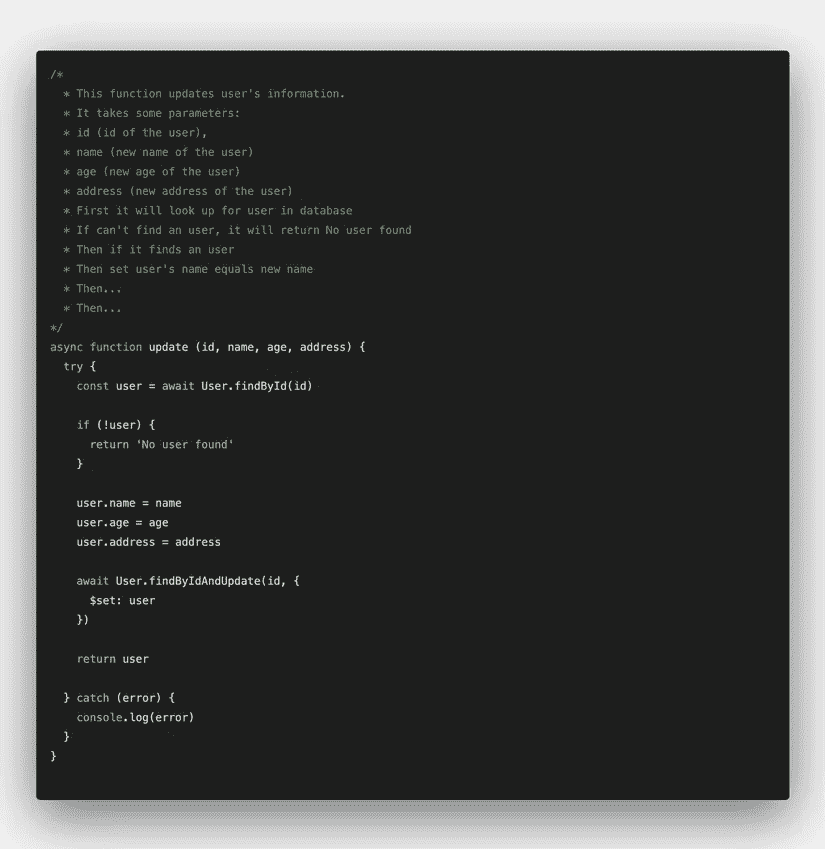
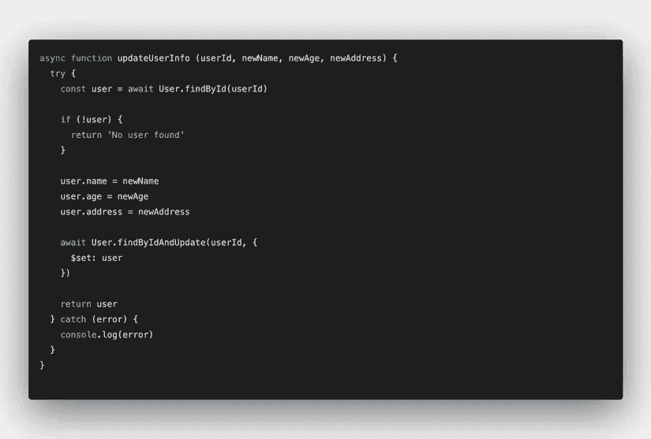
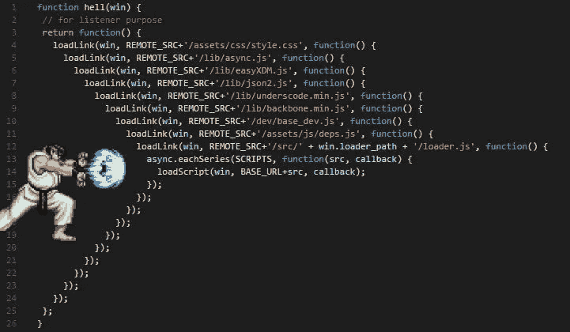

# 我每天是如何提高我的 JavaScript 编码技能的

> 原文：<https://javascript.plainenglish.io/how-i-improve-my-javascript-coding-skill-every-day-37ccf2feacf4?source=collection_archive---------0----------------------->

## 在这篇文章中，我将分享我是如何提高我的 JavaScript 编码技能的，以及我在实践中所学到和做的有效的事情。



# 编者ˌ编辑

目前，有无数种类型的编辑器，我们不知道选择哪一种来提高效率。

和我在一起，除了需要使用 Android Studio 的 Android 代码或者使用 Xcode 的 iOS，我大多只用 Visual Studio 代码。

这是微软开发的编辑器。是的，是微软，听起来不错！！！支持几乎所有的语言，无数的附加插件，人工智能代码建议，漂亮的界面，和轻量级(不像崇高的文字，但它…仍然很轻😄)



以前我只用 Sublime Text (VSCode 当时还不流行)。大量的插件(我将在下面谈到)，如自动检测和修复错误，格式代码，git 镜头，终端…它节省了我很多时间，因为我不再需要修复编码时常见的小错误。

如果你编写 PHP，你会喜欢 PHPStorm。Python，你会喜欢 PyCharm 的。诚然，这些编辑器(IDE)功能强大，但只针对一种语言。我是一名 Fullstack 开发人员，使用 JavaScript、HTML、PHP、NodeJS 和 React Docker，……然后我使用 VSCode，因为它非常强大，支持很多插件，尤其是 autocomplete 非常智能❤️

# 一见钟情

最让我花时间和沮丧的事情之一就是语法错误。像不声明变量/函数、空指针、缺少重音符号这样的错误……随着我们的代码变得越来越大，你的眼睛将会厌倦一次阅读几十个文件、疯狂的思维、颤抖的双手键入每一行代码😄，导致我们被忽视，犯错。

当我使用 ESLint 时，这是一个插件，它有助于发现错误，检查语法，格式化代码，从而减少编码时的 bug，并帮助代码在根据世界上流行的标准格式化时看起来更好。ESLint 支持很多大佬:JavaScript，React，Vue，…

尤其是使用 ESLint 搭配 VSCode，他们是完美的一对。将立即检查代码类型的错误/语法，以及如何使用函数和变量以获得最佳效果的建议。还有自动格式代码，哦，我的上帝爱它❤️.



除了 ESLint，还有更漂亮的方法来格式化代码，但是我更喜欢 ESLint，因为它支持错误检测和优化代码建议。

# 最佳目录结构

我最近开始“接受”并告诉自己的一件事是:

> 不要从一开始就试图优化项目结构

过去，当开始一个项目时，无论是大项目还是小项目，我总是花很多时间试图选择一个最优的项目结构。我在谷歌上阅读了各种“NodeJS 文件夹结构最佳实践”、“ReactJS 代码结构”……但后来仍然想知道这是否是最佳的，我应该选择框架来编码吗？…，很费时间。

我还意识到，尽管一开始我试图遵循一个被认为是好的结构，但仅仅几天后，我的代码就变得一团糟。😄因为我的系统思维不好，不管代码最初有多漂亮，最终都会出错。

> 不要从一开始就过多考虑选择什么架构，如何组织。选择一个方向或一个库、框架，并开始为之努力，边做边改进，使之变得好而实用。

如果你们中的任何人对一个结构良好的项目感兴趣，我与你们分享一个名为 NestJS 的 NodeJS 框架，我阅读了很多关于他们的文档，发现他们的架构非常好(与 AngularJS 非常相似，尽管我不太喜欢 Angular js😄)

# Console.log 无论在哪里都是“气味”

我很确定`console.log`是我在编写 JavaScript 时用得最多的。这样做的主要目的是看你感兴趣的位置的数据实际上是真的还是假的。

我个人认为，编程，不管是什么语言，大部分都围绕着数据，所以如果你看到任何令人不安的代码，也许是不对的，你应该`console.log`来确认一下。

也有很多人认为`debugger`应该看起来更专业。Chrome 还支持将 Debug 放在代码行中，帮助你更好地理解。其实这个对我个人来说没必要，`console.log`也注意代码中的哪一行，用`console.log`更快，更方便，但是我从 Google 脸书看到了世界著名编码器的教程，他们还是用`console.log`😄

但是你也要注意，当 console.log 完成后，检查一切正常，然后删除它，不要放在 git 上。他们会非常沮丧和眼睛酸痛(像我一样😄)

# 评论时间

在编码的过程中，会有很多次我们有很长很复杂的代码。我们担心过了很长时间，当我们第二次阅读它时，我们将不再知道这段代码在做什么。或者带着一颗人道主义的心，我们希望阅读代码的人能够理解它的作用。

就我个人而言，我发现写评论真的很有用，尤其是当项目有很多人在做的时候。我们不想每次不明白的时候都去问写代码的朋友。而他的朋友也忙于修复测试人员给他的一大堆错误。那么如果代码是自己解释的，下面的人马上就能理解，节省时间。

但是评论也必须看起来合理可爱😉。没必要什么都评论。这有时会使你的代码难以阅读，并使其他人眼睛疼痛😄



写代码的时候，我会选择变量/函数的名字以便于理解，不要让一个长的类/函数处理太多。相反，我分成了更小的类/函数(但是不要分得太多，不要再感到眼睛疼痛是合理的)。而且只是在你觉得有必要的时候做注释，练习写代码，让它“自我解释”。只要读一下就知道它的作用了。



# 使用 ES6，7，8，9 标准

JavaScript 是一种发展非常迅速的语言，并且增加了许多功能强大的可用函数/库。据我所知，每年都有“人”发布 JavaScript 标准，简称 ECMAScript 或 ES。这些标准中的每一个都包含一组内置于 JavaScript 中的新特性。

*   2015 ECMAScript 6 (ES6)
*   2016 ECMAScript 7 (ES7)
*   2017 ECMAScript 8 (ES8)
*   2018 ECMAScript 9 (ES9)
*   2019 ECMAScript 10 (ES10)
*   ….

因此，如果我们利用 ECMA 的强大功能，我们的代码会比仅仅使用传统的 for 和 if、while 循环看起来更好、更优化、更酷😄(可爱如本文作者🤣🤣)

下面是一些我在编码时最常用的函数/运算符的例子:

# 跳过承诺/回拨，切换到异步/立即等待

**承诺/回调的缺点** 在编码的时候，我们要大量使用 API。当从后端或第三方调用 API 来获取数据和显示时，我们将执行以下操作:

如果我们想在成功检索到用户列表后才调用另一个 API，那么通常你会这样做:

当我们想按顺序调用一系列 API 时，糟糕的事情就来了。这正是当项目规模越来越大，处理的请求越来越复杂时你所看到的😂😂：



# 异步/等待拯救世界

从 ES6 (2015)开始，async/await 被引入作为处理异步操作的承诺/回调的替代方案。async/await 的伟大之处在于，它帮助我们编写看起来像同步的异步代码，代码逐行运行，看起来非常整洁。

我们可以使用 async / await 重写上面的代码:

有一些注意事项:

*   `await`总是伴随着`async`
*   使用`try/catch`捕捉异步函数中的错误处理操作
*   `await`的本质就是会等到承诺返回值，所以有时候过多使用`await`会让我们的 app 变慢。

使用`async/await`代替常规承诺/回调的另一个好处是当使用`try/catch`捕捉`async/await`错误时。它还捕捉`try/catch`块中的所有其他错误，而不仅仅是`async/await`

# 使用 Typescript 提高代码质量

故事开始了…

刚开始用 C 编程的时候，然后是 Java。它们是非常强大的语言，需要非常严格的代码。需要数据类型(字符串、布尔型、…)或访问规范(公共、私有、受保护、…)的清晰完整的定义。那天我非常厌倦运行，因为我不知道这是公共的还是私有的，它的数据类型是什么，只是运行直到错误被报告

迁移到 JavaScript(或者 PHP，Python)之后，已经大大简化了，因为不管是什么数据类型。只需声明变量并使用:

```
let x = 1

const test = 'This is a test'

const arr = [1, 2, 3, 4, 5]
```

这也是让我从一开始就爱上 JS 的原因之一，因为它的语法非常“自由”，不那么杂乱，代码看起来干净漂亮😄。但生活并不像一场梦，我逐渐意识到，当项目有许多人，或代码后一段时间，然后回来阅读。真的很纠结。因为不知道这个变量是什么，这个函数会返回什么类型的数据？…

```
const var1 = db.column1
const var2 = db.column2
const var3 = db.column3
const var4 = db.column4
```

那我们现在怎么办？？当然可以

```
const var1 = db.column1
console.log(var1) // -> string
const var2 = db.column2
console.log(var2) // -> boolean (true/false)
const var3 = db.column3
console.log(var3) // -> number
const var4 = db.column4
console.log(var4) // -> array
```

只是浪费我的时间，以后不太可能再回来看，或者代码新读者能看懂。然后我/他们必须做几十个 console.log 语句才能理解。代码是做什么的？

**Typescript 解决了这个问题** Typescript 在我看来是 JavaScript 的“升级版”。现在，我们的 JavaScript 代码将有明确定义的类型(字符串、布尔、数字、…)、可访问的访问函数(公共、私有)、…以及许多其他东西。用 Typescript 编写的代码将被编译成普通的 JavaScript，因此我们可以照常运行，不需要专门的 Typescript 脚本或其他任何东西。看看一些例子😉：

我在 2 年前听说过 TypeScript，但仍然不喜欢它，也不想使用它，因为我只是喜欢 JavaScript 的自由本质。有时候我想尝试一下，但是我的眼睛很敏感，每次我看到一些乱七八糟的东西，我的眼睛就会更难受😆😆

但是不久前我决定转向 TypeScript，因为当我阅读旧的或其他人的代码时，我提到了令人头痛的问题。此外，开发社区倾向于切换到 TypeScript 很多，审查很好。

目前，TypeScript 是 JavaScript dev brothers 的趋势。库或框架(Angular，React 或 Vue)注意支持 TypeScript。对于你不知道:Vue 3 是 100%的打字稿重写😉。同时由微软开发的 TypeScript 让你对质量和支持放心。

# CI/CD —代码->测试->部署

**自动化测试** 听我说，你正在做的项目。迟早，它会崩溃。处理这件事的最好方法是同时做和改进。永远花 20%的时间去改进。确保您的改进不会产生错误(或产生最少的错误)的唯一方法是编写测试。

让你知道。你甚至可以在编码之前编写测试(Head First Java 建议这样做)

**CI / CD —持续测试和部署**

CI / CD (Continuous integration /持续集成)，这是现在的一种趋势，一种新的方式，帮助我们自动地、持续地编写代码、测试和部署。


实际上几乎所有的 CI/CD 工具都集成到了 Github、GitLab、BitBucket 中。所以你不需要担心。你的工作是建立然后推代码。DevOps 平台(Github、gitlab、bit bucket)会处理剩下的事情。

# 总结

好了，就这样。希望你们在读完我的文章后，能够学习并找到提高 JavaScript 编码技能的方法。如果你喜欢，请给我一些👏