# 我如何改进 Medium 的“你的故事”页面

> 原文：<https://javascript.plainenglish.io/how-i-improved-mediums-your-stories-page-686c022830f2?source=collection_archive---------10----------------------->

## 使用过滤器改善用户体验

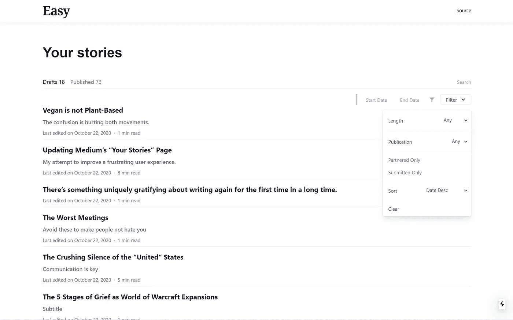

[Easy](https://easy-stories.vercel.app/me/archive): Medium’s “Your Stories” page, but with basic sort, search, and filtering.

我已经在 Medium 上花了几个月的时间，在很大程度上，我喜欢简单的 UI。作为一名作家和开发者，这里有很多值得喜爱的东西。这个 webapp 干净快捷，对于任何想在这里花很多时间的读者或作者来说都是必须的。在编辑器中写作轻而易举，即使在更新的 UI 中，浏览故事也感觉很自然。

不幸的是，有一部分媒体让我抓狂:“你的故事”页面。

在本文中，我将解释为什么它如此令人沮丧，如何改进它，然后提供一个改进的实现。我想尝试 Next.js 已经有一段时间了，所以我在其中实现了我的版本，作为一种学习体验。

*前言:我是在 minor UI 改成 Medium 之前开始写这个的，所以 Medium 的截图取自老版本。不幸的是，更新并没有解决我对你的故事页面的抱怨。*

*另外，由于篇幅原因，我将这篇文章分成了几个主要部分。随意跳到你感兴趣的地方。*

# 你的故事:你的问题

如果你在 Medium 上写过任何东西，你会对这个页面很熟悉。

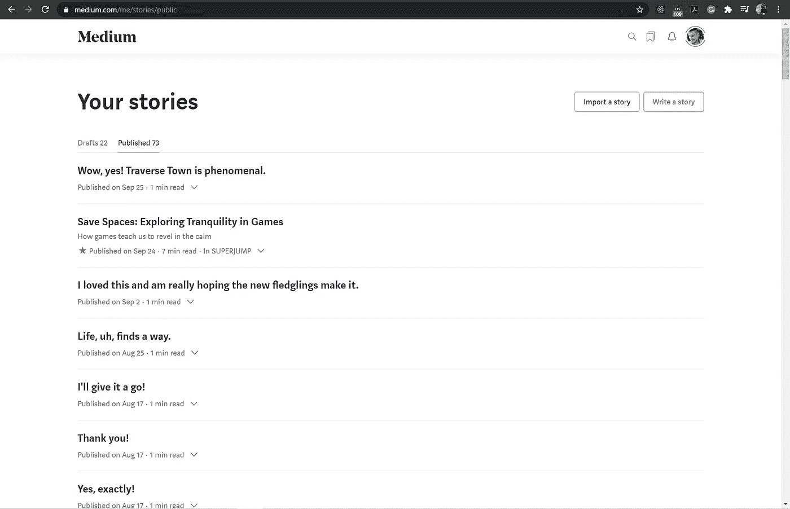

Source: medium.com/me/stories/public (my stories)

这是保存所有用户故事的地方。我们可以将这个页面分为两个主要功能:一个是你的故事(草稿和已发表)的存档，另一个是创建新故事的按钮。后者不是本文关心的问题——它运行良好。然而，该档案还有许多不足之处。

那么，有什么问题呢？

## 航行

有两个选项卡:“草稿”和“已发布”。两个选项卡都可以包含故事或评论。唯一的区别是它们是否已经发布到平台上。

单击任一选项卡都会显示按时间顺序排列的条目列表。已发布显示最近发布的条目，而草稿显示最近编辑的条目。

问题是这个平台没有内置排序、过滤、搜索或类似的简单功能来浏览你的内容。这种阻碍随着你生产更多的内容而扩大。出于这样或那样的原因，我每周至少要浏览一次我发表的故事，试图找到一个故事。也许我想看看故事的详细统计数据，这可以通过导航到故事或者点击这个箭头并导航到*查看统计数据*来完成。

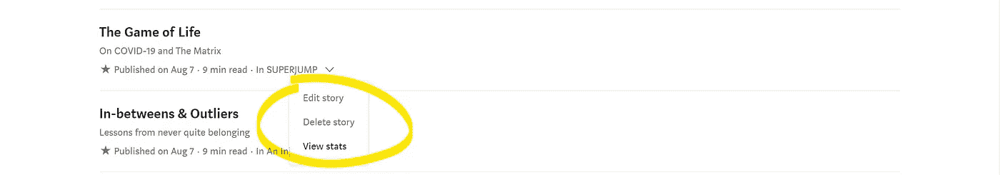

Source: medium.com/me/stories/public

或者，也许我写了很多故事，只是需要一个链接，链接到我写的一个老故事，作为正在进行的一篇文章的参考。无论哪种方式，我都必须滚动浏览一堆故事(或 Ctrl-F ),才能找到我要找的内容。如果我不记得它的确切名称，那么我别无选择，只能逐月查找，直到找到它。

## 分门别类

另一个问题是，档案中有一半的条目是我几乎从来不看的评论。我知道 Medium 希望用户能够将他们的评论视为他们自己的“故事”，这很好，也很棒。但是，当试图查找特定内容或查看宏观内容时，它增加了已经很麻烦的体验。

除此之外，除了默认的按时间顺序显示所有内容之外，没有其他方法可以查看故事。如果我只想看到今年以来的帖子，这并不可怕，但当我想知道我去年 3 月写的所有内容时会发生什么？准备滚动和/或按 Ctrl-F 键前进。

为了避免这种情况，我使用了统计页面或中型合作伙伴计划页面中的存档来更快地找到故事，因为您只能看到能够产生收入的故事(非故事合作伙伴计划评论)。另外，你可以按月查看收入，这有助于缩小范围。然而，这只是一个更大问题的软解决方案。

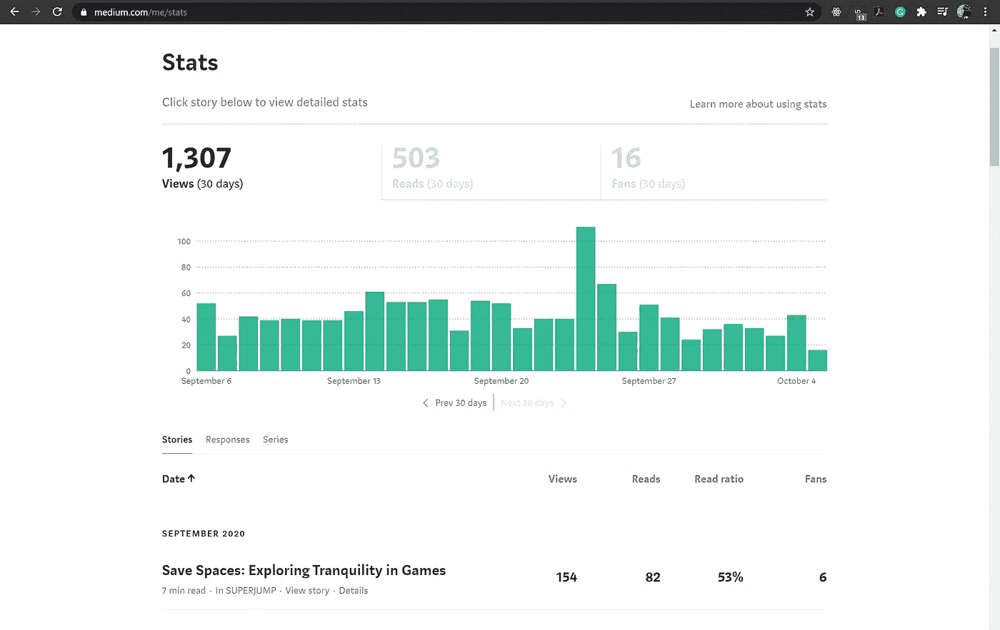

Medium Stats Page

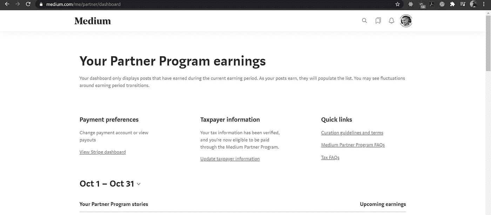

Medium Partner Program page

如果我想通过出版物查看我的故事，该怎么办？长度？阅读？如果我想知道我的哪些草稿正在等待出版审核或计划出版，该怎么办？

如果只有一些基本的搜索、过滤和排序功能，这将非常有帮助，更不用说高级选项，以便轻松地交叉分析统计数据。

最终目标应该是在故事页面本身为用户提供更多的灵活性，因为作为一个用户，我希望在那里查看我的故事。

# 起草解决方案

想出一个好的解决方案需要先回答一个更简单的问题。首先，故事页面的目的到底是什么？我不在 Medium 工作，所以我不能说这个页面的初衷是什么。尽管如此，我们可以从媒介生态系统的其他部分得出一些结论。

**中型合作伙伴计划页面**是查看您的故事收入的地方，它完成了它的工作——您所有合作伙伴故事的逐月收入历史记录。还能更健壮吗？当然可以，但不需要面向普通用户。大多数人只关心他们每月的收入。对于年度总数，我们可以查看条纹或税单。底线是，这不是我想去查看和搜索我的故事的地方。

**统计页面**是查看统计数据的地方。与合作伙伴计划页面相比，它为您提供了更多的故事排序选项，但它的明确目标仍然是查看统计数据。再说一次，有些地方可以改进，但这不是我去找草稿、编辑故事等的地方。

从这一点上，我们可以推断出【T4 故事】页面明确关注的不是数据也不是收益。也许在这一点上很明显，但这意味着它的主要焦点是查看和导航你的故事的子集，不管它们是评论、草稿还是已发表的文章。

为此，当前页面在技术上实现了这一点——只是做得不好。现在我们已经对它应该做什么做了假设，我们可以将改进形式化如下。

1.  添加搜索
2.  改进过滤，超越简单的“草稿”和“已发布”
3.  添加排序

## 新设计

我做的第一件事是几个快速而肮脏的开发工具模型——没有什么比改变静态 HTML 和 CSS 更复杂的了。老实说，像能够快速过滤故事、评论和草稿这样简单的事情会大有帮助。

一个最小的解决方案是在右边添加一个过滤按钮(如下图所示),带有高级过滤选项，如日期、长度等。在不使页面过于复杂的情况下，很难要求更多，所以这将是我实现的重点。


A quick mock-up to get the creative juices flowing

# Next.js 中的实现

在本文的其余部分，我将逐步介绍我在 Next.js 中的实现。因为这是我第一次在 Next 工作，我将尽力解释我的过程，希望能帮助其他人学习。然而，如果你是那种先读一本书最后一页的人(或者你只是不关心细节，想看看最终的结果是什么样子)，我已经在 Vercel [上部署了完成的项目，这里是](https://easy-stories.vercel.app/)。

在 media 的引擎盖下快速浏览一下，不出所料，media 正在使用 React，所以我将使用它。(他们也在他们的媒体工程出版物中公开描述他们的工作。)我一直在 Next.js 中摆弄，因为我想将其与 Gatsby(两者都是 React 框架)进行比较。

盖茨比和 Next 都因生成静态单页应用程序而广受欢迎，尽管 Next 也支持服务器端呈现(SSR)。因为我们的实现只是为了演示，所以我们不会关心健壮的数据库操作。我们只是想要一些东西，我们可以一起快速工具，模仿中等。静态单页应用程序在这里是一个完美的用例。

另外，我认为这是一个可以练习的好项目。

## 通过降价引导

首先，让我们引导下一个应用程序，从存储在本地`_posts` 目录中的降价文件中提取数据。

虽然完全从头开始构建可能是更好的做法，但该项目主要关注的是重新设计故事页面，而不是制作一个功能完整的 Medium 克隆。正因为如此，我需要的只是一个基本博客的快速示例框架。幸运的是，Next.js 提供了一个我用 npx 引导的简单程序。

```
npx create-next-app --example blog-starter medium-stories-example
```

这给了我们一些现成的东西。首先，它用一些示例帖子的降价文件建立上述帖子目录。它还为我们提供了动态路线的样板和这些帖子的要点，以及实现这些路线的登陆页面。最后，它为我们最终将扩展的样式和样板组件设置了 TailwindCSS。

一点 npm 魔法让我们有了一个开发环境并在`localhost:3000`上运行。

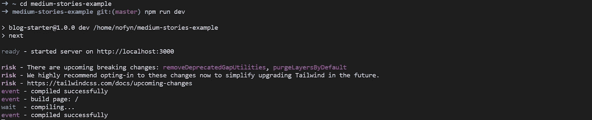

Tailwind yells at us, but we’re going to ignore that for now.


The Next blog out-of-the-box landing page. Lookin’ classy!

这在幕后完成了许多其他的事情，比如设置作者、样本资产和一些我不会使用的组件。但同样重要的是，它为我们的帖子设置了快速、动态的路由。

现在我可以在降价中创建一些虚拟帖子，下一步将在构建时创建相应的页面。这将有效地模拟 Medium 在本演示中的作用。

默认情况下，引导程序在我们的`_posts` 目录中设置了 3 个示例性的降价帖子。它还为我们设置了组件、应用程序 API 库、页面目录、公共资源、样式和配置文件。

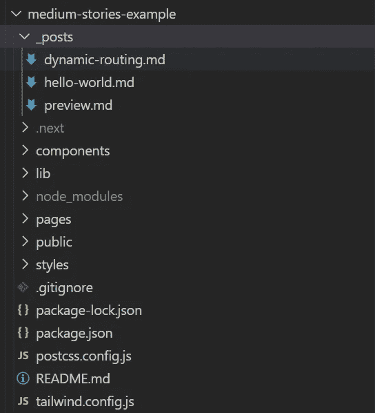

当我构建时，下一步动态地创建到这些的路线。

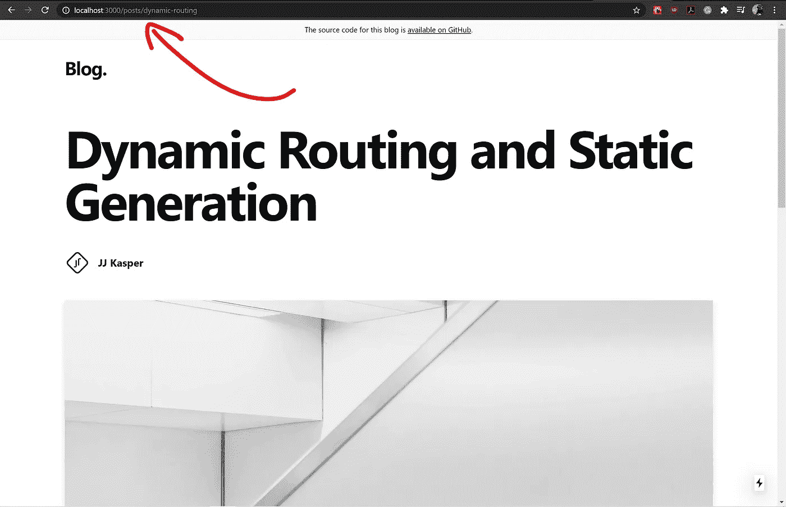

Navigating to localhost:3000/posts/[filename.md] takes us to the corresponding page.

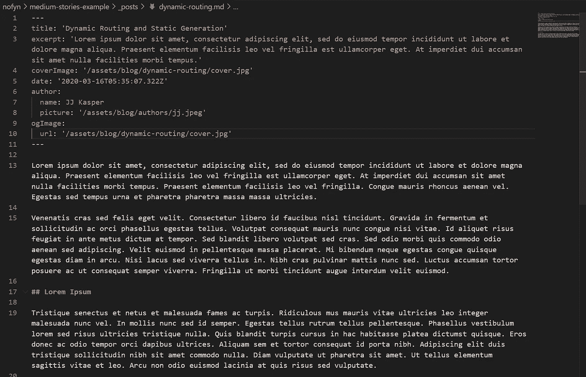

The markdown file that the route and page are generated from.

## 清理样板文件

现在引导数据库已经存在，让我们把它做得更像一个中型。

*注:* *在我进行这个项目时，Medium 改变了他们的风格。现在，我坚持旧的风格，因为我喜欢它们……因为重做它们需要付出努力。*

我不太关心登录页和帖子页，因为它们不是本项目的重点，但我会对它们进行快速改造。现成页面使用 5 个主要组件:a **标题**(他们称之为**提醒**)，**简介**，**英雄-发布**，**更多-发布**，以及**页脚**。这些都包含在**布局**组件中。我将删除除简介和页脚以外的所有内容，并将页面变成更具信息风格的登录页面。我还会创建一个定制的【关于 组件来显示我们的信息。

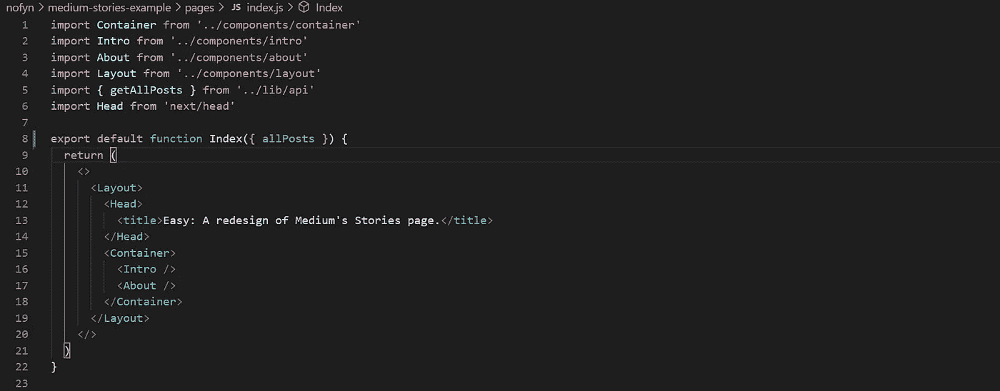

The reworked index.js

在对组件做了一些小的调整以得到我们想要的文本和样式，使之一目了然地模仿 Medium 之后，我们有了一个简单的登录页面。

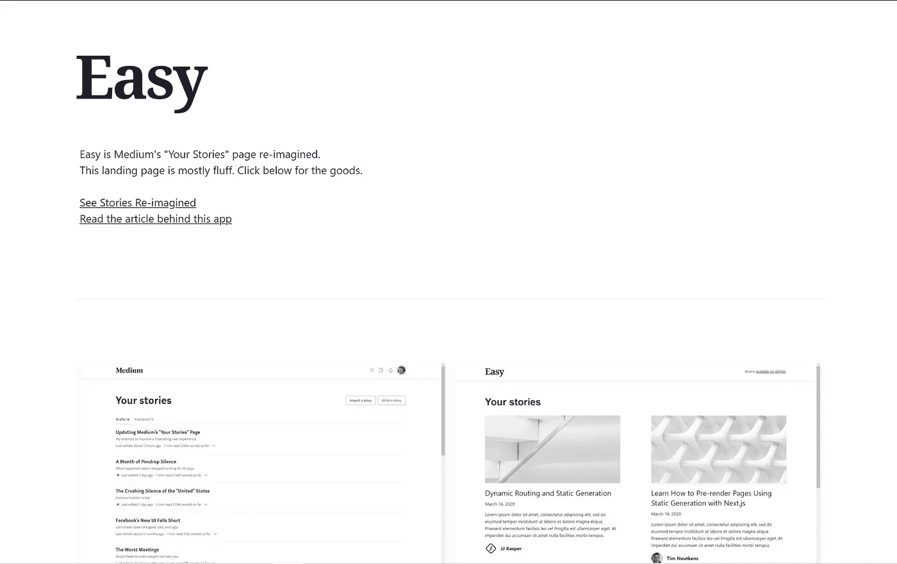

Landing page. Not shown: simple footer.

Medium 字体不是免费的，所以我用 [Noto Serif](https://fonts.google.com/specimen/Noto+Serif) 作为标志，用[robot to](https://fonts.google.com/specimen/Roboto)作为标题，用默认的 [Tailwind serif 和无衬线](https://tailwindcss.com/docs/font-family#app)作为副本。我观察了元素填充、边距等。毕竟，它不需要是一个完美的克隆体就能传达这个想法。

请注意第二部分，它显示了 Medium 页面和实现的并排图像，每个图像都链接到相应的页面。此时，我们的实现还没有完成，所以我们的实现只是一个简单的模拟。我们稍后会再次讨论这个问题。

现在，配置和基本的东西已经出来了，让我们来看看这个节目的明星。

## 模仿故事页面

在 pages 下，我们将创建 **stories.js** ，它将构成我们页面的主干。首先，我们将只设置它做 Medium 已经让我们做的事情:显示草稿和发布的文章。然后，我们将在下一节中扩展它。

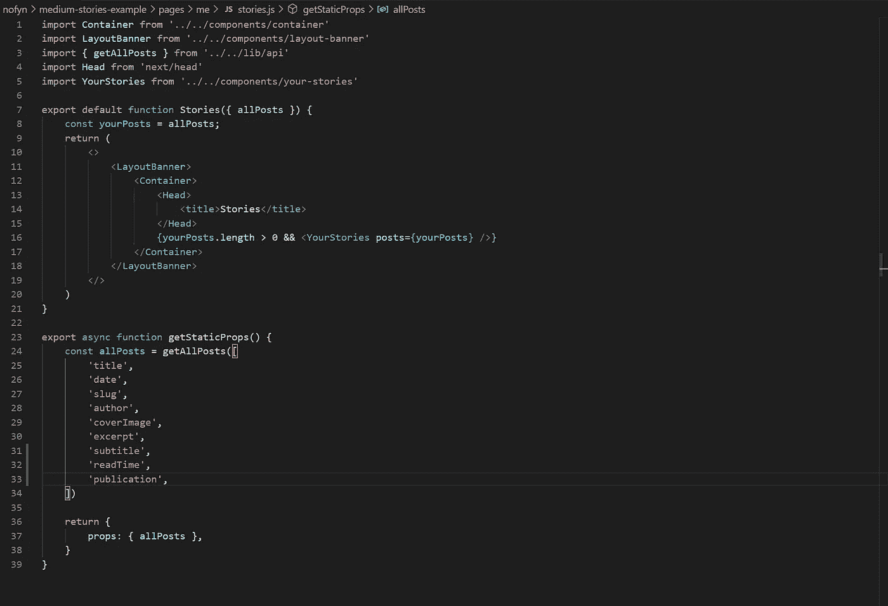

目前有两个主要部分:

```
export default function Stories({ allPosts }) { ... }
```

和

```
export async function getStaticProps() { ... }
```

我们的默认导出使用一些我们还没有介绍过的组件来设置页面的布局。

最重要的是，我们使用一个异步函数`*getStaticProps*`，它调用 API 从 posts 目录下的 markdown 文件中检索所有的文章。然后，我们将使用定制的`**YourStories**` 组件呈现这些帖子。

太好了，让我们填补空白。

Medium 的“你的故事”布局与登陆页面略有不同。注意顶部的工具栏。

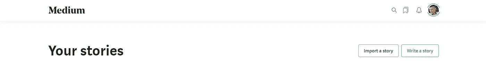

我将创建一个单独的`**LayoutBanner**` 组件，用一个`**Banner**` 组件来模仿它。

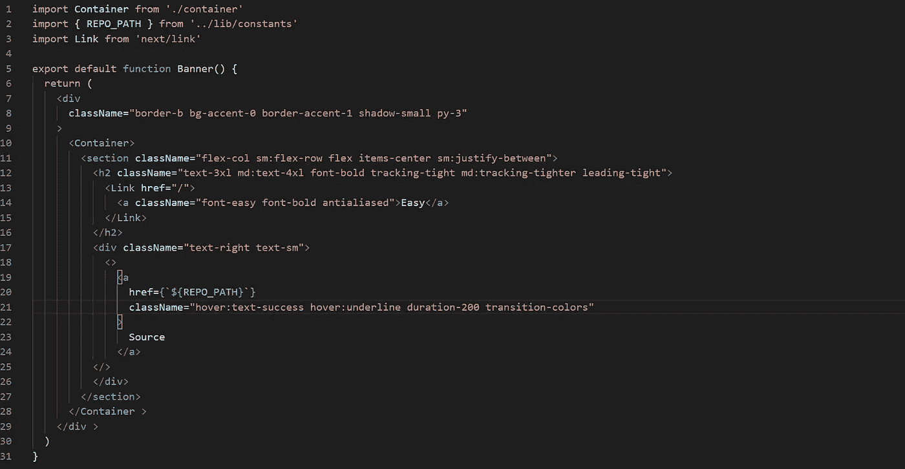

现在这些都准备好了，我们需要一个组件来呈现故事。为此，我将创建`**YourStories**`，它将模仿 Next.js 现成的`**MoreStories**`。不同的是，我会让它从我们的 markdown 文件中获取一些额外的字段，如阅读时间、副标题和出版物。我们也会将这些添加到我们的降价文件中。

注意，为了便于演示，我们只是使用一个静态值来表示阅读时间，而不是计算文章的实际阅读时间。类似地，副标题和出版物将被硬编码，而不是提取，因为我们不在媒体的这些部分中构建。在项目的后面，我将解决所有这些问题。

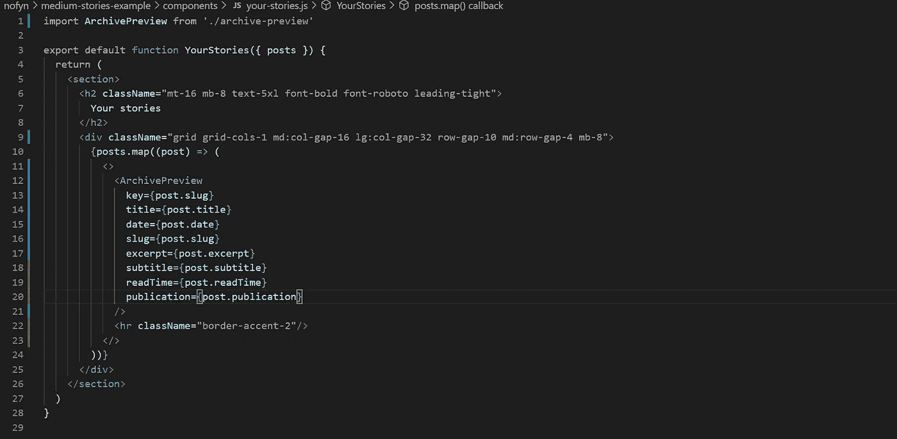

我们导入`**ArchivePreview**`，这是我们的`**PostPreview**`版本。我们的版本抓取我们需要显示的内容，而不是图片、作者等。

结合了它们的功能，对样式进行了一些润色，并对我们的 Markdown 文件进行了编辑以包含新的字段，我们已经完成了大部分工作。

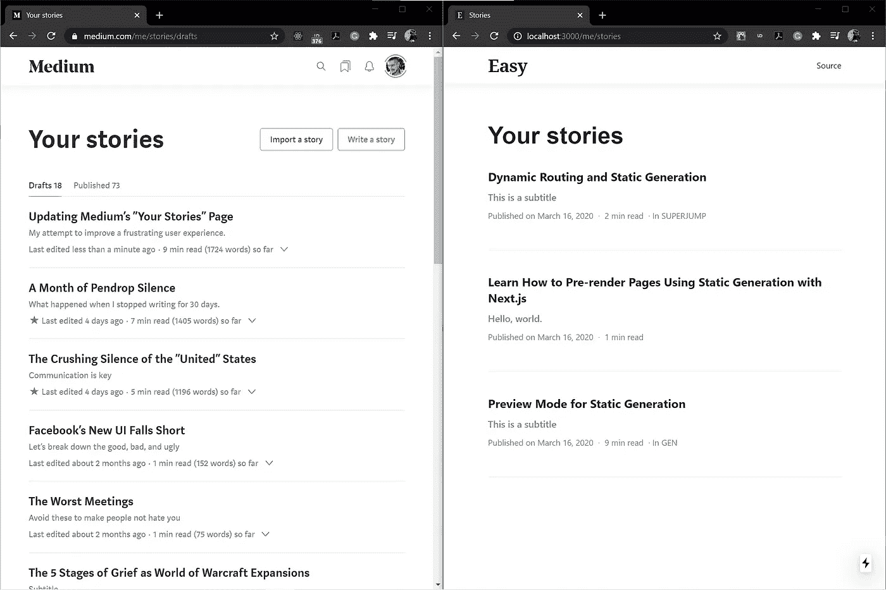

唯一缺少的是草稿和发表的文章。到目前为止，在这个项目中，我们已经采用了一种简单的方法来对文章进行分类——基本上，一篇文章可以是`_posts` 目录中的任何内容。我们不区分草稿和发表的文章，也不区分越来越细的内容，如合作、评论等。为了简化这个项目，我们将为草稿创建另一个目录。如果我们使用 Contentful 或另一个 CMS 来处理内容，我们可以使用 Next.js 的*预览模式*来处理草稿，但这超出了本文的范围。

既然目录在那里，我们将需要一些草稿。我们将使用一个名为[*Medium exporter*](https://medium.com/@macropus/export-your-medium-posts-to-markdown-b5ccc8cb0050)的简单工具从 Medium 中抓取一些文章来填充草稿。

```
npm install -g mediumexporter
mediumexporter https//medium.com/[DRAFT LINK] > _drafts/[TITLE].md
```

这将让我们开始。然而，我们得到的降价文件缺少我们的应用程序为帖子生成页面所需的属性(frontmatter)。在下图中，我们缺少了`title`、`subtitle`，以及所有其他构建页面所需的东西。

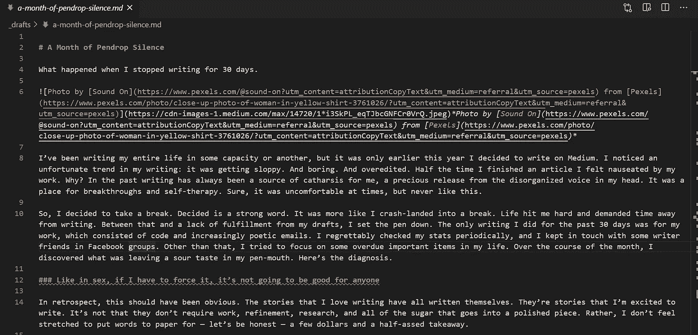

我们将手动添加 frontmatter，但稍后我们会将整个媒体简介(所有帖子、草稿、评论)转换为带有必要 frontmatter 的格式化 Markdown。

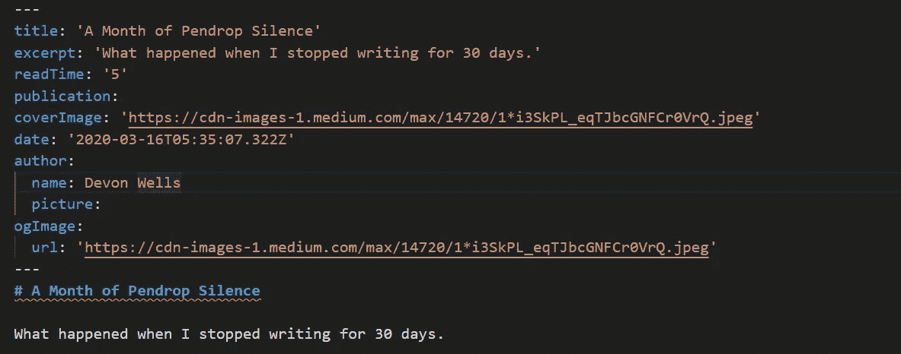

现在我们需要更新我们的 API 来从`_drafts`获取新的帖子，创建一个新的`pages/drafts`目录和相应的`[slug].js`来创建路线，并在我们的故事组件中包含新的函数来正确显示草稿。

```
_api.jsconst postsDirectory = join(process.cwd(), '_posts')
const draftsDirectory = join(process.cwd(), '_drafts')...export function getAllPosts(fields = []) { ... }export function getAllDrafts(fields = []) {  
  const slugs = getSlugs(draftsDirectory)
  const posts = slugs
    .map((slug) => getPostBySlug(slug, fields, true))
    // sort drafts by date in descending order
    .sort((post1, post2) => (post1.date > post2.date ? '-1' : '1'))
  return posts
}
```

然后，我们将旧的`**stories.js**` 页面重构为`**archive.js**`，并设置它来处理故事和草稿。随着这一变化，我们创建组件来处理显示草稿和草稿预览。

接下来，我们将一个`*useState*` 挂钩添加到我们的归档页面，用于在草稿和帖子之间切换(稍后将详细介绍)。最后，让我们像 Medium 版本一样，用逻辑来显示草稿和已发布帖子的数量。

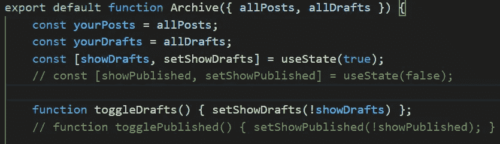

Read more about React state hooks [here](https://reactjs.org/docs/hooks-state.html)

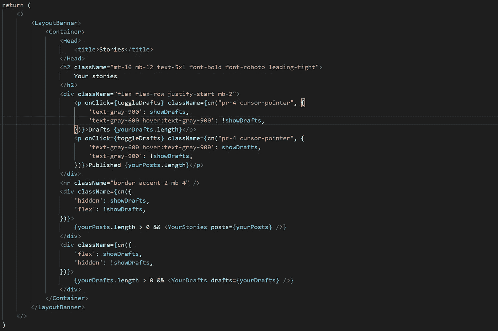

Clicking “Drafts” or “Published” calls toggleDrafts, updating which post type we display

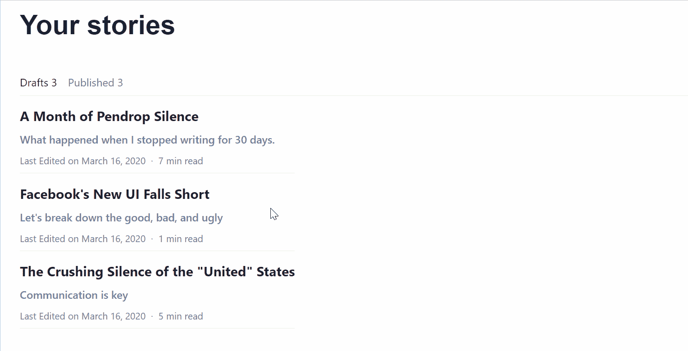

## 添加搜索

好了，现在所有的基础都准备好了，让我们添加一个搜索功能。

在 Archive 中，我们将添加一个`Search`组件，我们将传递两个道具:一个要查询的帖子数组和一个用结果更新 Archive 的回调函数。这个回调函数将是`Archive`中`useState`钩子的一部分。前面我们使用了一个 React 钩子来跟踪`Archive`的状态，即是否显示草稿或已发布的片段。现在我们将使用一个来给出我们的搜索的状态。

```
const [searchResults, setSearchResults] = useState([]);
```

如果你不熟悉 React 钩子，他们使用 [ES6 数组析构](https://developer.mozilla.org/en-US/docs/Web/JavaScript/Reference/Operators/Destructuring_assignment)来装配一个有状态变量`*searchResults*`，它由一个有效的设置器`*setSearchResults*` *来更新。*你可以在这里阅读更多关于 React 钩子[的内容。](https://reactjs.org/docs/hooks-state.html)

我们还将设置一个挂钩，决定我们是否在主动搜索。

```
const [searchActive, setSearchActive] = useState(false);
```

然后我们如下声明我们的搜索组件(`*allEntries*`是我们的草稿和发布的帖子的连接)。

```
<Search setResults={setSearchResults} posts={allEntries} />
```

通过将`setSearchResults`传递给我们的`Search`组件，我们的`Archive`组件实际上是在说，“嘿，fam！当你完成查询时，使用我给你的这个方便的函数来更新我的结果。”

剩下要做的就是创建我们的`Search`组件。

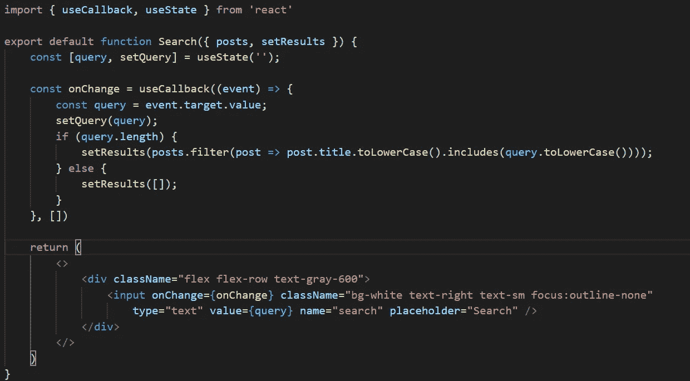

search.js

我们的`Search`组件通过`*onChange*`回调函数接受输入元素中的查询。每次用户输入时，它都会调用这个函数，将输入值与`allEntries`中的标题进行匹配。如果匹配，它通过调用带有匹配结果的传入钩子来更新父组件。

现在是继续重构我们的组件以预览归档结果的好时机。目前我们既有`ArchivePreview`和`DraftPreview`，也有`YourStories`和`YourDrafts`。我们将通过在草稿的降价中添加一个草稿标志并使用它来区分草稿来稍微简化一下。然后我们可以清理并使用单个流来预览帖子(`Archive > YourStories > ArchivePreview`)。当我们不知道我们在看什么类型的帖子时，例如搜索返回的帖子，这将有助于正确路由。

结果是一个轻量级的搜索，感觉反应灵敏和直观。

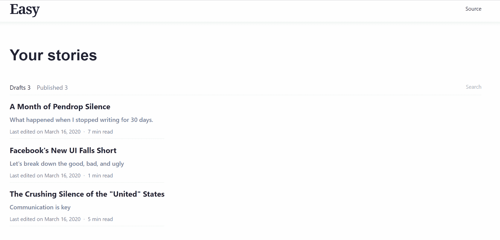

## 添加过滤器

与当前页面相比，能够搜索已经是一个巨大的进步，但这只有在我们知道自己在找什么的情况下才有帮助。如果你有超过 1000 个故事，其中一半是评论，并且这些东西分散在几个月甚至几年内，那么你需要更精细的结果。是时候实施过滤器了。

在下一节中，我们将构建一个`Filter`组件，并将其添加到`YourStories`组件中。我们在`YourStories`组件级别上这样做，这样我们可以简单地通过`Filter`组件传递我们的帖子，它将根据用户的选择过滤输入，然后从这些结果中构建我们的`ArchivePreview`列表。

在下图中，我们传递了*post*和一个钩子`*setFilteredPosts*`，它允许我们的`Filter`将数据传递回我们的`YourStories`组件。

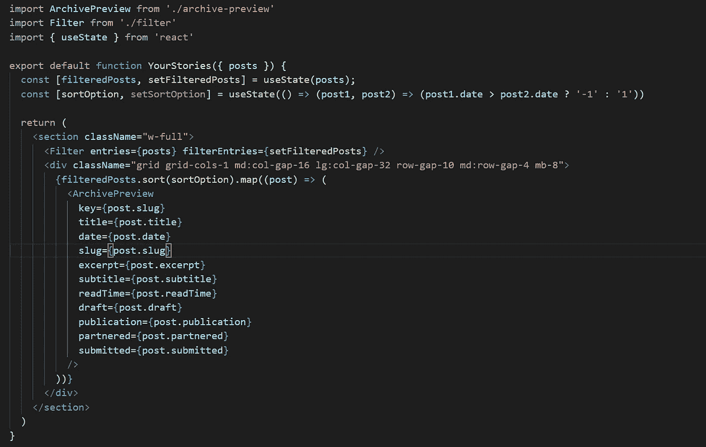

YourStories (ignore the sortOption for now)

您可能会注意到我们还为`ArchivePreview`添加了几个属性，即`*submitted*`和`*partnered*`。我们将使用这些作为我们帖子的标志，以帮助过滤。(注意这些也需要在`Archive`中添加到我们的导出中。)

让我们转换一下话题，谈谈设计。

如果您回想一下本文的开头，这个项目的目标是为页面安装简单的、不引人注目的增强功能，以改善用户体验。我们的搜索元素离我们很远，融入了页面的其余部分。如果你需要它，它就在那里，但是保持页面的整洁。虽然我们可以通过过滤选项实现全 apartments.com，但我们只会让页面陷入困境(抱歉，没有阴影的意思，apartments . com)。

为此，我们的`Filter`将是我们的`Search`组件下的一个简单按钮。

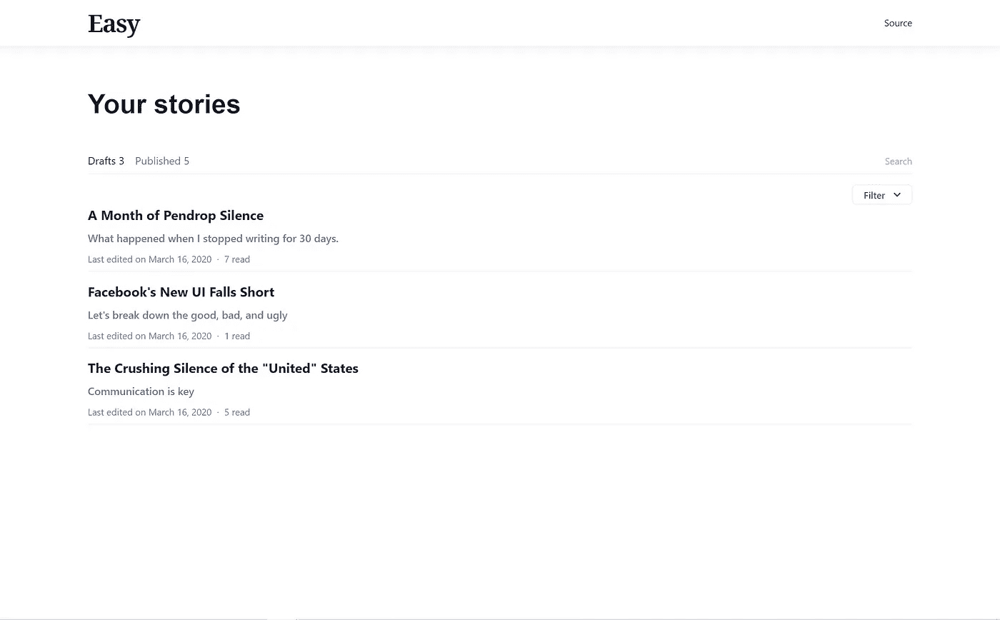

点击时，它会通过下拉菜单和一些基本的日期输入扩展我们的选项。为了简洁起见，我将跳过样式和动画，但这里是最终结果。


我包含了基于介质的过滤选项，允许我们从它们的输出中获取信息(稍后将详细介绍)，但我认为这只是冰山一角。显然，这个项目更多的是为了演示和学习，但我很乐意看到 Medium 采用它并扩展它。

无论如何，让我们建造它。

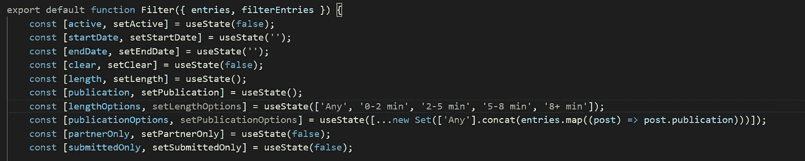

filter.js

首先，我们为所有的过滤选项设置挂钩:

*   `**active**`:处理主过滤器下拉菜单
*   `**startDate, endDate**`:日期输入值
*   `**clear**`:处理将过滤器重置为默认值的按钮
*   `**length, lengthOptions**`:使用一些基本的硬编码显示范围，按读取时间进行过滤
*   `**publication, publicationOptions**`:从传入的所有发布中按发布进行过滤
*   `**partnerOnly, submittedOnly**`:将帖子分别限制为那些已合作或已提交的帖子

每一个都是由一个附加到其相应的 JSX 元素的事件处理程序设置的。例如，当用户从长度`*<select>*`中选择长度`*<option>*`时，我们将其`*onChange*`属性设置为`*onLengthChange*`。

```
// Handler for when a user selects a different length
const onLengthChange = (e) => {
     setLength(e.target.value)
}...<select onChange={onLengthChange} value={length} ... >
     {lengthOptions.map((opt) => (
          opt && <option key={opt}>{opt}</option> 
     ))}
</select>
```

然后我们写一个函数来处理实际的过滤。它会考虑所有选项的状态，并相应地进行过滤。

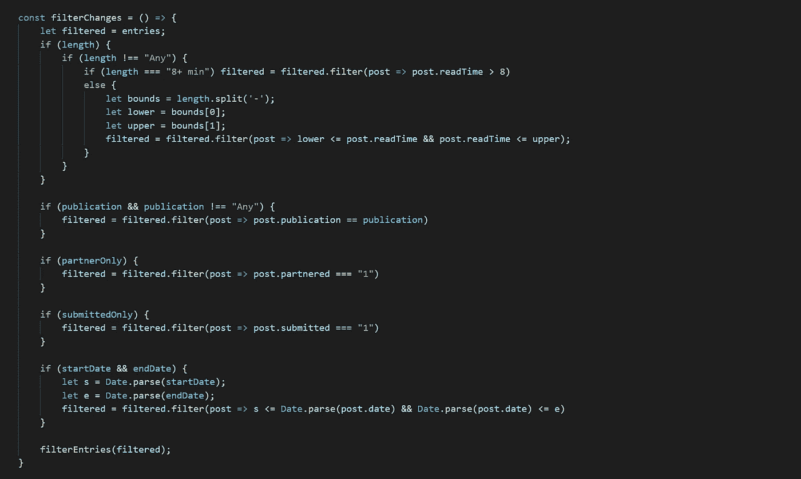

Our filterChanges function.

注意在底部我们调用了`*filterEntries*`钩子，它是我们从父`YourStories`组件传递来的，带有过滤后的帖子。

很好，我们有一个基于过滤器状态过滤的函数，我们有钩子来设置这些状态。唯一缺少的是当过滤器的状态改变时自动调用`filterChanges`的方法。为此，我们将使用`*useEffect*`吊钩。

我不会花太多时间讨论`useEffect` ( [React 已经写了一篇很棒的文章](https://reactjs.org/docs/hooks-effect.html))，但它是用来处理你的应用程序状态改变的副作用的。例如，用户点击订阅按钮将导致设置订阅的副作用或“效果”,并且可能呈现订阅后组件。

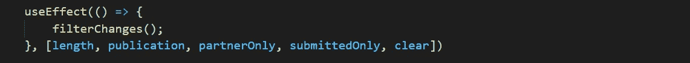

在我们的例子中，我们用它来调用`filterChanges`并在过滤器状态改变时更新 DOM。通常，`useEffect`会在组件重新渲染时被调用。然而，我们可以通过传递一个数组来指定要监视哪些元素的变化，从而限制调用`useEffect`的原因。

最终结果如预期的那样过滤了我们的故事。


In the above, “Ryan, thank you for the kind words!” is a comment, but I accidentally gave it a publication.

我们还可以将过滤器和/或过滤器与日期输入相结合。目前，日期输入只处理简单的 MM-DD-YYYY 字符串。未来的增强可能是添加一个健壮的日期选择器，但目前这是多余的。

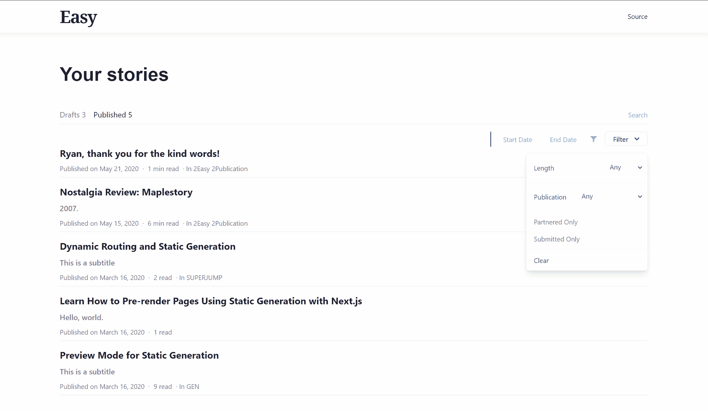

当然，我们还可以做一些其他的改进，比如增加更智能的过滤、保存过滤器等等。然而，现在，这实现了我们最初设定的目标。

## 添加排序

最后一部分是对文章进行排序的方法。如上所述，你可以在媒体的其他区域进行分类，但是出于某种原因，在“你的故事”页面上什么也没有。为了补救这一点，让我们在过滤器中添加一些基本的排序。

默认排序是日期降序。我们将增加日期升序和阅读时间。

如果你留心的话，你可能早就注意到我们的`YourStories`元素已经在呈现结果之前应用了排序。

```
//your-stories.js
const [sortOption, setSortOption] = useState(() => (post1, post2) => (post1.date > post2.date ? '-1' : '1'))...{filteredPosts.sort(sortOption).map((post) => (
          <ArchivePreview ... />))}
```

这是我们的默认排序。我们利用了这样一个事实，即在`useState`中可以将一个函数传递给一个钩子。然而，要做到这一点`useState`需要我们将状态初始化为一个返回函数的函数，因此我们得到了一些看起来很有趣的语法。

现在，我们需要做的就是将 setter 传递给`Filter`，并在我们的过滤器下拉列表中添加一些排序选项。当用户点击这些选项时，我们将适当的排序函数返回给它的父组件`YourStories`。

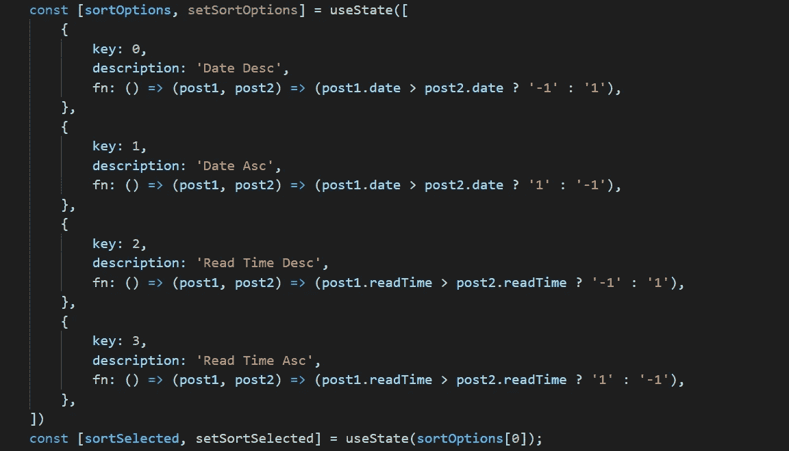

Add these to our hooks in filter.js


And then setup our dropdown select element

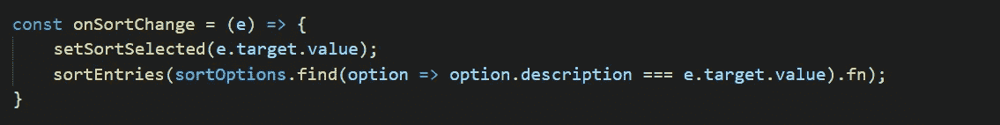

Finally, the handler, which updates our parent’s sort function

排序到此为止！

把它们放在一起，我们得到一些简单的排序。未来的增强可能包括添加 Medium 在 stats 页面上使用的 SVG 箭头和/或将排序按钮移出下拉列表以便于访问，但功能都在。

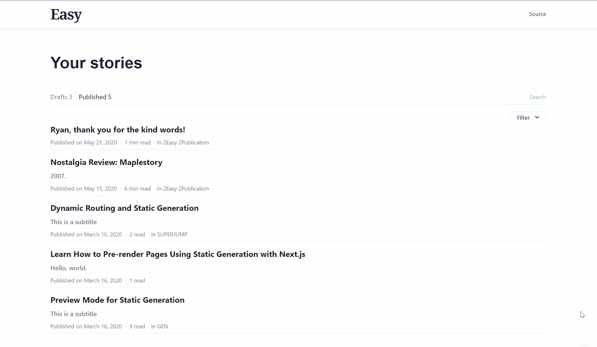

## 获取真实数据

好了，现在我们已经设置好了一切，直接从 Medium 中提取一些实际的文章就更好了。Medium 有一个导出功能，用户可以将他们的个人资料(包括 HTML 格式的所有帖子)拉成 zip 文件。

我的第一个想法是“太好了！我将把它们拉下来，转换成 Markdown，并添加必要的 frontmatter 来区分评论、草稿和发布的帖子。当然，出口将会有某种指示，表明哪个是哪个！”

可悲的是，没有什么是那么容易的。

导出*是*非常彻底，但它在区分帖子方面还有待改进。这是解压缩导出后得到的结果。

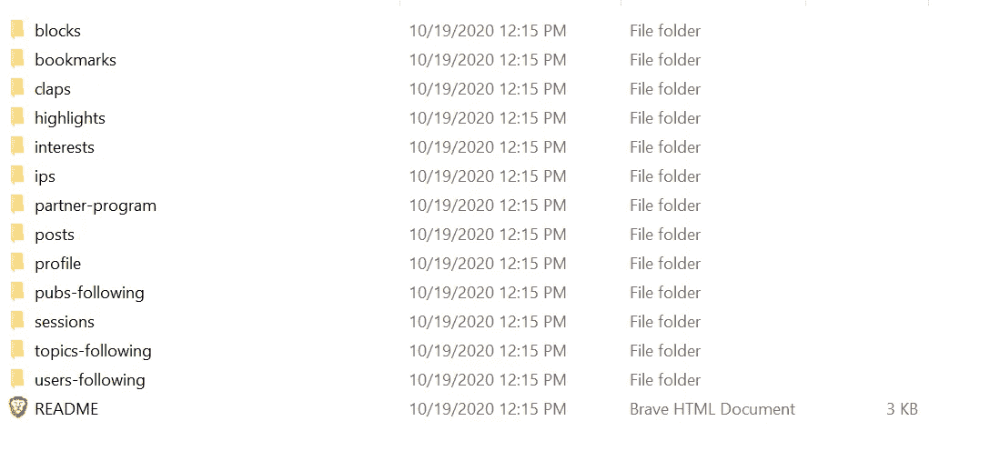

My profile’s “Medium Export”

我们想要的文件夹是帖子。如果我们挖进去…

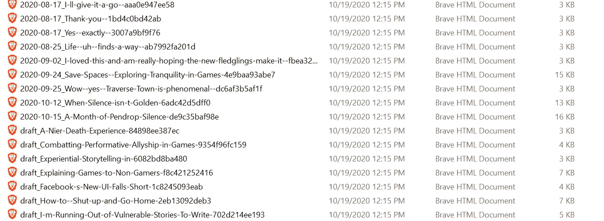

My “posts” folder of the Medium Export

我们看到一堆我们帖子的 HTML 文件。如果你仔细观察，你会发现他们通过给草稿贴标签为我们节省了大量的工作。不幸的是，这里没有将评论和发布的帖子分开的东西。我通读了 HTML，以确保没有像一个秘密属性，但找不到任何东西。如果我错过了什么，而你碰巧知道，请让我知道！

回想起来，这有点道理。很符合 Medium 的理念，一切都是“故事”。(只是我们身边发展的眼中钉肉中刺。)

不过，也不全是坏消息。虽然这让我们无法完全区分草稿、评论和已发布的帖子，但这只是意味着我们必须求助于不同的分类。相反，我们将文章分为草稿、合作故事和非合作故事。这样，我们至少可以过滤掉大部分评论，因为通常情况下，评论是没有合作伙伴的，而故事却有。在某种程度上，这更有意义，因为用户可能希望在他们发布的故事中看到他们的合作评论，因为这些可以赚钱。

好吧，但我们该怎么做？幸运的是，导出中还有另一个文件夹“Partner Program”，其中包含一个 HTML 文件，该文件列出了 posts 目录中所有合作的帖子。这是该页面的一个片段。

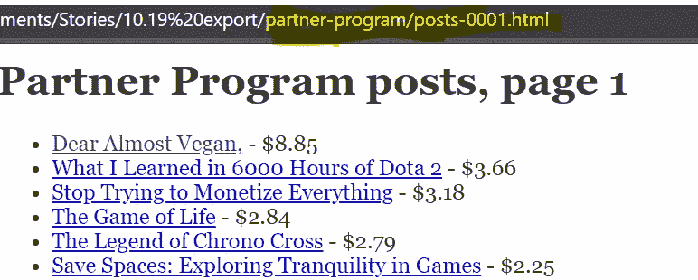

The HTML list provided in the partner program directory of the export

太美了。我们可以将此与帖子目录中的帖子进行交叉引用，以确定哪些帖子是合作的、草稿的和未合作的。

首先，我们需要一个更全面的媒体帖子来贬低格式化程序。我分叉了 [*medium-2-md*](https://github.com/gautamdhameja/medium-2-md) ，这是一个轻量级 CLI 工具，它为我们完成了大部分繁重的工作:接受一个中型导出目录并输出。md 文件与一些前沿问题。我们需要做的就是调整它，添加我们需要的 frontmatter，然后添加交叉引用功能。

默认情况下。我们得到的 md 看起来像这样。

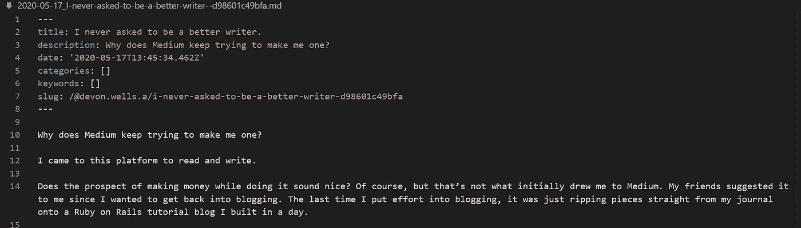

Please don’t judge my first post ever on Medium — it was a dark time.

我花了一些时间调整 medium-2-md 来适应这个简单的项目。我不会在这篇文章中涵盖这些变化，但如果你好奇，可以在这里找到分叉回购。

使用分叉版本， *medium-2-md-2-easy* ，以下简称 *2-easy* ，我们可以取一个 medium 出口，拉。md 文件为我们所有的职位与具体的前沿问题，以方便。

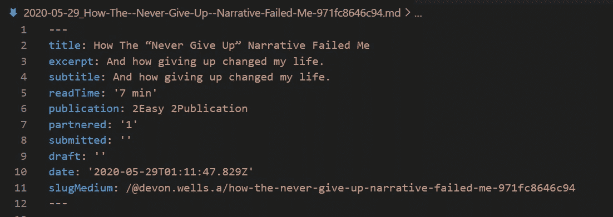

.md with 2-easy frontmatter

在上面的例子中，我们现在有了将在 Easy 中使用的附加属性。下面简单回顾一下这些属性。

*   `**Title**`:文章的标题，从 HTML 中提取
*   `**Excerpt**`:原始 Next.js 模板用来创建帖子预览的摘录。我们不用这个，但我暂时把它留在这里。
*   `**Subtitle**`:字幕，来自 HTML
*   `**readTime**`:之前我们手动输入了虚假的读取时间，但是我们的 medium-2-md 分叉版本实际上是基于简化版本的 Medium read time 算法来计算读取时间的，这可以在[这里](https://help.medium.com/hc/en-us/articles/214991667-Read-time#:~:text=At%20the%20top%20of%20each,an%20adjustment%20made%20for%20images.)找到。**我们的简化版读取时间会稍短，因为它没有考虑图像。**
*   `**publication**`:不幸的是，Medium 没有在出口中公开出版物，至少没有以一种有意义的方式——足以为我们的头版新闻抓住它们。这真是令人失望。2-easy 的一个未来增强功能可能是找到一种抓取出版物的黑客方式。目前，我们 2-easy 只是简单地为每个非草稿帖子分配“2Easy 2Publication”。
*   `**partnered**`:该帖子是否为合作帖子的标志，通过对照导出的 partner-posts 目录中的 slug 列表交叉引用原始帖子 slug 生成。**一个奇怪的注意事项是，Medium export 似乎不包括低于某个查看阈值的合作伙伴帖子。**我不确定这是一个错误还是什么，但是我的故事中大约有 5 个只有少量浏览量和 0 美元收入的故事没有出现在这里，尽管在实际网站上显示了合作伙伴状态。
*   `**submitted**`:发布队列中的草稿的标志，用于由发布者审阅或计划发布。这还没有实现，但是我把它放在了 2-easy 的前面。
*   `**draft**`:帖子是否为草稿的标志，对于帖子目录中文件名以“`draft_`”开头的任何帖子，设置为`“1”`。
*   `**date**`:过账日期，从 HTML 中拉取。请注意，Medium export 不提供草稿的最后编辑日期，因此 2-easy 会自动在 markdown 中提供今天的日期(与空字符串相反)。
*   `**slugMedium**`:鼻涕虫对原媒的文章。

因为这些是我们在 Easy 中使用的相同属性，所以我们可以提取结果。md 文件直接放入我们的目录。

```
//in our modified medium-2-md directory
node index.js convertLocal ../Export/posts -dfpcp ../Export/posts/md_[hash]/drafts_* ../[Easy_dir]/_drafts
cp ../Export/posts/md_[hash]/2* ../[Easy-dir]/_posts
```

Next 自动重新编译并创建新帖子的路径。我们现在应该可以在 Easy 中看到我们所有的帖子了。

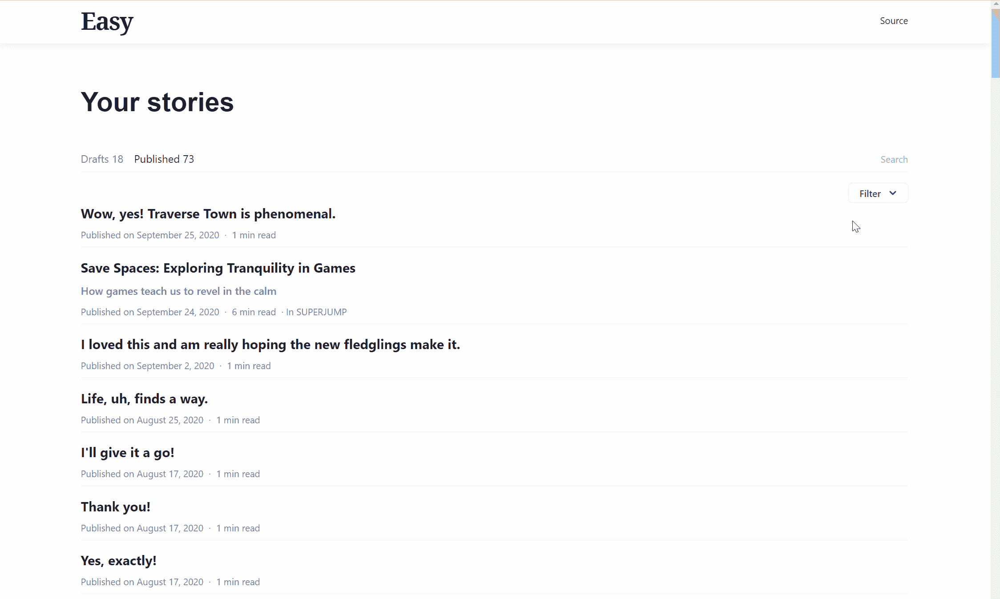

## 部署和总结

这些功能都是内置的，我们已经用真实的帖子测试过了。还有一些可以改进的地方，但总的来说，我对结果很满意。在这一过程中，我也对 Next.js 和 React 有了相当多的了解，如果你已经阅读了这篇文章，我希望你也一样。

剩下唯一要做的事情是清理并部署到 Vercel，这是一个为部署 Next 应用而构建的框架(实际上，它可以与其他应用一起工作，但它是专门为 Next 而构建的)。[他们有一份简单易懂的指南，指导你如何设置项目。](https://nextjs.org/learn/basics/deploying-nextjs-app)

在导入和部署之后，该应用程序启动并可在 [easy-stories.vercel.app.](https://easy-stories.vercel.app/) 获得

请不要评价我愚蠢的草稿。

就是这样！感谢你的阅读，如果你读到这里，我希望你能学到一些东西。Medium 最近做了很多 UI 更改，所以我祈祷他们很快会改进 Stories archive。如果你有任何建议，请在评论中告诉我。

## 涵盖的资源

*   [反应](https://reactjs.org/) ( [挂钩](https://reactjs.org/docs/hooks-intro.html))
*   [next . js](https://nextjs.org/)([Vercel](https://vercel.com/docs))
*   [尾翼 CSS](https://tailwindcss.com/)
*   [降价](https://www.markdownguide.org/)
*   [媒体导出](https://help.medium.com/hc/en-us/articles/115004745787-Download-your-information)(从 medium.com 导出您的内容)
*   [媒体导出器](https://www.npmjs.com/package/mediumexporter)(从 URL 导出)
*   [medium-2-md](https://github.com/gautamdhameja/medium-2-md) (用于转岗出口到。MD——或者，看看我在[的叉子中-2-md-2-easy](https://github.com/negtrooper1/medium-2-md)
*   [中型工程出版物](https://medium.engineering/)