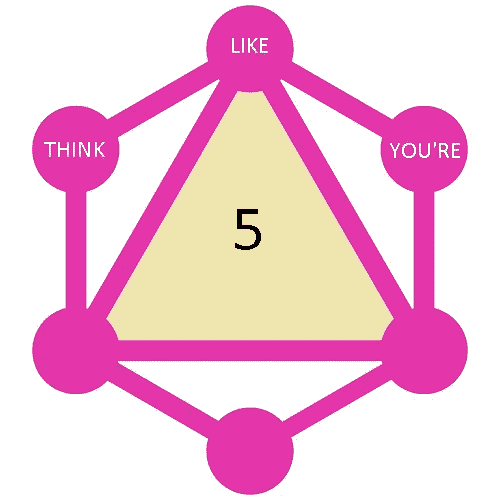

# 我是如何学会像 5 岁小孩一样思考的

> 原文：<https://javascript.plainenglish.io/how-i-learned-graphql-thinking-like-a-5-yr-old-66db66e38668?source=collection_archive---------8----------------------->



Modified GraphQL Logo (original source: [https://github.com/facebook/graphql/blob/master/resources/GraphQL%20Logo.svg](https://github.com/facebook/graphql/blob/master/resources/GraphQL%20Logo.svg))

**前言**

我们经常听到这样一句话，“把它解释给我听，就像我 5 岁一样”。就在昨天，我偶然发现了一个有趣的 dev .以这个标题发布。一段时间以来，我一直想把这句话改写成“像你 5 岁时那样思考”。5 岁的孩子可以成为出色的学习者，可以成为用简单术语思考的专家。它们的简洁使得它们能够非常高效和有效地得到它们想要的东西。

随着年龄的增长，我们的语言技能会提高，我们都会关注礼仪和习惯。所以，如果我们看到一个朋友在吃一块糖，我们想要它，我们会问:

“嗨，你好吗？那块糖看起来很好吃？我可以吃一块吗？”

另一方面，孩子只是说:

“棒棒糖！”

就算拿着棒棒糖的大人回复“你说呢？”孩子还是说“棒棒糖！”。大人回答，“你说请”(而且还是把糖块给了孩子！)而孩子笑，“不，你说请”。

成年人必须注意礼节，因为这是对他人表示尊重的一种方式。成年人知道，如果他在提问时不表现出尊重，他可能会空手而归……并可能得到类似“见鬼，不”的回答。另一方面，孩子得到了一个免费通行证，因为他可能不知道任何更好的时间点。幸运的孩子！

似乎这种成人的思维方式有时会延续到我们编程的方式中，并使我们效率更低，当我们真正关心的只是数据时，使我们过于关注信息的框架。我们可能会忘记，当我们与机器而不是人类交谈时，我们可以更少地担心礼仪，只是告诉机器我们想要什么。

**像 5 岁小孩一样接近 GraphQL】**

当我第一次浏览 GraphQL 时，作为一名开发人员，我可以主要关注数据，而不是获取数据的手续，这似乎很有吸引力(因为编写 API 路线的清单从来不是我签约的工作)。我也有点害怕，因为我不确定自己是否准备好接受一种完全不同的思维方式。幸运的是，“完全不同的思考方式”实际上要求我把自己的思维简化成一个 5 岁小孩的思维。

让我们把“糖果棒”的例子带到这里，来解释像孩子一样思考如何使生活变得更容易。

来自 RESTful APIs 的成人大脑可能会这样思考:

```
http.get(‘/?candybar=kitkat&size=kingSize’).then(handleResp)
```

成年人必须关心协议“http”、特殊字符“&”、“=”，并知道如何正确定位这些字符。而且一定要记住”。然后”。

一个有 SQL 思维的成年人可能会这样构建查询:

```
SELECT * FROM CANDYBARS WHERE CANDYBAR=”kitkat” AND SIZE=”kingSize”
```

成年人必须关心表名和列名。成年人必须知道数据的*表格*结构。仅仅得到一个糖果棒就要打很多字。哦，还有单词“SELECT”、“WHERE”、“FROM”和“…那都是英语…所以，如果英语不是成年人的母语，这个查询对她来说就变得有点难以理解了…

另一方面，一个孩子可能会尽快要糖果:

```
candybar = ‘kitkat’
size = ‘kingSize’
```

简单多了吧？？现在，这个片段实际上不是 GraphQL，但它非常接近。我就是这样开始学习的。我当时的想法是，“好吧，GraphQL，你说你只是关于数据，我们会让它只是关于数据。”我将稍微改进一下我的查询，以匹配我认为类似 JSON 的查询应该是什么样子，因为我认为这就是您所期望的:可能是一些花括号和一个逗号

```
{
 candybar: ‘kitkat’,
 size: ‘kingSize’
}
```

呃…再想想…省略逗号，因为一个 5 岁的孩子可能不总是像关注效率那样关注标点符号。

有了思维模式，我该做一件 5 岁孩子最擅长的事情了:玩它。幸运的是，在线工具[Interactive graph QL " graph QL "](https://graphiql-test.netlify.com/)]非常有价值。不需要设置或认证。我所要做的只是浏览到它，它已经为我的输入做好了准备。

在操场上，我能够在编码窗格中尝试上面的代码片段，并立即意识到语法是关闭的。“result”窗格告诉我有哪些错误，进一步查看右上角显示了哪些模式可用。因此，最终，只要做一些修改(是的，阅读文档)，我就知道上面的查询需要写成这样:

```
{ // ← NOTE: the word “query” is optional and can be omitted;
  // GraphQL treats this as a query by default. Pretty cool,right?
 candyBars (candyBar: ‘kitkat’, size: ‘kingSize’) { 
             // ^^ query params   ^^
   candyBar // ← include in resp back to me
   size // ← include in resp back to me
 }
}
```

但是，一个 5 岁的孩子可能想要更多的信息，即使实际参数保持不变。这在 GraphQL 中很容易做到:

```
query {
 candyBars (candyBar: ‘kitkat’, size: ‘kingSize’) { 
   id // ← Makes life easier. See mutations below.
   candyBar
   size
   /* Extra props here: */
   shape // ‘rectangle’
   wrapperColor // ‘red’
   wrapperHasCartoon // true
   /* ← keep typing…GraphiQL has intellisense… → */
   /* type until you get the prop you want. */
 }
}
```

这解决了查询问题，但是如何改变糖果条的状态呢？5 岁的孩子可能想咬下一大块肉。所以，我最初的想法是这样的:

```
update (id: 123, pctBitten: “50%”) {
 size // respond with new size
}
```

因此，在 GraphQL 中，这个词不是“更新”,而是“突变”。稍微调整一下，这个代码片段就变成了:

```
mutation {
 biteCandyBar(id: 123, pct: “50%”) { // mutations are labeled
   size // respond with new size
 }
}
```

尽管单词“突变”比“更新”更容易输入，甚至可能超出 5 岁儿童的词汇范围，但突变内部的模块可能更接近 5 岁儿童的思维。即要执行的突变是“biteCandyBar”。这也让参数从“pctBitten”简化为“pct”。根据突变的标签推断“pct”指的是“pctBitten”。

**结论**

是的，GraphQL 比我描述的要多得多。这只是皮毛，要成为这方面的专家，负责任的开发人员可能会全面阅读文档。然而，为了让你的脚湿，我恳求你像 5 岁那样思考！这很可能会减少你最初可能有的恐惧。