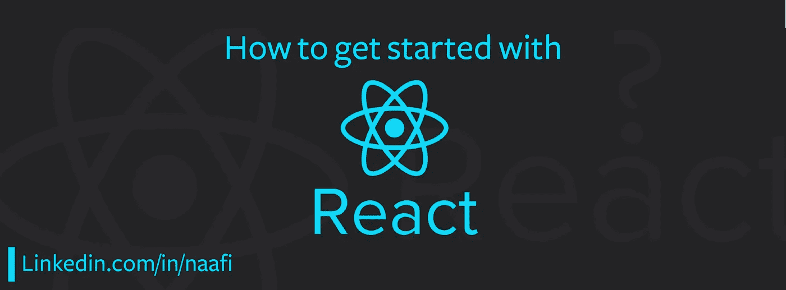
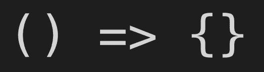
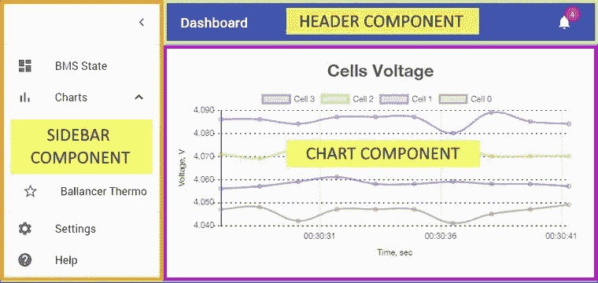

# 我如何作为新手学习 React JS——React JS 入门指南

> 原文：<https://javascript.plainenglish.io/how-i-learned-react-js-as-a-noob-ultimate-react-js-starter-guide-36a05ab9495e?source=collection_archive---------0----------------------->

## React JS 入门指南



How to get started with React Js | Ultimate React JS Starter Guide

你好朋友们。！

这篇文章有点长，相信我，完成后你会马上开始使用 React JS。不像我

老实说，我浪费了很多时间来寻找最好的材料来开始。看了大量的 youtube 视频，却没有完成一个，因为我不知道 React.js 的*基本先决条件(清单)*。

在这篇文章中，我将带你经历我是如何从仅仅知道普通(*香草* ) HTML、CSS、JAVASCRIPT(初级)开始学习 React JS 的旅程，并且没有任何像 Angular、Vue 等前端框架的经验。,

首先明白这一点，React 完全是在 **Javascript** 上，你练习 Javascript 越多，你学 React 就越好。目前，基本的 javascript 足以入门。

# 清单/先决条件

> 记住下面的清单是**必须的，**确保你勾选了所有项目来理解任何 React JS 教程。

1.  将这篇文章加入书签，你会需要它的。
2.  **HTML、CSS、Javascript(入门基础)。**
3.  **Javascript 的一些 ES6 概念喜欢-**
    1。箭头功能
    2。让和 Const
    3。类和“this”关键字
4.  **node . js(Fundamentals)**
    你不必一开始就完全了解，只要专注于我下面要告诉你的基本面就可以了。
5.  代码编辑器。

# HTML，CSS，JAVASCRIPT

> 如果你不熟悉 Html，CSS，JS，跳过这个主题。

*   这三者是前端 web 开发的基础。
*   他们一起工作来创建一个功能齐全的 web 应用程序/网站。
*   把人体想象成一个网站或网络应用
*   **HTML** —定义结构，即“ ***骨架*** ”，告诉什么必须来哪里。
*   **CSS** —定义样式，即" ***皮肤、肉*** "，告诉特定的片段看起来应该是什么样子，它的颜色、高度、宽度等。,
*   **JS** —定义功能，即" ***大脑*** "不完全是大脑，而是大脑的一部分，它告诉每个部分做什么。
*   我认为这足以理解 HTML、CSS 和 Javascript 如何一起创建 web 应用程序或网站。

**Html、CSS、Js 的素材:**

*   如果你是一个喜欢阅读和学习的人，那么[**W3SCHOOLS**](https://www.w3schools.com/)**是开始你的旅程的最佳地方。**
*   **如果你是一个视频教程的家伙，那么[**TRAVERSY MEDIA**](https://www.youtube.com/watch?v=UB1O30fR-EE&list=PLillGF-RfqbZTASqIqdvm1R5mLrQq79CU)**的** Web development for absolute 初学者系列再合适不过了。**
*   **对于 Javascript 来说，跟随这个教程，看看 FREECODECAMP 的 youtube 视频。**
*   **还有想刷新 javascript 的人看这个 [**七分钟 Javascript 教程**](https://www.youtube.com/watch?v=LFa9fnQGb3g) **。****

# **Javascript 的一些 ES6 概念**

> **箭头函数，Let 和 Const，Class 和' this '关键字**

**我们的浏览器中的 javascript 不断变化，ES6 或 ECMAScript 2015，如果我用简单的话来说，它只是 javascript 的另一个版本。**

**ES6 中有很多新特性，但是现在要开始使用 React，我们只需要知道箭头函数，Let 和 Const，Class 和' this '关键字。**

## **箭头功能:**

****

**dzone.com**

*   **箭头函数允许我们编写更短的函数语法。
    查看以下片段，以便更好地理解。**

```
//The old wayfunction greet()
{
	console.log('Hello');
}var greet1 = function(){
	console.log('hello');
}//The ES6 wayvar greet2 = () => {
	console.log('hello');
}
```

**观看此 [**视频**](https://www.youtube.com/watch?v=DKp-8P9hVRM) (0:56 秒)或在[**W3SCHOOLS**](https://www.w3schools.com/js/js_arrow_function.asp)**中阅读相关内容。****

**让我们继续**

## **让和 Const:**

**简单地说**

*   ****Let** —用于定义一个*局部变量*，将它们的范围限制在声明它们的块中。**
*   ****常量** —用于定义一个*常量变量*，其值不能改变。**

**看看这个 [**素材**](https://www.sitepoint.com/es6-let-const/) 了解更深入。接下来，我们有**

## **类和“this”关键字:**

**ES6 中引入了面向对象的编程概念，如类、方法、对象。**

**类对象就像我们在 C++、Java 等其他语言中学习的那些类和对象一样。**

**看看下面的代码**

**跟随 Hitesh Choudhary 的这个简短的 [**视频教程**](https://www.youtube.com/watch?v=XPw7nQSmMqU) **了解更多。****

## **现在我们来谈谈“this”这个关键词:**

****

**‘this’**

****‘this’**—关键字代表当前正在执行的对象。**

**强烈建议对‘this’关键字有一个坚定的理解，并学习什么是**绑定(用于将‘this’关键字绑定/连接到一个对象)。****

**要了解关于**‘this’**关键字和**‘Call，Bind’**方法的更多信息，请关注 Sukhjinder Arora 的这篇文章[](https://blog.bitsrc.io/understanding-call-bind-and-apply-methods-in-javascript-33dbf3217be)****。******

# ****节点. js****

> ****理解 React JS 代码的节点 JS 基础。****

******什么是 Node JS？(说白了)******

****Node 是 javascript 的执行环境，它不是一种编程语言，每个浏览器都有一个 Javascript 引擎，例如 chrome 有 V8 引擎，Mozilla firefox 有 SpiderMonkey，Microsoft Edge 有 Chakra。这些引擎嵌入到浏览器中，它们不能在浏览器外执行任何操作，如文件操作、操作系统操作、网络操作，以克服 Node。V8 引擎嵌入在节点 Js 内部。因此，Node 基本上是一个 Javascript 引擎，可以执行文件、操作系统和网络操作，并且内嵌了 chrome 的 V8 引擎。浏览器外的节点工作。****

****好了，现在你学习 React 必须知道 Node 的所有**特性是什么******

1.  ******NPM(节点包管理器)**
    它是一个包管理器，把外部节点模块和包安装到你的项目中，就像 python 的 PIP 一样。****
2.  ******进出口关键词。**
    **导入** —在您的项目中使用 NPM 安装一个节点模块后，要在您的代码中使用该模块，您需要使用**“导入”。
    导出**——当你创建一个模块/组件，并想只返回一部分，而不是所有的方法和变量时使用。****

```
**// user.jsconst getName = () => {
  return 'Jim';
};const getLocation = () => {
  return 'Munich';
};const dateOfBirth = '12.01.1982';exports.getName = getName;
exports.getLocation = getLocation;//and in index.jsconst user = require('./user');
console.log(
  `${user.getName()} lives in ${user.getLocation()} and was born on ${user.dateofBirth}.`
);/* only the exported method and variable will be accessible in here 'user.dateOfBirth' will not be fetched from user.js as it was not exported. */**
```

****查看这个 [**视频**](https://youtu.be/TlB_eWDSMt4?t=1517) 来了解导出在 Node 中是如何工作的。****

*******上面提到的两个节点 Js 的概念已经足够好了，可以开始使用 React JS。*******

# ****代码编辑器****

****在开发过程中，更好地选择代码编辑器会很有帮助。****

****对于 Web 开发，最推荐的代码编辑器是****

****1.强烈建议使用 Visual Studio 代码(VSCODE)。
2。崇高正文
3。原子****

********

****Checklist Done****

# ****现在反应 JS****

****现在先说说 React 和要学的东西。****

******React JS 是什么？******

****React 是一个 Javascript 库，由脸书开发，用于构建交互式用户界面。****

****React 遵循组件架构，这意味着 web 应用程序或网站的每个部分都是一个组件，所有部分都是单独制作的，最后装配到父组件中，然后呈现出来。****

********

****from owlypixel.com****

****就像图片中的边栏、标题、图表一样，它们都是固定在一个父组件中的独立组件。这就是组件架构。****

******现在 React JS 要先学的东西:******

****点击题目进一步学习。****

1.  ****组件架构(已经做了)。****
2.  ****[状态](https://www.youtube.com/watch?v=4ORZ1GmjaMc&list=PLC3y8-rFHvwgg3vaYJgHGnModB54rxOk3&index=11&t=0s)****
3.  ****[道具](https://www.youtube.com/watch?v=m7OWXtbiXX8&list=PLC3y8-rFHvwgg3vaYJgHGnModB54rxOk3&index=10&t=0s)****
4.  ****[功能性](https://www.youtube.com/watch?v=Cla1WwguArA&list=PLC3y8-rFHvwgg3vaYJgHGnModB54rxOk3&index=6&t=0s)组件，[类组件](https://www.youtube.com/watch?v=lnV34uLEzis&list=PLC3y8-rFHvwgg3vaYJgHGnModB54rxOk3&index=7&t=0s)。****
5.  ****[React 中的样式(CSS)。](https://www.youtube.com/watch?v=j5P9FHiBVNo&list=PLC3y8-rFHvwgg3vaYJgHGnModB54rxOk3&index=21&t=0s)****
6.  ****[反应路由](https://www.youtube.com/watch?v=Law7wfdg_ls)。****

****这些是 React 的基本概念，一旦你完成了这些，你就会开始对 React 充满信心。****

******状态和道具(说白了):******

******状态** —简而言之,“状态”包含同步变量，就好像你改变了一个状态变量的值，那么这个变化会立即反映在所有使用这个特定变量的地方。****

******Props** —就像函数或方法中传递的参数一样，在这里，Props(参数)作为输入参数传递到 Html 标签中。****

****跟随下面提到的视频资源学习 React JS 的所有其他核心概念。****

******YouTube 播放列表:** [**ReactJS 初学者教程**](https://www.youtube.com/watch?v=QFaFIcGhPoM&list=PLC3y8-rFHvwgg3vaYJgHGnModB54rxOk3)****

****咻！这就是我在旅途中所想到的，从这里开始，就全靠你们了。好好干！！****

********

****That’s all folks****

# ****快速访问链接:****

1.  ****HTML，CSS — [**读**](https://www.w3schools.com/) **|** [**看**](https://www.youtube.com/watch?v=UB1O30fR-EE&list=PLillGF-RfqbZTASqIqdvm1R5mLrQq79CU)****
2.  ****Javascript — [**观看**](https://www.youtube.com/watch?v=PkZNo7MFNFg)****
3.  ******S** [**偶数分钟 javascript 教程**](https://www.youtube.com/watch?v=LFa9fnQGb3g)****
4.  ****箭头功能— [**读**](https://www.w3schools.com/js/js_arrow_function.asp) **|** [**看**](https://www.youtube.com/watch?v=DKp-8P9hVRM)****
5.  ****[让与 Const—**读作**](https://www.sitepoint.com/es6-let-const/)****
6.  ****ES6 — [**中的类观看**](https://www.youtube.com/watch?v=XPw7nQSmMqU)****
7.  ****[**这个‘关键字’读作**](https://blog.bitsrc.io/understanding-call-bind-and-apply-methods-in-javascript-33dbf3217be)****
8.  ****'导出'方法— [**观察**](https://youtu.be/TlB_eWDSMt4?t=1517)****
9.  ****1hr 内节点 Js—[**观察**](https://www.youtube.com/watch?v=TlB_eWDSMt4)****
10.  ****React Js 初学者— [**观看**](https://www.youtube.com/watch?v=QFaFIcGhPoM&list=PLC3y8-rFHvwgg3vaYJgHGnModB54rxOk3)****
11.  ****React Js 速成班(搭建 ToDo app)——[**观看**](https://www.youtube.com/watch?v=sBws8MSXN7A)****

# ****结论:****

****感谢你阅读这篇文章，我希望你会发现这篇文章很有帮助，它是关于学习和分享的，我已经尽了我的一部分，希望你也这样做，把这篇文章分享给你的那些也在努力开始使用 React JS 和 Web 开发的朋友们。****

********

****All the best****

******万事如意！！！******

****如有任何疑问，请随时联系我:****

****领英:[https://www.linkedin.com/in/naafi/](https://www.linkedin.com/in/naafi/)****

****Instagram: [iam_naafi](http://instagram.com/iam_naafi)****

****Instagram: [web.io](http://instagram.com/web.io)****

****脸书:阿卜杜勒·瓦希德·纳菲****

****中:[阿卜杜勒·瓦希德·纳菲](https://medium.com/u/189322562d69?source=post_page-----36a05ab9495e--------------------------------)****

****电子邮件:naafi96@gmail.com****