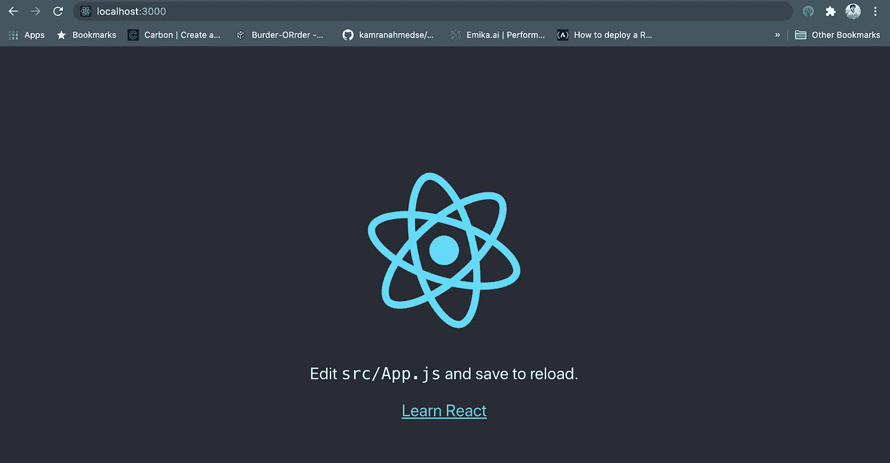
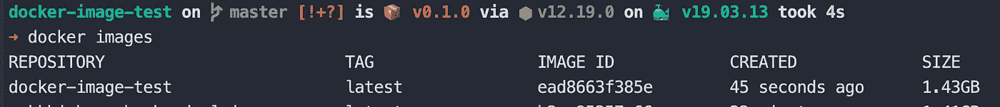
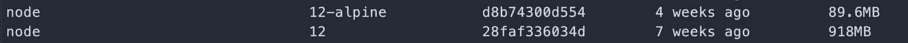
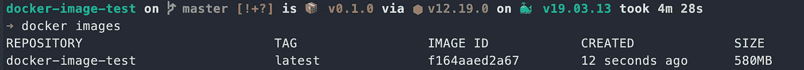
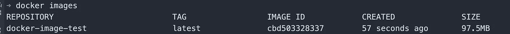

# 我如何将 Docker 图像大小从 1.43 GB 减少到 22.4 MB

> 原文：<https://javascript.plainenglish.io/how-i-reduced-docker-image-size-from-1-43-gb-to-22-4-mb-84058d70574b?source=collection_archive---------0----------------------->

## 5 个简单的步骤


Photo by [Guillaume Bolduc](https://unsplash.com/@guibolduc?utm_source=unsplash&utm_medium=referral&utm_content=creditCopyText) on [Unsplash](https://unsplash.com/s/photos/container?utm_source=unsplash&utm_medium=referral&utm_content=creditCopyText)

如果你从事 web 开发，那么你可能已经知道了容器化的概念，以及它有多棒等等。

但是在使用 [**Docker**](https://www.docker.com/) 时，图像大小是一个很大的问题。仅仅是我们从 [**create-react-app**](https://reactjs.org/docs/create-a-new-react-app.html) 得到的样板文件项目，就经常超过 1.43 GB

今天，我们将容器化一个 ReactJS 应用程序，并学习一些如何减少图像大小，同时提高性能的技巧。

这里将展示 ReactJS 的技巧，但它适用于任何 NodeJS 应用程序。

# 第一步。创建您的项目

*   只需到你的终端键入

```
npx create-react-app docker-image-test
```

*   然后 **create-react-app** 将为您提供基本的 react 应用程序
*   之后，进入根目录并运行项目。

```
cd docker-image-test
yarn install
yarn start
```

*   然后转到 [http://localhost:3000](http://localhost:3000) 查看您的应用程序是否启动并运行。



# 第二步。建立你的第一个形象

*   在项目的根目录中，创建一个名为 **Dockerfile** 的文件，并将下面的代码粘贴到那里。

Dockerfile

*   注意，我们正在从 docker hub 获取我们的基本映像节点:12，安装我们的依赖项，并运行基本命令。(我们不会在这里深入讨论 docker 命令的细节)
*   现在，从您的终端，为您的容器构建映像。

```
docker build -t docker-image-test .
```

*   Docker 会建立你的形象。完成后，您可以使用此命令查看您的图像。

```
docker images
```

列表顶部是我们新创建的图像，在最右边，我们可以看到图像的大小。暂时是 **1.43GB** 。



docker images on our machine

*   我们可以使用以下命令来运行映像

```
docker run --rm -it -p 3000:3000/tcp docker-image-test:latest
```

你可以进入你的浏览器并刷新页面来验证它是否还在工作。

# 第三步。更改基础图像

*   在之前的配置中，我们使用**节点:12** 作为我们的基础映像。但是传统上，节点图像是基于 Ubuntu 的，这对我们简单的 React T21 应用程序来说是不必要的沉重。
*   从 DockerHub(官方 docker 映像注册表)中，我们可以看到基于 alpine 的映像比基于 ubuntu 的映像要小得多，并且它们的打包只需要最小的依赖性。
*   这些基本图像的大小比较如下所示。



node:12 vs node:12-alpine

*   现在我们将使用**节点:12-阿尔卑斯山**作为我们的基础图像，看看会发生什么。

Dockerfile with node:12-alpine

*   然后，我们建立我们的形象，并看到大小，因为我们之前做的。



image with node-alpine

哇！我们的图像尺寸缩小到仅 580MB。这是一个很大的进步。但是我们能做得更好吗？

# 第四步。多阶段构建

*   在我们以前的配置中，我们将所有的源代码复制到工作目录中。
*   但是这是不必要的，因为我们只需要构建文件夹来服务我们的网站。所以现在，我们将使用[多阶段](https://docs.docker.com/develop/develop-images/multistage-build/)构建的概念来从我们的最终映像中削减不必要的代码和依赖性。
*   配置看起来会像这样。

*   在第一阶段，我们安装依赖项并构建我们的项目
*   在第二个阶段，我们从前面的阶段复制构建文件夹的内容，并使用它来服务我们的应用程序。
*   这样，我们在最终的图像中就不会有不必要的依赖和代码。

接下来，我们构建我们的图像，并像以前一样从列表中看到图像



Image with multi-stage build

现在我们的镜像大小是 **97.5MB** 只有**。**这有多棒？

# **第五步。使用 NGINX**

*   我们使用一个节点服务器来服务我们的 **ReactJS** 应用程序的静态资产，这不是服务静态内容的最佳选择。
*   我们可以使用更高效、更轻量级的服务器，如 [**Nginx**](https://www.nginx.com/) 来服务我们的应用程序，看看它是否提高了我们的性能并减小了大小。
*   我们最终的 Docker 配置文件看起来会像这样。

*   我们正在改变 docker 配置的第二阶段，以服务于使用 Nginx 的应用程序。
*   然后，我们使用当前配置构建我们的映像。


Final Docker Image Size

*   图像尺寸缩小至仅 **22.4MB** ！
*   与此同时，我们正在使用一个更高性能的服务器来服务我们出色的应用程序。
*   我们可以使用下面的命令来验证我们的应用程序是否还在工作。

```
docker run --rm  -it -p 3000:80/tcp docker-image-test:latest
```

*   请注意，我们将容器的 80 端口暴露给了外部，因为默认情况下，Nginx 将在容器内部的 80 端口上可用。

所以这些是一些简单的技巧，你可以应用到你的任何一个 **NodeJS** 项目中，来大幅减少图片的大小。现在，您的容器真正变得更加便携和高效。

今天到此为止。编码快乐！

**有话要说？**

```
**Get in touch with me via** [**LinkedIn**](https://www.linkedin.com/in/56faisal/) **or my** [**Personal Website**](https://www.mohammadfaisal.dev/)**.**
```

[](https://betterprogramming.pub/the-7-traits-of-a-rock-star-react-developer-747fbb001c05) [## 摇滚明星 React 开发者的 7 个特质

### 造成差异的习惯

better 编程. pub](https://betterprogramming.pub/the-7-traits-of-a-rock-star-react-developer-747fbb001c05) [](/20-essential-parts-of-any-large-scale-react-app-ee4bd35436a0) [## 任何大型 React 应用程序的 20 个基本部分

### 如果您正在编写企业级代码，您需要了解这一点

javascript.plainenglish.io](/20-essential-parts-of-any-large-scale-react-app-ee4bd35436a0) 

## 资源

*   ***本帖灵感***:[https://medium . com/the-agile-crafter/docker-image-optimization-from-1-16gb-to-22-4mb-53 fdb4c 53311](https://medium.com/the-agile-crafter/docker-image-optimization-from-1-16gb-to-22-4mb-53fdb4c53311)
*   ***Docker*** :[https://docs.docker.com/](https://docs.docker.com/)
*   ***Alpine Images*** [https://hub.docker.com/_/alpine](https://hub.docker.com/_/alpine)
*   ***Multi-Stage Build*** :[https://docs.docker.com/develop/develop-images/multistage-build/](https://docs.docker.com/develop/develop-images/multistage-build/)
*   ***NGINX*** :[https://www.nginx.com/](https://www.nginx.com/)