# 我是如何通过使用 Redux 钩子来减少 Redux 应用程序中的代码的。

> 原文：<https://javascript.plainenglish.io/how-i-reduced-the-amount-of-code-in-my-redux-app-by-using-redux-hooks-b19c926419ea?source=collection_archive---------1----------------------->

## 下面是如何简化所有组件中的 Redux 绑定，以帮助减少 React Redux 样板文件。


## 我最近写了一篇文章，比较了用 React 和 React + Redux 构建的完全相同的应用。

Redux 应用程序的代码使用`connect()`绑定将我们的组件连接到我们的商店。这意味着我们需要像`mapStateToProps`和`mapDispatchToProps`这样的东西给我们的每个容器组件添加几行代码。

**容器组件通常是我们 Redux 商店的入口点。然后，这些文件将 Redux 存储状态作为道具传递给子组件。在我们的例子中，我们的容器组件是* ***App.js*** *。但是如果您使用 React 路由器，您可能会决定将每个路由(例如****index . js****，****about . js****等)视为一个容器组件。单词“容器”的使用仅仅是一个语义单词，帮助开发人员将其与“常规”组件区分开来。这两个组件的创建方式没有区别，尽管如果您愿意，可以选择将容器组件放在应用程序目录中的* ***容器*** *文件夹中。*

## 无论如何，一些人提到我应该使用钩子来简化 Redux 绑定。

现在请记住，这不是一篇旨在鼓吹您应该去重写您以前所有的 Redux 代码的文章——因为如果它已经完美地工作了，您绝对不应该浪费时间重写。然而，我确实认为，如果用新的基于钩子的绑定替换旧的 Redux 绑定，那么让代码看起来像什么是个好主意。这样，您就可以利用这些新的绑定来开发下一个新项目。

***注意*** *:我们不会深入到我们的动作、reducers 或 store(或任何其他通常位于****redux****文件夹中的文件)中使用的代码。由于这是上一篇文章* *的延续，如果你想了解 Redux 的底层部分是如何工作的，我们建议你去阅读那篇文章。* ***这里的链接可以找到***[](https://medium.com/javascript-in-plain-english/i-created-the-exact-same-app-with-react-and-redux-here-are-the-differences-6d8d5fb98222)**。**

**注意:你仍然需要用 react-redux* `*<Provider>*` *组件包装你的应用。供参考，这是我们的****src/index . js****文件的样子:**

```
*import React from "react";
import ReactDOM from "react-dom";
import { Provider } from "react-redux";
import configureStore from "./redux/store/configureStore";
import App from "./App";const store = configureStore(); ReactDOM.render(
  <Provider store={store}>
    <App />
  </Provider>,
  document.getElementById("root")
);*
```

# *开始吧！*

*现在我们的待办事项应用程序非常简单，所以幸运的是我们只有一个需要使用 Redux `connect()`绑定的文件。这个文件也不需要从我们的 Redux store/actions 中提取太多东西。然而，该文件看起来仍然很乱，正如我们从下图中看到的:*

*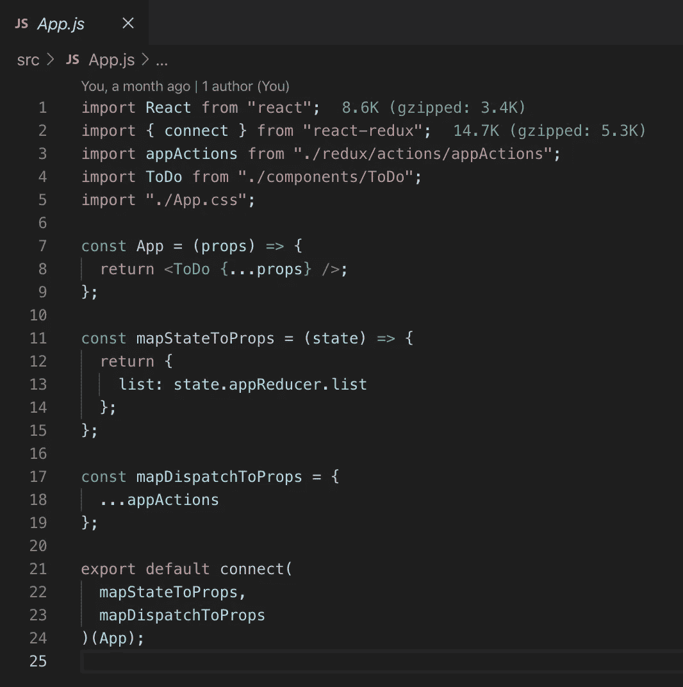*

*Our app when using connect() bindings*

*下面是我们新的 **App.js** 文件使用我们的 Redux Hooks 绑定后的样子:*

*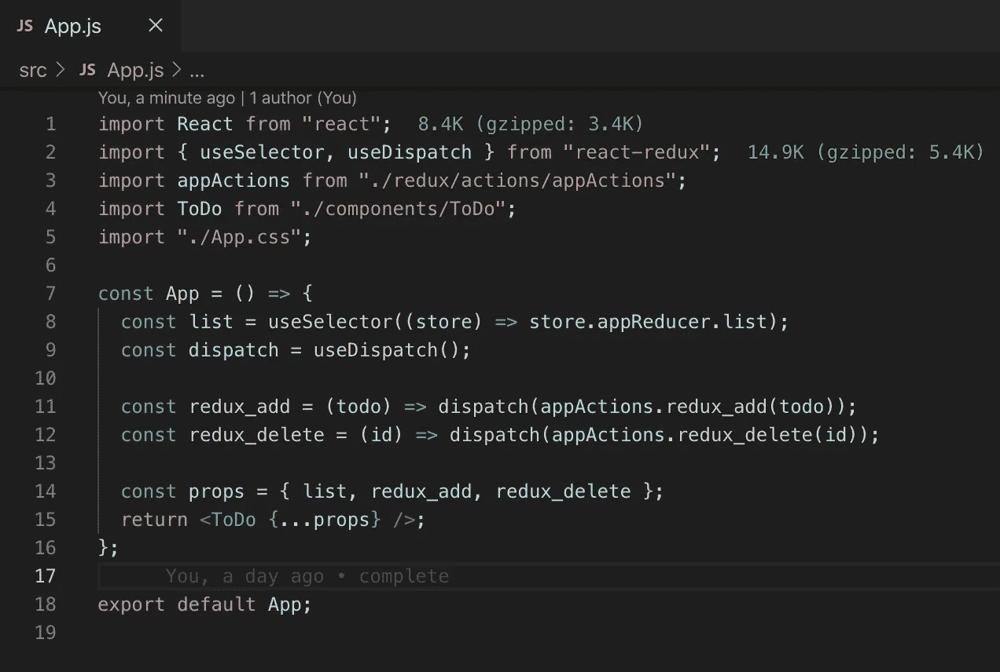*

*Our app when using Redux Hooks*

*这两个截图之间的一个直接区别是，在第一个截图中，我们使用了`connect()`绑定，所有内容都被分离出来，而在第二个截图中，当我们使用 Redux 挂钩时，所有内容都被封装在我们的`App`变量中。这种封装是必需的，因为很简单，我们不能在 React 功能组件之外使用钩子。*

*那么，这个小问题解决了，让我们仔细阅读一下`App`中的五行代码，来理解这一切是如何工作的:*

# *使用选择器()*

*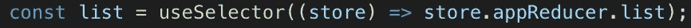*

*useSelector()*

*`useSelector()`是一个钩子，它提供了对 Redux 存储状态的访问。这个钩子接受一个选择器函数作为参数。用存储状态调用选择器。所以这里我们调用我们的参数`store`，然后访问我们的`appReducer`，它的状态中有一个`list`对象。如果你很想知道这些部分是如何连接的，[我建议你阅读之前的文章。通过使用`useSelector()`，我们有效地取代了使用`mapStateToProps()`的需要，使我们能够直接挂钩到 Redux store，而不需要从更高级的组件传递状态作为道具。](https://medium.com/javascript-in-plain-english/i-created-the-exact-same-app-with-react-and-redux-here-are-the-differences-6d8d5fb98222)*

*简而言之，这个钩子创建了对我们州的那个特定部分的引用。然后，我们可以在我们的应用程序中传递它，每当 Redux 更新它时，我们的引用也会更新。*

*好的，我们可以通过钩子访问我们的状态，但是如何访问我们的调度函数呢？*

# *使用 Dispatch()*

*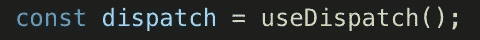*

*useDispatch()*

*`useDispatch()`是一个钩子，它为我们提供了对 redux `dispatch`函数的访问。在上面的截图中，你可以看到我们把`useDispatch()`赋给了一个叫做`dispatch`的`const`。*

*然后我们再创建两个`const`，它们与我们想要创建引用的分派函数具有相同的名称。你可以选择怎么称呼他们，但这是我选择的道路:*

*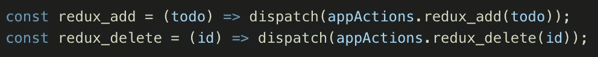*

*Our dispatch functions*

*这可能一开始看起来有点混乱，所以让我们进一步分解它。我们正在创建接受参数的函数，`redux_add`函数中的`todo`和`redux_delete`函数中的`id`。这些基本上是我们的调度功能所需的有效载荷。然后我们的函数返回最初被赋予值`useDispatch()`的`dispatch`。*

*由于它是对 Redux dispatch 函数的引用，我们基本上只是传入我们想要调用的函数，在`redux_add`的情况下，是位于`appActions`内部的`redux_add`函数，它被导入到文件的顶部。您还可以注意到，我们传入了`todo` param 作为它的有效负载。我们对`redux_delete`函数做了同样的事情。*

*现在你可以选择其他方式来写这个。例如，我可以这样写:*

*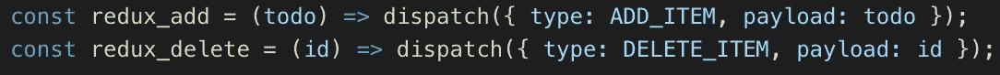*

*An alternative way to writing our dispatch functions*

*这实现了完全相同的事情，并且基本上是您最终会在 **appActions.js** 文件的每个函数中找到的内容。如果您选择第二种方式，请确保导入您的操作类型，而不是您的应用程序操作，这意味着导入:*

*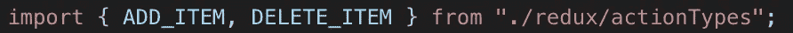*

*importing actionTypes*

*而不是这个:*

*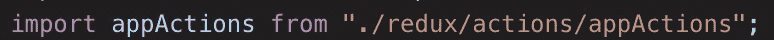*

*importing appActions*

*简而言之，我们使用`useDispatch()`来创建对特定调度函数的本地引用。这取代了我们使用`mapDispatchToProps()`的需要。*

*然后我们如何将这些值传递给我们的组件？*

# *小道具*

*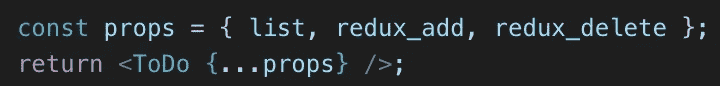*

*How we passed in our props to the ToDo component*

*这最后一点并不完全必要，因为我可以像这样将每一项传递给`<ToDo/>`组件:*

*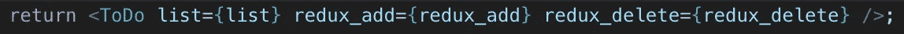*

*An alternative approach to passing in our props.*

*但是我通常不喜欢这个样子，并且希望用于`connect()`绑定版本和 Redux 挂钩版本的 props 对象的代码看起来尽可能的相似——这是通过创建`props`对象实现的。*

# *所以我们有它！*

*我们已经减少了 Redux 应用中的一些样板文件。除了冗余心智模型之外，样板文件可能是新开发人员需要考虑的问题。希望 Redux 挂钩可以帮助减少头部包装的数量。我们再也不用担心在`connect()`高阶组件中包装我们的组件了！*

*现在，您可以像异步动作创建者一样，将注意力集中在更紧迫的问题上了！*

****对比 React 与 React-Redux 的原文，可以在这里找到:***[https://medium . com/JavaScript-in-plain-English/I-created-The-exact-same-app-with-React-and-Redux-here-is-The-The-differences-6 D8 D5 FB 98222](https://medium.com/javascript-in-plain-english/i-created-the-exact-same-app-with-react-and-redux-here-are-the-differences-6d8d5fb98222)*

****如果你想回顾一下本文中用到的回购，可以在这里找到:【https://github.com/sunil-sandhu/redux-hooks-todo-2019】****

****你也可以在这里和原来使用旧绑定的 Redux 回购进行对比:****[https://github.com/sunil-sandhu/redux-todo-2019](https://github.com/sunil-sandhu/redux-todo-2019)**

**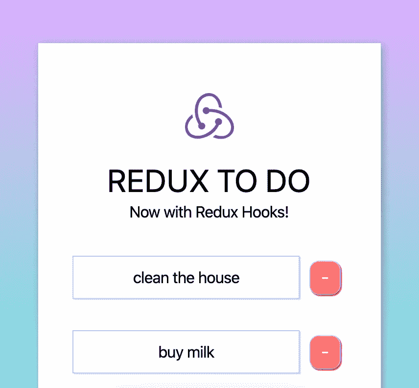**

**A screenshot of the app but cropped a bit so that we can use it for the featured image thing**