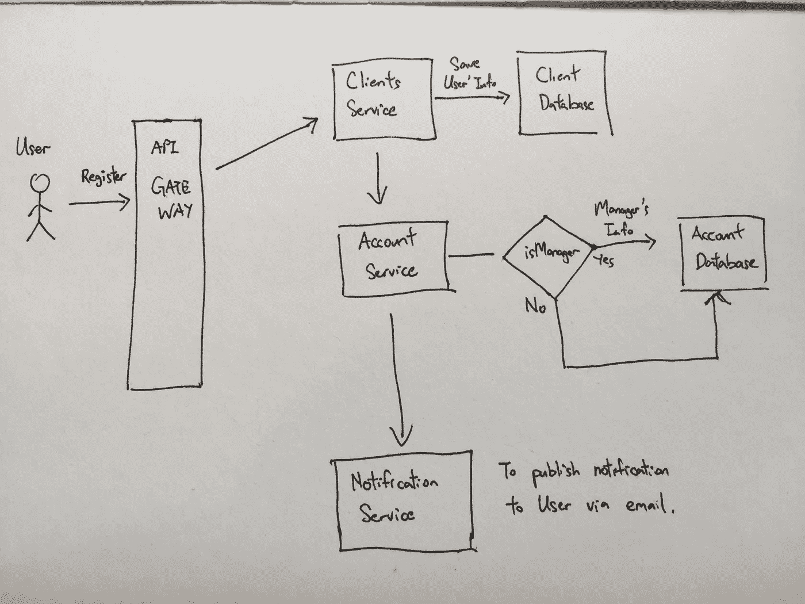

# 如何使用 Jest & Mongoose 为 MongoDB 设置单元测试

> 原文：<https://javascript.plainenglish.io/how-i-setup-unit-test-for-mongodb-using-jest-mongoose-103b772ee164?source=collection_archive---------0----------------------->

Photo by [Joshua Aragon](https://unsplash.com/@goshua13?utm_source=medium&utm_medium=referral) on [Unsplash](https://unsplash.com?utm_source=medium&utm_medium=referral)

# 背景

我正在做一个后端微服务项目，该项目采用了 MongoDB、Express Framework、RabbitMQ 等技术栈。最近，我被指派开发一个相当大的功能，它涉及不同微服务之间的变化和逻辑流。我在下面的截图中草拟了流程。

Microservices Flow and Forgive my handwriting

如果您想要设置和运行所有相关项目并执行端到端测试，这是非常具有挑战性和耗时的，因为当您的范围非常大时，错误可能会在所有这些不同的微服务中的任何地方发生。

# 解决方案设计

我想到的解决方案是**在每个微服务中对代码进行单元测试。**

当你从事微服务项目时，单元测试是很重要的。这是因为在进行集成测试之前，您希望确保您的代码能够正常工作。根据您的业务用例，集成测试可能会很困难和复杂。

这是我第一次觉得编写单元测试要容易得多。然而，在本文中，我们将只关注 MongoDB 单元测试。

# 履行

事不宜迟，让我们起草并分解实现步骤。

1.  基本快速应用程序设置
2.  使用 Mongoose 创建一个用户模型
3.  设置 Jest & MongoDB 内存服务器
4.  单元测试

## 基本快速应用程序设置

该应用程序使用 [Express](https://expressjs.com/) 框架运行。这个设置的预期结果是，我们将有一个连接到 MongoDB 的功能应用程序。

要完成安装，需要下列依赖项。

*   [昏庸](https://github.com/motdotla/dotenv)。这是用于管理环境变量的流行库。常见的用例是在这里存储 MongoDB 连接字符串，这样就可以很容易地为不同的环境配置连接字符串。
*   [猫鼬](https://mongoosejs.com/docs/index.html)。MongoDB 的数据建模库。

**为什么是猫鼬？**

我之所以用 Mongoose 而不是 [MongoDB 节点驱动](https://mongodb.github.io/node-mongodb-native/3.3/)是因为**模式**和**验证**。我不会深入猫鼬。基本上，Mongoose 提供的是允许我**有意地**定义我想要的字段，以及该字段是强制的还是可选的。有意编码非常重要，我们有责任知道每一行代码的用途。

似乎很复杂？不要担心设置。我为您设置了所需的依赖项。你可以通过 [Github](https://github.com/tlcheah2/unit-test-mongodb-with-jest/tree/initial-setup) 下载或者克隆代码，无缝地建立你自己的单元测试项目。

## 使用 Mongoose 创建用户模型

在我们成功建立项目之后。在我们创建模型之前，我们必须知道我们想要什么。

这意味着我们对用户模型有什么期望。假设我们想知道用户的 ***姓名*** 、 ***出生日期、年龄*** *以及使用何种社交账户登录。这个过程被称为在猫鼬中定义`schema`。*

定义模式比您想象的要容易。以下是步骤和代码:

1.  定义用户模式。
2.  用定义的用户模式创建用户模型。

现在我们有了一个工作模式和模型。让我们继续设置 Jest 和单元测试。

## 设置 Jest & MongoDB 内存服务器

**分步指南** 首先我们要安装 Jest。我选择将它作为一个开发依赖项来安装，这样每个签出这个项目人都可以使用它，而无需在他们自己的工作站中全局安装任何依赖项。

`npm install jest --save-dev`

我会说 Jest 是 MongoDB 进行单元测试的完美匹配，因为 Jest 附带了 MongoDB 预置的[,它提供了所有的配置，只需要最少的设置。一会儿我会解释更多。现在，让我们安装预置。](https://jestjs.io/docs/en/mongodb)

`npm install @shelf/jest-mongodb --save-dev`

然后，在您的项目目录中创建`jest.config.js`。

Jest Preset

之后，在你的项目目录下创建`jest-mongodb-config.js`,内容如下。

配置到此为止。很简单，对吧？

**为什么用 MongoDB 预置 Jest？** 该预置帮助您配置所有设置 [MongoDB 内存服务器](https://github.com/nodkz/mongodb-memory-server)。

为什么我们需要 MongoDB 内存服务器？这是因为当您运行您的单元测试时，您不希望您的单元测试虚拟日期被保存到您的真实数据库中。因此，MongoDB 内存服务器为您提供了只在内存中存储数据的能力。

有了这个预设，我们就可以忽略掉大多数让我们失去动力的设置，把大部分时间花在编写单元测试的真正工作上。

## 单元测试

现在我们知道了**为什么**和**如何**的部分。让我们在刚刚创建的用户模型上做一些单元测试。让我们配置 mongoose 到 Mongo 内存服务器的连接，我还列出了一些非常简单的测试用例。

这是我们将要测试的测试用例列表。

*   将用户成功插入数据库。(测试正常用例)
*   插入具有无效字段的用户。(模式测试)
*   插入没有必填字段的用户。(验证测试)

也可以参考下面的要旨。

# 结论

在我看来，开发人员总是有动力，热衷于做单元测试。但是，花费精力和时间的**依赖嘲讽**和**配置**始终是一个 ***障碍和挫伤积极性的因素*** 。

我自己也经历过这种情况，但我不知道如何解决依赖性，以便继续编写单元测试。最后，我跳过了单元测试，这是一种不好的感觉。

现在，通过简单的设置，所有的预置和配置都为您准备好了，您可以用最少的努力编写单元测试了。相信我，你的单元测试会给你的队友留下深刻印象。

> 与程序员的队友建立信任的捷径:编写测试。

最后，我希望这篇文章能启发你编写单元测试，并给你信息编写单元测试可能比你想象的更容易。

# 参考

*   官方笑话[文档](https://jestjs.io/docs/en/mongodb)与 MongoDB
*   MongoDB 内存服务器的 Jest 预设 [Github](https://github.com/shelfio/jest-mongodb)

感谢阅读。