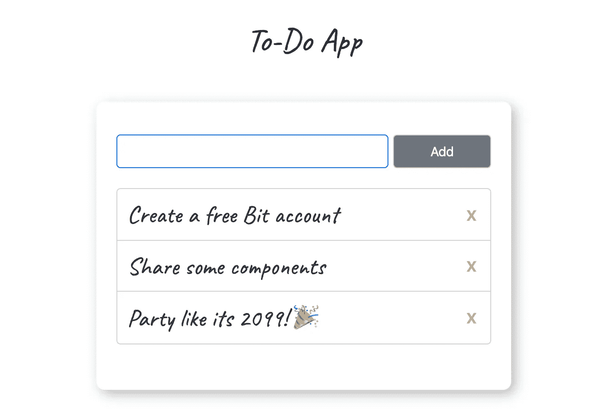
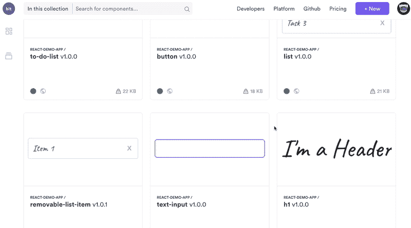
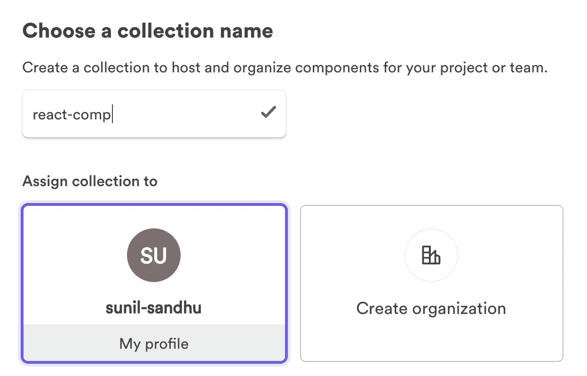
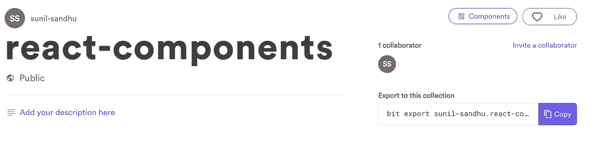
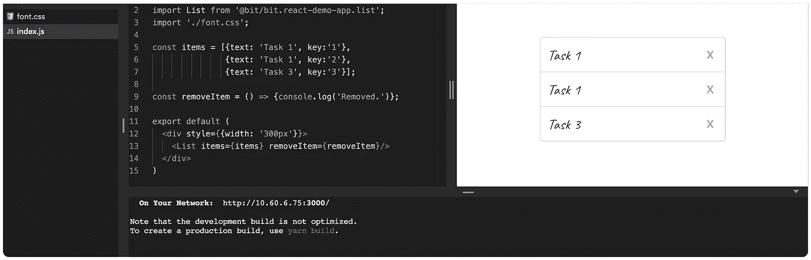
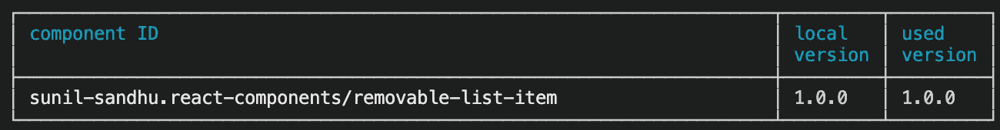
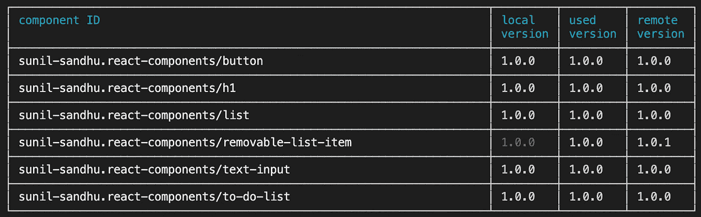

# 我如何在项目之间共享 React 组件

> 原文：<https://javascript.plainenglish.io/how-i-share-react-components-between-projects-3896d853cbee?source=collection_archive---------0----------------------->

## 通过与 Bit 共享组件来缩短开发时间！


Bit.dev

# 作为一名开发人员，我总是在开发新的应用程序。因此，我经常发现自己在重复很多任务。

比如一遍又一遍地创建相同类型的组件——按钮、表单、导航条等。我最近遇到了一个名为 [Bit](https://bit.dev/) 的平台，它为开发者提供了一种在项目之间共享组件的简单有效的方式[。使用 Bit 为我提供了一种简单的方法来提高速度，因为它帮助我避免了一遍又一遍地重新创建那些相同的组件。](https://bit.cloud/blog/how-to-reuse-react-components-across-your-projects-l3bhezsg)

## 在使用 Bit 的过程中，我还拥有了一个组件库，可以通过它们的 GUI 浏览。

使用 GUI——它不是 Bit 的一个独立软件，而只是登录到 Bit 网站并查看组件库——我获得了能够单独查看每个组件的额外能力，并且可以使用不同的值、状态等查看它的外观。

这种创建和存储组件的可视化方法有助于将开发和设计这两个世界结合在一起，这种体验是在 GitHub 等设备上存储代码时所没有的。

从任何应用程序或项目共享组件变成了一个简单的过程，使用 Bit 添加、标记和导出组件到您的可重用集合。然后，使用 npm/yarn 向您的项目添加组件变得很容易，就像您添加任何其他包一样。

## 我想演示一下使用 Bit 有多简单。

因此，让我们花几分钟时间，将我们之前创建的一些简单组件导出到 Bit，然后在我们的应用程序中重用它们。

我很快从一个演示版的 React To-Do 应用程序变成了这样:



到拥有一组独立的可重用组件供我使用:



Reviewing a collection of components in Bit

# 好了，说够了。我们开始吧！

## **1。收集您的组件**

如果你以前用 React 创建过一个应用，那很好。你将得到那个应用程序，并用它来构建你自己的组件库。您现在可以进入第 2 步了！

注意:如果你没有任何应用程序，或者之前从未使用 React 创建过应用程序，那么最好是先创建一些简单的应用程序，比如 to do 应用程序，然后在你对 React 感到满意时再回来。

## **2。现在，安装 Bit:**

```
$ yarn global add bit-bin
# or
$ npm install bit-bin --global
```

## **3。创建一个免费的 Bit 账户**

您可以通过访问:**[**https://bit.dev/signup**](https://bit.dev/signup)**

## ****4。回到终端并登录您的 Bit 账户****

**您可以通过运行以下命令来实现这一点:**

```
$ bit login
```

**Bit 会在终端中问你几个关于错误报告的问题，你可以回答*是*或*否*。然后你的浏览器应该打开 Bit 网站，并显示一个成功页面，如果一切按预期进行的话——对我来说就是这样，这是一次奇妙的开发体验。**

## ****5。开始分享吧！****

**要在 Bit 上共享组件，我们需要做 3 件事:**添加**(打包)**标签**(版本)**导出**(发布)。Bit 自动完成了大部分工作，所以这实际上是一个非常简单的过程。**

**在你的应用程序的根文件夹中运行`bit init`来初始化一个 Bit 工作空间。默认情况下，这会将您的工作区设置为使用 npm。如果你喜欢使用纱线，运行这个`bit init --package-manager yarn`。或者直接更新`"packageManager"`值来使用`yarn`。**

**这为您的 **package.json** 添加了一些代码，如下所示:**

```
“bit”: {
  “env”: {},
  “componentsDefaultDirectory”: “components/{name}”,
  “packageManager”: “yarn”
}
```

**现在我们的工作空间已经初始化，让我们继续添加一些组件。**

## **添加组件**

**接下来，让我们告诉 Bit 开始跟踪`src/components`目录中的所有组件。它会自动打包每个组件的所有文件和依赖项。我们可以通过运行以下命令来实现这一点:**

```
$ bit add src/components/*
```

**您现在可以运行`bit status`来查看是否所有的东西都添加好了。如果是，您会在终端/命令行中看到每个添加的组件旁边的`ok`。**

> **如果您在自己的应用程序中执行此操作时遇到任何问题，[请点击此处了解如何解决这些问题](https://docs.bit.dev/docs/isolating-and-tracking-components.html#tracking-a-component-with-file-dependencies)。**

**为了确保我们的代码可重用，我们需要定义一个编译器。为了节省开销，Bit 提供了预定义配置的可重用开发环境(env)。**

**将 Bit.dev 中的 [*React 编译器*导入到你的应用工作区。Bit 将它定义为工作空间中每个组件的构建配置。](https://bit.dev/bit/envs)**

```
$ bit import bit.envs/compilers/react --compiler
```

**上面的步骤在我的电脑上执行了大约一分钟，所以如果你发现自己有点等待，不要担心。如果一切顺利，您应该在终端中看到以下内容:**

```
the following component environments were installed
- bit.envs/compilers/react@1.0.11
```

**您还会注意到我们的 **package.json** 中的`"bit"`对象现在已经更新为:**

```
“bit”: {
  "env": {
    "compiler": "bit.envs/compilers/react@1.0.11"
  },
  “componentsDefaultDirectory”: “components/{name}”,
  “packageManager”: “yarn”
}
```

*****可选*** *:* 运行`$ bit build`查看所有组件是否构建成功。**

**既然已经添加了组件，我们现在可以看看如何标记它们了。**

## **标记组件**

**Bit 使用语义标签来帮助识别组件的不同版本，类似于一个软件如何使用标签来表明它是什么版本。**

**为了标记一个组件，我们使用`bit tag`,后跟你想要标记的组件的文件路径，以及我们想要给组件的版本号。或者，我们可以通过添加`--all`标志来一次性标记所有组件，如下所示:**

```
$ bit tag --all 1.0.0
```

**如果一切顺利，您应该可以在终端/命令行中看到标记的组件数量。**

**值得注意的是，指定版本号并不是强制性的。如果您愿意，您实际上可以将它留给 Bit 来处理，在这种情况下，补丁号将在每个新标签上自动增加。**

**最后，我们现在可以将组件导出到我们的 Bit.dev 集合中。**

## **导出组件**

**首先，进入 to [bit.dev](https://bit.dev) ，如果你已经登录，点击右上角的+New 按钮，然后点击“收藏”。**

****

**然后为您的收藏命名:**

****

**所以在我的例子中，我把我的集合叫做“反应组件”。然后点击页面底部的“创建”按钮。您现在将看到一个类似如下的页面:**

****

**[https://bit.dev/sunil-sandhu/react-components](https://bit.dev/sunil-sandhu/react-components)**

**在上面图像的右边，您可以看到它显示了一个命令，每当您想要将组件导出到这个集合时就运行这个命令。让我们继续这样做，运行:**

```
$ bit export user-name.collection-name
```

**在我的例子中，我将运行下面的:`$ bit export sunil-sandhu.react-components`。**

**完成后，您应该会在终端/命令行中看到一条注释，表明它是成功的。如果我在 Bit 上重新访问我的组件库，我可以看到我导出的六个组件！**

**现在你的每一个组件都可以在一个隔离的环境中查看，在这里你可以进行修改，添加/删除道具，等等！**

****

**What the component playground looks like for my List component**

**如您所见，我已经确保组件获得了所有需要的道具。此外，我还添加了一个包含 right `@import`的 CSS 文件，以便组件能够使用我希望它使用的字体系列。**

# **就这样，我现在有了自己的可重用组件库！**

**好的，那么我如何在其他应用程序中使用它们呢？让我们接下来讨论这个问题吧！**

## **在新应用程序中安装组件。**

**使用`create-react-app`创建一个新的 React 应用程序，并将其命名为‘new-app’。**

```
$ npx create-react-app new-app
```

**现在，您可以从新创建的 Bit 库获取组件了！**

**所以在我的例子中，假设我的项目需要一个`removable-list-item`组件。有趣的是，我之前已经创建了一个并导出到 Bit！因此，我可以像安装任何其他软件包一样安装它。我可以通过运行以下命令来实现:**

```
yarn @bit/sunil-sandhu.react-components.removable-list-item
```

****当然，您可以用替换 username . component-library . component-name**—*，在我的例子中是:sunil-sand Hu . react-components . removable-list-item—****，而不管您的 username . component-library . component-name 是什么。*****

## **但是，如果我不想将组件作为包添加，而只想让代码出现在我的应用程序中，该怎么办呢？**

**没问题，Bit 允许你分叉你的组件代码，允许你在本地编辑。**

**为此，在应用程序的根目录中初始化一个 Bit 工作空间:**

```
# cd new-app$ bit init
```

**现在，如果我想使用之前的`removable-list-item`组件，但只是想要代码而不是包，我可以运行下面的命令:**

```
$ bit import sunil-sandhu.react-components/removable-list-item
```

****同样，您可以用您的名称替换用户名.组件库/组件名。****

**这将导入组件并放在一个新创建的名为`components`的文件夹中。**

*****注意*** *:这个* `*components*` *文件夹出现在你 app 的根目录下，所以和* `*src/components*` *目录不同。***

```
├───.git
├───components
│   ├───removable-list-item
```

**您可以访问组件的源代码，并根据需要进行任何更改。**

**现在，假设您已经在本地进行了一些更改，并且现在决定希望这些更改作为组件的新版本出现在您的 Bit 组件库中。原来你也可以这样！**

**如果运行`bit status`，Bit 会识别出组件已经被修改。您可以使用`bit list`列出所有组件。在我们的例子中，我们只有一个被跟踪的组件:**

****

**Single tracked bit component**

**使用组件的 ID 为其标记新版本:**

```
$ bit tag user-name.collection-name/component-name
```

**就我而言，`$ bit tag sunil-sandhu.react-components/removable-list-item`。**

**现在将新版本导出到 Bit.dev。**

```
$ bit export user-name.collection-name
```

**就这样，您刚刚从新项目中编辑了组件，并将新的可重用版本导出到您的 Bit 集合中。**

## **但是，如果我希望我创建的原始应用程序使用这个组件的新版本，该怎么办呢？**

**事实证明，Bit 也创造了一种方法来做到这一点！仅供参考，这类似于用 Git 合并变更。最后，让我们快速回顾一下如何做这件事。**

**回到你的待办事项应用程序:**

```
$ cd react-demo-app
```

**现在运行以下命令来检查应用程序中的过期版本:**

```
$ bit list --outdated
```

**这将列出您的应用程序中的所有组件，我可以看到`removable-list-item`的本地版本以红色列出。**

**您应该会在控制台中看到类似下表的内容:**

****

**`bit list --outdated`**

**您现在可以获取组件的最新版本:**

```
$ bit import
```

**现在组件已经下载了，但是您的本地组件还没有改变。我们可以通过运行以下命令来验证这一点:**

```
$ bit status
```

**您应该会收到此消息，说明有挂起的更新，特别是您的更新组件。**

**我们通过运行`bit checkout`来合并新导入版本和您的本地版本之间的变更，从而解决这个问题。在我们的例子中，我们运行以下内容:**

```
$ bit checkout 1.0.1 removable-list-item
```

****你可以用你的组件的任何名称替换** `**removable-list-item**` **。****

**如果您遇到任何合并冲突，Bit 会在终端中告诉您。它还会为您的结账提供可选标志，其中之一是添加`--manual`标志，如下所示:**

```
$ bit checkout 1.0.1 removable-list-item --manual
```

****同样，用你的组件的任何名称替换** `**removable-list-item**` **。****

**这给了我修复组件内部任何合并冲突的能力，就像在 Git 中修复合并冲突一样。**

**然后我可以运行`yarn start`来查看我的 ToDo 应用程序现在正在使用更新的组件！**

## **浅谈构件属性和构件有效性**

**当在 Bit 上查看组件库中的组件时，确保组件接收到它们通常可能需要的任何道具是很重要的。**

**这里的关键是考虑你的每一个组件，而不是考虑它需要什么道具来渲染。因此，举例来说，如果你有一个组件，通常会收到一个“文本”属性，确保你提供给它的属性。如果你不这样做，当你试图在你的组件库中查看你的组件时，Bit 将不能呈现你的组件。**

**当您将它上传到 Bit 时，不为它提供道具可能是有意义的，因为您可能不喜欢这样做，但是您可以考虑解决这个问题的方法，比如通过 prop-types 库提供默认的道具。或者至少，在组件库中查看组件时，向组件添加所需的道具🙂。**

# **我们做到了！🎉**

**我们已经看到了如何在 React 应用程序之间快速打包、版本化和重用组件。除了 Bit 自动化带来的速度提升，我们还创建了自己的可重用库！**

**我们现在可以决定在我们的编程之旅中逐步增加。我们甚至可以邀请其他开发人员为我们的代码做贡献，就像我们对待其他项目一样。**

**它还不止于此，因为 Bit 上还有成千上万的其他组件库等着您去探索！**

****

**[Bit.dev](https://bit.dev)**

# **想了解更多关于 Bit 的内容吗？**

**[在 Bit.dev 中构建组件库的 15 个理由](https://blog.bitsrc.io/15-reasons-to-build-your-component-library-in-bit-dev-93a514878863)**

**[在 React 中加快开发的 5 个工具](https://blog.bitsrc.io/5-tools-for-faster-development-in-react-676f134050f2)**

**[2019 年你应该知道的 11 个 React UI 组件库](https://blog.bitsrc.io/11-react-component-libraries-you-should-know-178eb1dd6aa4)**

****更新:**如果您想使用 Bit，我强烈推荐这些更新的资源:**

**[https://www.youtube.com/watch?v=9vS86xgG3ak&t = 217s](https://medium.com/@JonathanSaring/update-with-some-new-examples-for-this-workflow-5c6b3bf2730?source=post_info_responses---------5-----------------------)**

**[](https://bit.cloud/blog/how-to-reuse-react-components-across-your-projects-l4pz83f4) [## 如何在项目中重用 React 组件

### 最后，您完成了为应用程序中的表单创建一个奇妙的输入字段的任务。你对……很满意

比特云](https://bit.cloud/blog/how-to-reuse-react-components-across-your-projects-l4pz83f4)**