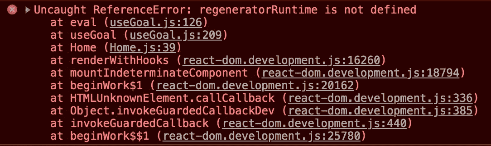

# 我如何在使用 Webpack 创建的 React 应用程序中设置 Jest 和 Enzyme 时解决问题

> 原文：<https://javascript.plainenglish.io/how-i-solved-issues-while-setting-up-jest-and-enzyme-in-a-react-app-created-using-webpack-7e321647f080?source=collection_archive---------0----------------------->


写这篇博客的主要原因是，我在 React 项目中设置测试环境时面临许多错误。如果你使用的是 CRA，那就简单多了，但是如果项目是用 Webpack 配置的，那就麻烦了。我不希望我的开发伙伴经历同样的麻烦。

***注*** *:本文不是为了从头开始设置 Webpack、Jest 或 Enzyme。为此，我会分享其他人的精彩文章的链接。这只是为了帮助开发人员修复他们在这样做时可能面临的错误。*

基本上，我遇到了两个花了很长时间才解决的错误:

1.  **Jest 遇到意外令牌**

```
Jest encountered an unexpected token

    This usually means that you are trying to import a file which Jest cannot parse, e.g. it's not plain JavaScript.This usually means that you are trying to import a file which Jest cannot parse, e.g. it's not plain JavaScript.

    By default, if Jest sees a Babel config, it will use that to transform your files, ignoring "node_modules".

    Here's what you can do:
     • To have some of your "node_modules" files transformed, you can specify a custom "transformIgnorePatterns" in your config.
     • If you need a custom transformation specify a "transform" option in your config.
     • If you simply want to mock your non-JS modules (e.g. binary assets) you can stub them out with the "moduleNameMapper" config option.     

    You'll find more details and examples of these config options in the docs:
    [https://jestjs.io/docs/en/configuration.html](https://jestjs.io/docs/en/configuration.html)
```

我一使用 Jest 运行测试，这个错误就出现了。

在做了大量的调试之后，我意识到我在。一点也不好。我漏掉的是“预设环境”。为此，我安装了 **@babel/preset-env。**

```
npm i -D [@babel/preset-env](http://twitter.com/babel/preset-env)
```

然后，我将`.babelrc`文件更新为:

```
{ 
  "presets": ["@babel/react", "@babel/env"]
}
```

有了这个，我能够成功地运行测试，使用:

```
npm run test
```

PS:我已经修改了相同的**“脚本”**键。

2.**未定义再生运行时间**



这是我面临的第二个错误。因此，我的测试现在运行良好，但是我的应用程序开始崩溃。当我点击网址时，我得到了上面的错误。

同样，在做了大量的调试和谷歌搜索后，我了解到我需要的东西是 **@babel/polyfill。**

要安装，只需运行:

```
npm install --save @babel/polyfill
```

是的，这不是开发依赖性，因为它是一个多填充。

安装完成后，只需将其添加到***web pack . config . js***中的`"entry"`中即可:

```
entry: ['@babel/polyfill', './src/js/index.js'],
```

仅此而已。有了这个，我的应用程序和测试，现在都运行得相当顺利。如果你遇到这些错误或者遇到新错误，请告诉我你是否能够修复它们。

**资源:**

[](https://medium.com/@imranhsayed/set-up-react-app-with-webpack-webpack-dev-server-and-babel-from-scratch-df398174446d) [## 从头开始使用 Webpack、Webpack 开发服务器和 Babel 设置 React 应用程序。

### 在这篇博客中，你将学习如何设置一个 React 应用程序:

medium.com](https://medium.com/@imranhsayed/set-up-react-app-with-webpack-webpack-dev-server-and-babel-from-scratch-df398174446d) [](https://medium.com/codeclan/testing-react-with-jest-and-enzyme-20505fec4675) [## 测试与 Jest 和酶 I 的反应

### 这篇文章将介绍如何设置和使用 Jest 和 Enzyme 来测试用 Create React App 创建的 React 应用程序…

medium.com](https://medium.com/codeclan/testing-react-with-jest-and-enzyme-20505fec4675) [](https://jestjs.io/docs/en/tutorial-react) [## 测试 React 应用 Jest

### 在脸书，我们使用 Jest 来测试 React 应用程序。如果您是 React 新手，我们建议您使用 Create React App。它…

jet js . io](https://jestjs.io/docs/en/tutorial-react) [](https://www.toptal.com/react/tdd-react-unit-testing-enzyme-jest) [## 测试驱动的 React.js 开发:用 Enzyme 和 Jest 进行 React.js 单元测试

### 根据 Michael Feathers 的说法，任何没有经过测试的代码都是遗留代码。因此，其中一个…

www.toptal.com](https://www.toptal.com/react/tdd-react-unit-testing-enzyme-jest)