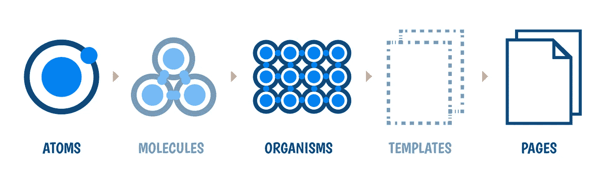

# 我如何构建反应应用

> 原文：<https://javascript.plainenglish.io/how-i-structure-react-apps-a76304277786?source=collection_archive---------1----------------------->

## 因为构建应用程序就像盖房子…


构建一个应用程序就像建造一栋房子🏡有很多决定要做，有很多观点，很多观点。文件夹结构也起着至关重要的作用。脑子里充斥着这样的问题:这个文件夹/文件应该放在哪里？它应该去哪个地方？文件夹、文件、组件、钩子或上下文的名称应该是什么？

> *开发商的生活方式*💻

我通常选择 [create-react-app](https://reactjs.org/docs/create-a-new-react-app.html#create-react-app) 来创建一个 react 应用程序，因为它很容易在短时间内启动开发&默认情况下，所有🛠的工具，如基本 CSS 文件、构建脚本、基本测试框架& PWA 都包括在内。

## 从 package.json 开始

**package.json**

## 剧本

这里是所有神奇的地方，所有美好的事情都发生在这里

*   构建应用程序
*   设置应用程序的样式
*   测试应用程序
*   美化应用程序
*   清理应用程序
*   还有更多

## ✅套餐的一些小技巧

脚本名称应该容易记住并且小，避免使用像`build:then:check:what:happened`这样的大名称

```
"scripts": {
  "build:then:check:what:happened": "react-scripts build",
  "are:we:building:then:check:what:happened": "react-scripts build"
}
```

我的选择:使用表情符号😉作为脚本名。让我知道你最喜欢的表情符号是什么，用于构建或部署代码，对我来说，构建应用程序是🥳，部署应用程序是🚀。

当我使用 Tailwind CSS 时，我倾向于将脚本命名为`build:style`，所以很容易识别出它是一个样式相关的任务，如果您使用多个样式框架，您也可以将其命名为特定于框架/库，如`build:tailwind`。

```
"scripts": {
  "build:style": "tailwind build index.css -o app.css"
}
```

用`:`代替`-`作为脚本名，这样会使脚本名工整&清晰易读。`-`表示包名& `:`表示脚本名😉

## `scripts`中的其他内容

林挺，美化，测试你的应用程序&检查捆绑包的大小是应用程序开发的一部分。为了避免代码格式问题，我启用了 pre-commit 钩子，利用了漂亮的。我用`eslint`表示林挺 JS，JSX，我用`stylelint`表示林挺风格，用`prettier`表示代码格式，我用`bundlesize`表示束大小。

使用反应惰性、暂挂和反应路由器的代码拆分😇

# 文件夹结构

我遵循原子设计方法，我严格遵循`Atoms`，然后在`Organisms`将它们集合在一起，然后直接到`Pages`。在开发项目时，遵循原子设计方法将在许多方面帮助您。

*   组件中重复代码较少，这减少了组件之间的不一致性
*   构建一个有机体或一个页面的时间会更快🚀
*   该项目的样式指南将驻留在`theme.js`中，调色板、间距、字体系列、字体大小、行高、边距、填充、伸缩、网格等等



Atomic Design

## 原子

原子是最小的组件，像按钮、标题、输入、下拉菜单、图标、标签。这在任何 app 中都起着重要的作用。app 的整个状态主要从这里开始。

## 有机体

有机体是像标题、卡片、带有图标的搜索框、列表项等原子的组合。一旦你计划、设计了`Atom`。你花在生物体上的钱会更少。

## 页

页面可以是原子和有机体的组合，或者仅仅是有机体，这取决于 UX 的设计。例如:它可以是许多带有标题的卡片，标题上有一个搜索框和一些按钮。

如果组件是按照上述方法设计的，那么构建一个组件所需的时间会更少。

主要的观点是，这不是一次性的过程，所有的小组件(原子)都是一次性制造出来的，组件的设计会及时变得更好⏰，通过多次迭代和讨论

## 组件的详细文件夹结构

这里我将上下文 API 用于共享状态:

```
📦 src
 ┣ 📂 components
 ┃ ┣ 📂 atoms
 ┃ ┃ ┣ Heading.js
 ┃ ┃ ┣ Input.js
 ┃ ┃ ┣ Icon.js
 ┃ ┃ ┣ Tag.js
 ┃ ┃ ┗ TextArea.js
 ┃ ┣ 📂 organisms
 ┃ ┃ ┣ Card.js
 ┃ ┃ ┣ Search.js
 ┃ ┃ ┣ Upload.js
 ┃ ┣ 📂 hooks
 ┃ ┃ ┣ useIntersectionObserver.js
 ┃ ┃ ┗ useKeyPress.js
 ┃ ┣ 📂 logics
 ┃ ┃ ┣ useName.js
 ┃ ┃ ┗ useStatus.js
 ┃ ┣ 📂 pages
 ┃ ┃ ┣ 📂 Create
 ┃ ┃ ┃ ┗ index.js
 ┃ ┃ ┣ 📂 List
 ┃ ┃ ┃ ┗ index.js
 ┃ ┃ ┣ 📂 Onboarding
 ┃ ┃ ┃ ┗ index.js
 ┃ ┃ ┗ index.js
 ┣ 📂 context
 ┣ 📂 images
 ┣ 📂 styled-elements
 ┣ 📂 tests
 ┣ 📂 utils
 ┣ App.js
 ┣ constants.js
 ┣ index.js
 ┣ serviceWorker.js
 ┣ setupTests.js
 ┗ theme.js
```

## 我如何构造反应元件

在一个组件中处理 UI 代码，在其他地方分离该组件的逻辑。这将使组件感觉轻量级🐥你可以更好地编码。

**用户界面:**

../pages/Create/index.js

**逻辑:**

../logics/useName.js

## 式样

通常我会在[顺风 CSS](https://tailwindcss.com/) 或<之间切换💅> [风格化-组件](https://styled-components.com/)基于项目需求。

## 顺风 CSS

如果我选择顺风 CSS，我倾向于只选择`tailwind.config.js`中需要的选项，并将 npm 脚本命名为`build:style`来构建样式。命名脚本`build:style`将有助于识别它是一个用于样式目的的构建方法😃正如我之前提到的。

## < 💅>样式-组件

**theme.js —** 定义这个文件里的一切，就可以布局整个 app 的风格指南。

theme.js of styled-components

## 如何使用样式化组件构造可重用组件

这是 Atom [React Component]的一个例子，可以在应用程序的任何地方重用。

../atoms/Input.js

通过析构`{...props}`，我们得到的主要好处是传递给输入组件的道具可以按原样使用而不用担心😇

## 主办；主持

我选择 [Netlify](https://www.netlify.com/) 来托管所有的前端或静态站点。网络生活是容易的，也使事情变得容易！🚀

**推荐人:**

*   [https://bradfrost.com/blog/post/atomic-web-design](https://bradfrost.com/blog/post/atomic-web-design/)
*   [顺风 CSS](https://tailwindcss.com/)
*   [<💅>样式化组件](https://styled-components.com/)
*   [基于组件的设计系统，由](https://varun.ca/styled-system/) [Varun Vachhar](https://varun.ca/) 设计