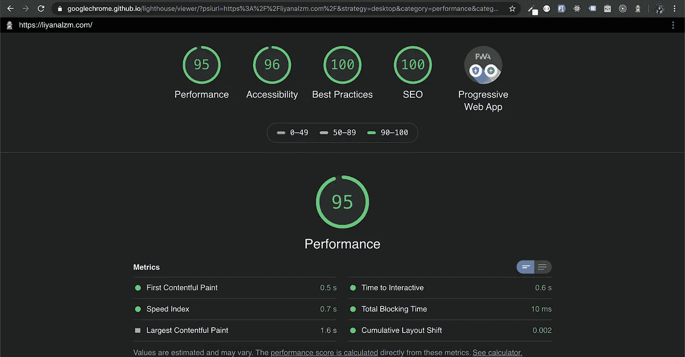
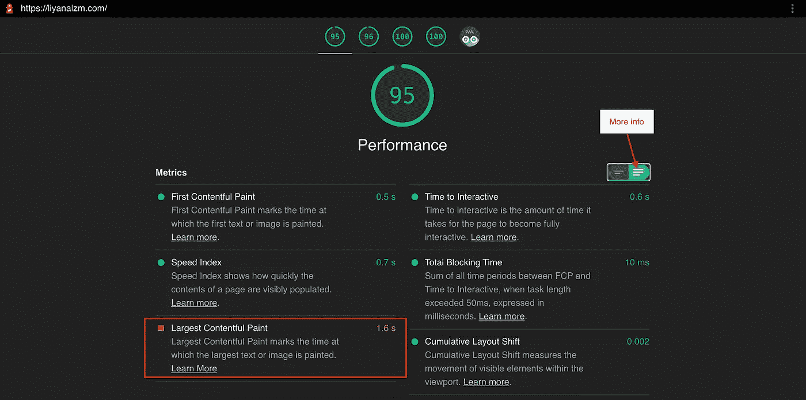
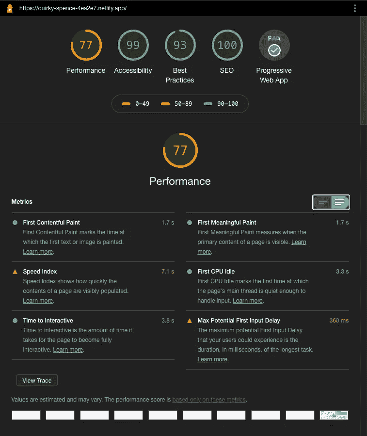

# 我如何使用 HTML5 视频，同时维护一个高性能的网站

> 原文：<https://javascript.plainenglish.io/how-i-use-html5-video-but-still-scored-a-good-performance-28b6fcd7a44a?source=collection_archive---------2----------------------->

HTML5 视频可能会成为拥有 A+性能网站的阻碍因素。Web 性能是指 web 应用程序/网站被下载并显示给用户(当前正在浏览您网站的人)的速度。

在谷歌开发者的[帖子](https://developers.google.com/web/fundamentals/performance/why-performance-matters)中，Jeremy Wagner 解释了为什么网站的性能很重要。长话短说，他提到，业绩会影响留在你网站上的人数，最终通过购买或广告收入转化为金钱。

# **如何检查你的网站性能？**

有很多方法可以检查你的网站性能，但我使用的一种方法是使用谷歌的灯塔。这项技术不仅允许你检查已经在互联网上的网站，还允许你检查你的本地网络应用程序。就像你现在正在开发的一样。

在我看来，在开发过程中检查你的 web 应用程序的性能是至关重要的，因为它会指导你应该或不应该使用什么。这项技术也建议你应该做些什么来获得一个非常好的表现。

下图是我的[作品集](https://liyanalzm.com)网站性能的一个例子，有 HTML5 视频标签。

Example of website with HTML5 Video tag

根据上面的图片，我仍然需要在*最大内容油漆*指标上进行改进。如果你点击你右手边的两个标签，更多的描述和一个更详细的链接将会出现，最终会把你重定向到一个有很多修复方法的页面。

More elaborations on the metrics

因此，这就是为什么在开发网站的时候总是检查你的网站性能是很重要的原因。除了得到一个性能良好的网站，你最终会改进你写代码的方式。

# **我如何实现？**

我在这里要告诉你的是基于我用 React JS 开发的经验。然而，这种逻辑可以应用于您正在使用的任何技术。

## **仅在页面的所有元素都正确呈现后加载视频**

## 加载视频时显示视频的第一帧图像

原因是为了避免下载视频时白屏显示时间过长。如果是这样，用户可能会认为网站坏了。最好放视频的第一帧，以避免视频开始播放时出现任何小故障。平滑过渡确实是最好的用户体验。

基于上面的片段，我更喜欢将第一帧图像显示为背景图像，因为它不会在第一次加载时下载，也不会阻碍第一页的绘制。

## 加载视频后，将视频重叠在图像上

谈论基本的 HTML5 概念，如果一个标签在另一个标签的下面，在下面的 HTML 标签将在另一个标签的上面。因此，即使视频已经加载并显示，用户也不会看到视频，因为图像在它上面。因此，我们应该通过添加 *z-index: -1* 来隐藏和 *z-index: 1* 来显示来调整样式。

我们能做的就是使用属性 *onCanPlayThrough 来确保视频已经完全下载。*该属性将调用 *videoLoaded* 函数，该函数将把 *isVideoLoaded* 设置为 true。*isvideololoaded*作为一个标志来隐藏或显示相应的 HTML 标签，如下面的代码片段所示。

## 组合代码

下面是上面给出的所有片段的乘积。用叉子叉着玩。

Final Product

# **如果我不关心绩效会怎么样？**

下面是一个例子，我删除了可以提高性能的代码。

Plain video tag style

当你运行灯塔测试，网站的性能下降。如下图所示，速度指数矩阵得分为 7.1 秒，慢了 7 倍。这是因为网络需要大量的时间来下载和显示视频。

B-scored performance

# 概括一下:

1.  Google 的 Lighthouse 是在开发和生产过程中检查 web 应用程序性能的一个很好的工具。
2.  仅在页面的所有元素都正确呈现后加载视频。
3.  加载视频时显示视频的第一帧图像。
4.  加载视频后，将视频重叠在图像上。

## 简单英语的 JavaScript

你知道我们有四种出版物吗？通过[**plain English . io**](https://plainenglish.io/)找到他们——通过关注我们的出版物和 [**订阅我们的 YouTube 频道**](https://www.youtube.com/channel/UCtipWUghju290NWcn8jhyAw) **来表达爱意吧！**