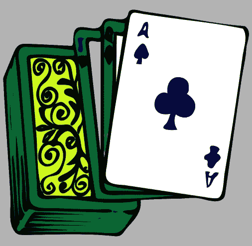

# 我如何使用 JavaScript 生成器创建一个赌场游戏纸牌洗牌机🃏

> 原文：<https://javascript.plainenglish.io/how-i-used-javascript-generators-to-create-a-casino-game-cards-shuffler-fef4f796110f?source=collection_archive---------2----------------------->

## 通过一个简单的例子理解 JavaScript 生成器的用途，让您的编程技能更上一层楼。


# 👨🏻‍🔬什么是发电机功能？

> 生成器是可以用来控制迭代器的函数。它们可以暂停，以后随时恢复。

发电机很酷的一点是它们可以是无限的。无限意味着您可以遍历一个无限的数据集，比如一个新闻提要或一个无限的图像转盘。

您可以毫无问题地在生成器函数中使用一个`while(true)`循环来实现这个无限的目标。这在经典编程中被认为是没有意义的，是崩溃的结果，但是这是完全合法的。

听起来很奇怪，不是吗？这篇文章是关于生成器函数的实现，但是**在深入之前:我邀请你看一下这篇文章，这将帮助你理解与标准循环相比的生成器的基础。**

[](https://codeburst.io/what-are-javascript-generators-and-how-to-use-them-c6f2713fd12e) [## 什么是 JavaScript 生成器以及如何使用它们

### 在本文中，我们将看看 ECMAScript 6 中引入的生成器。我们会看到它…

codeburst.io](https://codeburst.io/what-are-javascript-generators-and-how-to-use-them-c6f2713fd12e) 

发电机为引擎盖下的异步/等待功能供电。你可以看看从 Typescript playground 编译而来的[这段代码](http://www.typescriptlang.org/play/?target=2&ssl=1&ssc=1&pln=4&pc=2#code/IYZwngdgxgBAZgV2gFwJYHsI2QUxMgCgEoYBvAKBipik3xmBgF4GB3YVZGABQCd0AtqhA4AdLzzoANgDccBAEQAJHFKnoFRANyVqtCCGlj1AcwLBt5AL5A)，它给了你一个很好的例子。

在右边的面板中，您将看到我们的生成器代码转换后的输出。

看到`yield Promise.resolve("hello");`语句了吗？你在一个发电机里，就是这样。

对于任何基于循环的代码，如状态机、序列或任何游戏循环，生成器都非常酷。

说到游戏循环，今天的文章是关于一个洗牌机，这是一种纸牌拾取循环系统。你可能已经在赌场见过这样的机器了？这是用来给庄家洗牌的。


# 🃏My 洗牌机级别

接下来是一个 52 张牌经典洗牌机的简单实现。

✋🏻⚠️ **这不适合生产使用**，因为随机洗牌算法是一种伪随机洗牌算法。如果每秒钟多次调用这个函数，可能会导致重复的条目。

**💡你可能会对阅读这篇文章感兴趣:**[**https://www.random.org/randomness/**](https://www.random.org/randomness/)**，它很好地解释了计算机科学中的随机值。**



这个洗牌机将使用`lodash` `_.shuffle`方法随机洗牌一个代表整个 52 副扑克牌的数组。

[**Lodash**](https://lodash.com/docs/4.17.15#shuffle) 是一个 JS 库，它为许多公共用例提供了一个强大工具箱。

洗牌将使用[**Fisher–Yates 洗牌算法**](https://en.wikipedia.org/wiki/Fisher%E2%80%93Yates_shuffle) 完成，如果你想了解更多，请点击维基百科的链接。

所有的牌都将由经典的方块(、梅花(♣)、红心(♥)和黑桃(♠)及其数字代表。

每次迭代将返回一对代表卡片的**类型** — **值**，允许在 UI 中显示合适的卡片。

这是一张**游戏卡**的界面合约:

```
interface GameCard {
 type: ♥️ | ♦️ | ♠️ | ♣️, 
 value: "1" | "2" | "3" | "4" | "5" | "6" | "7" | "8" | "9" | "J" | "Q" | "K"
}
```

我们可以得到一张名为`{"type": "` ♠️ `", value:"1"}`的牌，代表黑桃 a🂡。

## 💻卡洗牌机的全部代码在一个片段中

> ***❓* 它是如何工作的？**

很简单，所有事情都包含在三个步骤中:

1.  首先，将一副牌作为数组传递给 CardShuffler 构造函数，它将随机洗牌。
2.  然后，通过调用`getCardDrawer`初始化生成器迭代器，它返回我们这个游戏循环的主要工具。
3.  享受使用发电机要求新的卡，一遍又一遍，直到甲板变空。

为了演示的简单，在给定的例子中，该副牌仅由 4 张牌组成。随意添加一副真正的 52 张牌来反映现实生活中的例子和更好的随机性。

## 🎮游戏循环

一旦实例化了`GameShuffler`类并且构造函数洗出了整副牌:您可以调用`getCardDrawer`方法来获得迭代器，该迭代器将用于一张一张地绘制每张牌。

➡️(至少)有两种方法可以迭代游戏循环:

**❶使用某种事件手动遍历生成器**

在这个示例中，我们创建了一个函数，它可以绑定到任何事件处理程序，比如单击按钮，或者通过调用该函数来手动触发。

每个生成器的迭代器公开一个`.next`方法，该方法将执行生成器函数中的代码到下一个`yield`语句。

解释器将每次迭代 while 循环来检查牌组的大小，如果牌组中还有剩余的牌，将从牌组中取出一张新的牌。

然后它会在`yield`语句处阻塞代码执行，直到我们再次调用迭代器的`.next`函数。

```
const onClick = () => {
  const nextCardStatus = cardDrawer1.next(); if (nextCardStatus.done) {
    console.log("Deck is now empty!");
  } else {
    console.log("Picked card is: ", nextCardStatus.value.card);
    console.log("Remaining cards in the deck: ", nextCardStatus.value.remainingCards);
  }
};
```

每次我们从这副牌中抽出一张牌，这张牌就被取走了。一旦游戏面板是空的，我们就退出循环，生成器完成。

你需要实例化一个新的**洗牌机**来玩另一个游戏。

**❷使用 for…of 运算符对生成器进行迭代**

生成器的迭代器也可以在 Javascript 语言循环中使用，如果我们使用作为 ES6 规范一部分的`for…of`操作符就是这种情况。

```
for (const cardStatus of cardDrawer2) {
  console.log("Picked card is: ", cardStatus.card);
  console.log("Remaining cards in the deck: ", cardStatus.remainingCards);
}
```

这允许我们迭代通过卡片序列，只要卡片组中有卡片。

这只是一种语法糖，帮助你循环遍历迭代器。但实际上，这只是调用`next`方法或迭代器，并检查返回对象的`done`和`value`键，以确定生成器是否已经完成。

# 🚛外卖/TLDR；📦

生成器是很好的工具，支持更好的异步功能、无限的数据流、惰性评估、内存高效的迭代。

通过增强循环过程，它们可以使您的代码更具可读性和性能。对于像 [Redux-Saga](https://redux-saga.js.org/) 这样的状态机来说，它们是非常强大的。

它们非常适合在无限数据流上进行任何基于序列/循环的迭代。

你绝对应该试一试！