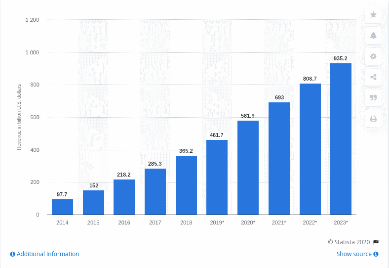
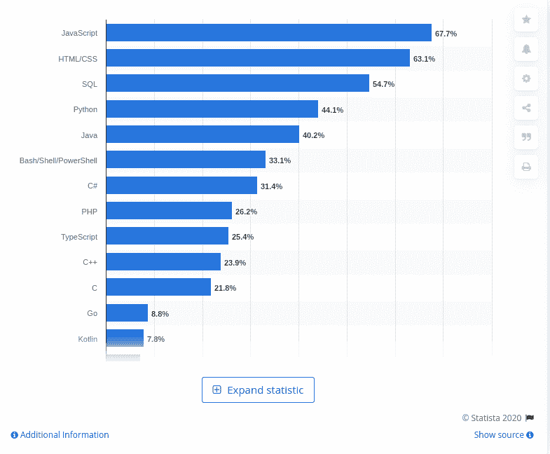

# JavaScript 如何有助于增强 Web 应用程序 UX？

> 原文：<https://javascript.plainenglish.io/how-is-javascript-contributing-to-web-app-ux-6651806d05b1?source=collection_archive---------4----------------------->

的确，应用程序开发行业正以惊人的速度增长，预计到 2020 年底将超过 5819 亿美元。从网飞到脸书，从优步到 Candy Crush，从应用程序发布的那一天起，就有大量的应用程序引领着应用程序市场。

[Image Source](https://www.statista.com/statistics/269025/worldwide-mobile-app-revenue-forecast/)

你注意到它在市场上如此成功的原因了吗？当然，编码运行在应用程序的后端，这使得用户更容易访问，并且可以在从任何现代网络浏览器到任何设备的多种设备上完美运行。

然而，web 应用程序相似的网站需要用户友好和高度互动，以便对更广泛的受众有用。此外，web 应用程序的成功还取决于该应用程序的用户界面(UI)和用户体验(UX)是否易于遵循和理解。当涉及到开发具有优秀 UX/用户界面的网络应用程序时，[1100 万开发者](https://jaxenter.com/dev-report-javascript-164201.html#:~:text=SlashData's%20report%20places%20JavaScript%20firmly,JS%2C%20like%20CoffeeScript%20and%20TypeScript.)正在使用 JavaScript 进行网络应用程序开发。

[Image Source](https://jaxenter.com/dev-report-javascript-164201.html#:~:text=SlashData's%20report%20places%20JavaScript%20firmly,JS%2C%20like%20CoffeeScript%20and%20TypeScript.)

> ***现在的中心问题是，“是什么让 JavaScript 成为 Web 应用程序开发的高要求编程语言？***

# **数百万 Web 应用开发者仍在使用 JavaScript 的原因？**

当涉及到开发任何应用程序时，选择最佳编程语言是开发人员主要关心的问题之一，到 2020 年，全球 67.7%的开发人员将依赖 JavaScript。

[Image Source](https://www.statista.com/statistics/793628/worldwide-developer-survey-most-used-languages/#:~:text=As%20of%20early%202020%2C%20JavaScript,SQL.)

在过去的 20 年里，出现了几种编程语言。尽管如此，JavaScript 是一种独立的编程语言，它保持了在领先技术中的地位，并确保向开发人员提供有前途的功能。

作为一种客户端编程语言，JavaScript 提供了广泛的库、框架和工具选择，允许开发人员定制高度交互和动态的 web 应用程序。此外，通过 JavaScript，开发者还可以通过简单地将它与 CSS3 和 HTML5 相结合来创建可以在各种浏览器、平台和设备上完美工作的网页。

> **除此之外，以下是 JavaScript 成为开发 web 应用程序的首选编程语言的几个原因:**

*   **JavaScript 带来了广泛的库和框架选择**

JavaScript 库和框架的广泛性使得开发人员可以非常方便和灵活地创建复杂的基于 JavaScript 的 web 应用程序，没有任何麻烦。最棒的是，它提供了广泛的库和框架选择，使开发人员能够快速、轻松、高效地创建高度交互和专业外观的 web 应用程序。此外，开发人员可以根据项目开发需要浏览 JS 库。

*   **不使用任何特定工具编写 JS 代码的简易性**

相比其他编程语言，开发经验最少的开发人员也可以在不使用任何工具的情况下快速编写 JavaScript 代码。开发人员只需打开记事本和 access editor，就可以毫不费力地找到编码错误，从而开始编写代码。编辑器重新格式化 JavaScript 代码，使您能够立即识别所有潜在的 bug 和错误。

*   **全面的社区支持和主要影响者**

JavaScript 被广泛用于应用程序开发的另一个原因是它拥有强大的社区支持，并由行业领先品牌实施，包括谷歌、微软、LinkedIn、脸书、阿里巴巴等。由于被行业巨头所使用，它正在为其普及做出贡献，并鼓励许多企业使用这种编程语言来满足项目需求。

*   **最小化网络应用开发的复杂性**

用 JS 开发复杂的 web 应用程序非常简单，因为尽管它是一种解释型编程语言，但它提供了简化的应用程序组合。开发人员可以使用 JavaScript 库来构建 DOM 边界，而 shadow DOM 进一步使 web 浏览器交付带有广泛使用的 HTML 标签(包括 select、div 和 input)的文档。

**总结:***JavaScript 成为全球开发者中最受欢迎的 web 应用程序开发语言有多种原因。作为一种高度健壮和享有盛誉的编程语言，允许开发人员快速构建大规模 web 应用程序，没有任何麻烦。*

> **但现在的问题是，JavaScript 如何提升 web app 用户体验？**

# **有助于增强网络应用用户体验的属性**

虽然创业公司都是关于百万美元的应用程序的想法，但如果没有用户访问它呢？换句话说，不管你的应用程序开发想法有多好，应用程序的成功在很大程度上取决于你的 web 应用程序开发者如何将其转化为最终产品。他/她在应用程序开发中嵌入了哪些技能？

最重要的是，浏览是多么容易、有意义和简单？

在评估推动应用程序成功的因素时，应用程序的 UX/UI 设计是要考虑的最重要的因素。应用商店中已经有 560 万个应用程序，但只有少数应用程序领先市场。这些应用程序背后的成功咒语是定义良好的用户界面/UX 设计、高度现代化的功能、快捷的访问、以用户为中心的方法和无缝的浏览体验。

***并且，这是所有 JavaScript 在开发 web 应用程序时所确保的！***

让我们深入了解 JavaScript 如何有助于改善 web 应用程序用户体验。

## **1。快速加载应用程序，无需刷新页面**

你的应用程序页面加载的速度可以决定你的 web 应用程序用户体验。App 加载时间不仅仅是喜好问题；这对该应用的成功也有重大影响。你的应用程序页面加载的时间越长，它的放弃率就会飙升得越多。

很多时候，开发人员忽略了应用程序加载时间的敏感性，让它滑动以适应更好的美学设计，现代功能和更多的内容，最终使你的应用程序加载沉重。

> 根据[调查报告](https://neilpatel.com/blog/loading-time/)，如果你的目标是交付卓越的网络应用用户体验，每一秒都很重要。以下是如何…

*   47%的消费者期望网页在 2 秒或更短时间内加载。
*   40%的用户会放弃加载时间超过 3 秒的应用程序。
*   应用程序加载时间延迟 1 秒，客户满意度就会降低 16%。

> **JavaScript 的作用**

现代 web 应用程序的最大问题是它们由图形密集型支持，这引发了网络延迟问题。但这一切都要归功于 JavaScript，它帮助你摆脱了所有与应用程序加载时间相关的问题。

作为一种流行的客户端语言，基于 JavaScript 的 web 应用程序速度相对较快，因为所有用户请求都在用户的浏览器中处理，而不是在服务器中处理。因此 JavaScript 可以快速加载页面，而无需刷新应用程序页面。

此外，JavaScript 不需要任何代码编译，这进一步提高了 web 应用程序的速度和性能，并确保了更好的用户体验。

## **2。单页网络应用上的无障碍页面转换**

拥有大量页面的真实应用程序总是会给用户带来不愉快的体验，增加他们离开应用程序的机会。即使是从一个页面切换到另一个页面，也经常会因为在屏幕上无内容地闪烁显示或花太长时间加载内容而导致明显的中断。最终，所有这些都会对用户体验造成负面影响。

这就是单页应用程序发挥作用的地方，它在一个页面中容纳整个网站，并通过在当前页面上加载外部资源来为用户提供令人难以置信的视觉体验。

几个静态网站也用 JavaScript 实现了页面过渡效果，提供流畅的页面浏览体验。

> **JavaScript 的作用**

许多 web 应用程序开发人员选择使用 JavaScript 进行页面过渡，因为它提供了首选的[普通 JavaScript 库](https://www.jqueryscript.net/blog/best-page-transition.html#vanilla)和 [jQuery 插件](https://www.jqueryscript.net/blog/best-page-transition.html#jquery)，使开发人员能够在 web 应用程序上快速实现页面过渡效果。

你可以直接下载插件来为你的应用程序添加效果，或者选择雇佣一家 [**软件开发公司**](https://www.xicom.biz/) 来更好地处理任务。

## **3。使用框架的交互式统一应用程序设计**

毫无疑问，应用程序的特性和功能是决定你的应用程序如何进入市场的关键因素，但有时它会导致复杂的开发解决方案，无法与用户联系起来。

为了向用户提供更好的应用程序功能以及高度先进的 web 应用程序设计，许多开发人员通常最终会使用复杂的应用程序结构，这些结构很难浏览和理解。

无缝交易、便捷的应用程序导航、未来派的功能、适合用户屏幕的像素级按钮和模板，这些都是吸引用户注意力并让他们更长久地使用你的应用程序所需要的。

> **JavaScript 的作用**

JavaScript 通过提供广泛的设计框架，包括 Angular、React、Vue、Ember、Meteor、Mithril 等，使整个过程相对更加舒适和轻松。

例如，Angular 为你提供了谷歌的资料，帮助你开发应用程序的高度互动和动态的用户界面。开发人员可以利用各种现成的部分，包括表单控件、导航、布局、按钮和指示器、弹出窗口等，为应用程序设计带来极大的便利。

## **4。提高应用程序的整体性能和速度**

无论你试图开发的应用程序有多复杂和简单，应用程序的性能和速度都是企业最关心的问题。app 越快越流畅，用户体验就越好。

> **JavaScript 的作用**

当我们谈论 JavaScript 时，应用程序的性能总是很突出。用 JavaScript 开发的 web 应用程序相对来说是轻量级的，加载速度快，保证了交易的顺利进行；因此，它在许多方面提高了应用程序的性能，并从整体上增强了用户体验。

此外，在开发基于 Javascript 的 web 应用程序时，需要更少的代码行，因此它允许浏览器更快地呈现页面，并提高应用程序的整体性能。

> **总结:**这样，JavaScript 将继续成为 web 应用开发领域的主导语言，并确保出色的用户体验。此外，它提供了几个 JavaScript 框架、工具和库，使开发人员能够在快速周转中构建高度交互、引人入胜和动态的用户界面。

# **领先的 JavaScript 库和工具确保了 Web 应用中出色的 UI/UX**

毫无疑问，JavaScript 带来了工具和库的广泛选择，允许开发人员根据应用程序的要求定制应用程序的 UX/UI 设计。

> 因此，这里列出了一些流行但推荐的工具和库，它们将帮助你在 2021 年构建一个优秀的 web 应用程序:

*   **3D 动画— three.js**

凭借 NPM 上每周 20 万的下载量和相对简单的 API，three.js 已经成为 web 应用程序中非常受欢迎的 3D 动画库之一。

*   **共享和重用 UI 组件——位**

使用 Bit，开发人员可以从任何代码库中获取可重用的 UI 组件，并将其共享到 Bit.dev 中的组件集合中。UI 组件集合对您和您的团队来说是可见的和可用的，因此，使 Bit 成为传统 UI 库的完美替代品，并确保了重用代码的良好方式。

*   **数据可视化—图表。Js**

Chart 是一个非常受欢迎的开源 HTML5 库，广泛用于响应式 web 应用程序，因为 V.S 由混合图表类型、新的图表轴类型和漂亮的动画组成。

*   **视频——视频。JS**

视频。Js 是一个著名的网络视频播放器，与 YouTube 和 Vimeo 一起支持 HTML5 和 Flash 视频。此外，它还扩展和标准化了原生视频元素，并为其提供了可跨浏览器高效运行的高级功能。

*   **2D 动画渲染引擎- PixiJs**

Pixi 是一个超快的 2D 精灵渲染引擎，可以帮助你显示，动画和管理高度互动的图形。因此，开发人员可以更容易地创建带有交互式图像的游戏和应用程序。

# **结论**

随着这篇文章的结束，希望你对 JavaScript 如何确保优秀的 web 应用用户体验的问题有了答案。但是，增强应用程序用户体验的专家建议之一是保持更新，并遵循最新的 Javascript UX/UI 实践。

你也可以雇佣一家移动应用程序开发公司，确保你的 [**web 应用程序开发解决方案**](https://www.xicom.biz/offerings/web-development/) 与下一级的 JS 框架、工具和库相集成，从而带来更好的用户体验。