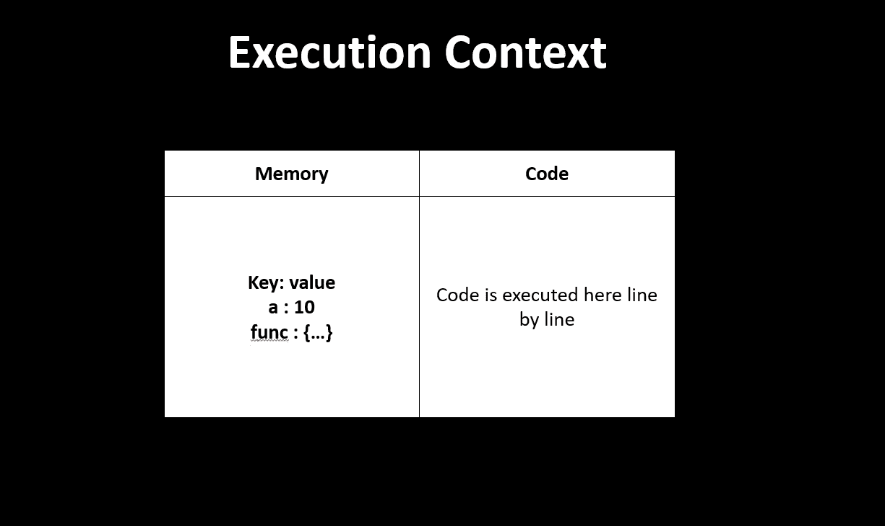
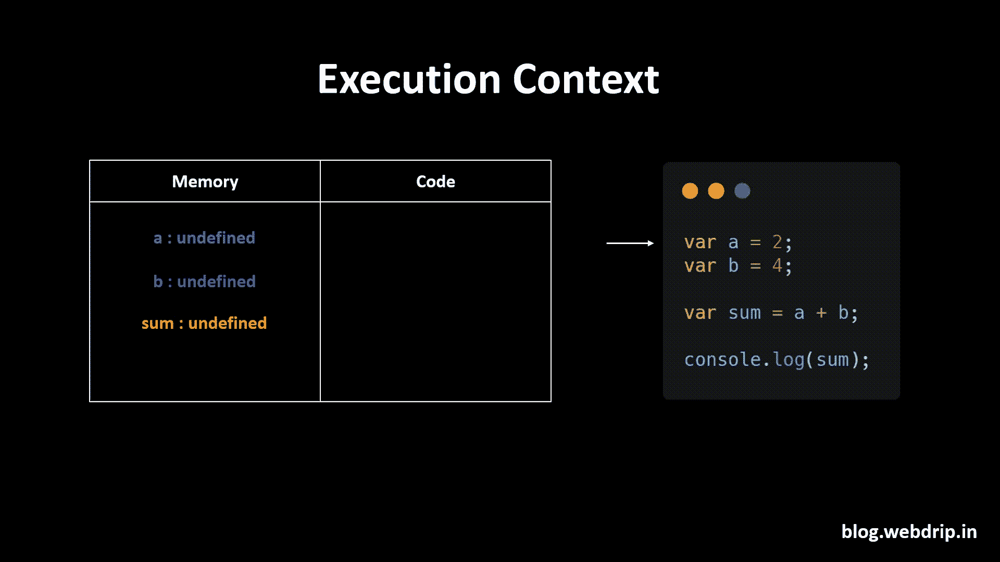
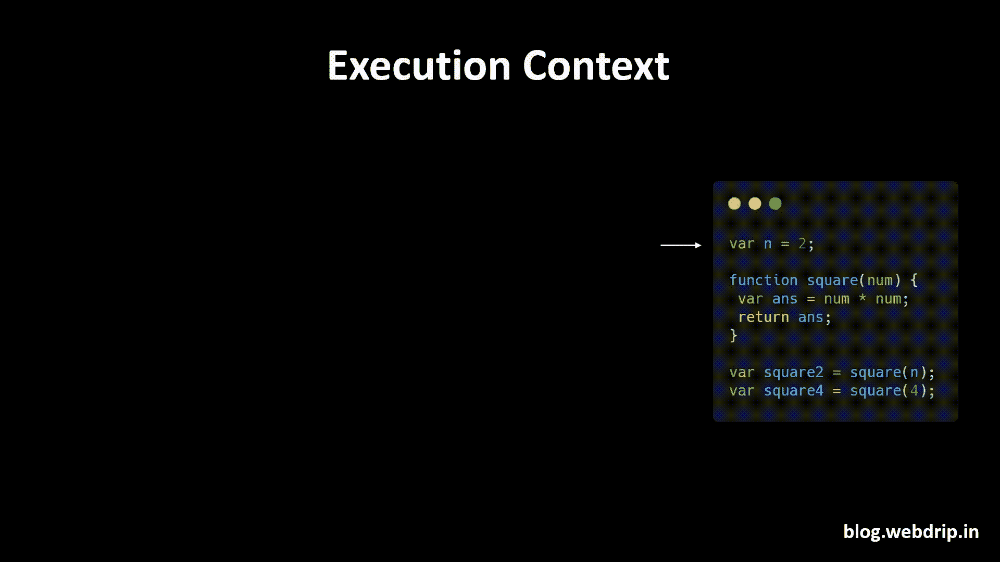
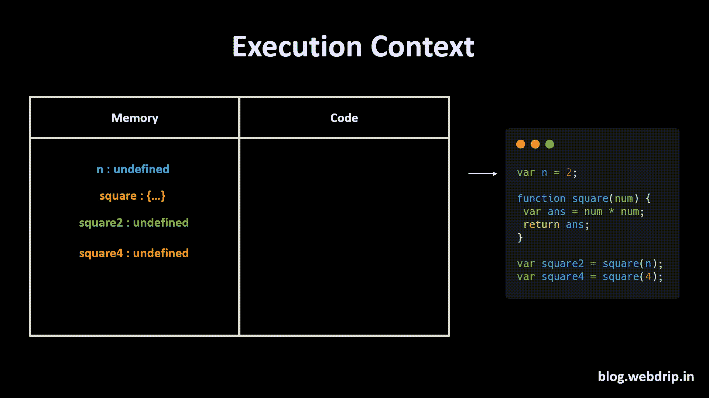
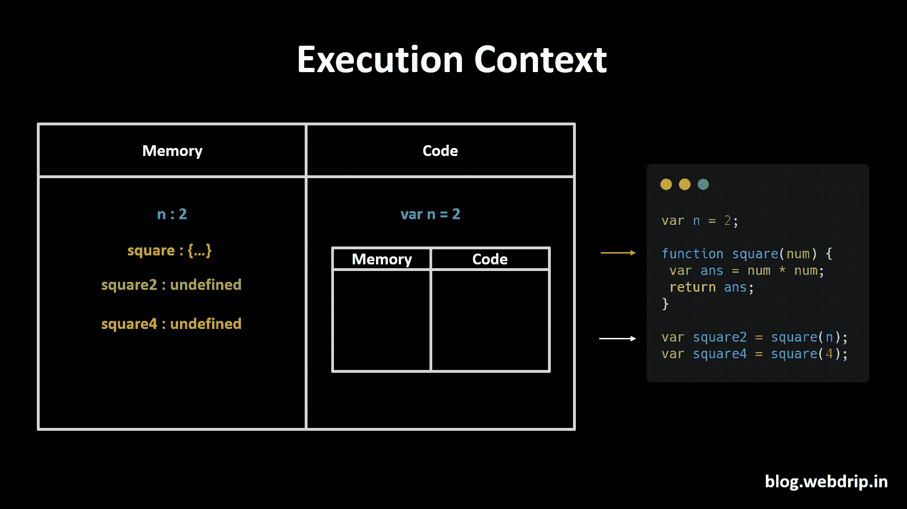
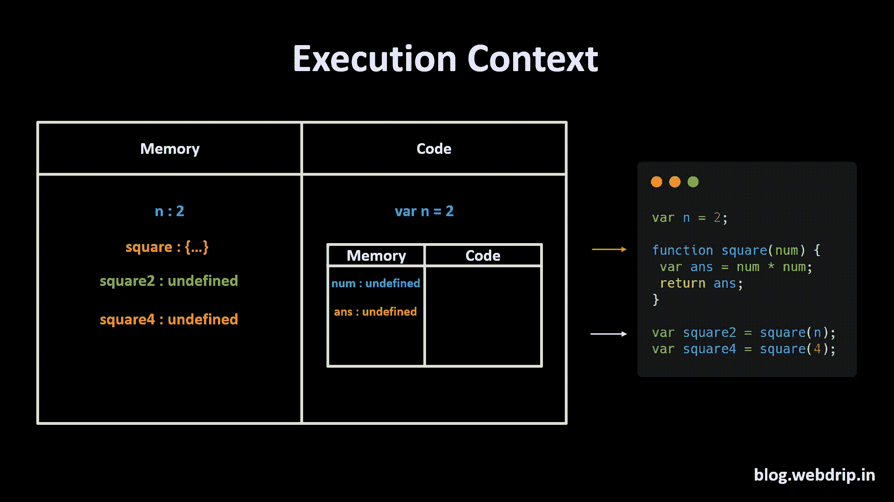
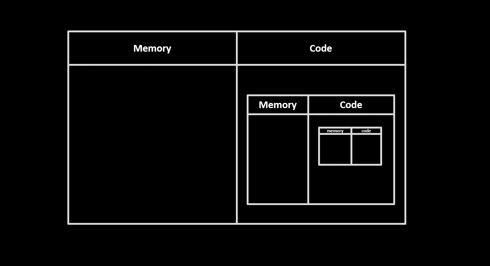

# JavaScript 如何工作:可视化指南🔥 🤖

> 原文：<https://javascript.plainenglish.io/how-javascript-works-a-visual-guide-515199eef837?source=collection_archive---------1----------------------->

JavaScript 是世界上最受欢迎也最受讨厌的语言之一。它受到喜爱，因为它是强有力的。只学 JavaScript，不学别的，就可以做一个全栈应用。人们讨厌它也是因为它以意想不到和令人不安的方式表现，如果你没有投入精力去理解这种语言，可能会让你讨厌它💔。

这个博客将解释 JavaScript 如何在浏览器中执行代码，我们将通过动画 gif 来学习😆。读完这篇博客后，你将离成为一名摇滚明星开发者更近一步。🎸😎


# 执行上下文

" JavaScript 中的一切都发生在执行上下文中."

我希望每个人都记住这句话，因为它是至关重要的。您可以假设这个执行上下文是一个大容器，当浏览器想要运行一些 JavaScript 代码时调用。

在该容器中，有两种成分 1。内存组件 2。代码组件

内存组件也称为可变环境。在这个内存组件中，变量和函数以键值对的形式存储。

代码组件是容器中一次执行一行代码的地方。这个代码组件还有一个有趣的名字，即“执行线程”。我觉得听起来很酷！



Execution context

**JavaScript 是一种同步、单线程语言。**是因为它一次只能执行一个命令，而且是按照特定的顺序。

# 代码的执行

```
var a = 2;
var b = 4;

var sum = a + b;

console.log(sum);
```

让我们举一个简单的例子，

在这个简单的例子中，我们初始化两个变量 a 和 b，并分别存储 2 和 4。

然后我们将 **a** 和 **b** 的值相加，并存储在 **sum** 变量中。

让我们看看 JavaScript 如何在浏览器中执行代码🤖


浏览器创建具有两个组件的全局执行上下文，即内存和代码组件。

浏览器将分两个阶段执行 JavaScript 代码

1 >存储器创建阶段

2 >代码执行阶段

在内存创建阶段，JavaScript 将扫描所有代码，并将内存分配给代码中的所有变量和函数。对于变量，JavaScript 将在内存创建阶段存储 undefined，对于函数，它将保留整个函数代码，我们将在下面的例子中看到这一点。



现在，在第二阶段，即代码执行阶段，它开始逐行检查整个代码。

当它遇到**变量 a = 2 时，**它在内存中将 2 赋给‘a’。直到现在，a 的值还没有定义。

同样，它对 b 变量做同样的事情。它将 4 分配给 b。然后，它计算并在内存中存储总和的值，即 6。现在，在最后一步中，它在控制台中打印 sum 值，然后在代码完成时销毁全局执行上下文。

# 如何在执行上下文中调用函数？

与其他编程语言相比，JavaScript 中的函数工作方式有所不同。

让我们举一个简单的例子，

```
var n = 2;

function square(num) {
 var ans = num * num;
 return ans;
}

var square2 = square(n);
var square4 = square(4);
```

上面的例子有一个函数，它接受 number 类型的参数，并返回该数字的平方。

JavaScript 将创建一个全局执行上下文，并在我们运行代码的第一阶段为所有变量和函数分配内存，如下所示。

对于函数，它会将整个函数存储在内存中。



激动人心的部分来了，当 JavaScript 运行函数时，它会在全局执行上下文中创建一个执行上下文。

当遇到变量 a = 2 时，它在内存中将 2 赋给‘n’。第 2 行是一个函数，由于该函数在内存执行阶段已经被分配了内存，它将直接跳转到第 6 行。

square2 变量将调用 square 函数，javascript 将创建一个新的执行上下文。



square 函数的这个新的执行上下文将在内存创建阶段为函数中的所有变量分配内存。



将内存分配给函数内部的所有变量后，它将逐行执行代码。它将获得 num 的值，第一个变量的值等于 2，然后它将计算 ans。计算 ans 后，它将返回分配给 square2 的值。

一旦函数返回值，它将销毁其执行上下文，因为它已经完成了工作。



现在它将对第 7 行或 square4 变量遵循类似的过程，如下所示。


一旦所有代码被执行，全局执行上下文也将被破坏，这就是 JavaScript 如何在幕后执行代码。

# 调用栈



当在 JavaScript 中调用一个函数时，JavaScript 会创建一个执行上下文。当我们在函数中嵌套函数时，执行上下文会变得复杂。

JavaScript 在调用栈的帮助下管理代码执行上下文的创建和删除。

书库(有时称为“下推书库”)是物品的有序集合，其中新物品的添加和现有物品的移除总是发生在同一端，例如书库。

调用堆栈是一种跟踪它在调用多个函数的脚本中的位置的机制。

让我们举一个例子

```
function a() {
    function insideA() {
        return true;
    }
    insideA();
}
a();
```

我们正在创建一个函数“a”，它调用另一个返回 true 的函数“insideA”。我知道代码很蠢，什么都不做，但它将帮助我们理解 JavaScript 如何处理回调函数。


JavaScript 将创建一个全局执行上下文。全局执行上下文将内存分配给函数‘a’并在代码执行阶段调用‘函数 a’。

为函数 a 创建一个执行上下文，它位于调用堆栈中的全局执行上下文之上。

函数 a 将分配内存并调用函数 T2。为 ideA 中的**函数创建一个执行上下文，并放置在“函数 a”的调用栈之上。**

现在，这个 insideA 函数将返回 true，并将从调用堆栈中移除。

因为“函数 a”中没有代码，所以将从调用堆栈中移除执行上下文。

最后，全局执行上下文也被从调用堆栈中删除。

# 参考

*   [YouTube 上的 Namaste JavaScript 播放列表](https://www.youtube.com/watch?v=pN6jk0uUrD8&list=PLlasXeu85E9cQ32gLCvAvr9vNaUccPVNP&ab_channel=AkshaySaini)


我希望这篇文章是有益的。💪🏾如果你有任何问题，请随时联系我。


更多这样的见解，请查看我的博客网站

*原载于 2020 年 12 月 14 日*[*https://dev . to*](https://dev.to/narottam04/how-javascript-works-visually-explained-269j)*。*

*更多内容请看*[***plain English . io***](http://plainenglish.io/)