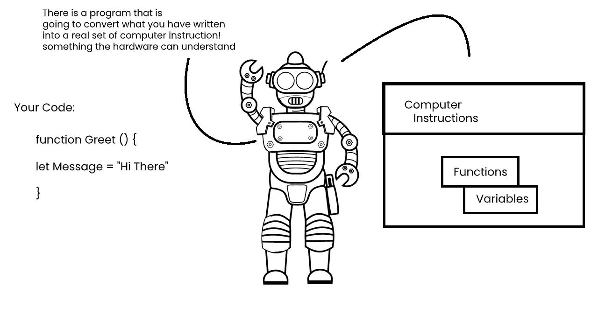
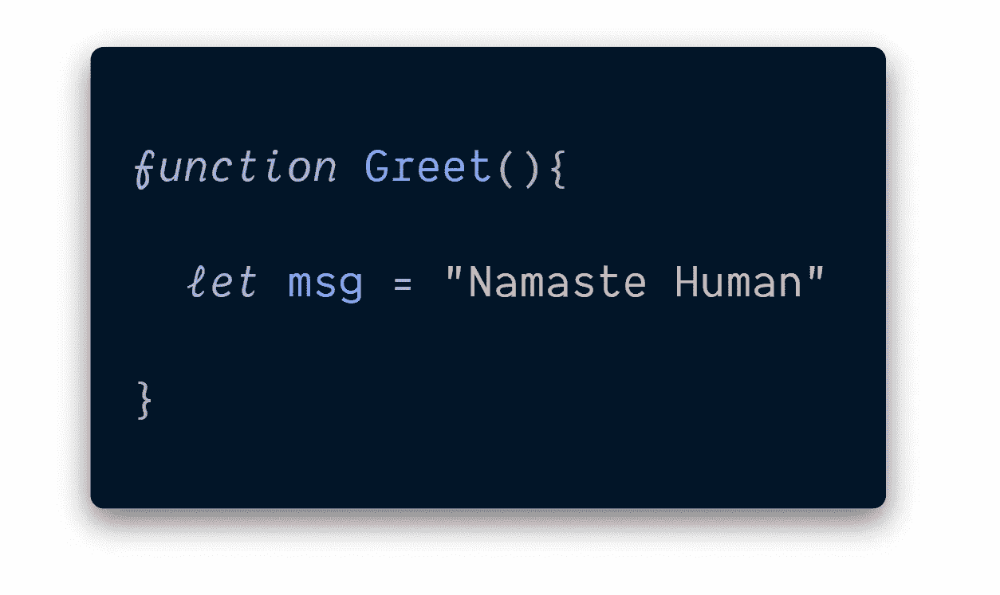
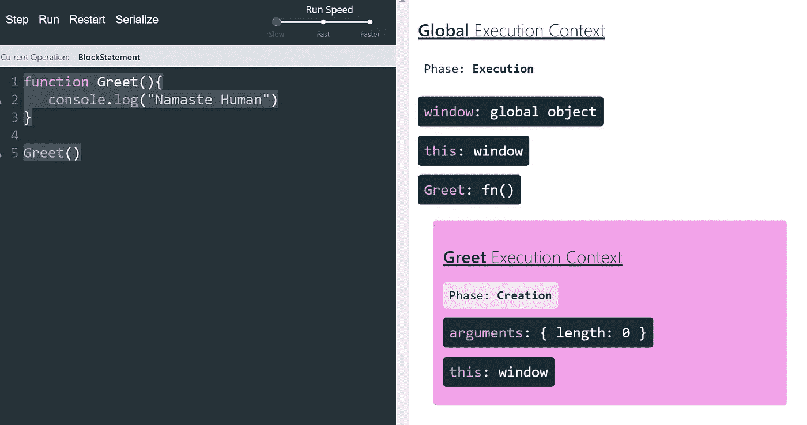

# 世界上最流行的编程语言是如何工作的？

> 原文：<https://javascript.plainenglish.io/how-javascript-works-inside-workings-of-javascript-2e4281fdc08?source=collection_archive---------2----------------------->

## 用简单的语言理解语法分析器、执行上下文和词汇环境

Photo by [Kaushal Moradiya](https://www.pexels.com/@mkvisuals?utm_content=attributionCopyText&utm_medium=referral&utm_source=pexels) from [Pexels](https://www.pexels.com/photo/man-holding-book-2781195/?utm_content=attributionCopyText&utm_medium=referral&utm_source=pexels)

我们将编程定义为一般的人类活动，一种扩展或改变系统功能的行为。

> 编程是非专业人员(例如，更改闹钟或手机设置的消费者)和专业人员(计算机程序员，本文的读者)共同完成的一项普遍活动。

JavaScript 是当今最流行的编程语言之一。也许你是新手，或者你已经用了很多年了。但是你不能否认世界上一些最重要、最广泛使用的软件是用 JavaScript 编写的。但问题是，你对这种令人惊讶的强大，有时很奇怪，但通常很漂亮的编程语言了解多少呢？

## 你有没有想过这些程序语句是如何告诉计算机做什么的？

> 像 a = a + 2 这样的语句，在读写时对开发者是有帮助的，但实际上并不是计算机可以直接理解的形式！

计算机上一个不常见的实用程序(一个 [*解释器或者一个编译器*](https://www.youtube.com/watch?v=e4ax90XmUBc) )被用来将你编写的代码翻译成计算机可以理解的方向！

对于一些计算机语言，每次程序运行时，这种命令的翻译通常是自上而下、逐行进行的，通常称为 ***解释*** ***代码*** *。*

对于其他语言，翻译是提前完成的，称为编译代码，所以当程序稍后运行时，运行的实际上是已经编译好的计算机指令。

人们通常断言 ***JavaScript 被解释为*** ，因为 JavaScript 源代码在每次运行时都会被处理。但是这并不完全准确。JavaScript 引擎实际上是在运行中编译程序，然后立即运行编译后的代码。

在本文中，我们将了解一些基本概念，这些概念将有助于您理解实际发生的事情。到本文结束时，你会对编写 JavaScript 代码时实际发生的事情有更深的理解。

我们将在这里学习的概念是:

1.  **语法分析器**
2.  **词汇环境**
3.  **执行上下文**

在开始之前，请相信我，*、*这三个听起来可怕的术语都不难理解！

Readers reaction.

# 语法分析器

*一个程序，它读取你的代码并确定它做什么以及它的语法是否有效。*

当你用 JavaScript 写代码时，它不会神奇地告诉计算机做什么。你[从所有这些中抽象出来](https://esprima.org/demo/parse.html)。您正在编写代码，但是其他人编写了将您的 JavaScript 代码转换成计算机可以理解的东西的程序。

这些程序被称为编译器。有时它们也与口译员有关。

*I*[*interpreter 和 compiler*](https://www.youtube.com/watch?v=e4ax90XmUBc)做的工作是实际一个字符一个字符地读取你的代码*并确定语法是否有效！然后，它以计算机可以理解的方式实现语法。*

*那所有的**语法解析器**都在其本质上。*

*所以，当你写代码的时候，有一个 [**程序**](https://www.youtube.com/watch?v=e4ax90XmUBc) 会把你写的东西转换成计算机能理解的！*

*You may write something like this, which is in human readable form. but,*

# *类似这样的事情发生在引擎盖下*

**

*假设你写了一个`**function**`，里面有一个`**variable**`。那个函数和变量会被存储在计算机内存中。然后，它从你写的东西中被翻译出来，这对于人类来说更可读，对于计算机来说更容易理解。*

*有一个编译器或解释器来完成这项工作，在这两者之间是我们所说的语法分析器。*

*它会像 **f / u/ n/ c/ t/ i/ o/ n** 一样一个字符一个字符地检查你的代码*

**She is explaining How The Computers Reads Your Code 😉**

**它说:哦！那是一个`function`😃
所以这个后面应该有个空格！那么我看到的下一个东西，直到圆括号`**( )**`将是函数的名字，**

**在上面的例子中，`*Greet*`是计算机看到的下一个东西，直到括号( )为止，所以它假设`*Greet*`将是函数的名称。**

**这一切都被其他人写的 [*系统翻译成*](https://en.wikipedia.org/wiki/Brendan_Eich) *。*在翻译过程中，编写编译器的程序员可以选择做额外的事情。**

**记住，你的代码不是直接进入计算机的！
它一路被翻译。**

# ****词汇环境****

***词汇的意思是与单词或语法有关。它处理你写的代码中的物理位置。***

**它存在于编程语言**中，其中，*你在*** 什么地方写东西是*重要的！***

**下面我们有*函数* `*Greet()*` 和一个名为`*msg*`的变量在里面。**

**变量`*msg*`在词汇上位于*在函数内部，这意味着你写的代码 ***实际上位于哪里。******

****

**在编程语言中，**词法环境**很重要，意味着你在代码中看到的东西会让你知道它实际上在计算机内存中的位置。它将如何与其他*****功能*** 和程序元素交互也将由此决定。****

****因为把你的代码转换成指令的编译器会关心你把东西放在哪里。它做出决定，*语法分析器*检查一切并做出决定。****

****所以当我们谈论代码中某个东西的 ***词汇环境时，我们谈论的是它写在哪里以及它周围有什么！*******

****明白了吗？****

# ******执行上下文******

*****帮助管理正在运行的代码的包装器*****

****为了帮助管理正在运行的代码，有许多词法环境，也就是您正在实际查看的代码区域！****

****但是哪一个当前正在运行是通过所谓的 ***执行上下文来管理的。*******

****一旦我们开始我们的代码，我们就创建了一些全局****执行上下文*** 折衷的东西:*****

*   ******执行线程(**指的是一行一行的解析和执行代码 **)******
*   ****变量与数据的实时存储(称为**全局变量环境******

> ******全局变量** **环境**是指我的代码中所有的变量，对我来说是可用的。****

****当您执行一个 ***函数*** 时，您在**全局执行上下文**中创建了一个新的 ***执行上下文*** :****

*   ******执行的线程(**我们逐行检查函数执行代码中的代码 **)******
*   ****存储函数中定义的任何内容的本地内存(“可变环境”)。****

****执行上下文发生在两个阶段:****

## ******创作短语******

******(** 函数和变量在计算机中得到分配的内存 **)******

********

****In this phase, two special things get created, a global object like `Window` for browser and a variable called, this.****

## *******执行短语*******

******(** 函数和变量被执行 **)******

********

****For Better Visualisation****

****如果你看上面的图片，你会看到，有一个 ***全局执行上下文*** ，在其中，创建了函数`***Greet***`的唯一 ***执行上下文*** 。每当你创建一个函数时，一个唯一的执行上下文(有时也被称为 ***函数执行上下文*** )将被创建，它进一步被包裹在**全局执行上下文**中。****

****JavaScript 运行时维护这些执行上下文的一个 [*栈*](https://www.geeksforgeeks.org/stack-data-structure/) ，这个栈顶的执行上下文就是当前正在执行的上下文。****

> *******执行上下文*** 包含你写的代码，它也运行你的代码！****

****这两个短语的细节我们就不多说了。它包含的东西超出了您在代码中编写的内容。****

****记住！你的代码被翻译，被另一个功能处理，另一套别人写的程序。这就是执行你的代码，它也可以做其他事情。****

****现在只需要明白这一点，当我们谈论 ***执行上下文*** 时，可以把它想象成帮助你管理你正在运行的代码的包装器。把它看作是一个地方(范围),在这里你的代码被一行一行地执行。****

****还有更多关于执行上下文的内容，我们将在其他文章中讨论。****

# ****我们所学内容的总结****

*   ******我们编写的代码**并没有被直接执行，但是 *JavaScript 引擎会获取代码并做出决定*。****
*   ******语法解析器**是一个读取你的代码并判断语法或句法是否有效的程序！****
*   ******词汇环境**意味着你在代码中看到的东西会让你知道它实际上在计算机内存中的位置。****
*   ****把 ***执行上下文*** 想象成一个包装器，帮助你管理你正在运行的代码。****

******喜欢这个帖子？我很乐意从你那里听到******。********