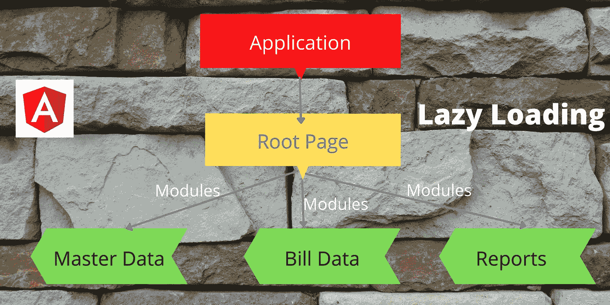
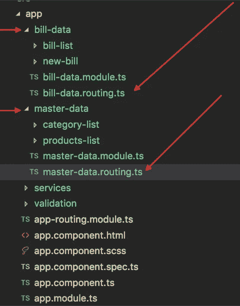
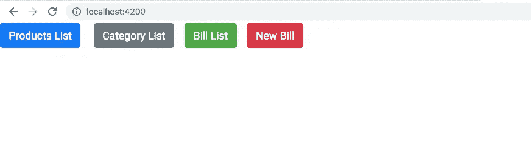

# 惰性加载如何影响 Angular 应用性能

> 原文：<https://javascript.plainenglish.io/how-lazy-loading-impacts-angular-app-performance-9c1ee0cb11ea?source=collection_archive---------1----------------------->



# **角形部件有什么问题？**

**组件**在角度应用中充当**页面**。一般来说，我们在创建**角度**应用时会做什么？。我们将根据项目需求创建许多组件。比方说，如果您正在创建一个 Angular 应用程序，它需要十个页面(只有十个页面)。然后，我们将创建十个组件，并将应用程序部署到云服务器。假设整个 dist **文件夹的大小**大约为**2–3mb**。当您加载特定的应用程序时，浏览器将在第一个请求中**加载所有的**十个组件。加载的组件将缓存在浏览器内存中。而且上页速度非常快。它给了用户更好的用户体验。这是棱角分明的特征。是的，Angular 将在**单个请求**中加载所有组件。这就是为什么与以前的技术相比，它呈现页面的速度非常快。每次只从服务器中提取数据。

如果您的应用程序非常小，那么在一个请求中加载所有组件就太好了。为什么？因为它减少了渲染时间和带宽，不像旧技术。但是如果你有更多的组件。比方说，如果你有 100 个或 100 个以上的组件。Angular 将再次尝试在一个请求中加载所有的 **100+** 组件。并且加载所有组件将花费更多的时间。如果应用程序需要更多的时间来加载，用户会感到沮丧，并会离开应用程序。如果一个应用程序花费太多的时间来加载，我们将失去使用基础。

# **什么是懒装？**

我们如何避免这个问题？。简单来说，只加载需要的组件，而不是加载所有的组件。这个概念将减少加载时间。

**只加载需要的组件，并在需要时加载其他组件，而不是在一个请求中加载所有组件。没错，这就是所谓的懒加载。**

**将组件放在模块**下可以实现惰性加载。您可以拆分组件，并将其放在不同的模块下。默认情况下加载根页面。模块只有在被请求时才会被加载。比方说，如果您有 10 个模块，那么在第一个请求中只加载根页面。其余模块只有在被请求时才会被加载。它减少了装载时间。

# **什么时候用懒人加载？**

当你设计一个大角度的应用程序时，必须实现延迟加载。一个大的应用程序意味着它在 dist 文件夹中产生更多的 MB 或者有更多的组件。在我看来，如果你的应用程序超过 2 MB 以上，那么你可以使用惰性加载的概念。为什么因为，如果拿今天的网速来说，加载 2MB 是非常容易的。但是，您必须考虑应用程序将用于哪个领域。如果您的用户的互联网连接速度很慢，那么您必须相应地优化大小和实现延迟加载。

初学者必须意识到这个概念。我将分享我的故事。当我刚接触 Angular 时，我不知道惰性加载的概念。完成了几个项目，但没有实现/不知道惰性加载(大约 25 页的应用程序)。我没有感觉到应用程序变慢，用户也没有报告任何关于应用程序加载时间的问题。为什么？因为我们有很好的网络连接。

过了一段时间，我进入了一个大的应用(ERP)。我们完成了所有的基本工作，如设计数据库和创建一个用户界面原型。最初，我们创建了 100 个组件。那么它就超过了 200 多个组件。仅创建 UI 级别的组件。当时，我面临一个大问题。由于内存问题(更多组件)，未生成 dist。我遇到了一个堆内存错误。然后我们增加了内存，生成了 dist，没有实现延迟加载。

然后我们开始开发应用程序。即使在本地开发环境中，当我们在应用程序中进行简单的更改时，也需要更多的加载时间。当时只有我意识到我们做错了。我决定解决这个问题。然后谷歌了一下，发现了懒加载的概念。

这对我们来说是双重工作。将所有的组件转移到一个单独的模块会耗费大量的时间，因为我们已经开始开发了。这是一个大错误。所以在做角度应用的时候，你必须意识到惰性加载。

**如何实现懒加载？**

1.  首先，创建一个模块。
2.  在模块下创建组件。
3.  为模块下的组件创建工艺路线。
4.  将新创建的路由包括到主路由(app.routing.ts)

以上四个步骤将帮助您在 Angular 应用程序中实现延迟加载。

假设我们要创建一个计费应用程序。计费应用程序有四个组件。

1.  类别列表
2.  产品列表
3.  新法案
4.  账单列表

现在我要把以上四个组件放到两个模块里。

1.  主数据模块(类别列表、产品列表)
2.  账单数据模块(新账单、账单列表)

**项目结构**



**1。创建新模块**

使用下面的命令创建一个新模块。在这里，我们将创建两个模块。

```
ng g module master-data
ng g module bill-data
```

**2。在模块**下创建组件

要创建一个组件，我们可以使用相同的命令。但是在命令名之前添加模块名。

为主数据模块创建组件。

```
ng g c master-data/category-list
ng g c master-data/product-list
```

为账单数据模块创建组件。

```
ng g c bill-data/bill-list
ng g c bill-data/new-bill
```

**3。为组件创建路由**

要创建路由，我们需要在模块文件夹下创建一个 **routing.ts** 文件。

对于主数据模块，在主数据文件夹下创建一个名为**master-data . routing . ts**file 的新文件。并粘贴下面的代码。

现在包括到 **master-data.module.ts** 文件的路径。

对账单数据模块也重复相同的步骤。

**4。将模块包括到主路由**

现在导入并在 **app.routing.ts** 文件中包含新创建的模块路由。

我创建了一个 home 组件，并将其作为默认的根页面。当加载应用程序时，它只加载 home 组件。如果我们导航到产品列表，那么只有账单数据模块将被加载。如果您没有导航到产品或类别页面，则主数据模块无法加载。只会加载所需的页面模块。

使用**home.component.html**文件中的以下代码导航到不同的路线。

**样本输出**



我在演示中使用了引导 CSS 框架。

仅此而已。希望你喜欢这个教程。

**获取完整源代码**

```
[https://github.com/bharathirajatut/angular-examples/tree/master/lazy-loading-example/src](https://github.com/bharathirajatut/angular-examples/tree/master/lazy-loading-example/src)
```