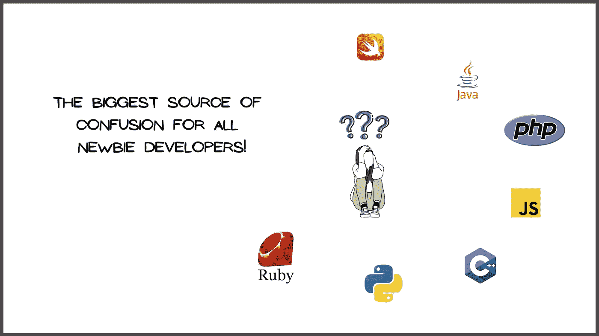

# 需要了解多少种编程语言？

> 原文：<https://javascript.plainenglish.io/how-many-programming-languages-do-you-need-to-know-88a0bb259f6f?source=collection_archive---------9----------------------->

## 作为一名开发人员，了解更多语言为什么如此重要

作为一名开发人员，需要了解多少种编程语言？这个问题的主要原因是，大多数新手看到许多开发人员懂多种语言或技术，当有人谈论软件工程师或任何技术开发人员时，他们就会联想到这种形象。在这篇文章中，我将试着给出我对这个问题的看法，希望你会发现它是有帮助的和有益的。

现在我想先说，这是一个非常主观的话题。如果你问不同的软件工程师，你可能会得到很多不同的答案，我很难也几乎不可能给出你应该懂多少种语言的确切数字。为什么？有很多不同的原因可以解释为什么有人会选择使用一种特定的语言或特定数量的语言。我不是重点告诉你去学习，比如说，五六种编程语言，而是要把重点放在你应该知道的编程语言的类型，以及从学习这些编程语言中你将获得什么样的计算机科学基础知识。

在进入类型之前，我认为讨论为什么你可能想要学习多种编程语言是有意义的，即使你不打算使用它们来构建应用程序或从事项目工作。简单来说，它让你成为一个更优秀、更全面的程序员。我发现当你学习不同的语言时，你会学到更多的编程知识。没有办法从一两种编程语言或者同类型的语言中学会编程的一切。学习不同类型的编程语言是有价值的，因为它们引入了你以前可能没有见过的新概念和新特性。

另一个重要原因是，它允许您拥有大量工具，并且能够更好地判断在特定项目中使用何种语言或技术。毕竟，编程语言只是用来完成一项任务的工具。理想情况下，您希望使用最好的工具来完成工作，如果您只懂一两种编程语言，您可能甚至不知道对于您正在尝试做的事情还有更好的选择。

有两种主要的编程范式，我非常确定所有的编程语言都属于这两种类型。我们有命令式编程语言或声明式编程语言。当然，其中还有更具体的类别，但首先，我将解释两个主要类别。命令式编程范式是一种我们告诉计算机如何提出解决方案的范式。这种类型的编程范例中的重要概念是如何在寻找问题的解决方案的过程中设计算法。

声明式编程范式需要陈述事实、提出问题，并让计算机为我们提供解决方案。在这种类型的编程中，我们不太关心我们如何得到解决方案，而是更关心解决方案是否正确，以及我们需要什么输入才能得到正确的解决方案。声明式编程的一个很好的例子是 SQL。你没有描述你将如何提出这个问题。你只需要把它打出来，计算机就会给你。

# 命令式编程环境中的编程范例

属于命令式编程的主要范例是面向对象和过程式编程。还有一些其他的。有许多不同的编程范例，但这些是主要的。值得注意的是，一些语言实现了多个范例。例如，Python 实现了面向对象的范例和过程化范例。

当你看面向对象的编程范例时，你会注意到这个想法是把程序表示为对象的集合，这些对象存储它们的内部数据，并且像方法一样具有外部访问部分。面向对象编程语言使用封装、继承、多态等原则。

## 优势

1.  像继承这样的特性可以减少冗余，并允许在多个类中使用相同的功能，而不必重写它。
2.  程序通常容易维护。
3.  代码很容易重用。
4.  一些安全性优势可以通过数据抽象来实现，这在其他一些编程范例中是无法实现的。

## 不足之处

1.  你的程序将会很大。
2.  使用这种范式设计和创建程序需要付出更多的努力。总的来说，这与它的复杂性以及编写它所需的大量代码有关。
3.  与函数式编程或过程式编程中构建的程序相比，使用所述范例创建的程序的速度通常相当慢。

当你看过程化编程时，你会注意到在所述范例中的语言执行一系列过程，这些过程通常被称为例程或子例程。如果你不知道，例行程序或子程序就是一系列需要按照特定顺序执行的计算步骤。过程语言通常依赖于块和范围。你会看到像 if，for，while，e.t.c 这样的关键字，这些用来实现程序的控制流。

## 优势

1.  它们运行起来不需要太多内存。
2.  它们也能很好地与解释器和编译器一起工作。
3.  它们有一个简单的结构，需要最少的代码。

## 不足之处

1.  它们不能很好地保护数据。
2.  错误捕捉和调试相当困难。
3.  用过程语言写作需要更深层次的语言和计算机指令知识。

至此，我已经介绍了命令式编程领域中的两个主要范例。同样，这只是为了让您了解编程语言的不同之处，以及为什么您可能想要学习来自不同范例的编程语言，因为它们有不同的概念、优点和缺点。

# 声明性编程上下文中的编程范式

现在在声明性编程领域，有三种主要的范例，它们是逻辑、函数和数据库。为了避免重复，我将只讨论函数和逻辑范例。数据库范式语言类似于 SQL，根据我之前给出的解释，您可能会想到为什么它会是一种声明式编程语言。

# 逻辑

逻辑范式基于形式逻辑，本质上是陈述某个领域的事实或规则的线。当您想要解决某个问题时，您可以提出问题或编写查询，以返回有关您所声明的事实的结果。逻辑编程允许你以一种不依赖于实现的方式来表达知识。这意味着你不是真的告诉计算机如何解决它，而是简单地给它一个你希望它解决的问题。

## 优势

1.  事实或信息与其使用方式相分离，即与实施相分离。
2.  对于非计算学科很有用。
3.  它在证明解的正确性方面非常有效。

## 不足之处

1.  不容易学习或使用。
2.  它服务于一个特定的目的，而这个目的并不适合你想要完成的许多任务。

# 功能的

函数式编程通过只使用返回值的纯函数而不是修改程序的状态来避免共享数据、状态和任何副作用。这意味着函数式语言在很大程度上依赖于递归以及函数作为参数和返回值的传递。这种范式是从 Lambda 演算发展而来的，并在一些流行的语言中实现，如 Lisp、Scheme、Scala，甚至 r。

## 优势

1.  纯函数对于相同的输入总是返回相同的结果，这使得它们更容易测试、调试和理解。
2.  函数式编程也使得并行处理和并发编程更加容易。

## 不足之处

1.  很难表示或实现某种状态概念。
2.  递归几乎在任何地方都被使用，这意味着没有标准的循环，很多人不喜欢这样。

本文的主要目的是分享这四种范例，并说明有许多不同的编程语言，每一种都有许多独特的特性和用例。是的，某些范例中的某些语言已经过时，您可能不想使用它们。这并不意味着几个小时的实验没有价值。我将留给你们一些语言，你们可以学习它们来涵盖这些范例。我不一定建议你学习所有这些。我只是想让你们对那些范例中的一些语言有个概念，我认为，至少在研究中有一些价值。

从一些老的编程语言开始，Scheme 和 Prolog 是第一批，虽然我不会在任何实际项目中使用它们。然而，我认为学习语言如何工作的概念是有益的。如果你想学习更现代的编程语言，包括这些范例，我建议你学习 Python 或者 JavaScript。它们都是脚本语言，并且都是动态类型的。所以，这已经给了你一个很好的介绍一种特定类型的编程语言，你可以用它做很多项目。

我也建议学习 Java，因为它是一种强类型语言。它也是一种面向对象的编程语言，它教给你许多关于面向对象的设计、良好的编程习惯以及编写生产级代码的方法，这些你可能在 Python 或 JavaScript 中是学不到的。我最后的建议是学习 C 或 C++，因为它们是低级编程语言。在 C 和 C++中，你需要使用指针之类的东西，你需要学习内存管理，还有很多你在 Java、Python 或 JavaScript 之类的语言中可能没有见过的编程概念。

同样，这些是我的想法和建议。还有很多其他的范例。我在这篇文章中提到的是人们使用的主要方法。在决定学哪些之前，你可以做更多的研究。你不必一下子学会所有的知识。编程无处可去。作为一名开发人员，你有很多时间来拓展自己。