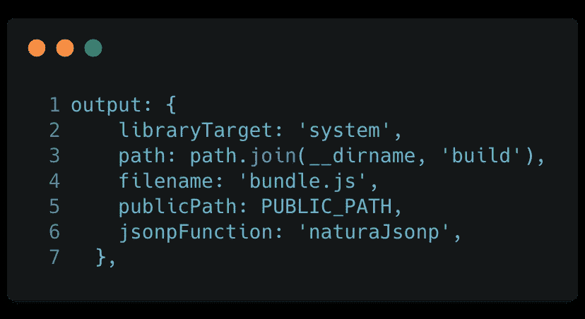
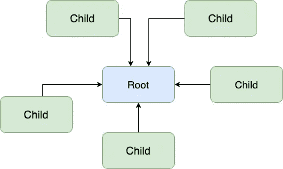
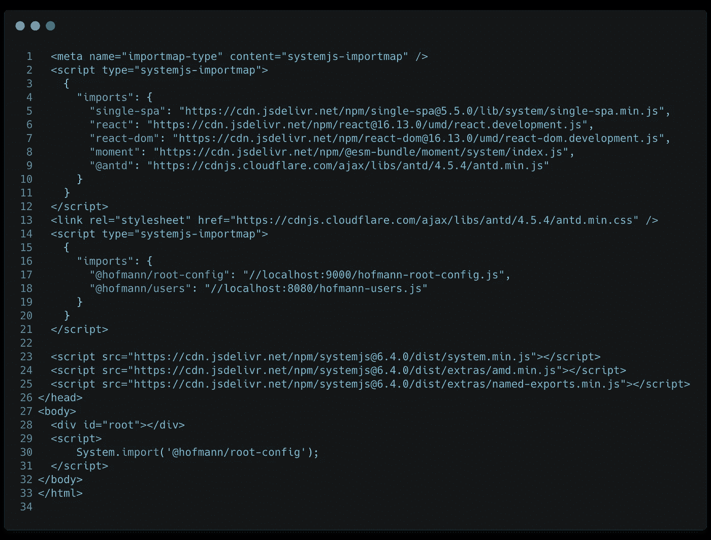
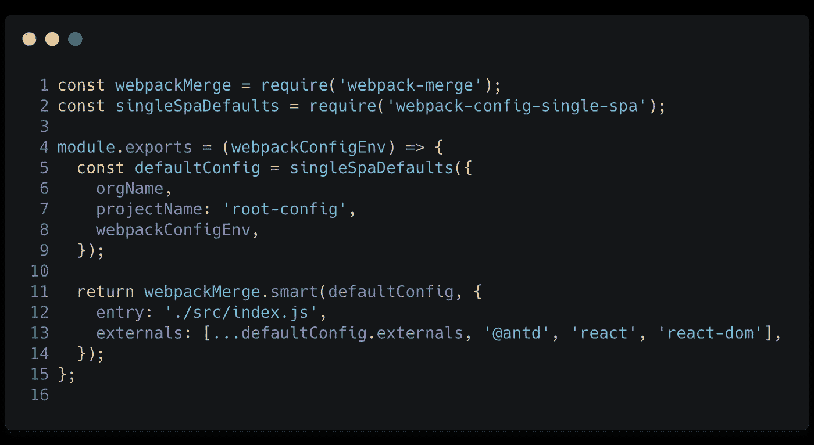
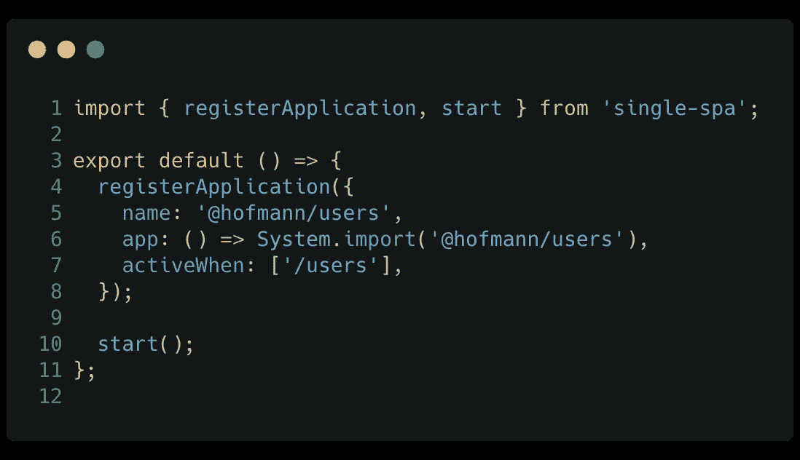
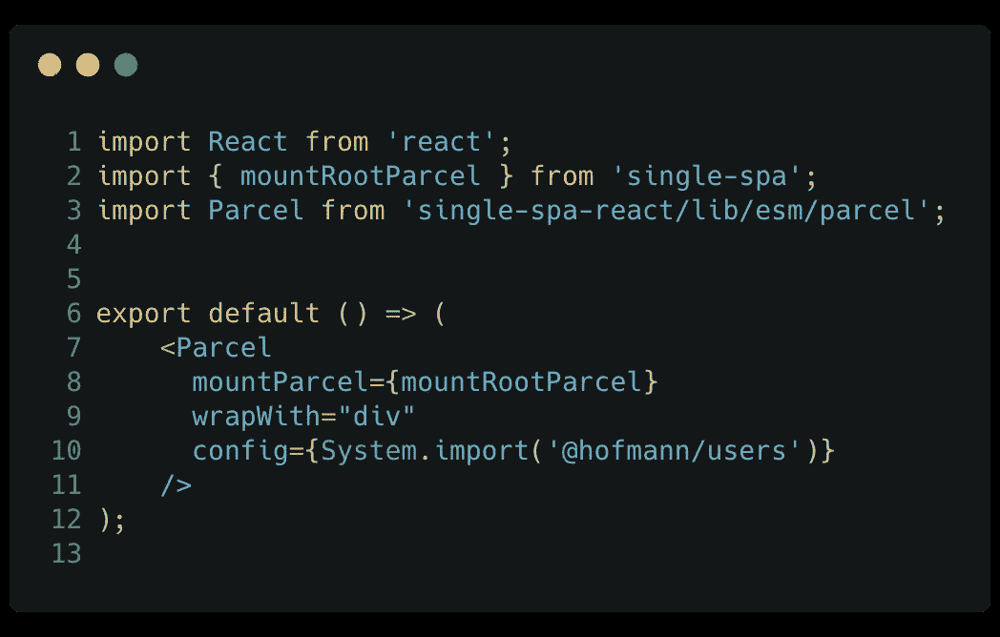
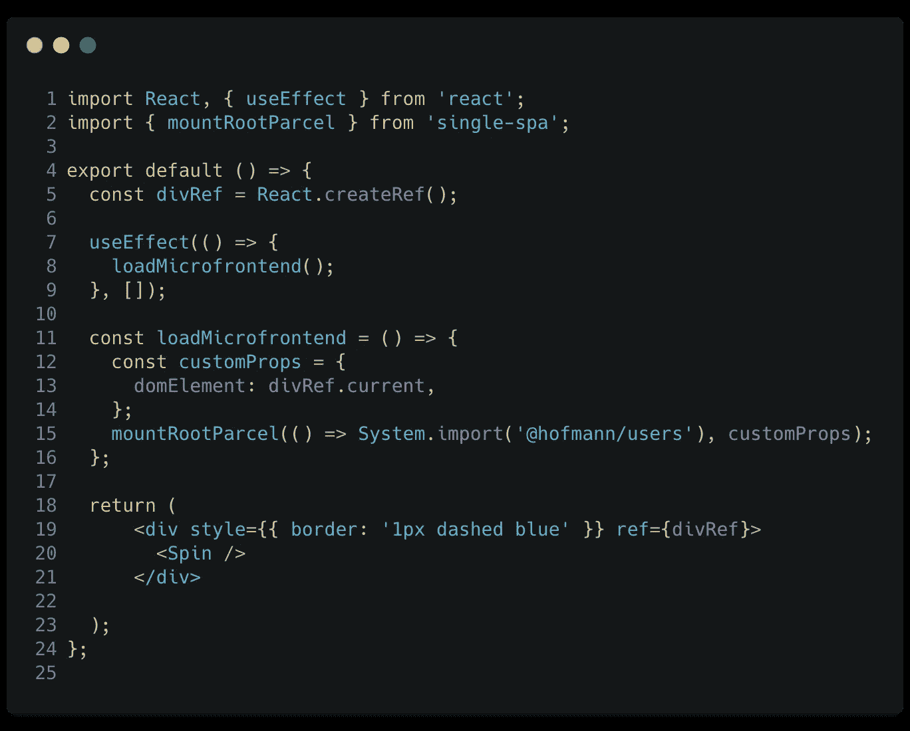
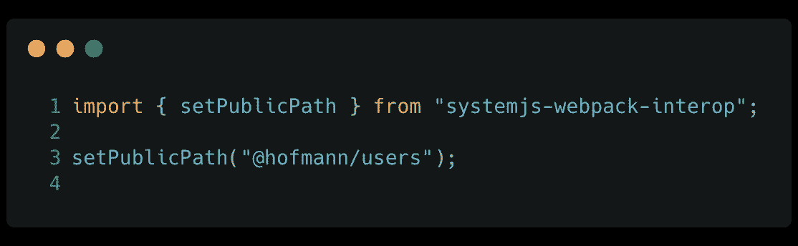
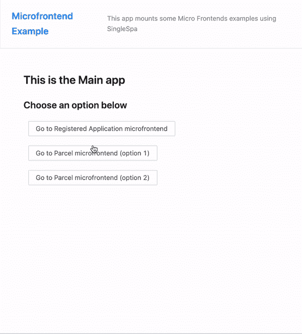

# 微前端如何提高我们团队的生产力

> 原文：<https://javascript.plainenglish.io/how-microfrontends-improved-our-teams-productivity-79538ba6618b?source=collection_archive---------7----------------------->

## 一个超过 10 个团队的应用程序可能很难开发，但是微前端的使用提高了产品质量，极大地提高了我们的生产力。


Photo by [Jude Beck](https://unsplash.com/@judebeck?utm_source=medium&utm_medium=referral) on [Unsplash](https://unsplash.com?utm_source=medium&utm_medium=referral)

# 概观

在这篇文章中，我告诉你为什么我们使用微前端策略，如何实现它，以及它对我的团队产生的影响。

我还在本文末尾提供了一个功能示例，您可以根据自己的喜好使用它。

# 语境

“微前端”是一个最近讨论很多的话题，幸运的是我们可以在互联网上找到关于这个话题的好材料，并且已经有一些工具可以帮助我们应用这个策略。

在这篇文章中，我报告了我和我的团队在我们的一个产品的创建和发展中使用这种策略的经验，包括一些概念、结果和我们从中获得的东西。

我们接到的任务是为现有的 web 应用程序创建一个新功能，但这不是全部，这个功能应该在某个时候与其他现有系统相关联或独立工作。

鉴于这项任务的复杂性，我们认为这是创建微前端的最佳案例。但是有些东西帮助了这个选择，主要是因为我们需要在其上附加产品的 web 应用程序，最初有一些问题让我们有点担心。它…

*   …由十几个不同的团队维护，因此我们需要使用分支来编写新功能
*   …使用培训发布方案进行部署，新代码通常每 15 天投入生产，也就是说，新用户需要很长时间才能获得更改
*   …没有良好的测试覆盖和任何功能测试套件，所以我们需要做出的某些决定至少是非常紧张的，因为我们害怕损害其他团队的功能。

# 可用工具

为了解决我们的问题，我们做了一些研究来决定哪一个是最好的决定。一个积极的方面是，微前端的概念不是什么新东西，它可以以多种方式应用，每种方式都有其利弊，我们可以通过实例或现代工具来使用 iframes。

在我们进行这项研究时，我们提出了一些替代方案和工具，最终选择了 Single-SPA:

*   **iframe**—优点:*实现更快，只需包含 iframe 就可以了。应用程序之间的通信可以通过 PostMessage* 进行。缺点:复制库，对用户体验有负面影响，几乎不允许定制(因为我们只有一个区域)，与 PostMessage 的通信可能不安全。
*   [**马赛克 9**](https://www.mosaic9.org/)**——对我们的语境来说太复杂了。**
*   **[](https://single-spa.js.org/)****——它完美地结合了我们的需求和期望。******

# ******为什么是单人水疗？******

******我们进行了概念验证(POC)并选择了 Single-SPA，因为该库将为我们带来一些好处:******

*   ******实现起来并不复杂(一旦我们理解了它背后的概念)******
*   ******只需对现有系统进行少量改动******
*   ******主要是:不复制库的可能性(如果你需要的话)，所以用户不需要下载更大的 javascript 构建！******

# ******单一 Spa 概念******

******为了理解下面的例子，有必要理解一些简单的概念，有些是 Single Spa 合并的，有些是它创建的。******

******我会尽量客观，这样你就不会在看书的时候睡着了😁…******

## ******嵌入式概念******

********导入地图** —查看以下示例:******

****`import { html } from 'module'`****

****在上面的摘录中，“*HTML”*将从“*模块”*中导入，这些模块将依次放在我们项目的“*node _ modules”*文件夹中。使用导入映射，我们可以定义"*模块"*是项目的一个外部依赖项，为它定义一个位置和一个别名。像这样:****

```
**<**script type="importmap"**>
{
  "imports": {
    "@module": "https://module.com/module.js"
  }
}
</**script**>**
```

****这样，当我们导入“@*modulo”*库时，我们将导入[*https://module.com/module.js*](https://modulo.com/modulo.js,)URL 上的脚本，应用程序不会从“*node _ modules”*文件夹中获取它。****

****但是，无论如何……导入地图功能还不能在浏览器中使用……****

****为了避开这个事实， *Single-Spa* 使用了 *SystemJS* 库，这是一个类似 polyfill 的库，这意味着它允许我们——除了其他功能之外——使用导入映射策略，但是做了一些修改:****

*   ****导出包时，webpack(或汇总)必须在输出中包含*类型:系统*。参见下面打印的第二行:****

********

****我们稍后将回到这个配置。****

# ****自己的概念****

******生命周期** 如果你处理的是目前最流行的框架和库，你应该已经习惯了*“组件生命周期”*这个术语。我们知道组件何时在屏幕上被安装或卸载，我们可以利用这些信息做些什么——或者不做。****

****单 SPA 应用程序也有这个概念。在这种情况下，我们还知道 MFE(微前端)何时从屏幕上加载、安装和卸载。在这种情况下，生命周期指的不是组件，而是整个应用程序。****

****一个单 SPA 应用程序只需要导出至少 3 个异步函数，这涉及到生命周期: *bootstrap、mount 和 unmount。*****

******申请类型******

****归根结底，以下类型与微前端的加载方式有关。****

*   ******注册应用:**基于路由加载微前端时。类似于:*“如果我们在‘用户’路线上，加载微前端 X，如果我们在‘设置’路线上，加载微前端 Y——或者两者都加载”。*****
*   ******packages*:***当一个组件加载微前端时，这样你的 it 可以挂载到任何地方。在这种情况下，我们可以有一个微前端来导出小组件，或者整个应用程序，我们可以将它们安装在屏幕上的任何地方。****
*   ******实用模块:**在这种情况下，我们不在屏幕上挂载任何东西，我们甚至不关心它。在这些情况下，我们需要与几个微前端共享一个公共 API，或者为所有应用程序共享一个公共设计系统。****

******根应用 vs 子应用******

********

****将 ***根应用*** 理解为“将在运行时导入所有其他微前端( ***子应用****)**)的应用”。*****

*****有人问我是否有可能让一个子应用程序自己导入微前端，形成一个大的应用程序家族。我相信这是可能的，但所有这些复杂性有意义吗？*****

*****然而，我们将把本文的重点放在一个简单的*根←子*层次*上。******

# *****想要更多概念？*****

*****这些是目前的主要概念。但是如果你想更深入的话，我推荐这个页面:[推荐设置](https://single-spa.js.org/docs/microfrontends-concept#types-of-microfrontends)，里面有很多关于单人 Spa 的其他细节。*****

# *****例子*****

*****最精彩的部分，我知道！*****

*****这里的任务是创建一个根应用程序，它有自己的内容，并导入一个微前端作为注册的应用程序和包，类似于我们的现实。*****

*****接下来，我将包含一些最重要部分的代码片段。完整的代码在文章末尾链接的存储库中。*****

*****下面的代码片段被分成*根应用*代码和*子应用*代码*。******

# *****根应用程序*****

********index.html********

**********

*   *****第 2 行到第 12 行:导入共享库的映射，这里是为了避免重复。看，我们已经在第 9 行和第 13 行声明了 ant-design，所以我们将为每个应用程序提供一个统一的设计系统。*****
*   *****第 14 到 21 行:这里我们用微前端声明了 ImportMap。根应用程序也有它的内容，所以我们也需要在第 17 行导入它。*****
*   *****第 23 到 25 行:还记得我说过导入地图在浏览器中还不可用，我们需要 SystemJs 作为 polyfill like 吗？所以我们需要导入这些脚本。我们还需要第 1 行，并将第 2 行的脚本类型改为*‘system js-import map’。******
*   *****第 30 行:看看这个列表中的第二项，因为我们需要立即导入 root-config 来安装应用程序并立即显示其内容。*****

*******web pack . config . js*******

**********

*   *****第 2 行— Single-Spa 有*webpack-config-Single-Spa*lib，它抽象了一些 web pack 配置。*****
*   *****第 12 行——由于根应用程序有一些特性，我们需要修改*入口点。******
*   *****第 13 行——这里我们指出了在导入映射中报告的另外 3 个具有相同别名*的外部库。******

*******如何加载应用程序*******

********注册申请:********

**********

*****在上面的代码片段中，我们加载微前端作为一个*注册的应用程序。******

*   *****第 5 行—我们为我们的应用程序创建一个名称。它不必与 T22 导入地图别名相同。*****
*   *****第 6 行—返回要导入的微前端的函数。*****
*   *****第 7 行—我们告知应用程序将安装在哪些路由上，可能不止一个路由。*****
*   *****第 10 行—注册所有应用程序后，我们启动 singleSpa。稍后可以注册新的应用程序，但是调用 start 函数是必不可少的，这样所有的 js 包都将被加载，安装在正确的路径上。*****

********包裹— Modo 1********

**********

*****有两种方法可以导入一个包，第一种情况更简单，但是我们使用第二个库(第 3 行)。*****

*   *****第 9 行——我们说我们的微前端将安装在一个 div 中*****
*   *****第 10 行——我们使用与导入映射相同的*别名导入微前端******

********包裹— Modo 2********

**********

*****它更复杂，但我们不需要额外的库。*****

*   *****第 5、19 和 13 行——我们创建了一个对将要安装微前端的 HTML 元素的引用。*****
*   *****第 2 行和第 15 行——最后，我们安装微前端。*****

# *****子应用程序*****

*******入口点*******

**********

*   *****第 4 行和第 7 行——singleSpaReact 简化了微前端和我们需要的所有生命周期函数的创建。*****
*   *****第 10 行—当天结束时将显示的所有代码。*****
*   *****第 11 至 13 行—如果应用程序中出现错误，将显示该组件。这是一个 JSX 组件。*****
*   *****第 17 行—需要导出的生命周期变量。*****
*   *****第 1 行—标识 MFE 所必需的，它必须与导入映射的别名相同。打印如下:*****

**********

# *****所有这些都在起作用*****

*****到目前为止，我们已经看到了如何实现微前端的概念和代码示例。*****

*****我创建了一个示例应用程序，展示了该功能如何实时工作。*****

**********

*****你可以在 GitHub 上找到所有代码:*****

*****[](https://github.com/brunnohofmann/microfrontends_example) [## brunnohofmann/micro frontends _ 示例

### 使用 singleSPA 的微前端示例](https://github.com/brunnohofmann/microfrontends_example)***** 

# *****结果*****

*****工作和使用微前端是一次非常有趣的经历，解决了我们团队面临的许多问题。*****

*****在一个有很多团队的大公司里，就像我们的例子，实现微前端很有意义。*****

*****借助微前端战略，我们已经实现了一些非常有趣的优势:*****

*   *****现在，我们不必等待产品发布来部署新功能，我们独立于主系统并拥有自己的管道，只要我们需要，部署就会立即进行。*****
*   *****我们有质量战略！今天，我们有单元测试，集成测试，我们正在研究实施突变测试的最佳方式。所有这些都让我们更有信心去进化产品。*****
*   *****我们不需要害怕影响其他团队，因为如果微前端由于任何原因中断，系统可以恢复继续运行。*****
*   *****该产品足够灵活，可以独立工作，也可以在另一个系统中工作。*****

*****最终，我们设法满足了产品的期望，解决了困扰我们的问题。今天，我们有了我们需要的独立性，看到事情如何走到一起是非常好和有益的。*****

*****天哪，太多内容了。但是如果你到了这里，非常感谢你！告诉我，你用过微前端吗？如果有，体验如何？*****

# *****关于该主题的参考资料*****

*****[](https://martinfowler.com/articles/micro-frontends.html#SharedComponentLibraries) [## 微前端

### Cam Jackson Cam Jackson 是 ThoughtWorks 的一名全栈 web 开发人员和顾问，他对如何…

martinfowler.com](https://martinfowler.com/articles/micro-frontends.html#SharedComponentLibraries) [](https://micro-frontends.org/) [## 微前端

### 与多个团队一起构建现代 web 应用程序的技术、策略和方法，这些团队可以发布功能…

micro-frontends.org](https://micro-frontends.org/) [](https://gustafnk.github.io/microservice-websites/) [## 微服务网站

### Gustaf Nilsson Kotte (@gustaf_nk)请在 GitHub 资源库上提供反馈并报告问题注意:更多…

gustafnk.github.io](https://gustafnk.github.io/microservice-websites/)*****