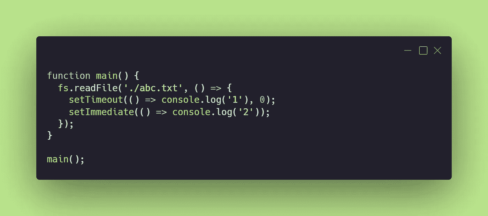

# 在 Node.js 中处理异步操作

> 原文：<https://javascript.plainenglish.io/how-nodejs-works-event-loop-handling-async-operation-4bfc2781110f?source=collection_archive---------6----------------------->


Photo by [Clay Banks](https://unsplash.com/@claybanks?utm_source=medium&utm_medium=referral) on [Unsplash](https://unsplash.com?utm_source=medium&utm_medium=referral)

经过大量的挖掘，我了解了 node.js 是如何在内部工作的。这个博客是基于我的研究，保持耐心深入！😁

好吧。让我们先了解一下 Node.js 是什么🐘。*文档说:“Node.js 是一个基于* [*Chrome 的 V8 JavaScript 引擎*](https://v8.dev/) *构建的 JavaScript 运行时。”*

这里有很多花言巧语🤯。让我们一起把它分解💪首先，什么是运行时，为什么 node.js 是运行时？？？

运行时是为使代码工作而执行的任何代码。我们编写的代码将由运行时执行。运行时可以由编译器、解释器、执行代码的引擎、为代码进程提供线程的线程池组成。

引擎是负责执行程序的实际代码。**它将您的代码转换成机器代码，以便您的计算机(CPU)执行。**

在 JavaScript 中——JavaScript 引擎**将您的脚本翻译成可运行的机器代码指令，这样它就可以被 CPU 执行。**

****JavaScript 运行时环境**就像一个大容器，里面包含了其他小容器，比如引擎、堆、堆栈、web API、事件循环、回调队列。当 JS 引擎解析代码时，它开始将代码片段放入不同的容器中。**

**重要的是**JAVAScript 引擎的实现完全独立于运行时环境。**发动机的开发没有考虑任何特定的环境。**

**例如 Chrome Browser 和 node.js 使用相同的引擎——V8，但是它们的运行时间不同:在 Chrome 中，你有窗口、DOM 对象等，而 node 给你缓冲区和进程。**

**想象一个机器人正在烹饪食物:**

*   **你的代码将是机器人烹饪食物的指令。**
*   **发动机将是能够理解指令并对其采取行动的机器人。**
*   **运行时间将是液化石油气炉和用具。**

## **Node.js 是一个运行时环境，因为它有 V8 引擎、libuv threadpool 和 OS Async Helpers。所有这些都让您能够在服务器上编写 JavaScript 代码。**

**换句话说:“V8 发动机”🦋**

**文档上写着:*“V8 是谷歌的开源高性能 JavaScript 和 WebAssembly 引擎，用 C++编写。”***

**嗯，这意味着，V8 是一个 C++程序，它接收 JavaScript 代码，编译并执行它。V8 的职责:**

1.  **编译并执行 JS 代码。**
2.  **处理调用堆栈，以某种顺序运行您的 JS 函数**
3.  **管理对象的内存分配—内存堆**
4.  **不再使用的对象的垃圾收集**
5.  **提供所有数据类型、运算符、对象和函数**

## ****注意:-V8 对文档对象模型(DOM)一无所知——它是由浏览器提供的****

**在理解事件循环之前，让我们先理解线程和进程。**

**你的计算机所做的任何事情都是使用进程来完成的。例如，文件由文本编辑器进程打开。音乐由音乐播放器进程播放。**

**同样，为了运行您的节点程序，需要一个进程。当您在终端中运行`node`时，就会创建这个过程。**

**每个进程都有线程，这些线程实际上执行进程程序内部的代码。线程使用你的 CPU 核心来执行代码。一个进程可以有多个线程。**

**因此，当您使用`node` : `const mul= 4*2;`运行下面的代码时，会创建一个进程，并为该进程分配线程来执行代码。**

## ***NodeJS 进程不是“单线程”的。“事件循环”是单线程的***

# **事件循环**

**考虑以下代码:**

```
console.log("This is the first statement");setTimeout(**function**(){
console.log("This is the second statement");
}, 5000);console.log("This is the third statement");
```

**输出**

```
This is the first statement
This is the third statement
This is the second statement
```

**Node.js 不会为第二条语句等待 5 秒，而是执行第三条语句，同时等待 5 秒的计时器超时，尽管它是单线程的。怎么会？事件循环救援！**

**“事件循环”就是一个类似于`for`循环或`while`循环的循环。当您通过运行`node app.js`启动节点流程时，会发生以下步骤:**

1.  **V8 引擎执行 app.js 中的代码**
2.  **V8 发动机立即启动“事件循环”**

## **现在有一点应该非常清楚了——事件循环不执行您的代码，V8 引擎负责执行您的代码。**

**“事件循环”是循环中的一段代码，它从“作业/任务队列”中提取任务，并将其发送到[调用堆栈](https://medium.com/swlh/in-depth-introduction-to-call-stack-in-javascript-a07b8513bcc3)中执行。**

**等等！坚持住！哪些任务和什么是“作业队列”？**

**所以作业队列是 FIFO 数据结构。首先推送的任务将首先被作业队列拾取。**

**这里的任务是函数内部需要执行的任何代码。当 I/O 操作、setTimeout、setInterval、setImmediate 或 OS 任务完成时，回调函数被调用，然后进入作业队列。它将“等待”直到堆栈完全清空。当堆栈为空时，它会将队列开头的回调函数发送到堆栈。**

**正如我上面提到的，事件循环类似于 for 或 while 循环。它通过某些阶段进行迭代，这被称为“事件循环迭代”。**

**每个阶段都有自己的队列/堆，事件循环使用它们来推送/存储要执行的回调(Node.js 中有一个误解，即只有一个全局队列，回调在其中排队等待执行，这是不正确的。).**

**阶段包括:**

## **1.计时器**

**JavaScript 中计时器的回调(setTimeout、setInterval)一直保存在堆内存中，直到它们过期。如果堆中有任何过期的计时器，事件循环将拾取与它们相关联的回调，并将其带到调用堆栈。**

**从技术上讲，计时器回调的执行是由事件循环的轮询阶段控制的(我们将在本文后面看到这一点)。**

## **2.待定回调**

**在这个阶段，会执行某些系统级回调。你真的不需要担心这个阶段(老实说，没有太多关于它的信息)，但我想让你知道它是存在的。**

## **3.空闲/准备**

**在这个阶段，事件循环不做任何事情。它处于闲置状态，准备进入下一阶段。**

## **4.投票阶段**

**这个阶段使 Node.js 变得独一无二。在这个阶段，事件循环会监视新的异步 I/O 回调，并执行挂起的 I/O(fs.read file())回调。除了 setTimeout、setInterval、setImmediate 和 closing 回调之外，几乎所有的回调都被执行。**

**轮询阶段有两个主要功能:**

1.  **计算它应该阻塞和轮询 I/O 多长时间，然后**
2.  **处理轮询队列中的事件。**

**当事件循环进入轮询阶段*并且没有定时器(setTimeout，setInterval)被调度*时，将发生以下两种情况之一:**

*   ***如果轮询队列不为空*，事件循环将遍历其回调队列并同步执行它们，直到队列耗尽或达到系统相关的硬限制。**
*   ***如果轮询队列为空*，将会发生以下两种情况之一:**
*   **如果脚本已经由`setImmediate()`调度，事件循环将结束轮询阶段并继续检查阶段以执行那些调度的脚本。**
*   **如果脚本没有被`setImmediate()`调度，事件循环将等待回调被添加到队列中，然后立即执行它们。**

**一旦轮询队列为空，事件循环将检查定时器*，其时间阈值已达到*。如果一个或多个计时器准备好了，事件循环将返回到计时器阶段来执行这些计时器的回调。**

## ****5。立即检查/设置****

**`setImmediate()`实际上是一个特殊的计时器，运行在事件循环的一个独立阶段。它使用一个 libuv API(将会谈到它),该 API 在轮询阶段完成后调度回调来执行。**

## ****6。结束回调****

**在这个阶段，事件循环执行与关闭事件相关的回调，如`socket.on('close', fn)`或`process.exit()`。**

**“libuv”是一个库，它为 NodeJS 运行时提供了一组线程(线程池)来执行长时间运行的任务，比如基于`fs`模块的任务。默认情况下，它为每个节点进程提供 4 个线程，但是您可以通过将`process.env.UV_THREADPOOL_SIZE`设置为您想要的任何值来更改线程池的大小。**

**“操作系统异步助手”在任何低级操作系统操作发生时使用。例如，使用`http`或`https`模块的 REST API 调用或使用`http.createServer()`创建 web 服务器。这些操作从不使用线程池，只要有 CPU 内核可供操作，就会立即执行。**

**一旦“libuv”或“OS Async Helpers”完成了它们的任务，它们就将回调放入“作业队列”中，以便“事件循环”拾取它们，然后将它们发送给“V8 引擎”来执行。**

# **例子**

****

**输出**

```
**2
1**
```

**让我们看看 Node.js 是如何执行这段代码的:**

1.  **当调用 main()时，首先会遇到带有回调的 fs.readfile()。它的回调被推入 I/O 阶段队列，因为 fs 操作是 I/O 操作。**
2.  **当事件循环看到文件读取操作完成时，它开始执行回调，**之后，它进入检查(setImmediate)阶段。****

****检查**相位是否在**定时器**相位之前。因此，在 I/O 阶段，`setImmediate`的回调将总是在`setTimeout(fn, 0)`之前运行。**

**使用`setImmediate()`优于`setTimeout()`的主要优势在于，如果在一个 I/O 周期内进行调度，则`setImmediate()`将始终在任何定时器之前执行，而与有多少定时器无关。**

**感谢您的阅读！可以在 Medium 和 [LinkedIn](https://www.linkedin.com/in/prachi-singh-0369b1196/) 上关注我。欢迎在评论中提问。🌼🌼🌼**