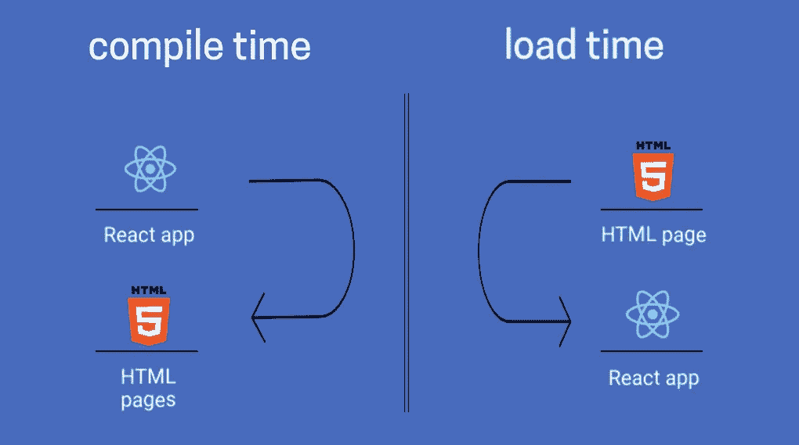
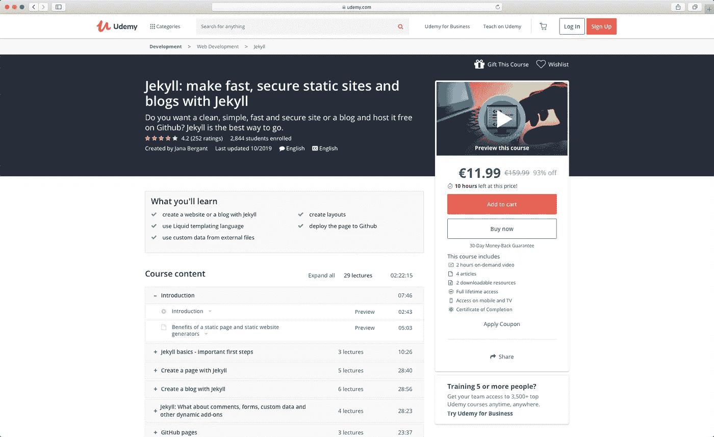
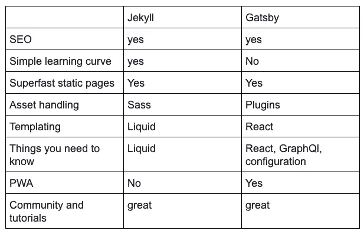

# 选择静态网站生成器如何不出错？盖茨比 vs 哲基尔

> 原文：<https://javascript.plainenglish.io/how-not-to-go-wrong-when-choosing-a-static-website-generator-gatsby-vs-jekyll-510cea59e6e1?source=collection_archive---------0----------------------->

你好，需要一个超级快，在谷歌搜索中表现最好的静态网站吗？在本文中，我会帮你在**盖茨比**和**哲基尔**之间做出选择。

两个流行的静态站点生成器。看完这个，你就知道到底用哪一个了，为什么。

您也可以在这里观看本文的视频版本:

让我告诉你玛丽亚和丹尼斯的事。

玛丽亚是一名教练。她帮助人们减肥。她联系我是因为她想为自己创建一个网站。她想发表她的客户的文章和成功故事。她的页面将是一个关于我的页面，联系页面，和博客帖子列表。简单的技巧和诀窍以及成功的故事。所以超级简单。

丹尼斯是一名网页设计师。他设计页面。他也做 HTML，CSS，熟悉 React 和 Angular。他想重新设计他的页面。之前，他有一个简单的 HTML 页面。但现在他想将其升级为一个简单的商店，人们可以在那里购买他的设计模板。他仍然希望他的网站是静态的，这样可以加载得更快。

> 你会用哪个女巫？哲基尔？还是盖茨比？

[盖茨比](https://github.com/gatsbyjs)是最新的静态站点生成器。它由 node 提供支持，并且发展非常迅速。

# 我们为什么要用盖茨比？

*   第一个很好的理由是 Gatsby 产生了进步的网络应用。有了 Gatsby，您的网站就可以享受随之而来的好处。渐进式网络应用程序是看起来和感觉上都像应用程序的网站。这意味着用户无需下载移动应用程序即可访问所有信息和功能。
*   它支持 GraphQL。您可以从各种数据源加载数据。就像数据库一样。一个 API。Wordpress 网站。或者减价文件。
*   它有很多插件。
*   此外，它有一个庞大的用户群体。
*   然后文档很棒，可以找到好的教程和课程。

> 什么事？听起来很不错。那我们为什么不直接对玛丽亚和丹尼斯说盖茨比才是我们要走的路呢？

嗯，这个。

*   使用 Gatsby 有一个陡峭的学习曲线——需要 JavaScript、React 和 GraphQL 的知识。GatsbyJS 涉及大量的配置和设置。你正在学习全新的东西。您不只是像在 React 和 node.js 应用程序中那样编写 Javascript。您可能会发现自己在说:“这与我以前作为 React 开发人员所做的任何事情都不一样。”不要气馁。对于网站建设来说，它是静态网站生成器背后的大脑。

# 让我告诉你关于杰基尔的事

《化身博士》于 2009 年上映。Jekyll 是这个列表中最老的静态站点生成器。

Jekyll 是用 Ruby 写的，全世界都在用。由于隶属于 GitHub，Jekyll 获得了开源社区的大量关注和贡献。

虽然 Jekyll 对页面内容使用 Markdown，但它也使用 [Liquid templating language](https://jekyllrb.com/docs/liquid/) 来处理页面。Jekyll 也使用 Sass，这对于喜欢 CSS 预处理器的开发人员来说意义重大。

# 《哲基尔》有哪些好的地方？

*   设置和部署 Jekyll 是一个简单的过程。
*   它有一个庞大的开发者社区。你会找到帮助你的人。
*   有教程，文档也可以。
*   它使用了简单易学的液体模板语言。
*   Jekyll 非常适合搜索引擎优化(SEO)。
*   有大量的插件可供使用。

# 为什么不用哲基尔呢？

*   嗯，它不是一个进步的网络应用程序。这只是一个静态的网站。
*   处理资产可能会很麻烦。最小化 javascript 和图像预加载并不是现成的。但是 is 确实用 SASS。
*   为 Windows 用户设置可能也很困难——Jekyll 需要一个 Ruby 环境。

> **在我们做出决定之前，你可以多了解一些盖茨比和杰基尔在幕后是如何工作的。**

**有了 Gatsby，你可以从任何地方获取数据，可能是 markdown、API、数据库、Wordpress。**

Jekyll 使用 markdown 和 HTML 页面。

> 盖茨比真的是一款 React app。

它有组件等等。但它的工作原理大不相同。 **Gatsby** 将继续将该页面预先制作成**静态 HTML 页面**。所以 Gatsby 将在编译时获取数据。那是在你部署你的网站之前，或者作为一些部署过程的一部分。

经过预处理的静态页面将立即为您提供。

页面被加载，然后它**加载 React 部分**。因为 React 部分与静态页面相同，所以在加载 React 之后，您看不到任何区别。但是页面开始作为动态页面工作。这意味着你也可以拥有动态的内容。你可以轻松制作混合应用。预先生成的部分是静态网站的应用程序。以及作为 React 应用的部分动态页面。女巫是伟大的搜索引擎优化。Gatsby 将预加载搜索引擎优化所需的内容。评论或小工具等动态部分仍将作为 React 应用程序工作。Gatsby 创建的页面仍然是一个完整的 React 应用程序。

关于 Udemy 的一门很棒的课程是汤姆·菲利普斯的课程，它将教你如何从盖茨比身上得到最大的收获。题目是 [Gatsby JS & Firebase:构建混合实时+静态站点](http://bit.ly/35XOvQo)。你将深入了解盖茨比是如何在幕后工作的。您将了解如何最大限度地利用插件。此外，你会知道如何添加像评论注册动态部分。

[Gatsby JS & Firebase: Build HYBRID realtime + static sites](http://bit.ly/35XOvQo)

我强烈推荐这道菜。它有很高的评级，汤姆反应迅速，所以你可以快速发展。

> Jekyll 最大的优点就是简单。学习曲线超级快。

我有一门 Udemy 课程可以加速你的博客发展进程。你很快就会有自己的博客了。在课程中，我们一起创建了一个博客，我将向你展示关于液体模板的一切。在用 Jekyll 创建静态站点时，您只需要知道液体模板。

[Jekyll: make fast, secure static sites and blogs with Jekyll](http://bit.ly/2sqf6aa)

你觉得怎么样？玛丽亚应该用什么？她想让自己的网站快速运行，但她不想学习 React 和 GraphQl。但是她有一些 HTML，CSS 的知识，因为她是作为一个爱好制作网站。所以，我推荐她的是用 Jekyll。她参加了我的课程，现在她非常开心，帮助她的客户减肥。

丹尼斯改变了主意。他对开发略知一二，所以听朋友说还可以用 **Next.js 配合 React 创建一个静态站点**。所以，我们也谈到了这一点。现在，如果你像丹尼斯一样，你的应用不是一个超级简单的博客。此外，您对 React 和 Node 有一些经验，那么我欢迎您观看视频，我们将帮助 Denis 决定是使用 Gatsby 还是 Next。你也可以决定。

Gatsby vs Next

让我总结一下我们学到的东西。那么区别在哪里呢？

《化身博士》和《盖茨比》对《T4》的 SEO 来说都很棒。

他们提供**超快的静态页面**。

哲基尔有一个简单的学习曲线，而盖茨比你需要知道更多。

有了 Jekyll，你只需要学习液体模板，对终端有一个基本的了解。

Jekyll 的模板系统是 Liquid，而 **Gatsby 是 React app** 。

但是有了 Gatsby，你需要学习 React、GraphQL 以及它拥有的所有配置选项。但是你的应用将会是一个进步的应用，拥有它所有的优势。

不仅仅是一个静态的站点。两者都有很好的社区和大量的支持。

盖茨比更像一个 Wordpress，它有很多插件。有了这个插件，你可以最小化图片，编译 Javascript，缩小它。

要学习盖茨比，我推荐汤姆·菲利普斯的《我的课程》。题目是 [Gatsby JS & Firebase:构建混合实时+静态站点](http://bit.ly/35XOvQo)。

为了学习 Jekyll，我欢迎你参加我的课程 [Jekyll:用 Jekyll 制作快速、安全的静态网站和博客](http://bit.ly/2sqf6aa)。

让我知道你的想法。

如果你喜欢这篇文章，我想邀请你到我的 youtube 频道，在那里我会发布更多关于 web 开发主题的文章。

 [## 贾娜·贝尔甘特

### 嗨，我是一名自学了 20 年的网络开发人员。教学是我的热情所在，这也是我在 Udemy 上开设课程的原因

www.youtube.com](https://www.youtube.com/c/JanaBergant-learn-to-code) 

祝您愉快:)