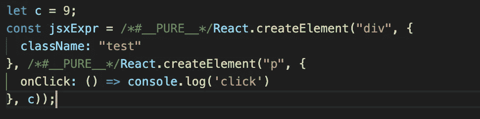
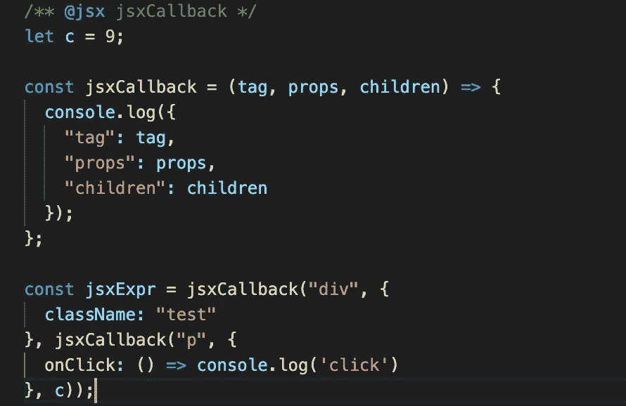

# JSX 变换解释道

> 原文：<https://javascript.plainenglish.io/how-react-uses-jsx-5bc989ebc674?source=collection_archive---------3----------------------->

## 建议在 React 应用中使用 JSX(JavaScript XML)编写 HTML。尽管浏览器不能理解 JSX 语法，因此需要将 JSX 转换成简单的 JavaScript 函数。这是一篇关于该主题的深度文章。

## **内容:**

1.  简单的" **Hello React"** App
2.  **ReactDOM.render()的参数**
3.  用 JSX 扩展“**Hello React”App**
4.  **JSX** 变身穿越**通天塔**

**先决条件** : JavaScript，用 CRA，巴别塔，JSX 反应安装设置

# 简单的“Hello React”应用程序

在看 JSX 之前，让我们首先尝试创建我们的第一个非常简单的 React 应用程序。我们将通过 React 在浏览器上呈现“Hello React”。继续创建 react 应用程序，我们选择`[***create-react-app***](https://create-react-app.dev)`来创建应用程序。现在，创建我们的“Hello React”应用程序就像在`src/index.js`编写以下代码一样简单:

```
import ReactDOM from 'react-dom';
ReactDOM.render(
"Hello React!",
document.getElementById('root')
)
```

我们可以在控制台/终端上运行`npm start`，在浏览器中看到上面代码的输出。


Output for above index.js

# **ReactDOM.render()** 的参数

从上面的代码中我们可以看到，react 从一小段代码开始了它的神奇。在这段代码中，我们调用 react dom 提供的 **render()** 函数。现在，这个渲染函数，我们可以看到，已经采用了两个参数。让我们检查一下这个函数实际接受的所有参数。

如果我们在`node_modules/react-dom/cjs/react-dom.development.js`检查代码，我们发现这个函数接受三个参数。

```
**ReactDOM**.**render(element, container, callback)**
```

1.  元素:这是我们想要渲染的主界面。
2.  **容器**:这是元素被渲染的地方，默认为**根**，但是我们可以更改。
3.  **回调**:这是**可选**。我们先不要担心这个。

如果我们在运行 react 应用程序的同一个浏览器选项卡中打开开发人员控制台，并检查**元素**选项卡，我们会发现下面的 HTML 代码。


这里的`<div id="root">`部分是**容器**而`Hello React!`是**元件**。

# 用 JSX 扩展“**Hello React”App**

现在回到我们的“Hello React”应用程序。正如我们所知，render 函数将第一个参数作为一个元素，这就是我们想要呈现给浏览器的内容。在这里，我们想要呈现复杂的 HTML，而不是像前面那样只呈现一个字符串。 **React 推荐使用 JSX(JavaScript XML)** 来达到同样的效果。让我们稍微改变一下我们的代码来支持 JSX，这将帮助我们渲染更多的字符串。

```
import ReactDOM from 'react-dom';
ReactDOM.render(
<div>Hello React!</div>,
document.getElementById('root')
)
```

你注意到没有，`<div>Hello React!</div>`，不是弦，而是 JSX。我们来看看浏览器是如何渲染这个的。


这里的`<div id="root">`部分是**容器**，`<div>Hello React!</div>`是**元素**。

# **JSX** 变身穿越**通天塔**

让我们更深入地讨论 JSX。我们知道浏览器不能理解 JSX 语法，因此有必要将这个 JSX 转换成浏览器能够理解的东西。

这个任务是由巴别塔预置和插件完成的。巴别塔会自动出现在我们的应用程序中。如果没有，可以通过 npm 轻松安装。我们将使用的 Babel 插件是"[@ babel/plugin-transform-react-jsx](https://babeljs.io/docs/en/babel-plugin-transform-react-jsx)"

`[**@babel/plugin-transform-react-jsx**](https://babeljs.io/docs/en/babel-plugin-transform-react-jsx)` 是 react app 中负责转换 JSX 的插件。**需要注意的一点是，JSX 也可以在 React 应用之外使用**。我们将尝试在没有 React 应用程序的情况下使用 JSX，因为它将帮助我们了解 React 如何更好地改造 JSX。

**没有 React App 的 JSX:**

为此，在“Hello React”应用程序主题之外创建一个新文件夹，然后按照给定的步骤操作:
1。用`npm init`命令初始化`package.json`文件。
2。然后让我们安装`[***@babel/cli***](https://babeljs.io/docs/en/babel-cli)`和`[***@babel/core***](https://babeljs.io/docs/en/babel-core)`，带有开发依赖标志。
3。在`package.json`中的`scripts`下创建一个名为`build`的命令，我们将像`npm run build`一样使用它，将命令设为`babel src -d lib`
4。安装`@babel/plugin-transform-react-jsx`，如果还没有的话，也使用开发依赖标志

完成上述所有步骤后，package.json 应该看起来像这样:


现在让我们创建与 **package.json** 同级的 **babel.config.json** 文件，并告诉 babel 使用:

## ***1。*** ***【插件-转换-反应-jsx】******同经典运行时:***

```
{
"plugins": [
         ["@babel/plugin-transform-react-jsx", {
          "runtime": "**classic**"
         }]
    ]
}
```

`@babel/plugin-transform-react-jsx`的运行时间默认值也是**经典**。但这将从巴别塔 8 开始改为"**自动**"运行时。

接下来，让我们创建`src/index.js`并使用以下内容:

```
let c = 9;
const jsxExpr = <div className="test">
<p onClick={() => console.log('click')}>{c}</p>
</div>;
```

下面是 JSX 表达式。

接下来，我们需要构建我们的项目。还记得我们在 **package.json** 中创建了一个 **build** **命令**吗？现在是时候使用它了。我们可以使用`npm run build`运行该命令，这将运行`babel src -d lib`，这意味着 **babel 将对** `**src**` **文件夹中的所有文件进行处理，并将输出放在名为** `**lib**` **的目标文件夹中。**

现在让我们在终端中运行`npm run build`并检查`lib`文件夹中的输出。`lib/index.js`应该是这样的:



这里我们可以看到 JSX 现在被替换成了 **React.createElement** 函数。如果我们想检查它如何在浏览器上工作。让我们在`src`文件夹中创建一个 HTML 文件。

**src/index.html**

```
<!DOCTYPE html>
<html lang="en">
<head>
<meta charset="UTF-8" />
<meta name="viewport" content="width=device-width, initial-scale=1.0" />
<title>JSX without React App</title>
</head>
<body>
<div id="root"></div>
<script src="../lib/index.js"></script>
</body>
</html>
```

让我们用 Chrome 浏览器打开它，我们不会在浏览器上看到任何东西，所以让我们检查开发者控制台，**控制台**选项卡。这里，我们将看到一个错误，即**反应**未定义。这是意料之中的，因为它不是 React 应用程序。

如果我们想在没有 React 应用程序的情况下使用 JSX，我们可以告诉 babel 使用我们的自定义函数，而不是 **React.createElement 函数**。为此，我们可以将`src/index.js`的内容替换为:

```
/** @jsx jsxCallback */let c = 9;const jsxCallback = (tag, props, children) => {
console.log({
"tag": tag,
"props": props,
"children": children
})
}const jsxExpr = <div className="test">
<p onClick={() => console.log('click')}>{c}</p>
</div>;
```

**/** @jsx jsxCallback */** 会让巴别知道 **jsxCallback** 是它需要替换 jsx 表达式的函数。这也被称为**杂注。**
由于我们正在使用 **classic** 运行时，如果我们不提供这个 **pragma 注释**，那么它将默认为 **React.createElement** 函数。

做了这个修改后，我们需要再次运行`npm run build`，让我们在`lib/index.js`中检查结果。它应该看起来像:



在这里，如果我们仔细观察，我们的 JSX 表达式已经被 **jsxCallback** 函数所取代。

现在，如果我们试图用 Chrome 浏览器打开我们的`src/index.html`文件。我们在浏览器上仍然看不到任何东西，但是让我们检查一下开发者控制台，**控制台**选项卡，它看起来应该是这样的:


正如我们在这里看到的，详细信息如预期的那样打印在我们的控制台中。此时，我们只有在 **jsxCallback** 函数中将 JSX 值打印到控制台的代码。我们当然可以改变它，使它能够创建 HTML 标签并将其附加到 DOM。

## ***2。带自动运行时的插件-转换-反应-jsx:***

随着 React 17 的发布，React 最近引入了另一个运行时。为了检查它，我们需要在 **babel.config.json** 文件中将我们的运行时值从`classic`改为`automatic`。

```
"plugins": [
   ["@babel/plugin-transform-react-jsx", {
          "runtime": "**automatic**"
   }]
]}
```

让我们把`src/index.js`里面的内容改回:

```
let c = 9;
const jsxExpr = <div className="test">
<p onClick={() => console.log('click')}>{c}</p>
</div>;
```

做了这个修改后，我们需要再次运行`npm run build`，让我们在`lib/index.js`中检查结果。它应该看起来像:


这里 JSX 被转换成从`react/jsx-runtime`导入的 **_jsx** **函数调用**。

使用**自动**运行时，我们不能像使用**经典**运行时那样使用`**@jsx**`来调用我们的自定义函数，但是我们可以使用`**@jsxImportSource**` **杂注**来导入我们的自定义模块，而不是使用**反应**。因此，如果我们将`**/** @jsxImportSource myOwnJSX */**` 放在代码的顶部，并再次运行`npm run build`，那么`lib/index.js`将看起来像这样:


这里 JSX 被转换成从`myOwnJSX/jsx-runtime`导入的 **_jsx** **函数调用**。

**React App 中的 JSX:**

每个 React 内部的应用程序都将使用`@babel/plugin-transform-react-jsx`巴别塔插件进行 JSX 转换。
现在回到“Hello React”应用程序，我们可以说当我们写`<div>Hello React!</div>`时，它翻译成

```
/*#__PURE__*/React.createElement("div", null, "Hello React!");
```

**或**

```
import { jsx as _jsx } from "react/jsx-runtime";const jsxExpr = /*#__PURE__*/_jsx("div", {
   children: "Hello React!"
});
```

如果你正在使用`create-react-app 4.0.0+`，那么 JSX 变换将使用**自动**运行时完成。

有关**自动运行时**的更多信息，请查看[新 JSX 变换介绍](https://reactjs.org/blog/2020/09/22/introducing-the-new-jsx-transform.html)，这将有助于理解他们为什么要推出新 JSX 变换，做了哪些更改等等。详细地说。

**感谢阅读。关于这个话题的任何问题/建议都欢迎评论。:)**