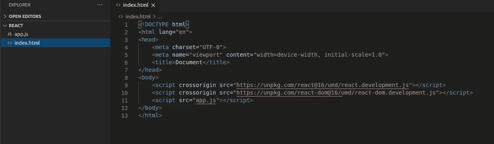
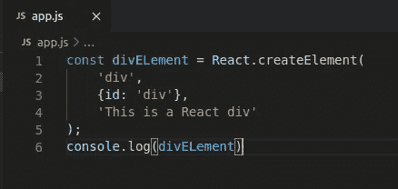
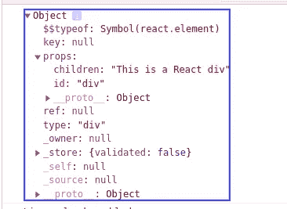
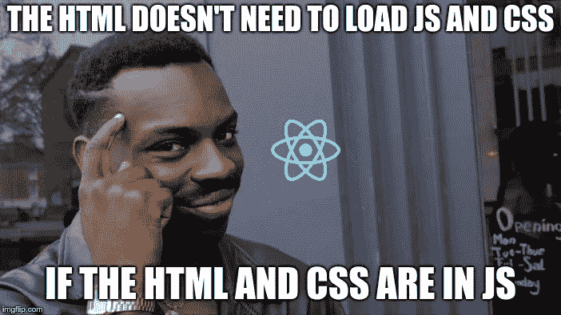

# React 是如何工作的

> 原文：<https://javascript.plainenglish.io/how-react-works-under-the-hood-277356c95e3d?source=collection_archive---------1----------------------->


React 是一个非常流行的 JavaScript 库。今天，许多创业公司选择 React 作为他们为项目构建快速前端应用程序的工具。它的周下载量超过 550 万次，但没有多少开发人员知道 React 实际上是如何工作的。

浏览不同的文档可能会令人沮丧，因此在本文中，我将尝试解决这个问题，并尽我所能解释 React 的内部工作方式。有很多内容要讲，所以我们开始吧。


与 Angular 或 Vue 不同，React 实际上只是普通的 JavaScript，所以如果你知道 JS 的语法，知道一点状态管理，知道一点组件，你就可以开始使用 React 了。

# 反应虚拟 DOM

在它的核心，React 只是为你维护一棵树，它会在节点上进行有效的差分计算。你的 HTML 代码很像一棵树，或者至少你的浏览器是这样对待它的。它构建了通常所说的文档对象模型或 DOM。

HTML DOM 很大程度上是一个修改其中节点的接口(API)。它包含不同的方法，如 *getElementById* 或新的 *querySelector* 来定位每个节点，我们使用 JS 来处理 DOM。这意味着每当我们想要改变内容时，我们都要修改 DOM，但这相当昂贵。为什么相当贵，这是个问题。

如果您至少对 React 有所了解，那么您可能听说过虚拟 DOM，对吗？


你可能听说过*虚拟 DOM* 和*真实 DOM* 的区别在于前者要快得多。嗯，这是真的……算是吧。DOM 对象实际上与真正的 DOM 对象具有相同的属性，但是速度上的差异是因为它不影响屏幕上的任何东西。V.DOM 只是 DOM 的一个*表示*，但是它是轻量级的，并且与特定于浏览器的实现细节无关。更容易将 V.DOM 视为真实事物的蓝图。

在 V.DOM 中改变一些东西与在真实 DOM 中改变一些东西没有太大的区别。真正的区别是在那之后。当我们在浏览器中更改真正的 DOM 时，会触发布局和重画，这需要额外的资源，非常昂贵。这意味着我们必须避免接触 DOM，尽可能地并且应该只改变那里的一些东西，当绝对确定这是最小的行动过程时。

基本上，JS 现在做的是检查所有的元素，如果检测到变化，它就改变整个元素容器。

React 和类似的框架是如何解决这个问题并加速这个过程的，它找到了更新 DOM 所需的最小变化。我们的 V.DOM 会添加牛奶，将其与更新之前拍摄的 DOM 快照进行比较，找出变化最小的地方，并只更新 ***这些变化。***


现在你可能会问。"如果 V.DOM 和 DOM 是一样的，为什么会更快？"。正如我所说，V.DOM 不接触屏幕，这意味着它不处理任何绘画和计算。它只是在蓝图上画出差异，告诉 DOM，DOM 只更新特定的元素，这大大减少了压力。

# **JSX**

你可能听说过 JSX，但它到底是什么？它是做什么的？从根本上说，JSX 只是为`React.createElement(component, props, ...children)`函数提供了语法上的好处。JSX 电码

```
<MyButton color="blue" shadowSize={2}>
  Click Me
</MyButton>
```

编译成:

```
React.createElement(
  MyButton,
  {color: 'blue', shadowSize: 2},
  'Click Me'
)
```

JSX 标记的第一部分决定了 React 元素的类型。大写的类型表示 JSX 标签引用了 React 组件。这些标签被编译成对命名变量的直接引用，所以如果使用 JSX `<Foo />`表达式，`Foo`必须在范围内。
所以，基本上使用 JSX 和 React 是**而不是**强制的，但它肯定是更可取的。它看起来非常类似于实际的 HTML 代码。

会有什么反应？CreateElement 到底是做什么的？它只是创建一个普通的 JS 对象。我们可以看到它，如果我们只是控制台记录它。为此，您只需创建 HTML 和 JS 文件。



我们导入 React 脚本，并在我们的 js 文件中编写:



当我们将它记录到浏览器中时，我们可以看到



现在，如果我们在这个 div 中添加一个 p

```
const parentElement = React.createElement(‘div’,{id: ‘div’},React.createElement(‘p’, {}, ‘A p inside a div’))
```

我们会得到嵌套的对象。当你开始写嵌套的东西时，想象你有一个 div，在这个 div 里面，你有另一个 div，然后里面有一个按钮。它会很快失去控制。因此，JSX 帮助你将 HTML 的简洁带到 JavaScript 的强大。



# 呈现 React 应用程序

那么这一切是如何组合在一起的呢？React 实际上是如何将我们的组件呈现给浏览器的？遇见 ReactDOM。ReactDOM 根据节点的“type”属性递归地创建节点，并最终将它们附加到 DOM 中。它接收两个参数，第一个是追加什么，第二个是追加什么。

如果您曾经使用过 create-react-app，您会在 public 文件夹中看到一个 index.html 文件，在 src 子根文件夹中看到一个 index.js 文件。这些可能是您的应用程序中最重要的文件。你看，React 只需要在 HTML 文件中创建一个**实际的** div，这样它就可以将目标指向那个 div，并在某种程度上将其总节点树挂在上面。这就是为什么，当您查看 React 应用程序时，您很可能会看到一个父 div，树的其余部分在某种程度上附加到它上面。

这些是关于 React 及其工作原理的一些最重要的概念。我意识到还有很多其他的事情，但是我不想把帖子写得太长太无聊。我可能会就这些话题分别发表文章。我希望这对你更好地理解这个美丽的图书馆的内部运作有所帮助。

请随时给我建议、问题或批评。
保持阳性，检测阴性。和平！