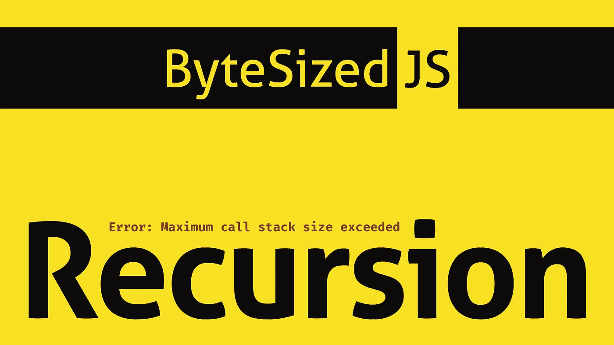

# JavaScript 中递归的工作原理

> 原文：<https://javascript.plainenglish.io/how-recursion-works-in-javascript-e561bf087155?source=collection_archive---------5----------------------->



# 介绍

欢迎来到字节化 JavaScript，在这里我们讨论可管理的代码块。今天我们将讨论递归。

递归是你在学习 JS 时经常看到的东西之一。问题是，你明白它是什么吗？如果你不知道，我将给出两个例子，希望能澄清这个问题。如果你这样做，无论如何检查我的例子！我相信你有更深入的见解可以分享。

# 视频版本

如果你通过观看学习得很好，请查看这篇文章的视频版本！

# 什么是递归

递归很简单:

> *一个函数反复调用自己*

它将调用自己，直到发生以下两种情况之一:

1.  我们达到了调用堆栈限制。
2.  我们定义一个退出值。

# 简单的例子

让我们从一个简单的例子开始。我们函数的目标是增加一个数，直到达到一个极限…然后停止。首先，我们来打破它。

```
function incrementer(ceiling,total) {
  	total++
  	return incrementer(ceiling, total)
}
incrementer(10,0)
```

该代码将一直运行，直到达到调用堆栈限制。可能不是我们想要的。

现在，让我们为代码添加一个“out”。

```
function incrementer(ceiling,total) {
  	total++
  	if (total === ceiling) {return total}
  	return incrementer(ceiling, total)
}
incrementer(10,0)
```

很简单。这对我们来说没什么用，但它表明了一个原则:

> *递归是一个调用自身的函数。*

现在让我们看一个更健壮的例子。

# 强大的示例

假设我们想找出:

> *到给定值为止，所有平方值的总和是多少？*

或者用数学术语来说:

> 1 + 2 + 3 …n

为了解决这个问题，我们可以编写一个函数来完成以下任务:

1.  检查我们是否达到了极限
2.  平方该值
3.  把它加到总数上
4.  减少数值
5.  返回步骤 1

看看这个。

```
// Our function takes in two values: 
// our limiter (ceiling) and a total that we will return (inititally set at 0)function getSumSquares(ceiling, total = 0) { // check if we have reduced our ceiling to zero. If so...escape!
  if (ceiling === 0) {
    return total;
  } // if we still have more work to do, do the work
  total += ceiling ** 2;

  // call yourself, but reduce our ceiling by one.
  return getSumSquares(ceiling - 1, total);
}
```

该函数将调用自己，直到我们的条件被满足，在这个例子中，`ceiling === 0`，因此命名为递归。

# 最后的想法

希望这能澄清一些事情。这只是你能用递归做的事情的表面。我在下面添加了一些链接来提供更多的细节。

如果你想讨论更多的 JavaScript 话题，请给我留言。

一如既往，编码快乐！

# 插头

## 书

我正在写一本关于图形设计及其与软件开发的关系的书！如果你感兴趣，在这里注册更新。

[](https://digitalnutt.substack.com/p/coming-soon?r=34slo&utm_campaign=post&utm_medium=web&utm_source=copy) [## 网络开发及其他

### 欢迎来到我的深思熟虑的发展，贾里德。我是一名自由职业者，住在洛杉矶。我目前…

digitalnutt.substack.com](https://digitalnutt.substack.com/p/coming-soon?r=34slo&utm_campaign=post&utm_medium=web&utm_source=copy) 

## 音乐

我也写音乐！请点击这里查看:

[](https://www.youtube.com/channel/UCqxQspCPTcE_wH0KBE5J-aw) [## 以…为模

### 从代码中诞生的电子音乐。电子编程。

www.youtube.com](https://www.youtube.com/channel/UCqxQspCPTcE_wH0KBE5J-aw) [](https://music.apple.com/us/artist/modulo/1499420471) [## 苹果音乐上的模数

### 听 Modulo 的歌曲和专辑，包括“Nails”、“Re:Rezzed”、“Nomad”等等。按模数排序的歌曲开始于…

music.apple.com](https://music.apple.com/us/artist/modulo/1499420471) 

## 支持

如果你喜欢这篇文章并想看更多，最好的方法是订阅/关注我！如果你觉得亲切，你可以请我喝杯咖啡！

# 资源

这个视频更具体地描述了事件循环，但是它涵盖了在 7:00 左右调用堆栈被超过时会发生什么。

[https://www.youtube.com/watch?v=8aGhZQkoFbQ](https://www.youtube.com/watch?v=8aGhZQkoFbQ)