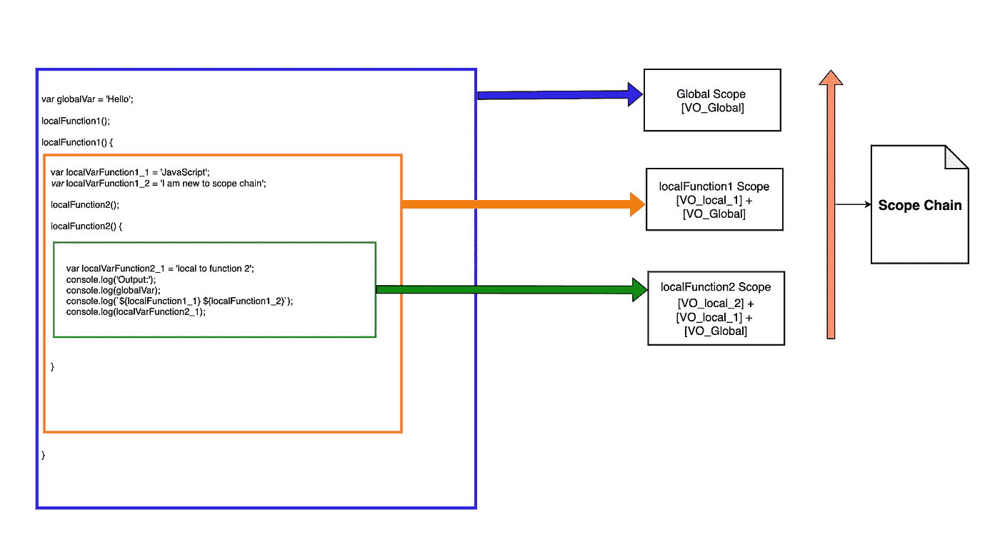

# JavaScript 中作用域链是如何确定的？

> 原文：<https://javascript.plainenglish.io/how-scope-chain-is-determined-in-javascript-b180eceae002?source=collection_archive---------1----------------------->


Picture credits [Unsplash](https://unsplash.com/photos/PDxYfXVlK2M)

> 这篇文章是我上一篇文章[JavaScript 代码执行](https://medium.com/javascript-in-plain-english/javascript-parsing-and-code-execution-f92a08498ec1)的续篇。
> 从上一篇文章中，我们知道执行上下文有两个阶段。创建和执行阶段。创建阶段由三个重要步骤完成。首先是可变对象的形成，其次是作用域链，最后是确定和设置。

为了理解作用域链，我们应该首先定义什么是作用域？

> **范围:**
> 当前执行的上下文。值和**表达式**是“可见的”或者可以被引用的上下文。如果一个**变量**或其他表达式不“在当前范围内”，那么它就不可用。作用域也可以在层次结构中分层，以便子作用域可以访问父作用域，但反之则不行。— [MDN](https://developer.mozilla.org/en-US/docs/Glossary/Scope)

如果我们试图用简单的话来打破上面的定义，它的意思是，作用域是变量和表达式的访问区域。在 ES6 之前，我们只有一种方法在 JavaScript 中创建作用域，那就是创建一个名为 functional scope 的新函数，另一种是 global scope。随着 ES6 标准的引入，语言中引入了块级范围。我们将简要介绍每一项，然后是示例。这种理解有助于我们进一步理解 JavaScript 中的作用域链是如何工作的。
**全局作用域:** 全局作用域是包含所有其他作用域并在其中可见的作用域。
**局部作用域:** 局部作用域是变量的一个特征，使它们成为局部的(即变量名只绑定到它在一个不是[全局作用域](https://developer.mozilla.org/en-US/docs/Glossary/global_scope)的作用域内的值)。
**块范围:**
一个**块语句**(或其他语言中的**复合语句**)用于分组零个或多个语句。该块由一对花括号分隔，可以选择为`[labelled](https://developer.mozilla.org/en-US/docs/Web/JavaScript/Reference/Statements/label)` :
让我们看一个解释上述概念的例子。

```
Using ES5...// Global Scope.
*var* globalVar = 'Hello';
localFunction1();
*function* localFunction1() {
  // Local Scope for localFunction1. *var* localVarFunction1_1 = 'JavaScript';
  *var* localVarFunction1_2 = 'I am new to scope chain';
  localFunction2();
  *function* localFunction2() {
  // Local Scope for localFunction2. *var* localVarFunction2_1 = 'local to function 2';
  localFunction3();
  *function* localFunction3() {
   // Local Scope for localFunction2\. 

   *var* localVarFunction3_1 = 'local to function 3';
   console.log('Output:')
   console.log(`${globalVar} ${localVarFunction1_1}`); 
   console.log(localVarFunction1_2);
   console.log(localVarFunction2_1);
   console.log(localVarFunction3_1);
  }
 }
}
Output:
Hello JavaScript
I am new to scope chain
local to function 2
local to function 3Using ES6..// Global Scope.
*let* globalVar = 'Hello';
localFunction1();
*function* localFunction1() {
  // Local Scope for localFunction1. *let* localVarFunction1_1 = 'JavaScript';
  *const* localVarFunction1_2 = 'I am new to scope chain';
  localFunction2();
  *function* localFunction2() {
   // Local Scope for localFunction2. *let* localVarFunction2_1 = 'local to function 2';
   localFunction3();
   *function* localFunction3() {
     // Local Scope for localFunction2\. 

     *var* localVarFunction3_1 = 'local to function 3';
     console.log('Output:')
     console.log(`${globalVar} ${localVarFunction1_1}`); 
     console.log(localVarFunction1_2);
     console.log(localVarFunction2_1);
     console.log(localVarFunction3_1);
     {
       // Local to the block
       *let* blockVarFunction3_1 = 'Local to block';
       console.log(blockVarFunction3_1);
     }
     console.log(blockVarFunction3_1);
   }
 }
}Output:
Hello JavaScript
I am new to scope chain
local to function 2
local to function 3
Local to block
ReferenceError: blockVarFunction3_1 is not defined
```

现在，这里的问题是" **localFunction3** "如何能够访问和打印没有在函数作用域中定义的变量的值，因为正如我们在上面的定义中看到的，存在全局作用域和局部作用域，其中前者随处可见，而后者对负责创建它的函数可见。这个问题的答案是“**作用域链**，它被定义为当前变量对象(VO) +所有父词法变量对象的集合。运行代码时，JavaScript 引擎会尝试在当前范围内查找变量，如果找到变量，就会在变量对象中创建一个条目，并使用该变量对象定义范围链。如果变量没有在当前作用域中定义，它会继续尝试在父函数作用域中查找变量定义。这个过程一直持续到遍历过程到达全局范围，只有当变量不在这个链中的任何位置时，javaScript 引擎才会抛出一个错误并停止执行。需要记住的重要一点是，作用域链只能自下而上工作，而不能反过来。下图显示了流向，其中红色箭头表示方向。



**Scope chain representation.**

这里我们可以看到**“local function 3”**的作用域链是[VO _ local _ 2]+[VO _ local _ 1]+[VO _ Global]。
**注意:** VO_local#是属于特定函数的变量对象，VO_Global 代表全局变量对象。此外，我们在 javaScript 中有词法作用域，词法意味着代码中写了什么。词法范围被定义为一个函数在词法上位于另一个函数内，并且可以访问父(外部)函数的范围。因此，我们已经看到了范围链是如何确定的，但是有一件重要的事情需要记住，即范围链和执行上下文的不同之处。让我们看一个例子来说明区别在哪里。

```
*let* globalVar = 'Hello';
localFunction1();
*function* localFunction1() {
  *let* localVarFunction1_1 = 'JavaScript';
  *let* localVarFunction1_2 = 'I am new to scope chain';
  localFunction2();

  *function* localFunction2() {
   *let* localVarFunction2_1 = 'local to function 2';
   localFunction3();
  } *function* localFunction3() {
    *let* localVarFunction3_1 = 'local to function 3';
    console.log('Output:')
    console.log(`${globalVar} ${localVarFunction1_1}`);
    console.log(localVarFunction1_2);
    console.log(localVarFunction2_1);
    console.log(localVarFunction3_1); }
}Output:
Hello JavaScript
I am new to scope chain
ReferenceError: localVarFunction2_1 is not defined
```

尽管在 localFunction2 中调用了函数 localFunction3，但为什么我们会得到 localVarFunction2_1 的错误。这是因为上下文堆栈的工作方式不同于作用域链。在上面的示例中，调用了 localFunction1，它调用了 localFunction2，而 localFunction3 又调用了 localFunction3，对于这些调用中的每一个，新的执行堆栈都放在执行堆栈的顶部，而对于作用域链来说，情况略有不同，全局作用域包含 globalVar 和 localFunction1，然后 localFunction1 的作用域包含 localFunction2 和 local function 3 以及变量定义。执行上下文是函数被调用的顺序，但是作用域链是函数在代码中的编写顺序，也就是它们在代码中的词汇顺序。所以函数被调用的顺序并不决定这些函数中变量的范围。决定变量范围的是函数的编写位置。

如果你觉得这篇文章很有帮助并且喜欢它，请随意与你的朋友和同事分享。

你有任何问题、建议或想要联系我吗？在 LinkedIN 上给我留言或在下面评论。

我也可以在推特上通过@zargarmuneer90 找到我。

[](http://davidshariff.com/blog/javascript-scope-chain-and-closures/) [## JavaScript 作用域链中的标识符解析和闭包

### 从我以前的帖子中，我们现在知道每个函数都有一个相关的执行上下文，其中包含一个变量…

davidshariff.com](http://davidshariff.com/blog/javascript-scope-chain-and-closures/)