# Storybook:创建应用程序组件的必备库

> 原文：<https://javascript.plainenglish.io/how-storybook-improved-our-teams-workflows-and-communication-2ee57fcb2a87?source=collection_archive---------9----------------------->

## 简化开发人员和设计人员之间的交流。

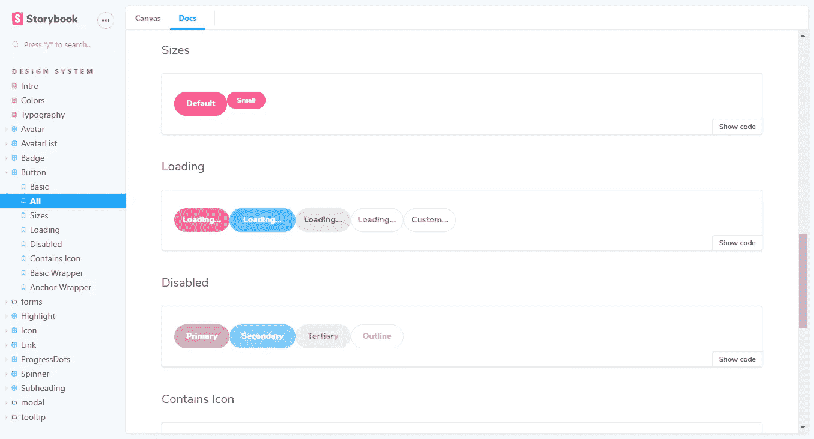

Web 开发人员总是可以使用各种工具、库和框架来帮助他们编写和维护代码。最近，我最着迷的工具是故事书。其核心是一个组件库和一个独立构建 UI 组件的工具，这两个特性有很多级联的好处。Storybook 已经帮助我们解决了我们团队的一些最大的挑战，让每个人都参与到面向组件的架构中，并减少了我们浪费在创建重复组件上的时间。它帮助我们的团队集中在一个工作上，改进了我们的文档，并允许我们发现现有的组件，而不需要深入其他团队的项目。

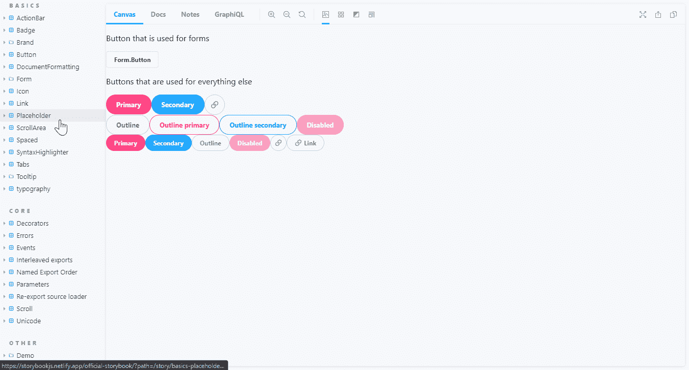

A great way of seeing just what Storybook has to offer is checking out the Storybook that they use for their own components. [https://storybook.js.org/docs/basics/live-examples/](https://storybook.js.org/docs/basics/live-examples/)

# **协助发现**

Storybook 的主要特性是让您探索应用程序中可用的组件。Storybook 托管在您的网络中，因此参与项目的每个人都可以访问它，story book 允许您发现某个组件是否已经存在，以及它是否满足您的要求。如果您找不到任何符合您需求的东西，它会帮助您决定是需要创建一个新组件还是修改一个现有组件。

对所有输入进行如此多的控制使得发现错误和不一致变得更加容易。当我们回去为所有预先存在的组件创建故事时，我们能够识别几乎一半组件中的错误。

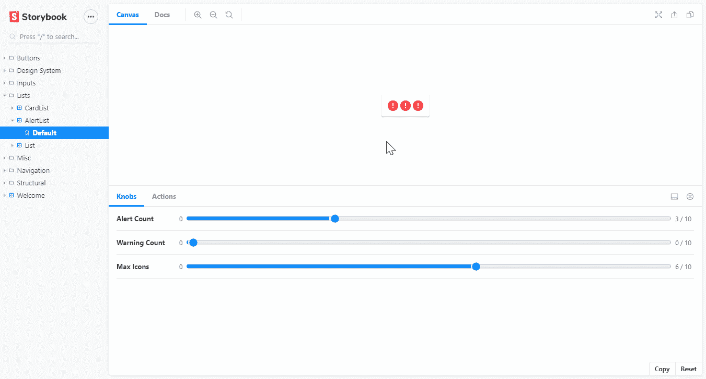

Here, we are dynamically controlling the number of icons in a list. Try to spot the bug in the logic of the Show More icon.

对于具有多个通用配置的组件，我们为每个设置创建了故事。例如，下面的故事演示了一个下拉列表，显示了组件支持的多种状态和选项。

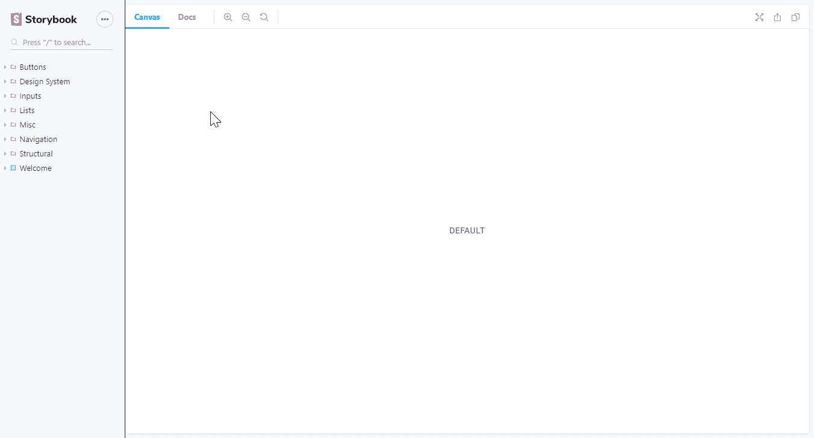

Having multiple stories for each component saves you needing to go searching through your application for each use-case your component supports when making changes.

故事书有许多有用的[附加组件](https://storybook.js.org/addons/)，进一步帮助发现每个组件的功能。其中最有用的是[旋钮](https://github.com/storybookjs/storybook/tree/master/addons/knobs)插件，它让用户可以在 Storybook 的界面中改变每个组件的输入属性。您可以切换并检查组件输入的每一种可能的排列，而无需更改代码或配置。

*   [actions](https://github.com/storybookjs/storybook/tree/master/addons/actions) —让您查看响应用户交互的每个组件发出的事件和输出。
*   [背景](https://github.com/storybookjs/storybook/tree/master/addons/backgrounds) —允许您更改 Storybook 每个组件的背景颜色。
*   [viewport](https://github.com/storybookjs/storybook/tree/master/addons/viewport) —允许您查看每个组件在不同设备或屏幕尺寸下的外观。

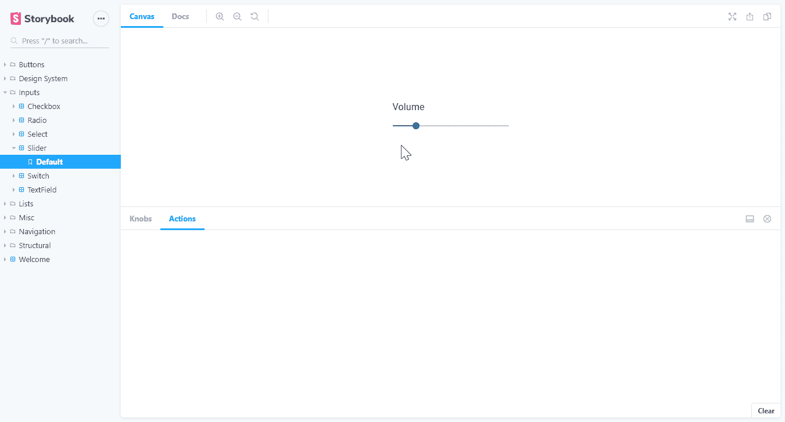

The ‘actions’ add-on lets us see the events fired as inputs respond to user input.

我们最大的时间浪费之一是，当组件已经存在时，我们还在不断地创建新的 UI 组件。有一次，我们发现我们的应用程序中有七个不同的日期选择器。这种重复不仅意味着我们在浪费时间创建已经存在的东西，而且使得我们的应用程序的持续维护更加困难。一个简单的 UI 更改可能最终需要更改数百个文件，因为我们必须更新所有的变化。重复的组件导致了不一致的用户界面，也意味着应用程序的任何重新设计都几乎是不可能的。对组件的每次更新都有丢失其中一个副本的风险。当我们确实想要重用一个组件时，拥有多个副本使得我们很难知道使用哪个版本，导致每当有人使用旧版本实现一个变更时就要返工。

我们最终创建重复组件的原因有很多:

*   我们不知道是否会第二次使用一个组件，所以我们将该组件绑定到第一个用例。
*   开发人员没有意识到组件已经存在，所以创建了一个新的组件。
*   UI/UX 没有意识到一个组件已经存在，所以设计了一个不同外观的组件。
*   一个组件似乎太简单了，所以它是在页面上内联创建的。

提高已有资料的可发现性有助于我们解决重复的问题。从 UI/UX 到开发人员，每个人都可以确定我们的应用程序中当前存在哪些组件，以及哪些组件可以重用。他们可以检查现有组件是否符合他们的需求。通过在 Storybook 中而不是在一个特性中开发新的组件，我们减少了用例特定功能泄漏的可能性。Storybook 清楚地表明，每当有人重新创建一个现有的控件，这意味着我们可以更快地指出它。

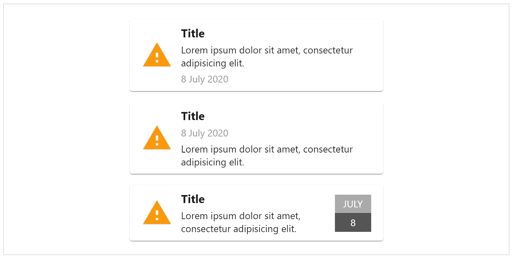

In the space of just three months, we were given three different notification card layouts.

通过提高可发现性和作为真理的单一来源，故事书帮助了摩擦的另一个原因——每个人对我们的每个组成部分都有不同的名称。在讨论中，我们经常不得不描述 UI 组件，而不是使用它们的名称，因为我们没有共同的语言。在不知道名称的情况下，在我们的代码库中找到对象是一件很有挑战性的事情，我们经常不得不求助于连接一个调试器来定位声明的地方。

Everyone had a different name for this component: FAB. Floating plus button. Action menu icon. Context menu icon. “The blue button in the corner of the screen.”

我们已经构建了我们的项目，这样我们就有了一个由所有团队和微前端共享的用户界面组件库。考虑到这个库中的一长串组件，可能很难判断我们要找的组件是否存在，看起来像什么，如何工作，或者如何连接。我们需要检查其他团队的项目，以检查该组件是否适合我们的用例，以及如何使用它。故事书让这个共享库对每个人都可见，使得使用其他团队的组件变得更容易。使用示例、文档和示例设置减少了我们在其他团队的代码库中寻找额外细节的需要。有一个单独构建组件的地方减少了团队意外地将组件绑定到前端的频率，例如，通过意外地将关键样式或行为添加到父元素。

所有的变化都已经设置好了，我们在以后修改组件时节省了时间和风险。我们不太可能错过关键用例的存在，直观地检查一个改变没有破坏任何用例变得很简单。以前，我们需要记住我们的应用程序在哪里使用组件的每个变体，以及如何配置应用程序以达到每个状态。

# **改进工作流程**

故事书为开发人员在将组件放入应用程序之前提供了一个开始构建组件的地方。对于每个组件，我们创建一个或多个包含组件可能配置的故事。故事书然后在其用户界面中容纳所有这些故事。通过热模块重新加载，我们可以快速看到我们的变化，而插件可以让我们在我们支持的所有配置和用例之间快速切换。我们可以花更少的时间在我们的管理工具和数据库中设置特定的配置，并花更少的时间硬编码不同的配置。在我们的应用程序之外进行开发，可以让我们打破进行更改、编译应用程序、登录、导航、等待数据加载，然后验证更改的循环。

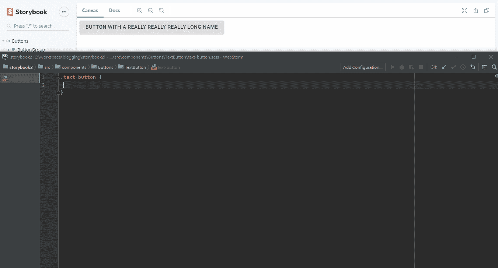

Hot-reloading allows us to write code in our IDE and see it updated in Storybook a few seconds later.

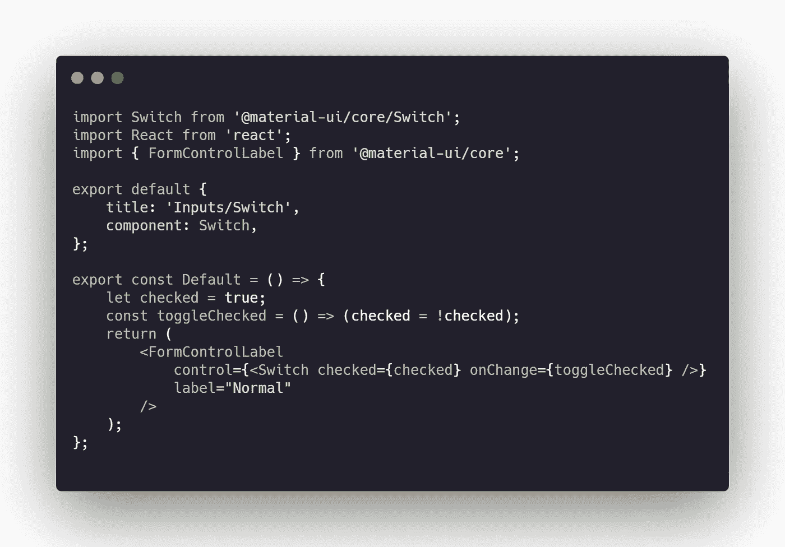

Each story requires minimal code. A little bit of boilerplate and an example. Since Storybook’s configuration is contained within these files, there is no framework lock-in. Removing Storybook is as simple as running “npm uninstall storybook” and deleting your story files.

简化组件开发的额外控制也有助于 QA 测试该组件。不仅可以更快地测试一个组件，而且控制输入的能力使他们能够到达难以到达的地方。这种访问特别有用，因为他们没有开发人员那样的硬编码能力。当他们发现一个有问题的配置时，故事书的“旋钮”插件提供了一种创建指向错误配置的可共享链接的方法。

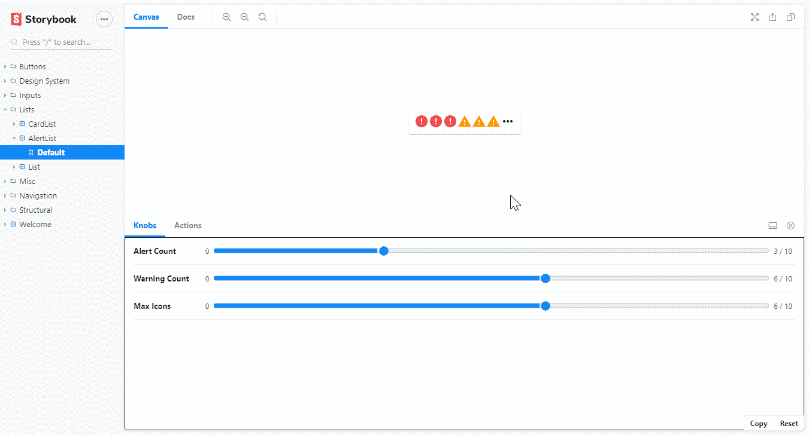

Once we have identified a problem scenario, we can generate a link to easily share the problem scenariowith others.

拥有一个工具来鼓励独立地构建组件，让我们更容易考虑每个组件的契约和边界。意识的增强阻止了我们将特定于用例的功能绑定到每个组件上，使得将来重用每个组件变得更加容易。我们对每个组件的额外控制使得捕捉瞬态和难以达到或复制的状态变得更加容易，减少了每个组件在边缘情况下的错误数量。

通过在没有应用程序其余部分的情况下构建 UI 组件，我们有了另一个集成点，为我们将一个功能分解为多个任务提供了更多的选择。例如，对于一个需要两个新 UI 组件的新特性，我们可以让一个开发人员在后端工作，两个开发人员使用 Storybook 创建每个 UI 组件，另一个开发人员将所有东西连接在一起。这种方法不是让多个特性并行运行，试图避免阻塞和独立性，而是让我们的整个团队聚集在一个特性上。并行运行更少的工作减少了我们需要的上下文切换，减少了我们的周期时间，并且减少了在每个迭代结束时交给 QA 的已完成工作的峰值。此外，在整个功能完成之前，我们使用 Storybook 向 QA 和 UI/UX 提供完整的组件进行验证，让我们更快地获得重要的反馈。

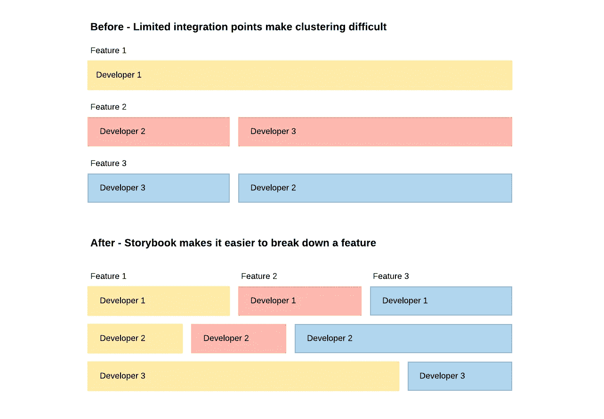

Storybook gave us more options for how to break down our features into smaller pieces that could be worked on simultaneously.

# **辅助通信**

早期，Storybook 最重要的好处之一是提供了一个工具，帮助开发人员将可重用组件的思想传达给项目中的每个人。在过去的六个月里，我们一直在从 Windows UWP 过渡到 React。使用 React 及其基于组件的架构鼓励我们开始思考如何将每个特性或页面分成可重用的部分。然而，我们意识到只有开发人员改变了思维方式；其他角色都没有注意到。我们仍然收到相同的旧页面——以及面向功能的设计和规范。在将我们的方法转移到基于组件的架构时，如果没有其他角色的参与，我们的收获是有限的。有了故事书，我们可以用一种切实的方式向其他人解释我们的新方法。项目中的其他角色可以在组件库中导航，并使用附加组件来了解每个组件的全貌。Storybook 帮助他们理解跨多个用例重用单个组件意味着什么，以及这可以为我们提供的价值。

帮助每个人转向考虑可重用的 UI 组件有助于开发人员创建那些组件。设计和规范包含了我们需要的更多细节，交流和发现对现有组件的有意更改变得更加容易。对于一个遗留应用程序来说，多年来已经积累了许多不同的设计，Storybook 为新的工作提供了一个真实的来源。UI/UX 可以检查我们的组件库中有哪些可用的组件，而不是浏览应用程序并猜测组件的哪个版本是正确的，或者只是决定创建一个新版本。

为了创建一个基于 wiki 的文档的替代品，Storybook 最近发布了“docs”插件(添加链接)。文档是 Markdown 文档、参数信息、实例、用法信息和代码片段的组合。带有实例的文档使得在进行更改时，验证我们是否支持所有现有行为变得很容易。我们可以对代码进行修改，并立即看到文档中的例子更新。因为我们可以在文档中开发我们的组件，所以文档更容易维护。以前，我们依赖于两个文档来源:一个 wiki，其中的信息要么丢失要么过时，或者找到一个开发人员来检查源代码。到目前为止，我们发现使用 Storybook 创建的文档更容易访问、创建和更新。

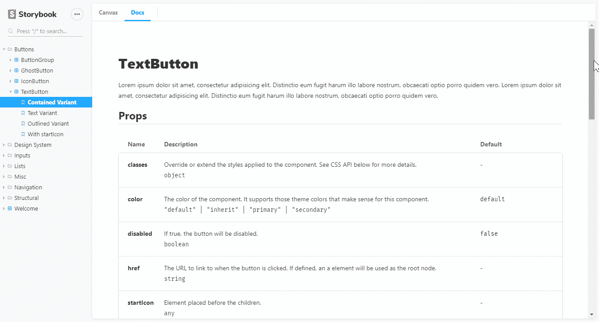

Doc-pages include the documentation on the object itself alongside additional documentation written in markdown and live working examples. We can use hot-reload to make changes and see the documentation update automatically.

“docs”附加组件也开始整合设计系统功能。例如，我们现在可以使用 Storybook 来列出应用程序的颜色、字体和图标。拥有这些现成的工具减少了我们需要切换的工具数量，并且有助于与 UI/UX 团队的交流。UI/UX 可以知道开发者已经获得了什么图标，或者他们是否需要给他们新的图标。两个团队都可以开始使用一种通用语言来设计系统元素。例如，两者可以对每种颜色使用相同的术语，而不是在模型中传递十六进制代码。

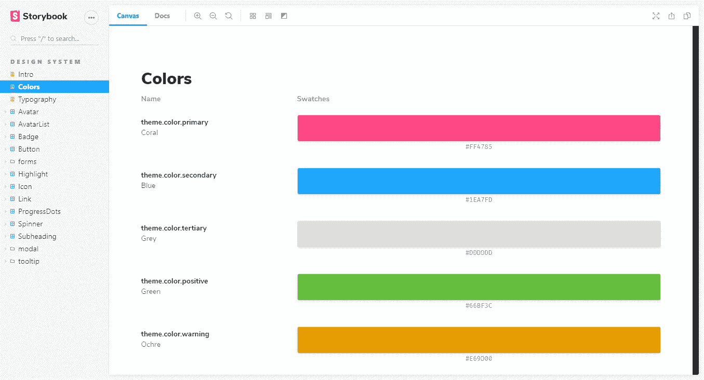

The colors doc page not only shows us the available colors for our application but also their variable names and hex codes.

Storybook 成为我们项目中跨角色和团队使用的少数工具之一。在讨论中，每个人都可以把它作为关于存在什么，如何使用它，以及如何称呼它的真理的单一来源。在设计和规划期间，它帮助我们区分什么是已经可用的，什么是需要的。Storybook 的影响比仅仅添加一个组件库要大得多，它给我们的工作和交流方式带来了广泛的改进。

## 资源

*   这篇文章中媒体使用的大部分资源来自于 [Storybook 自己的故事书](https://storybook.js.org/docs/basics/live-examples/)
*   其余的来自神奇的 [Material-UI](https://material-ui.com/) 组件库。