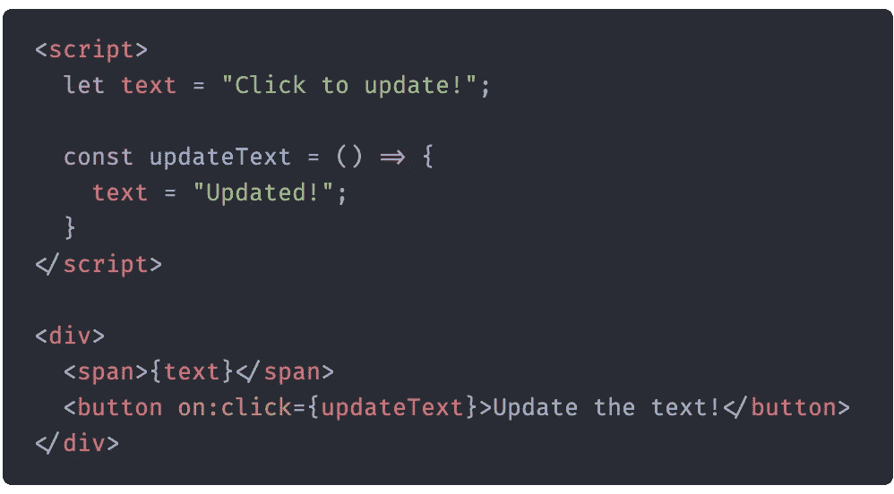
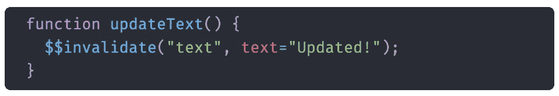
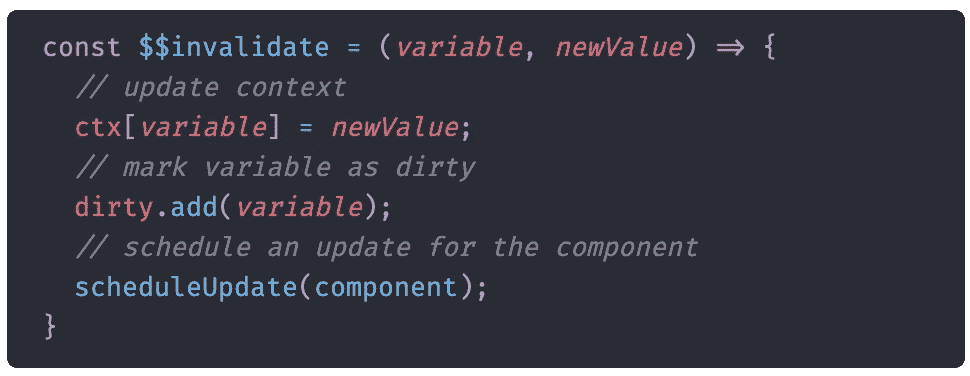

# 斯维尔特的国家体系是如何运作的

> 原文：<https://javascript.plainenglish.io/how-sveltes-state-system-works-713e7c60f47e?source=collection_archive---------4----------------------->

前端框架为开发人员提供了一种更简单的方式来编写具有复杂状态的应用程序。每个框架都为管理状态以及如何更新 DOM 提供了自己的解决方案。例如，在 React 中，当您想用一个`this.useState`调用或一个钩子来更新状态时，您必须显式声明。

An example React component which updates state with a hook

通常很容易理解一个框架如何在幕后运行。Vue、React 和 Angular 都要求你创建一个框架可以控制的类或函数。您必须将它们的状态变量声明为类的属性或钩子。您还可以将函数绑定为组件的属性。

## 脱颖而出的框架

Svelte 一直在慢慢成长，并在其他前端框架中拥有一个小而忠诚的粉丝群。Svelte 也可能有最独特的方法来编写前端网站。从表面上看，它似乎非常类似于 Vue，然而在幕后，它是完全不同的。

The same React component but written in Svelte

Svelte 将前端开发的所有方面合并到一个文件中。代码放在一个`script`标签中，样式放在一个`style`标签中。其余的代码被假定为 HTML，并成为组件使用的模板。当构建一个苗条的应用程序时，编译器会自动为你构建普通的 JavaScript 组件。这一点的力量在于纤细的束小得令人难以置信。事实上，在您的最终包中只有很少的代码(只有大约 500 行样板代码)。当看到上面的 Svelte 代码时，人们一定会想:“Svelte 如何知道在第`text="Updated!"`行重新呈现组件？”Svelte 声称要建立“控制论增强的网络应用程序”，所以，我看了看 Svelte 的源代码以及我编译的包，看看这些控制论增强到底是什么。

## Svelte 是一个编译器

我认为这个概念也许是在和苗条的人一起工作时需要理解的最重要的想法。虽然从纯粹的定义来看，框架是苗条的仍然属于这一类；它不是 React 或 Angular 那样的框架。正如我前面提到的，为了让你的应用程序运行，在构建的包中只需要很少的代码。相反，苗条的编译器将你的`.svelte`文件翻译成 JavaScript 组件。下面是 Svelte 在构建包时生成的一些代码的例子。下面的代码将生成我之前提供的 Svelte 文件的 DOM 内容。

The code which Svelte generated to build the DOM content of the component above

因此，虽然细长的代码确实存在于您的包中，但它包含在您的实际组件中，而不是作为样板或多余的绒毛。粗略估计，同样的用纤体写的待办事项清单应用程序，其捆绑包大小只有同等 React 应用程序的 13%。此外，由于这些组件不依赖于太多的外部代码，首次交互的时间比 React 或 Angular 要快得多。

## 苗条是如何工作的

让我们看看 Svelte 如何编译你的代码，并生成帮助器方法，让你的应用程序实际工作。具体来说，我们将关注为管理状态和更新 DOM 而创建的助手方法。如果我们看看我之前展示的例子的构建文件，我们可以看到 Svelte 是如何编译`updateText`方法的。

The compiled updateText method

实际的方法签名没有改变，但是包含关系操作符的代码行改变了。实际上，它被移到了这个`$$invalidate`方法的第二个参数中。所以这个函数必须以某种方式更新苗条组件的状态。我们可以从它的签名中看到，它采用了我们正在更新的变量的名称以及更新后的变量。

所以这很酷。我们可以直接看到 Svelte 的编译器是如何工作的。它实际上是在重写我们的代码，让我们能够自动重写 DOM！这种情况会发生在很多不同的地方，不仅仅是国家。

对我们来说幸运的是，`$$invalidate`方法也在我们的捆绑中。所以让我们来看看这个函数实际上是做什么的。

The $$invalidate method

它实际上很小，非常容易理解。注释应该清楚地说明不同行的作用(为了清楚起见，我添加了它们)，但是我会更详细地解释它。首先，该函数用我们正在改变的变量的新值更新`ctx`对象。`ctx`仅仅是组件状态的不同部分的存储。然后，它将该变量添加到一个名为`dirty`的东西中。那个变量只是一个集合，它包含了已经被更新的变量。Svelte 这样做是为了它只需要更新 DOM 中实际上受新状态影响的部分，而不是重写整个内容。最后，它让应用程序知道这个特定的组件需要重新呈现。在 DOM 更新后，还有一个函数被调用，它清空脏集。

这就是 Svelte 如何在幕后管理其状态的要点。它没有像 React 挂钩那样要求用户显式声明状态何时更新，而是选择保持简单的 JavaScript 语法。虽然这确实使代码更容易编写，但有些操作符不会被 Svelte 注册，这可能相当令人沮丧。此外，如果我在看一个带有局部变量的函数，可能会弄不清楚哪个操作符实际上会更新组件的状态。这时像`setState`或钩子这样的东西会使代码更加清晰。

Svelte 的编译器非常有趣。它通过直接使用普通的 JavaScript HTML 元素消除了对虚拟 DOM 的需求。它还注入辅助方法并操纵您的代码，为其提供现代 web 应用程序所需的额外功能。

除了我们在这里看到的之外，还有很多其他的东西。如果你对 Svelte 感兴趣，我强烈建议你多读一些，因为它能让你更好地理解框架在幕后是如何工作的。

## 简单英语的 JavaScript

喜欢这篇文章吗？如果有，通过 [**订阅获取更多类似内容解码，我们的 YouTube 频道**](https://www.youtube.com/channel/UCtipWUghju290NWcn8jhyAw) **！**