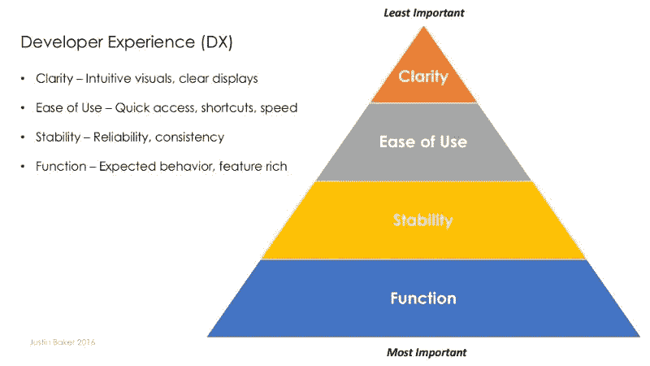
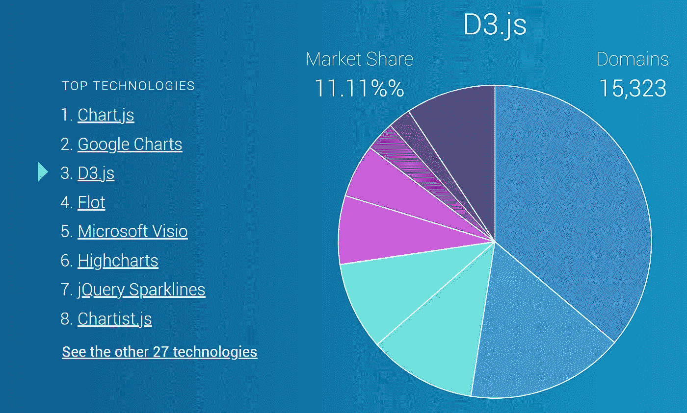
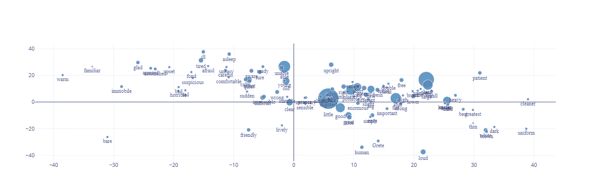

# D3.js 的开发者体验可以改善吗

> 原文：<https://javascript.plainenglish.io/how-the-developer-experience-for-d3-js-could-be-improved-31b372ab3119?source=collection_archive---------11----------------------->

## D3.js 的替代品:我讲述的故事


Photo by [Chris Sabor](https://unsplash.com/@chrissabor?utm_source=medium&utm_medium=referral) on [Unsplash](https://unsplash.com?utm_source=medium&utm_medium=referral)

D3.js 是一个强大的可视化工具，但它有一个陡峭的学习曲线，即使你知道它，也需要努力使用它。在 D3.js 上投入时间值得吗？作为一名设计师和程序员，我使用了各种不同的语言和可视化库；我想分享我在 D3.js 工作的故事，如果我的经历能为你节省时间或减少挫折，我会很高兴。

# 设计原理

## D3.js 的崛起

D3.js 的第一次正式发布是在 2011 年，由迈克·博斯托克和杰夫·赫尔发布，他们之前都在斯坦福可视化集团工作。D3.js 是第一个基于 web 标准的库，这为 web 上的数据可视化创造了巨大的机会。

接受 web 标准使得 D3.js 被学术界、研究人员和可视化社区广泛采用。在撰写本文时，它在 Github 上获得了 94.7k 颗星。第二名是 51.2k 星的 Chart.js。D3.js 正被广泛使用，并为一些最有影响力的网站提供支持，包括《纽约时报》、《国家地理》和约翰·霍普斯金大学的[新冠肺炎追踪器](https://coronavirus.jhu.edu/map.html)。

## D3.js 的精髓

D3 代表数据驱动文档，其中文档是 web 上使用的 DOM(文档对象模型)。据官方消息:*“D3 . js 是一个基于数据操作文档的 JavaScript 库。D3 帮助您使用 HTML、SVG 和 CSS 将数据变得生动。D3 对 web 标准的重视使您可以获得现代浏览器的全部功能，而无需将自己束缚于专有框架，将强大的可视化组件和数据驱动的 DOM 操作方法结合起来。”*

从 D3.js 的角度来看，没有必要发明新的概念，因为 web 标准已经定义了它。D3.js 成为交织这些标准的使能器。通过公开对 web 元素和图形库的完全访问，D3.js 能够创建令人惊叹的图形和动画；但是出于完全相同的原因，对于没有大量 web 开发知识的人来说，D3.js 变得很难学。

# D3.js 难在哪里？

如果你觉得 D3.js 很难，我保证你不是一个人。下面我们一起来分析一下原因。

## 1) D3.js 不是瑞士军刀

大多数人来 D3.js 是为了数据可视化项目，没有意识到 D3.js 实际上是一个通用库。D3.js 是围绕数据绑定和转换的中心思想设计的，它没有在任何特定的领域对此进行定义。换句话说，D3.js 没有为图表等常见的可视化任务提供现成的武器库。

不服气？让我们看看为了在 D3.js 中生成一个条形图我们需要做什么。下面的代码是[一个官方的例子](https://observablehq.com/@d3/bar-chart)。只需快速浏览一下，就能感受到使用 D3.js 需要做些什么。您可以随时跳过。

我们听说 D3.js 很难学，但是创建一个普通的条形图应该不会**这个**难。

## 2)不直观

数据可视化定义为数据的图形表示，包括一些易于理解的形式，如饼图或树形图。D3.js 几乎支持我们能想到的任何东西，但是它的语法不直观。

让我们再看看上面的例子。D3.js 使用 SVG 作为底层图形库，非常棒。但是在代码的第 4 行，`svg.append(“g”)`，那是什么？直觉上没有意义；如果你了解 SVG，你会发现这是 SVG 的组元素。

D3.js 公开了 HTML、CSS、SVG 的所有细节，一切的方方面面都由程序员来打理。在 D3.js 中画条形图，字面意思是根据数据画出各个高度的矩形。D3.js 不提供数据可视化特别需要的抽象。

## 3)没有有意义的默认设置

有时我们希望事情快，就像在任何一家麦当劳点一份 1 就能得到一个巨无霸一样简单；描述一个三明治的所有成分可能需要 10 分钟。

D3.js 要求用户定义很多东西。例如，在条形图示例中，xAxis 和 yAxis 需要用户设置，这应该是自动生成的。把一切都留给用户是不方便的，最终会伤害 D3.js 的人气，我相信这已经在发生了。

为典型场景定义好的模板可以大大节省时间，但是 D3.js 要求开发者定义所有细节。D3.js 似乎更关心赋予用户所有的可能性，但不太关心易用性。

## 4)未针对“流动状态”进行优化

我们肯定都经历过工作时的心流状态，或者玩电子游戏时的心流状态，这是一切都运转良好的时候，我们变得如此高效，以至于我们甚至没有注意到时间的流逝。

那家游戏公司的创始人 Jenova Chen 对如何达到和保持心流状态做了大量的研究。他在一款名为 *flow* 的游戏中展示了他的理论，展示了如何让用户保持心流状态。你可以在这里找到他的论文。他的理论为他的公司开发的所有游戏的成功做出了巨大贡献，例如获奖的*花*和*旅程*。

flow, game by That Game Company | designed by Jenova Chen

然而，对于 D3.js，经常需要在不同的领域之间转换我们的思维:因为我们需要将数据绑定到具有适当布局的 DOM 组件中，调整 SVG 以绘制图表，并在 CSS 中设置它们的样式，这一切都是一次性的；我们需要不断重复这样的过程。

这与陈停留在流态的理论正好相反。这种不断的转换妨碍了我们的效率；当我们的大脑被迫同时跟踪许多事情时，我们就不能达到更高的注意力水平。

# 开发者体验(DX)

也许程序员是硬汉。作为一名程序员，我们可以忍受当事情经过一个小时的一步一步的指示后没有效果，而我们还没有放弃；我们在没有文档的情况下工作，我们甚至阅读用我们没有学过的编程语言编写的源代码。但事实是程序员也仍然是有感情的人。

软件行业努力满足最终用户，用户体验(UX)已经成为许多开发团队关注的焦点；与此形成鲜明对比的是，开发人员的经验很少被提及，而且这个项目甚至在今天的维基百科中也不存在。

贾斯汀·贝克在媒体上有很好的文字介绍开发者经验。他说**开发者体验(DX)**“*是提供稳定、快速、直观的强大功能*”。



Developer Experience (DX) | [Justin Baker](https://medium.com/hackernoon/developer-experience-dx-devs-are-people-too-6590d6577afe)

软件开发的历史并不长，但是有很多案例清楚地表明开发人员的经验是非常重要的。事实上，开源项目吸引开发者是至关重要的；一个缺乏开发经验的项目将失去吸引力并失败。

## 编程语言中的 DX

大多数人可以通过使用编程语言来体验开发者的体验。编程语言的兴衰与开发人员的经验有很大关系。

Programming Language Popularity in Animation

例如，我们都知道 C++功能强大，但也非常严格和苛刻。通过推广面向对象编程，C++蓬勃发展，但是编写 C++代码从来不是一种休闲爱好。C++给程序员带来了计算机内存分配和释放的棘手任务，这是 C++软件产品中最主要的错误来源。

有很多技术上的原因让 Python 超越 C++并登上流行排行榜的首位，但我认为简单的事实是它让开发人员的生活变得更容易。

1999 年，吉多·范·罗苏姆向美国国防高级研究计划局提交了一份名为“每个人的计算机编程”的资助提案，其中他进一步定义了他对 Python 的**目标:**

1.  一种简单直观的语言，和主要竞争对手一样强大
2.  开源，所以任何人都可以为它的发展做出贡献
3.  像普通英语一样容易理解的代码
4.  适合日常任务，开发时间短——维基百科

现在很多学校都在教 Python 入门编程，取代 C++。Python 现在非常适合我，因为我可以利用碎片化的时隙来编程，这在 C++中是不可能的。在编程 Python 的时候，我可以专注于正在解决的实际问题，而不是编程语言本身。

## D3 或不是 D3

在很多方面，D3.js 的情况与 C++类似。编程 D3.js 是一项要求很高的任务，感觉就像在交通高峰期开车穿过洛杉矶市区；我们当然可以做这件事，但不是非常乐意。

一天晚上，在美丽的圣塔莫尼卡海滩，看着夕阳西下，我问自己一个深刻的问题:我为什么要编程？


Photo by [Diego Fraustro](https://unsplash.com/@pyr_photo?utm_source=medium&utm_medium=referral) on [Unsplash](https://unsplash.com?utm_source=medium&utm_medium=referral)

简单的回答就是我还是爱！但是，我需要比 D3.js 更好的体验。

我离开 D3.js 的原因不完全是技术上的，更多的是哲学上的。使用 D3.js 并不能让我开心。是时候超越 D3.js 了。

# D3.js 的替代方案

## 1) Chart.js

说到市场份额，Chart.js 和 Google Charts 现在都领先 D3.js。可以说，这两者都不能做到 D3.js 能够做到的所有事情；但是对于常见的可视化任务，两者都足够了。



Market Share of Data Visualization Libraries by [Datanyze.com](https://www.datanyze.com/market-share/charting--446) (Screenshot)

Chart.js 基于 HTML5 标准，它偏向 canvas 而不是 SVG。顾名思义，它是为制图而设计的。我们只需要描述图表的样子，Chart.js 就会为您生成图表。

如果这就是我们所需要的，我们可以开始使用 Chart.js，这很容易。

顺便说一句，如果可能的话，我希望远离带有公司名称的产品，是的，我说的是谷歌图表或微软 Visio 我只是不准备在私人公司提供的生态系统中购买。

## 2)阴谋地

Plotly 是一个产品系列，由一家加拿大公司开发，也叫 Plotly。这里说一下 Plotly.js，它可以是真正的 D3.js 的替代品。Plotly 还支持 Python 中的服务器端编程。对于任何 Python 程序员来说，一定要看看 [Plotly DASH](https://dash.plotly.com/) 。

我要说 Plotly.js 可以轻松学会。

从概念上讲，它的结构很好，我可以很容易地找到东西。我将向您展示如何创建气泡图。

```
let chart = {
    x: xs,
    y: ys,
    mode: 'markers+text',
    type: 'scatter',
    text: labels,
    textfont: {
        family: 'Times New Roman',
        color: '#333399'
    },
    textposition: 'bottom center',
    marker: {size: counts}
}Plotly.newPlot(WordMap, [chart])
```

它直截了当，不言自明。用`mode: ‘markers+text’`在图表上绘制文字；`marker` 可以进一步风格化，通过传入一个数组来定义大小；该图表是交互式的，显示鼠标悬停事件的详细信息。



Top 100 Adjectives in Metamorphosis by Kafka (Screenshot of the interactive chart) | Rebecca Xu & Sean Zhai

最近，我和雪城大学的丽贝卡·徐一起分析历史上一些最有影响力的作品中使用的词汇。上面的图表是在不到一天的时间里用 Plotly 创建的。大部分时间都花在了使用 spaCy 和 Python 准备数据上。提取的信息用 JSON 编写，然后由 Plotly.js 读入进行渲染。我希望媒体能尽快对嵌入代码有更好的支持，这样我就可以展示交互式图表。

# 结论

## 我的建议

这个故事的原标题是*D3 . js 为什么难*，最后一刻改成了*D3 . js 的开发者体验能否提升*。对于 D3.js 开发者来说，我并不打算以一个悲伤的音符结束。拯救在于以下事实:

Plotly.js 是在 D3.js 之上开发的。

Plotly.js 基于 D3.js 做了大量的工作，它提供了更好的开发者体验。如果您真的愿意，Plotly.js 允许您访问底层的 D3.js 功能。我希望你喜欢它。

对于一个小团队，特别是一个人的团队或有艺术和设计背景的人，我强烈推荐 Plotly，它的效率要高得多。

## 充分利用 D3.js

事实是，许多成功的项目都是由 D3.js 驱动的。但是，当我们仔细观察时，我们可以看到这些项目通常是由更大的团队完成的。使用 D3.js 的最佳方式是构建一个对象层来反映业务逻辑。在从事更大的项目时，我们需要专门设计来有效地解决问题。

D3.js 在更大的团队和项目中找到了它的完美用途，尤其是当一个抽象层建立在 D3.js 之上的时候。

干杯！