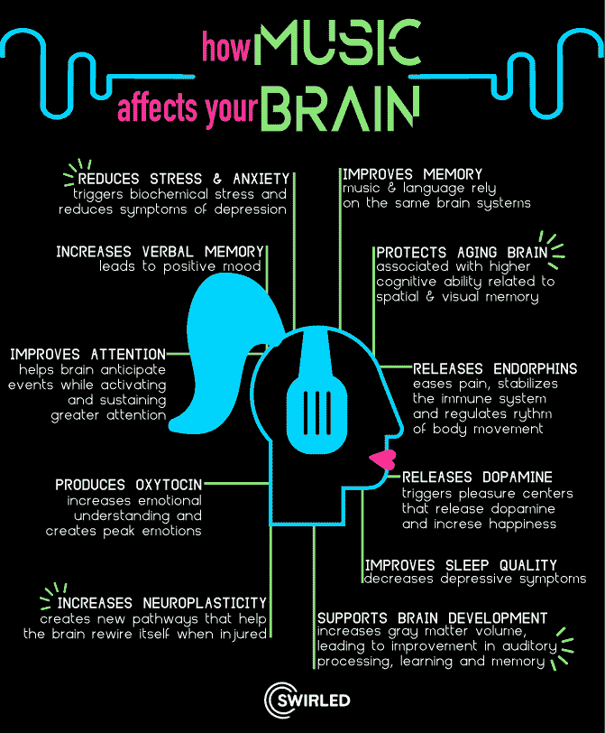

# 正确的音乐如何提高你的编码效率

> 原文：<https://javascript.plainenglish.io/how-the-right-music-can-boost-your-coding-productivity-2a651b1e8690?source=collection_archive---------11----------------------->

## 构建您个人的、基于科学的音乐收藏，将您的生产力提高 30%

Photo by [Tanner Boriack](https://unsplash.com/@tannerboriack?utm_source=medium&utm_medium=referral) on [Unsplash](https://unsplash.com?utm_source=medium&utm_medium=referral)

你知道音乐帮助赢得了二战吗？

我指的是英国政府一个名为“工作时听音乐”的项目的神奇效果。成立于 1940 年，其理念是每天两次在工厂播放欢快的音乐，以提高工人的整体士气，提高他们的生产力，为军队提供所需的军火。

这个节目很受欢迎。全国各地的经理都在引用[他们的工厂已经变得多有生产力。甚至高达 15%以上。直到今天，人们相信演奏音乐的小小努力对国家赢得战争有着有益的影响。](https://downloads.bbc.co.uk/historyofthebbc/ww2/R27-257-2%20-%20Music%20While%20You%20Work%20-%20First%20Report%20-%2005-05-1941%20-%2030-11-1941.pdf)

## 工作文化中的音乐

音乐总是与历史上工作的人有关。例如，想象一下水手在航行时在船上吟唱。

**但是音乐能对当今的开发者产生特殊的生产力影响吗？它能为你工作并提高你的成绩吗？**

答案是肯定的。让我们通过观察音乐可以改善你的结果的两种科学方法来理解为什么。然后，我会提供一套具体的音乐集，你可以听来达到这些效果。

## 音乐让你更聪明

这个因素与被发现的[“莫扎特效应](https://en.wikipedia.org/wiki/Mozart_effect)**有关。一篇科学论文声称，听了莫扎特的音乐后，人们在某些被称为空间任务的操作中表现得更好。**

**其他的研究是在听作者讲话的人身上进行的。例如，已经证实听[莫扎特的 K.448 可以减少癫痫儿童的癫痫样放电](http://K.448 decreases epileptiform discharges in children with epilepsy)。同样的成分被证明是一种伟大的脑电波的[刺激器，而脑电波](https://en.wikipedia.org/wiki/Neural_oscillation#:~:text=Neural%20oscillations%2C%20or%20brainwaves%2C%20are,or%20by%20interactions%20between%20neurons.)与记忆、认知和解决问题有关。**

**显然，某些类型的音乐真的可以刺激你的大脑，让你变得更聪明，这种现象是所谓的阿尔法波视频诞生的基础。播放特定类型的音乐来刺激你大脑中的脑电波。**

## **音乐改善你的心情**

**音乐可以被认为是大脑的一针咖啡因。当你听一首你喜欢的歌曲时，你的大脑会释放多巴胺，这会让你感觉良好，减少你的压力和焦虑。**

**它不会直接提高你的工作效率，但它会改善你的情绪，从而提高你的工作水平。**

****

**Source of the image [here](https://www.pinterest.com/pin/30540103710702650/).**

## **你的个人音乐收藏**

**也就是说，你现在可能想知道什么类型的歌曲可以在你身上产生两种科学提到的效果之一。如上所述，我为你准备了一个音乐收藏。**

**该系列本身是遵循一系列与工作和音乐相关的科学原则而创作的。**

*   **你会发现音乐作品可以刺激脑电波，最适合编码和其他紧张的脑力工作。**
*   **你不会找到有歌词的音乐。正如[科学论文](https://pubmed.ncbi.nlm.nih.gov/22523045/)已经证明的那样，歌词会降低我们的注意力，分散我们对工作的注意力。**
*   **你会发现带有重复声音的平静、冷静的音乐。正如科学所证明的那样，熟悉音乐对刺激你大脑的正确区域非常重要。**

**以下是我给你的建议:**

## **莫扎特音乐有助于增强脑力**

**Link to video [here](https://youtu.be/tT9gT5bqi6Y)**

**Link to video [here](https://www.youtube.com/watch?v=7JmprpRIsEY&t=2112s)**

## **脑电波刺激音乐**

**Link to video [here](https://www.youtube.com/watch?v=WPni755-Krg&t=4760s)**

**Link to video [here](https://www.youtube.com/watch?v=HA6nSQawROM)**

## **放松音乐来提升你的情绪**

**Link to video [here](https://www.youtube.com/watch?v=5qap5aO4i9A)**

**Link to video [here](https://www.youtube.com/watch?v=lTRiuFIWV54)**

**Link to video [here](https://www.youtube.com/watch?v=Y-JQ-RCyPpQ)**

## **结论**

**音乐真的可以给你的工作带来巨大的动力。这一点已经被科学和历史本身所证明。一如既往地感谢您的阅读，并在下面留下您的评论。**

***—皮耶罗***