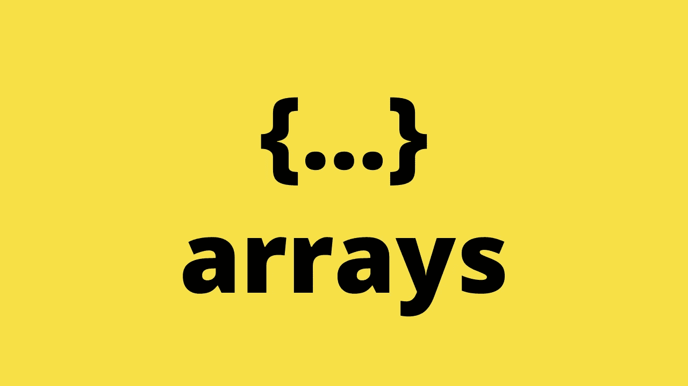

# JavaScript 中三个点如何操作数组

> 原文：<https://javascript.plainenglish.io/how-three-dots-manipulate-arrays-in-javascript-c664fea01bd8?source=collection_archive---------3----------------------->

## 让我们用更少的代码处理数组，同时保持可读性



spread 操作符是 ES6 的一大特色。它带来了一些简化代码库的好处。

在本文中，您将了解简单的三个点`(…)`如何比其他方法更好地操作数组。继续读。

# 1.克隆阵列

一开始就投身于 JavaScript 世界的初级开发人员可能会认为克隆数组非常简单。只需将给定数组的值赋给另一个变量，如下所示:

```
let names = [‘Amy’, ‘James’, ‘Joey’];
let clonedNames = names;
console.log(clonedNames); // [“Amy”, “James”, “Joey”]
```

大错特错。

因为 JavaScript 中的数组是引用类型，所以上面的例子是关于指向同一个内存地址的两个变量。如果你改变其中一个的值，另一个也会改变。

```
clonedNames[0] = ‘David’;
console.log(clonedNames); // [“David”, “James”, “Joey”]
console.log(names); // [“David”, “James”, “Joey”]
```

如您所见，我们改变了第一个元素`clonedNames`的值，原始数组中的第一个元素也随之改变。所以，这不是克隆。

让我们来解决它:

```
let names = [‘Amy’, ‘James’, ‘Joey’];
let clonedNames = [...names];
clonedNames[0] = ‘David’;
console.log(clonedNames); // [“David”, “James”, “Joey”]
console.log(names); // [“Amy”, “James”, “Joey”]
```

这一次，我们使用三个圆点`(…)`。现在，实际值被复制到“clonedNames”变量，而不再是内存地址。更改“clonedNames”的值不会影响原始数组值。

# 2.将节点列表转换为数组

当你需要处理 html DOM 时，这个非常有用。

```
let nodes = document.querySelectorAll(‘ul’);
console.log(nodes); // object NodeList
let array = [...nodes];
console.log(array); // [<ul elements>]
```

# 3.将字符串转换为数组

使用 spread 运算符将字符串转换为数组再简单不过了:

```
let name = ‘Joey’;
let nameArray = [...name];
console.log(nameArray);
```

没有额外的方法。没有复杂的算法。只是三个简单的点`(…)`

# 4.合并数组

我们有几种方法来合并数组。使用 spread 是最简单快捷的方法。

```
let languages1 = [‘JavaScript’, ‘Python’, ‘C#’];
let languages2 = [‘C++’, ‘Kotlin’, ‘PHP’, ‘Ruby’];
let mergedLanguages = [...languages1, ...languages2];
console.log(mergedLanguages); //[“JavaScript”, “Python”, “C#”, “C++”, “Kotlin”, “PHP”, “Ruby”]
```

或者你甚至可以在给定数组的任意索引处插入数组。

```
let languages1 = [‘JavaScript’, ‘Python’, ‘C#’];
let languages2 = [‘C++’, ‘Kotlin’, ...languages1, ‘PHP’, ‘Ruby’];
console.log(languages2); // [“C++”, “Kotlin”, “JavaScript”, “Python”, “C#”, “PHP”, “Ruby”]
```

# 5.将集合转换为数组

如果给你一个集合，你需要使用一个索引集合而不是一个键集合，你必须把这个集合转换成一个数组。Spread operator 可以帮助您轻松完成这项任务。

```
let set = new Set([2, 0, 3, 1]);
let array = [...set];
console.log(array); // [2, 0, 3, 1]
```

# 6.将地图转换为数组

```
let map = new Map().set(‘key1’, 1).set(‘key2’, 2).set(‘key3’, 3);
let array = [...map];
console.log(array); // [[“key1”, 1], [“key2”, 2], [“key3”, 3]]
```

或者只是映射键/值:

```
let keys = [...map.keys()];
console.log(keys); // [“key1”, “key2”, “key3”]let values = [...map.values()];
console.log(values); // [1, 2, 3]
```

# 7.将参数作为数组传递

JavaScript 的一些内置函数可以用任意数量的参数调用，比如`Math.min()`。你有一个数组，但是你不能直接把这个数组传递给函数，因为它单独接受参数，而不是整个数组。

```
let numbers = [2, 5, 1, 7, 4, 3];
let min = Math.min(numbers);
console.log(min); // NaN
```

正如你在上面的例子中看到的，它不起作用。幸运的是，spread 运算符可以解决这个问题。

```
let numbers = [2, 5, 1, 7, 4, 3];
let min = Math.min(...numbers);
console.log(min); // 1
```

# 结论

在 JavaScript 中有很多方法可以解决数组问题。以合并数组为例，我们可以使用`.concat()`、`.push()`或`[.apply()](https://medium.com/javascript-in-plain-english/how-to-control-this-better-in-javascript-dcacd54bcf97)`、[函数](https://medium.com/javascript-in-plain-english/how-to-control-this-better-in-javascript-dcacd54bcf97)。但是最干净的方法是使用 spread 运算符。不是很多东西，而是三个简单的点`(…)`

希望你能把上面的用法应用到你的项目中。

# 进一步阅读

[](https://medium.com/javascript-in-plain-english/9-tips-for-writing-scalable-javascript-code-e6bcfc791882) [## 编写可伸缩 JavaScript 代码的 9 个技巧

### 您应该从一开始就准备好扩展您的项目

medium.com](https://medium.com/javascript-in-plain-english/9-tips-for-writing-scalable-javascript-code-e6bcfc791882)