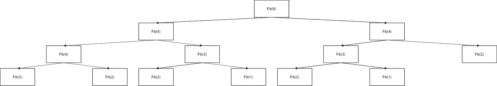
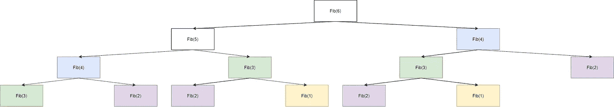

# 如何 ace 斐波那契数列面试题

> 原文：<https://javascript.plainenglish.io/how-to-ace-fibonacci-sequence-interview-question-93b5f15a27cc?source=collection_archive---------6----------------------->

## 如何优化 JavaScript 中斐波那契数列元素的计算

Fibonacci sequence in nature

> **TLDR:** 实现斐波那契数列在编程面试中是如此常见，值得掌握这个问题。了解这个序列递归实现的简单优化方法。

H 你曾经需要在面试中使用斐波那契数列计算程序吗？这么多人举手！让我们研究一下这个简单的问题。我们从**问题定义**开始好吗？

> 写一个函数，以正整数 N 为参数，返回斐波那契数列的第 N 个元素。使用斐波那契数列的递归定义。

斐波那契数列的数学定义是这样的:

> fib(n)= fib(n-1)+fib(n-2)
> fib(1)= fib(2)= 1

用英语描述这个:斐波那契数列的第 N 个元素可以通过将前一个元素和前一个元素之前的元素相加来计算。我们还知道两个 Fibonacci 数都等于 1。

这是一个非常简单的问题。我们需要将数学定义转化为代码实现。

首先，让我们通读问题定义并提取函数签名:

Function signature

让我们仔细看看提到的数学定义。它有两个组成部分:**递归定义**解释了如何计算特定元素。**终止条件**表示何时停止计算:

> fib(n) = fib(n-1) + fib(n-2) //递归定义
> fib(1) = fib (2) = 1 //终止条件

# 第一工作溶液

其次，让我们尝试实现**循环定义**:

Implementing recurrence definition

这是很好的代码，但不幸的是它不会终止。除非我们增加一些**终止条件**，否则这种情况会一直持续下去:

Implementing termination condition

我们获得了第一个工作解决方案。成功！

# 测试

此时，您应该考虑测试您的解决方案，以确信它是正确的。问问你自己:它对任何有效的输入都有效吗？有没有死角？什么输入可能有问题？

为了使文章简短，我们将省略这一步。

# 最佳化

通常在这一点上，我们应该考虑是否能以某种方式优化代码。斐波纳契数列的这个简单定义有一个缺陷，如果不一步一步地分析算法，这个缺陷可能不容易被发现。

让我们分析一下如何计算小 n 的值。假设它是 6。为了计算 fib(6)，我们需要计算 fib(5)和 fib(4)。好的，看起来不错。让我们继续…为了计算 fib(5 ),我们需要计算 fib(4)和 fib(3)。

稍等..我们需要计算 fib(4)两次！一个在计算 fib(6)时，一个在计算 fib(5)时。那是浪费时间。

如果我们进一步进行计算，似乎我们需要多次计算一些元素。让我们以图形的形式可视化每个元素的依赖元素:

Graph of elements to compute for N=6

我们清楚地看到一些节点是重复的。让我们给相同的元素上色:

Graph of elements to compute for N=6 (colorized)

让我们用表格总结一下我们的发现:

Table of repeated calculations

我们只检查了 N=6 的情况，但是对于更大的 N，所有这些多余的计算变得更加糟糕！

## 高速缓存简介

有人可能会问:有可能每个序列元素只计算一次吗？想到的是在计算完每个元素后保存它，然后在试图计算它之前总是检查所需的元素是否已知。

如何贯彻这一理念？让我们介绍一下简单的[缓存](https://en.wikipedia.org/wiki/Cache_(computing))。我们将引入一个表，在该表中我们将保存序列元素的值，如下所示:

Example of filled cache

显然，我们在开始时不知道任何值，所以我们从空数组开始:

最后，我们得到了优化的递归解。大获成功！

# 摘要

从这些例子中你可以学到一些一般性的东西。我们用系统的方法处理这个问题。我们也用了一些工具进行算法分析。

## 方法

我们使用非常通用的方法来解决编程问题，可以这样总结:
1 .思考问题定义:
a)它要求什么？
b)我理解使用的所有术语吗？
c)它有关于解决方案的任何信息吗？(例如函数签名)
2。关于小投入的理由。一步一步地为他们解决问题。
3。得出第一个工作解决方案，即使它远非最佳解决方案。
4。测试您的解决方案。(我们跳过了这一步)
a)正确吗？
b)哪些输入值可能有问题？
c)是否存在任何死角？
5。尝试优化您的解决方案？
a)是否存在冗余？你能想出更简单的公式吗？有些计算是不必要的吗？

## 工具

我们默默地使用了一些在分析任何算法时都有用的工具:
——用纸笔浏览简单的例子
——可视化算法工作。任何图表、图画、情节都可以。人类非常擅长寻找视觉模式，不太擅长算术。说实话，我们算术真的很差。
-在表格中总结算法的某些方面。与可视化工具一样，在表格中发现模式比在数字序列中容易得多。

尽管斐波纳契数列是一个非常简单的问题，但是你可以使用所描述的方法和工具来解决任何其他的编程问题。