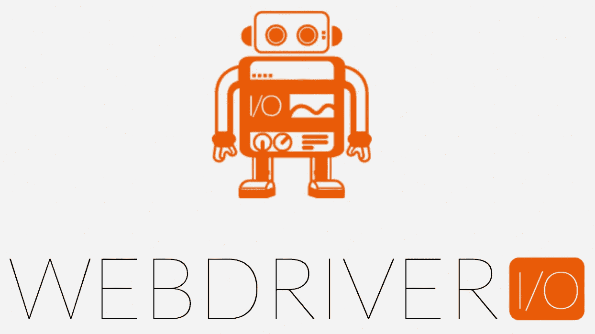

# 如何加速 JavaScript 测试

> 原文：<https://javascript.plainenglish.io/how-to-achieve-faster-javascript-automated-ui-tests-399b86e46122?source=collection_archive---------0----------------------->

## 了解如何使用 Selenium 和 WebdriverIO 加速测试



如果你对自动化测试感兴趣，你很可能有一个成长中的应用程序或者一个成长中的工程团队，并且需要一个可靠的方法来测试你的应用程序。

如果您已经有了一个自动化的测试解决方案，那么您就会知道缓慢且不稳定的测试的痛苦。刚刚开始开发自动化测试策略的开发人员会希望从一个坚实的基础开始，以避免以后的重构。不管你属于哪一类，我希望能为你提供一些关于如何让你的自动化 UI 测试尽可能快速流畅地运行的建议。

我们的应用程序提供了一系列功能，测试这些功能是最重要的。为了防止回归并让工程师们放心地合并代码，我们建立了构建管道来运行许多不同的测试套件，其中最重要的是我们的自动化 UI 测试。这些 UI 测试非常关键，因为它们测试用户实际上会如何与我们的应用程序交互。我们正在确保添加的新代码不会导致现有测试失败。

## 快速概述

我们团队用的软件是 Selenium Webdriver，NodeJS，和 WebdriverIO。


Selenium 是一种自动化浏览器的技术，允许我们创建基于浏览器的测试。

WebdriverIO 是一个测试框架，它使用 NodeJS 提供一个扩展的 API 来编写自动化测试。

这里有几个有用的提示，我们的前端团队已经实现了这些提示，使我们的自动化 UI 测试成为一个更有效的对抗回归的工具。

# 禁用屏幕截图

第一件事是检查你的 webdriverIO 配置文件。在我们的项目中，我们注意到在每一个“it”函数之后，webdriverIO 都会捕获一个截图。我们的测试输出文件夹包含大约 10-30 个截图，这取决于每个测试中有多少操作。

这在调试测试时非常有用，但问题是捕获屏幕截图会降低测试速度。我们发现，通过禁用截图，我们的测试运行时间减少了 40%。有助于减少时间和文件大小的另一个设置是，您可以为测试运行设置视口大小。这允许您只测试您需要的屏幕尺寸。

```
*// browser.saveScreenshot*
```

# 错误记录

更新错误日志不会对您的测试运行产生太大的影响，但是它会使您更容易调试您的测试，并允许您更快地找到错误。让 Webdriverio 只在抛出错误时输出日志也有助于减少日志文件中的噪音。

```
Level of logging verbosity: silent | verbose | command | data | result | error
```

# 设置多个实例

设置多个实例将允许您有两个或更多的浏览器会话来运行您的测试。您可以让测试同时运行，而不是一个接一个地运行，这将缩短整个测试运行。值得注意的是，每个测试应该能够单独运行，这意味着它不依赖于之前的测试来设置或删除数据。

```
maxInstances: 3,
capabilities: [{         
    browserName: 'chrome',         
}]
```

# 不同的配置文件

您可以通过为不同的环境创建不同的配置来充分利用以上几点。例如:我们的团队有一个本地的 webdriverio 配置，它不截图也不记录错误信息。

我们还减少了全局超时，这样我们可以更快地失败。我们的策略是尽快完成第一次试运行。然后，我们将重新运行所有失败的测试，但这一次使用 webdriverio 详细配置，该配置将对失败的测试进行截图并重置全局超时。

```
webdriverio.local.conf.js
webdriverio.ci.conf.js
webdriverio.test.conf.js
```

# 测试套件组织

在我们的测试文件夹中，有两个子文件夹包含了我们所有的测试。我们的团队运行两个浏览器实例，因此 Webdriver 知道并行运行每个子文件夹。监控每个文件夹的测试时间是很重要的，这样它们可以在相似的时间内完成，并且您可以最大化实例。

# 避免 Browser.pause()

Browser.pause 会导致不稳定的测试结果，不应该依赖它来等待 API 调用、页面加载和操作，因为它们可以在每次测试运行的不同时间内完成。

相反，WebdriverIO 为 API 提供了广泛的等待。您可以等待元素可见、存在，或者您可以编写自己的自定义函数，在进入测试的下一步之前等待条件为真。

```
browser.waitUntil(condition, timeout, timeoutMsg, interval)
```

# 可重用的助手方法

创建可重用的助手方法不会节省测试时间，但是会节省开发时间。如果您有许多测试需要执行类似的操作，比如登录或点击某个东西，然后等待结果，那么最好创建一个定制的 helper 方法。您可以构建自己的方法来接受参数，并根据您测试的页面等待不同的结果。

# 无头铬合金

谷歌在 60 版将无头模式集成到 Chrome 中。无头 Chrome 也将大大减少你的测试时间，因为它不需要用户界面就能运行你的测试。您仍然能够捕获屏幕截图，并查看您的应用程序在无头模式下的外观，因此不要担心，您仍然可以有效地进行调试。如果您确实切换到在 headless Chrome 中运行 WebdriverIO 测试，请确保验证所有现有的测试。我们的团队在下载文件时遇到了一些问题。

```
browserName: 'chrome',         
    'goog:chromeOptions': {         
        *args: ['--headless', '--disable-gpu']*
    }
```

我们的团队在几年前从 Casper.js 转换到 web drivero，并享受到了 web drivero 提供的灵活性。我们不断提高配置效率。自动化 UI 测试是为了防止回归而编写的，是新代码提交给用户之前的最后一道防线。

希望您能够将这些策略带到您自己的项目中，并实现更快的测试运行。

我们越快失败，我们就能越快修复！