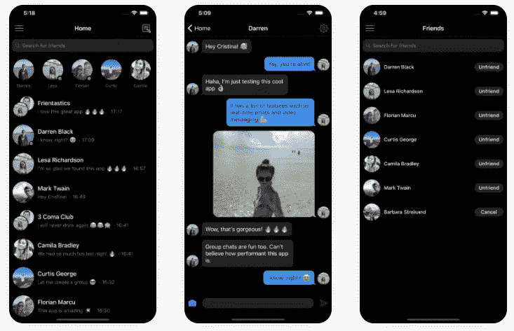

# 如何将聊天功能添加到 React 原生应用中

> 原文：<https://javascript.plainenglish.io/how-to-add-a-chat-feature-to-your-react-native-app-c75003eb820c?source=collection_archive---------6----------------------->

## 在 Instamobile，我们正在构建大量复杂的功能，以节省全球 React 本地开发人员的时间和精力。这些复杂的功能之一是聊天功能，这是当今几乎所有移动应用程序的必备功能。在本教程中，我们将学习如何用几行代码将 React 原生聊天添加到任何移动应用程序中。


是的，我们正在谈论一个完全成熟的聊天功能，它与后端(数据库和存储)集成，并且是实时的。而且可以毫不费力地集成到任何 React 原生 app 中！



构建聊天功能极其复杂，尽管乍一看似乎很琐碎。只支持基本的文本聊天功能会让你的应用看起来不专业，如果没有发送视频、记录消息等功能，用户会非常失望。

这里列出了每个 React 原生聊天应用应该具备的功能，这些功能在所有那些教你如何在 10 分钟内构建一个聊天应用的教程中从未被考虑过:

*   照片和视频信息
*   音频消息
*   一次发送多张照片/视频
*   影像播放机
*   可点击的 URL
*   全屏照片查看器
*   打字指示器
*   看到的状态
*   在线状态
*   群聊
*   推送通知
*   深色模式
*   RTL 和本地化
*   阻止用户(苹果公司要求)

相信我，这个清单还在继续。我们花了 6 个月的时间开发了我们的[成熟的聊天应用](https://www.instamobile.io/app-templates/react-native-chat-app-template/)，它仍然没有我们想要的所有功能。所以不，你不可能在 10 分钟内建立一个 React 原生聊天应用，如果你从零开始。

幸运的是，我们在 Instamobile 的代码是高度模块化的，所以我们让我们的客户在几分钟内就可以非常容易地将聊天功能集成到任何 React 原生应用程序中。这适用于任何移动应用程序，不管他们使用的是什么后端系统。

魔住在**的*imchatsune*的**组件中。该组件只需要一个通道作为输入，包装两个用户 id，当显示在屏幕上时，它将启用全功能的 React 本地聊天功能。

我们将介绍您需要遵循的步骤，以便正确显示两个给定用户之间的聊天屏幕。

## 1.将您的应用程序链接到您的 Firebase 帐户

所有消息都存储在 Firebase Firestore(一个数据库)中，不管您现有的后端是什么类型(AWS、MySQL、REST API、GraphQL 等)。您只需要两个用户 id 就可以正确触发聊天功能，我们将向您展示如何让事情正常运行。

除了消息之外，聊天还将被阻止的用户存储在 Firestore 中。这是苹果指南所要求的功能，没有它你就不能发布你的 iOS 应用。

如果你还不熟悉 Firebase，这里有你需要做的事情(如果你需要更多细节，查看我们的[综合文档](https://www.instamobile.io/docs/documentation/firebase-integration/)):

现在运行你的应用程序，确保一切正常。

## 2.将核心/聊天文件夹添加到 React 本机应用程序中

所有与聊天相关的代码都存在于 ***内核/聊天*** 模块中。有趣的是，我们所有的[应用程序模板](https://www.instamobile.io)都使用这段代码来启用聊天功能。

简单的复制粘贴这个文件夹到你的 ***src*** 文件夹就大功告成了。此外，如果您想使用我们自己的本地化库和图标，您可能还想复制粘贴 ***CoreAssets*** 和 ***Translations*** 文件夹。

## 3.将导航路径添加到 IMChatScreen

***IMChatScreen*** 是负责 React 本地聊天功能的组件。这是我们在[产品页面](https://www.instamobile.io/app-templates/react-native-chat-app-template/)上列出的每一项功能的入口。它显示用户界面，它连接到后端，它监听新消息，它显示照片&视频采集器，它管理打字指示器，等等。

因此，为了将聊天功能添加到 React 本机应用程序中，您需要让您的应用程序能够呈现这个屏幕。

我们将假设您正在使用***react-navigation***库来处理屏幕转换。因此，只需将此屏幕(IMChatScreen)添加到您的一个导航器中。

***imchatsscreen***住在***src/Core/chat***里。所以可以这样导入

```
import { IMChatScreen } from '../Core/chat';
```

下面是一个示例，展示了在堆栈导航器中，您到 IMChatScreen 的路线可能是什么样子:

```
const HomeStack = createStackNavigator( { 
  Home: { screen: HomeScreen }, 
  ChatScreen: { screen: IMChatScreen }, 
  }, { 
  initialRouteName: 'Home', 
  initialRouteParams: { appStyles: AppStyles } 
});
```

## 4.显示聊天屏幕

现在一切都设置好了，你可以在 React 本地应用的任何地方显示聊天屏幕，只需导航到 ***聊天屏幕*** 路径。

以下是如何在两个用户之间显示聊天屏幕，并使用用户 id 作为这些用户的唯一标识符:

```
import { IMChatScreen } from '../Core/chat'; 
... const id1 = "1234"; 
const id2 = "5678"; const otherUsers = [ 
  { id: id1 < id2 ? id1 + id2 : id2 + id1, firstName: "Andrew" } 
]; 
const channel = { id: id1 + id2, participants: otherUsers, }; props.navigation.navigate('ChatScreen', { 
  channel, appStyles: AppStyles, 
});
```

就是这样。这就是将聊天功能呈现到您自己的 React 本机应用程序中所需的全部内容。

以下是一些观察结果:

*   该代码将显示当前用户(id = 1234)和另一个用户(id = 5678)之间的聊天
*   频道 ID 总是两个用户 ID 的串联，按字母顺序排列(这样当两个用户互相交谈时，他们将拥有完全相同的频道 ID)
*   正如你所看到的，我们假设有一个“聊天屏幕”导航路径已经集成在你的一个导航器(堆栈导航器，底部导航器等)中。)—因此，请确保在测试聊天之前将此导航路径添加到您的应用程序中。
*   所有的数据都将存储在 Firebase Firestore 中，不管你使用的是什么后端。所以在测试这段代码之前，请确保[你已经设置了你的 Firebase 账户](https://www.instamobile.io/docs/documentation/firebase-integration/)。**是的，它可以在你现有的后端之外工作，可以是任何类型的(AWS，REST API，WordPress，MySQL 等)**
*   对于群组聊天，频道 ID 将只是您想要显示聊天屏幕的群组的频道 ID。
*   您可以使用自定义 AppStyles，以获得与您的应用程序 UI 匹配的正确颜色和字体
*   无论您选择哪种后端，报告和阻止用户也可以开箱即用。它们将存储在 Firestore 的“报告”表中。

## 5.测试您的集成

您可以开始在两个用户之间聊天。当然，您将测试该功能是否正常工作。

你也可以进入你的 [Firebase 控制台](https://console.firebase.google.com/)，查看自动创建的 Firestore 表格:

*   **通道** —用于存储所有消息及其元数据
*   **channel_participations** —这是存储聊天室和用户之间的关联，对于群聊来说极其重要
*   **报告** —该表用于记录所有被阻止或报告的用户。

## 结论

从头构建一个 React 原生聊天是极其痛苦的。这些功能非常复杂，性能非常关键，很难得到正确的，所需的总开发工作将超过 6 个月。

此外，如今用户非常挑剔，对聊天室有很高的期望，因此合理的聊天功能所需的功能也非常多。

幸运的是，在 Instamobile，我们已经建立了一个模块化的聊天功能，可以很容易地集成到任何 React 本机应用程序中。希望本教程能帮助我们所有的客户轻松地将聊天室添加到他们的应用程序中。

如果你遇到困难或者 React 本地聊天教程中缺少了什么，请在评论中告诉我们。干杯！

*原载于 2020 年 4 月 6 日*[*https://www . insta mobile . io*](https://www.instamobile.io/mobile-development/react-native-chat/)*。*