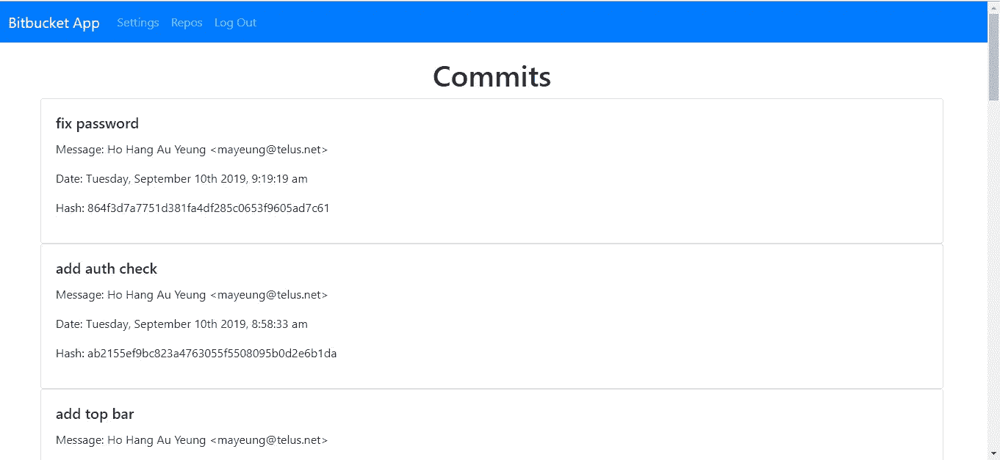

# 如何向 React 应用程序添加经过认证的路线

> 原文：<https://javascript.plainenglish.io/how-to-add-authenticated-routes-to-your-react-app-f496ff266533?source=collection_archive---------5----------------------->

使用高阶元件很容易制作认证的反应路线。高阶组件是以组件为道具并返回渲染一个新组件的组件。

例如，要创建经过身份验证的路由，我们可以编写:

```
import React from "react";
import { Redirect } from "react-router-dom";function RequireAuth({ Component }) {
  if (!localStorage.getItem("token")) {
    return <Redirect to="/" />;
  }
  return <Component />;
}export default RequireAuth;
```

`RequireAuth`是带`Component`道具的组件。`Component`是一个道具，是一个反应组件。我们检查本地存储中是否存在认证令牌，如果存在，那么我们呈现需要认证的路由`Component`。否则，我们将重定向到不需要身份验证的路由。

在本文中，我们将制作一个简单的 Bitbucket 应用程序，它具有经过身份验证的 React 路由。我们将让用户注册一个帐户，并为他们的帐户设置他们的位桶用户名和密码。一旦用户登录并设置了他们的位存储桶凭证，他们就可以查看他们的存储库和每个存储库的提交。

Bitbucket 是一个很棒的存储库托管服务，可以让你免费托管 Git 存储库。您可以升级到他们的付费计划，以低价获得更多功能。它还有一个全面的自动化和获取数据的 API。

开发者为 Bitbucket 的 API 做了 Node.js 客户端。我们可以很容易地使用它来做我们想做的事情，如操纵提交、添加、删除或编辑存储库、跟踪问题、操纵构建管道等等。

Bitbucket.js 包是用于编写 Node.js Bitbucket 应用程序的最简单的包之一。我们所要做的就是用我们的 Bitbucket 用户名和密码登录 Bitbucket 实例，并调用在[https://bitbucketjs.netlify.com/#api-_](https://bitbucketjs.netlify.com/#api-_)中列出的内置函数来对 Bitbucket 包做几乎任何我们想做的事情。

我们的应用程序将包括后端和前端。后端处理用户身份验证，并通过 Bitbucket API 与 Bitbucket 通信。前端有注册表单，登录表单，用于设置密码和位桶用户名和密码的设置表单。

为了开始构建应用程序，我们创建一个项目文件夹，里面有`backend`文件夹。然后我们进入`backend`文件夹，通过运行`npx express-generator`来运行快速生成器。接下来我们自己安装一些包。我们需要 Babel 来使用`import`，BCrypt 来散列密码，Bitbucket.js 来使用 Bitbucket API。Crypto-JS 用于加密和解密我们的位桶密码，Dotenv 用于存储哈希和加密秘密，Sequelize 用于 ORM，JSON Web Token 包用于身份验证，CORS 用于跨域通信，SQLite 用于数据库。

运行`npm i @babel/cli @babel/core @babel/node @babel/preset-env bcrypt bitbucket cors crypto-js dotenv jsonwebtoken sequelize sqlite3`安装软件包。

在`package.json`的`script`部分，输入:

```
"start": "nodemon --exec npm run babel-node --  ./bin/www",
"babel-node": "babel-node"
```

使用 Babel Node 启动我们的应用程序，而不是常规的 Node.js 运行时，这样我们就可以获得最新的 JavaScript 特性。

然后，我们在`backend`文件夹中创建一个名为`.babelrc`的文件，并添加:

```
{
    "presets": [
        "[@babel/preset-env](http://twitter.com/babel/preset-env)"
    ]
}
```

启用最新功能。

然后我们必须通过运行`npx sequelize-cli init`来添加序列代码。之后，我们应该在`config`文件夹中得到一个`config.json`文件。

在`config.json`中，我们把:

```
{
  "development": {
    "dialect": "sqlite",
    "storage": "development.db"
  },
  "test": {
    "dialect": "sqlite",
    "storage": "test.db"
  },
  "production": {
    "dialect": "sqlite",
    "storage": "production.db"
  }
}
```

使用 SQLite 作为我们的数据库。

接下来，我们添加一个用于验证认证令牌的中间件，在`backend`文件夹中添加一个`middllewares`文件夹，并在其中添加`authCheck.js`。在文件中，添加:

```
const jwt = require("jsonwebtoken");
const secret = process.env.JWT_SECRET;export const authCheck = (req, res, next) => {
  if (req.headers.authorization) {
    const token = req.headers.authorization;
    jwt.verify(token, secret, (err, decoded) => {
      if (err) {
        res.send(401);
      } else {
        next();
      }
    });
  } else {
    res.send(401);
  }
};
```

如果令牌无效，我们返回 401 响应。

接下来，我们创建一些迁移和模型。运行:

```
npx sequelize-cli model:create --name User --attributes username:string,password:string,bitBucketUsername:string,bitBucketPassword:string
```

来创建模型。请注意，属性选项没有空格。

然后，我们向 Users 表的`username`列添加 unique 约束。为此，请运行:

```
npx sequelize-cli migration:create addUniqueConstraintToUser
```

然后在新创建的迁移文件中，添加:

```
"use strict";module.exports = {
  up: (queryInterface, Sequelize) => {
    return queryInterface.addConstraint("Users", ["username"], {
      type: "unique",
      name: "usernameUnique"
    });
  },down: (queryInterface, Sequelize) => {
    return queryInterface.removeConstraint("Users", "usernameUnique");
  }
};
```

运行`npx sequelize-cli db:migrate`运行所有迁移。

接下来，我们创建路线。创建一个名为`bitbucket.js`的文件，并添加:

```
var express = require("express");
const models = require("../models");
const CryptoJS = require("crypto-js");
const Bitbucket = require("bitbucket");
const jwt = require("jsonwebtoken");
import { authCheck } from "../middlewares/authCheck";const bitbucket = new Bitbucket();
var router = express.Router();router.post("/setBitbucketCredentials", authCheck, async (req, res, next) => {
  const { bitBucketUsername, bitBucketPassword } = req.body;
  const token = req.headers.authorization;
  const decoded = jwt.verify(token, process.env.JWT_SECRET);
  const id = decoded.userId;
  const cipherText = CryptoJS.AES.encrypt(
    bitBucketPassword,
    process.env.CRYPTO_SECRET
  );
  await models.User.update(
    {
      bitBucketUsername,
      bitBucketPassword: cipherText.toString()
    },
    {
      where: { id }
    }
  );
  res.json({});
});router.get("/repos/:page", authCheck, async (req, res, next) => {
  const page = req.params.page || 1;
  const token = req.headers.authorization;
  const decoded = jwt.verify(token, process.env.JWT_SECRET);
  const id = decoded.userId;
  const users = await models.User.findAll({ where: { id } });
  const user = users[0];
  const bytes = CryptoJS.AES.decrypt(
    user.bitBucketPassword.toString(),
    process.env.CRYPTO_SECRET
  );
  const password = bytes.toString(CryptoJS.enc.Utf8);
  bitbucket.authenticate({
    type: "basic",
    username: user.bitBucketUsername,
    password
  });
  let { data } = await bitbucket.repositories.list({
    username: user.bitBucketUsername,
    page,
    sort: "-updated_on"
  });
  res.json(data);
});router.get("/commits/:repoName", authCheck, async (req, res, next) => {
  const token = req.headers.authorization;
  const decoded = jwt.verify(token, process.env.JWT_SECRET);
  const id = decoded.userId;
  const users = await models.User.findAll({ where: { id } });
  const user = users[0];
  const repoName = req.params.repoName;
  const bytes = CryptoJS.AES.decrypt(
    user.bitBucketPassword.toString(),
    process.env.CRYPTO_SECRET
  );
  const password = bytes.toString(CryptoJS.enc.Utf8);
  bitbucket.authenticate({
    type: "basic",
    username: user.bitBucketUsername,
    password
  });
  let { data } = await bitbucket.commits.list({
    username: user.bitBucketUsername,
    repo_slug: repoName,
    sort: "-date"
  });
  res.json(data);
});module.exports = router;
```

在每个路由中，我们从令牌中获取用户，因为我们将把用户 ID 添加到令牌中，并从令牌中获取 Bitbucket 用户名和密码，用于登录 Bitbucket API。请注意，我们必须解密密码，因为我们在将密码保存到数据库之前对其进行了加密。

我们在`setBitbucketCredentials`路由中设置位桶凭证。我们在保存密码之前对其进行加密，以确保其安全。

然后在`repos`路径中，我们得到用户的 repos，并按照相反的`update_on`顺序排序，因为我们在`sort`参数中指定了`-updated_on`。因为我们在`sort`参数中指定了`-date`，所以提交是以日期倒序排列的。

接下来，我们将`user.js`添加到`routes`文件夹中，并添加:

```
const express = require("express");
const models = require("../models");
const bcrypt = require("bcrypt");
const jwt = require("jsonwebtoken");
import { authCheck } from "../middlewares/authCheck";
const router = express.Router();router.post("/signup", async (req, res, next) => {
  const { username, password } = req.body;
  const hashedPassword = await bcrypt.hash(password, 10);
  const user = await models.User.create({ username, password: hashedPassword });
  res.json(user);
});router.post("/login", async (req, res, next) => {
  const { username, password } = req.body;
  const users = await models.User.findAll({ where: { username } });
  const user = users[0];
  await bcrypt.compare(password, user.password);
  const token = jwt.sign({ userId: user.id }, process.env.JWT_SECRET);
  res.json({ token });
});router.post("/changePassword", authCheck, async (req, res, next) => {
  const { password } = req.body;
  const token = req.headers.authorization;
  const decoded = jwt.verify(token, process.env.JWT_SECRET);
  const id = decoded.userId;
  const hashedPassword = await bcrypt.hash(password, 10);
  await models.User.update({ password: hashedPassword }, { where: { id } });
  res.json({});
});router.get("/currentUser", authCheck, async (req, res, next) => {
  const token = req.headers.authorization;
  const decoded = jwt.verify(token, process.env.JWT_SECRET);
  const id = decoded.userId;
  const users = await models.User.findAll({ where: { id } });
  const { username, bitBucketUsername } = users[0];
  res.json({ username, bitBucketUsername });
});module.exports = router;
```

我们有注册、登录和更改密码的路径。当我们注册或更改密码时，我们会在保存之前对密码进行哈希运算。

`currentUser`路径将用于前端的设置表单。

在`app.js`中，我们将现有代码替换为:

```
require("dotenv").config();
var createError = require("http-errors");
var express = require("express");
var path = require("path");
var cookieParser = require("cookie-parser");
var logger = require("morgan");
const cors = require("cors");var indexRouter = require("./routes/index");
var usersRouter = require("./routes/users");
var bitbucketRouter = require("./routes/bitbucket");var app = express();// view engine setup
app.set("views", path.join(__dirname, "views"));
app.set("view engine", "jade");app.use(logger("dev"));
app.use(express.json());
app.use(express.urlencoded({ extended: false }));
app.use(cookieParser());
app.use(express.static(path.join(__dirname, "public")));
app.use(cors());app.use("/", indexRouter);
app.use("/users", usersRouter);
app.use("/bitbucket", bitbucketRouter);// catch 404 and forward to error handler
app.use(function(req, res, next) {
  next(createError(404));
});// error handler
app.use(function(err, req, res, next) {
  // set locals, only providing error in development
  res.locals.message = err.message;
  res.locals.error = req.app.get("env") === "development" ? err : {};// render the error page
  res.status(err.status || 500);
  res.render("error");
});module.exports = app;
```

添加 CORS 插件以支持跨域通信，并通过添加以下内容在我们的应用程序中添加`users`和`bitbucket`路线:

```
app.use("/users", usersRouter);
app.use("/bitbucket", bitbucketRouter);
```

这完成了应用程序的后端部分。现在我们可以构建前端了。我们将用 React 构建它，所以我们从项目的根文件夹运行`npx create-react-app frontend`开始。

接下来，我们必须安装一些软件包。我们将安装用于样式化的 Bootstrap，用于路由的 React Router，分别用于表单值处理和表单验证的 Formik 和 Yup，以及用于发出 HTTP 请求的 Axios。

为此，运行`npm i axios bootstrap formik react-bootstrap react-router-dom yup`来安装所有的包。

接下来，我们修改`App.js`文件夹，用以下代码替换现有代码:

```
import React from "react";
import HomePage from "./HomePage";
import "./App.css";
import ReposPage from "./ReposPage";
import CommitsPage from "./CommitsPage";
import SettingsPage from "./SettingsPage";
import { createBrowserHistory as createHistory } from "history";
import { Router, Route } from "react-router-dom";
import SignUpPage from "./SignUpPage";
import RequireAuth from "./RequireAuth";
const history = createHistory();function App() {
  return (
    <div className="App">
      <Router history={history}>
        <Route path="/" exact component={HomePage} />
        <Route path="/signup" exact component={SignUpPage} />
        <Route
          path="/settings"
          component={props => (
            <RequireAuth {...props} Component={SettingsPage} />
          )}
        />
        <Route
          path="/repos"
          exact
          component={props => <RequireAuth {...props} Component={ReposPage} />}
        />
        <Route
          path="/commits/:repoName"
          exact
          component={props => (
            <RequireAuth {...props} Component={CommitsPage} />
          )}
        />
      </Router>
    </div>
  );
}export default App;
```

我们在这里为应用程序中的页面添加路线。`RequiredAuth`是一个更高阶的组件，它接受一个需要认证的组件来访问，如果没有被授权，则返回重定向，如果用户被授权，则返回页面。我们在这个路径中传递需要认证的组件，比如`ReposPage`、`SettingsPage`和`CommitPage`。

在`App.css`中，我们将现有代码替换为:

```
.page {
    padding: 20px;
}
```

添加一些填充。

接下来，我们将`CommitsPage.js`添加到`src`文件夹中，并添加:

```
import React, { useState, useEffect } from "react";
import { withRouter } from "react-router-dom";
import { commits } from "./requests";
import Card from "react-bootstrap/Card";
import LoggedInTopBar from "./LoggedInTopBar";
const moment = require("moment");function CommitsPage({ match: { params } }) {
  const [initialized, setInitialized] = useState(false);
  const [repoCommits, setRepoCommits] = useState([]);const getCommits = async page => {
    const repoName = params.repoName;
    const response = await commits(repoName, page);
    setRepoCommits(response.data.values);
  };useEffect(() => {
    if (!initialized) {
      getCommits(1);
      setInitialized(true);
    }
  });return (
    <>
      <LoggedInTopBar />
      <div className="page">
        <h1 className="text-center">Commits</h1>
        {repoCommits.map(rc => {
          return (
            <Card style={{ width: "90vw", margin: "0 auto" }}>
              <Card.Body>
                <Card.Title>{rc.message}</Card.Title>
                <p>Message: {rc.author.raw}</p>
                <p>
                  Date:{" "}
                  {moment(rc.date).format("dddd, MMMM Do YYYY, h:mm:ss a")}
                </p>
                <p>Hash: {rc.hash}</p>
              </Card.Body>
            </Card>
          );
        })}
      </div>
    </>
  );
}export default withRouter(CommitsPage);
```

我们获得 URL 参数中给定的存储库名称的提交，并将它们显示在 React Bootstrap 提供的列表`Cards`中。

接下来，我们创建主页，让我们登录。在`src`文件夹中创建一个`HomePage.js`文件，并添加:

```
import React, { useState, useEffect } from "react";
import { Formik } from "formik";
import Form from "react-bootstrap/Form";
import Col from "react-bootstrap/Col";
import Button from "react-bootstrap/Button";
import { Link } from "react-router-dom";
import * as yup from "yup";
import { logIn } from "./requests";
import { Redirect } from "react-router-dom";
import Navbar from "react-bootstrap/Navbar";const schema = yup.object({
  username: yup.string().required("Username is required"),
  password: yup.string().required("Password is required")
});function HomePage() {
  const [redirect, setRedirect] = useState(false);const handleSubmit = async evt => {
    const isValid = await schema.validate(evt);
    if (!isValid) {
      return;
    }
    try {
      const response = await logIn(evt);
      localStorage.setItem("token", response.data.token);
      setRedirect(true);
    } catch (ex) {
      alert("Invalid username or password");
    }
  };if (redirect) {
    return <Redirect to="/repos" />;
  }return (
    <>
      <Navbar bg="primary" expand="lg" variant="dark">
        <Navbar.Brand href="#home">Bitbucket App</Navbar.Brand>
      </Navbar>
      <div className="page">
        <h1 className="text-center">Log In</h1>
        <Formik validationSchema={schema} onSubmit={handleSubmit}>
          {({
            handleSubmit,
            handleChange,
            handleBlur,
            values,
            touched,
            isInvalid,
            errors
          }) => (
            <Form noValidate onSubmit={handleSubmit}>
              <Form.Row>
                <Form.Group as={Col} md="12" controlId="username">
                  <Form.Label>Username</Form.Label>
                  <Form.Control
                    type="text"
                    name="username"
                    placeholder="Username"
                    value={values.username || ""}
                    onChange={handleChange}
                    isInvalid={touched.username && errors.username}
                  />
                  <Form.Control.Feedback type="invalid">
                    {errors.username}
                  </Form.Control.Feedback>
                </Form.Group>
                <Form.Group as={Col} md="12" controlId="password">
                  <Form.Label>Password</Form.Label>
                  <Form.Control
                    type="password"
                    name="password"
                    placeholder="Password"
                    value={values.password || ""}
                    onChange={handleChange}
                    isInvalid={touched.password && errors.password}
                  /><Form.Control.Feedback type="invalid">
                    {errors.password}
                  </Form.Control.Feedback>
                </Form.Group>
              </Form.Row>
              <Button type="submit" style={{ marginRight: "10px" }}>
                Log In
              </Button>
              <Link
                className="btn btn-primary"
                to="/signup"
                style={{ marginRight: "10px", color: "white" }}
              >
                Sign Up
              </Link>
            </Form>
          )}
        </Formik>
      </div>
    </>
  );
}export default HomePage;
```

我们使用 Formik 提供的`Formik`组件来自动处理表单值。它将把这些值直接传送给`onSubmit`处理程序的参数。在`handleSubmit`函数中，我们运行`schema.validate`函数，根据从 Yup 库生成的`schema`对象检查表单值的有效性，如果成功，那么我们从我们将创建的`requests.js`文件中调用`login`。

接下来，我们创建顶栏。在`src`文件夹中创建`LoggedInTopBar.js`并添加:

```
import React, { useState } from "react";
import Navbar from "react-bootstrap/Navbar";
import Nav from "react-bootstrap/Nav";
import { withRouter, Redirect } from "react-router-dom";function LoggedInTopBar({ location }) {
  const [redirect, setRedirect] = useState(false);
  const { pathname } = location; const isLoggedIn = () => !!localStorage.getItem("token"); if (redirect) {
    return <Redirect to="/" />;
  } return (
    <div>
      {isLoggedIn() ? (
        <Navbar bg="primary" expand="lg" variant="dark">
          <Navbar.Brand href="#home">Bitbucket App</Navbar.Brand>
          <Navbar.Toggle aria-controls="basic-navbar-nav" />
          <Navbar.Collapse id="basic-navbar-nav">
            <Nav className="mr-auto">
              <Nav.Link href="/settings" active={pathname == "/settings"}>
                Settings
              </Nav.Link>
              <Nav.Link href="/repos" active={pathname == "/repos"}>
                Repos
              </Nav.Link>
              <Nav.Link>
                <span
                  onClick={() => {
                    localStorage.clear();
                    setRedirect(true);
                  }}
                >
                  Log Out
                </span>
              </Nav.Link>
            </Nav>
          </Navbar.Collapse>
        </Navbar>
      ) : null}
    </div>
  );
}export default withRouter(LoggedInTopBar);
```

这包含了 React 引导程序`Navbar`来显示一个带有主页链接和应用程序名称的顶栏。我们只显示本地存储器中的`token`。我们检查`pathname`，通过设置`active`道具来突出显示正确的链接。

接下来在`src`文件夹中创建`ReposPage.js`来显示用户拥有的存储库列表。我们补充:

```
import React, { useState, useEffect } from "react";
import { repos } from "./requests";
import Card from "react-bootstrap/Card";
import { Link } from "react-router-dom";
import Pagination from "react-bootstrap/Pagination";
import LoggedInTopBar from "./LoggedInTopBar";function ReposPage() {
  const [initialized, setInitialized] = useState(false);
  const [repositories, setRepositories] = useState([]);
  const [page, setPage] = useState(1);
  const [totalPages, setTotalPages] = useState(1); const getRepos = async page => {
    const response = await repos(page);
    setRepositories(response.data.values);
    setTotalPages(Math.ceil(response.data.size / response.data.pagelen));
  }; useEffect(() => {
    if (!initialized) {
      getRepos(1);
      setInitialized(true);
    }
  }); return (
    <div>
      <LoggedInTopBar />
      <h1 className="text-center">Your Repositories</h1>
      {repositories.map((r, i) => {
        return (
          <Card style={{ width: "90vw", margin: "0 auto" }} key={i}>
            <Card.Body>
              <Card.Title>{r.slug}</Card.Title>
              <Link className="btn btn-primary" to={`/commits/${r.slug}`}>
                Go
              </Link>
            </Card.Body>
          </Card>
        );
      })}
      <br />
      <Pagination style={{ width: "90vw", margin: "0 auto" }}>
        <Pagination.First onClick={() => getRepos(1)} />
        <Pagination.Prev
          onClick={() => {
            let p = page - 1;
            getRepos(p);
            setPage(p);
          }}
        />
        <Pagination.Next
          onClick={() => {
            let p = page + 1;
            getRepos(p);
            setPage(p);
          }}
        />
        <Pagination.Last onClick={() => getRepos(totalPages)} />
      </Pagination>
      <br />
    </div>
  );
}export default ReposPage;
```

我们获得列表存储库，并添加分页以获得更多的存储库。

在`requests.js`中，我们添加:

```
const axios = require("axios");
const APIURL = "[http://localhost:3000](http://localhost:3000)";axios.interceptors.request.use(
  config => {
    config.headers.authorization = localStorage.getItem("token");
    return config;
  },
  error => Promise.reject(error)
);axios.interceptors.response.use(
  response => {
    return response;
  },
  error => {
    if (error.response.status == 401) {
      localStorage.clear();
    }
    return error;
  }
);export const signUp = data => axios.post(`${APIURL}/users/signup`, data);export const logIn = data => axios.post(`${APIURL}/users/login`, data);export const changePassword = data =>
  axios.post(`${APIURL}/users/changePassword`, data);export const currentUser = () => axios.get(`${APIURL}/users/currentUser`);export const setBitbucketCredentials = data =>
  axios.post(`${APIURL}/bitbucket/setBitbucketCredentials`, data);export const repos = page =>
  axios.get(`${APIURL}/bitbucket/repos/${page || 1}`);export const commits = (repoName) =>
  axios.get(`${APIURL}/bitbucket/commits/${repoName}`);
```

这个文件包含我们注册、登录、设置凭证、获取存储库和提交等所有 HTTP 请求。

对于处理响应，如果我们得到 401 响应，那么我们清除本地存储，这样我们就不会使用无效的令牌。代码如下:

```
axios.interceptors.response.use(
  response => {
    return response;
  },
  error => {
    if (error.response.status == 401) {
      localStorage.clear();
    }
    return error;
  }
);
```

我们使用以下内容将令牌附加到请求头:

```
axios.interceptors.request.use(
  config => {
    config.headers.authorization = localStorage.getItem("token");
    return config;
  },
  error => Promise.reject(error)
);
```

所以我们不必为每个经过身份验证的请求设置它。

接下来在`src`文件夹中创建一个名为`RequiredAuth.js`的文件，并添加:

```
import React from "react";
import { Redirect } from "react-router-dom";function RequireAuth({ Component }) {
  if (!localStorage.getItem("token")) {
    return <Redirect to="/" />;
  }
  return <Component />;
}export default RequireAuth;
```

我们检查令牌在认证路由中的存在，如果令牌存在，则呈现传入的`Component` prop。

然后，我们在`src`文件夹中创建一个名为`SettingsPage.js`的文件，并添加:

```
import React, { useState, useEffect } from "react";
import { Formik } from "formik";
import Form from "react-bootstrap/Form";
import Col from "react-bootstrap/Col";
import Button from "react-bootstrap/Button";
import * as yup from "yup";
import {
  currentUser,
  setBitbucketCredentials,
  changePassword
} from "./requests";
import LoggedInTopBar from "./LoggedInTopBar";const userFormSchema = yup.object({
  username: yup.string().required("Username is required"),
  password: yup.string().required("Password is required")
});const bitBucketFormSchema = yup.object({
  bitBucketUsername: yup.string().required("Username is required"),
  bitBucketPassword: yup.string().required("Password is required")
});function SettingsPage() {
  const [initialized, setInitialized] = useState(false);
  const [user, setUser] = useState({});
  const [bitbucketUser, setBitbucketUser] = useState({}); const handleUserSubmit = async evt => {
    const isValid = await userFormSchema.validate(evt);
    if (!isValid) {
      return;
    }
    try {
      await changePassword(evt);
      alert("Password changed");
    } catch (error) {
      alert("Password change failed");
    }
  };const handleBitbucketSubmit = async evt => {
    const isValid = await bitBucketFormSchema.validate(evt);
    if (!isValid) {
      return;
    }
    try {
      await setBitbucketCredentials(evt);
      alert("Bitbucket credentials changed");
    } catch (error) {
      alert("Bitbucket credentials change failed");
    }
  };const getCurrentUser = async () => {
    const response = await currentUser();
    const { username, bitBucketUsername } = response.data;
    setUser({ username });
    setBitbucketUser({ bitBucketUsername });
  };useEffect(() => {
    if (!initialized) {
      getCurrentUser();
      setInitialized(true);
    }
  });return (
    <>
      <LoggedInTopBar />
      <div className="page">
        <h1 className="text-center">Settings</h1>
        <h2>User Settings</h2>
        <Formik
          validationSchema={userFormSchema}
          onSubmit={handleUserSubmit}
          initialValues={user}
          enableReinitialize={true}
        >
          {({
            handleSubmit,
            handleChange,
            handleBlur,
            values,
            touched,
            isInvalid,
            errors
          }) => (
            <Form noValidate onSubmit={handleSubmit}>
              <Form.Row>
                <Form.Group as={Col} md="12" controlId="username">
                  <Form.Label>Username</Form.Label>
                  <Form.Control
                    type="text"
                    name="username"
                    placeholder="Username"
                    value={values.username || ""}
                    onChange={handleChange}
                    isInvalid={touched.username && errors.username}
                    disabled
                  />
                  <Form.Control.Feedback type="invalid">
                    {errors.username}
                  </Form.Control.Feedback>
                </Form.Group>
                <Form.Group as={Col} md="12" controlId="password">
                  <Form.Label>Password</Form.Label>
                  <Form.Control
                    type="password"
                    name="password"
                    placeholder="Password"
                    value={values.password || ""}
                    onChange={handleChange}
                    isInvalid={touched.password && errors.password}
                  /><Form.Control.Feedback type="invalid">
                    {errors.password}
                  </Form.Control.Feedback>
                </Form.Group>
              </Form.Row>
              <Button type="submit" style={{ marginRight: "10px" }}>
                Save
              </Button>
            </Form>
          )}
        </Formik><br />
        <h2>BitBucket Settings</h2>
        <Formik
          validationSchema={bitBucketFormSchema}
          onSubmit={handleBitbucketSubmit}
          initialValues={bitbucketUser}
          enableReinitialize={true}
        >
          {({
            handleSubmit,
            handleChange,
            handleBlur,
            values,
            touched,
            isInvalid,
            errors
          }) => (
            <Form noValidate onSubmit={handleSubmit}>
              <Form.Row>
                <Form.Group as={Col} md="12" controlId="bitBucketUsername">
                  <Form.Label>BitBucket Username</Form.Label>
                  <Form.Control
                    type="text"
                    name="bitBucketUsername"
                    placeholder="BitBucket Username"
                    value={values.bitBucketUsername || ""}
                    onChange={handleChange}
                    isInvalid={
                      touched.bitBucketUsername && errors.bitBucketUsername
                    }
                  />
                  <Form.Control.Feedback type="invalid">
                    {errors.bitBucketUsername}
                  </Form.Control.Feedback>
                </Form.Group>
                <Form.Group as={Col} md="12" controlId="bitBucketPassword">
                  <Form.Label>Password</Form.Label>
                  <Form.Control
                    type="password"
                    name="bitBucketPassword"
                    placeholder="Bitbucket Password"
                    value={values.bitBucketPassword || ""}
                    onChange={handleChange}
                    isInvalid={
                      touched.bitBucketPassword && errors.bitBucketPassword
                    }
                  /><Form.Control.Feedback type="invalid">
                    {errors.bitbucketPassword}
                  </Form.Control.Feedback>
                </Form.Group>
              </Form.Row>
              <Button type="submit" style={{ marginRight: "10px" }}>
                Save
              </Button>
            </Form>
          )}
        </Formik>
      </div>
    </>
  );
}export default SettingsPage;
```

我们有两种形式。一个用于设置用户的密码，另一个用于保存位桶凭证。如果输入的数据有效，我们在单独的 Yup 模式中都有效，并向后端发出请求。

接下来，我们通过在`src`文件夹中创建`SignUpPage.js`来创建注册页面。我们补充:

```
import React, { useState, useEffect } from "react";
import { Formik } from "formik";
import Form from "react-bootstrap/Form";
import Col from "react-bootstrap/Col";
import Button from "react-bootstrap/Button";
import { Redirect } from "react-router-dom";
import * as yup from "yup";
import { signUp } from "./requests";
import Navbar from "react-bootstrap/Navbar";const schema = yup.object({
  username: yup.string().required("Username is required"),
  password: yup.string().required("Password is required")
});function SignUpPage() {
  const [redirect, setRedirect] = useState(false); const handleSubmit = async evt => {
    const isValid = await schema.validate(evt);
    if (!isValid) {
      return;
    }
    try {
      await signUp(evt);
      setRedirect(true);
    } catch (ex) {
      alert("Username already taken");
    }
  }; if (redirect) {
    return <Redirect to="/" />;
  } return (
    <>
      <Navbar bg="primary" expand="lg" variant="dark">
        <Navbar.Brand href="#home">Bitbucket App</Navbar.Brand>
      </Navbar>
      <div className="page">
        <h1 className="text-center">Sign Up</h1>
        <Formik validationSchema={schema} onSubmit={handleSubmit}>
          {({
            handleSubmit,
            handleChange,
            handleBlur,
            values,
            touched,
            isInvalid,
            errors
          }) => (
            <Form noValidate onSubmit={handleSubmit}>
              <Form.Row>
                <Form.Group as={Col} md="12" controlId="username">
                  <Form.Label>Username</Form.Label>
                  <Form.Control
                    type="text"
                    name="username"
                    placeholder="Username"
                    value={values.username || ""}
                    onChange={handleChange}
                    isInvalid={touched.username && errors.username}
                  />
                  <Form.Control.Feedback type="invalid">
                    {errors.username}
                  </Form.Control.Feedback>
                </Form.Group>
                <Form.Group as={Col} md="12" controlId="password">
                  <Form.Label>Password</Form.Label>
                  <Form.Control
                    type="password"
                    name="password"
                    placeholder="Password"
                    value={values.password || ""}
                    onChange={handleChange}
                    isInvalid={touched.password && errors.password}
                  /> <Form.Control.Feedback type="invalid">
                    {errors.password}
                  </Form.Control.Feedback>
                </Form.Group>
              </Form.Row>
              <Button type="submit" style={{ marginRight: "10px" }}>
                Sign Up
              </Button>
            </Form>
          )}
        </Formik>
      </div>
    </>
  );
}export default SignUpPage;
```

它类似于另一个登录请求，除了我们调用注册请求而不是登录。

最后，在`index.html`中，我们将现有代码替换为:

```
<!DOCTYPE html>
<html lang="en">
  <head>
    <meta charset="utf-8" />
    <link rel="shortcut icon" href="%PUBLIC_URL%/favicon.ico" />
    <meta name="viewport" content="width=device-width, initial-scale=1" />
    <meta name="theme-color" content="#000000" />
    <meta
      name="description"
      content="Web site created using create-react-app"
    />
    <link rel="apple-touch-icon" href="logo192.png" />
    <!--
      manifest.json provides metadata used when your web app is installed on a
      user's mobile device or desktop. See [https://developers.google.com/web/fundamentals/web-app-manifest/](https://developers.google.com/web/fundamentals/web-app-manifest/)
    -->
    <link rel="manifest" href="%PUBLIC_URL%/manifest.json" />
    <!--
      Notice the use of %PUBLIC_URL% in the tags above.
      It will be replaced with the URL of the `public` folder during the build.
      Only files inside the `public` folder can be referenced from the HTML.Unlike "/favicon.ico" or "favicon.ico", "%PUBLIC_URL%/favicon.ico" will
      work correctly both with client-side routing and a non-root public URL.
      Learn how to configure a non-root public URL by running `npm run build`.
    -->
    <title>Bitbucket App</title>
    <link
      rel="stylesheet"
      href="[https://maxcdn.bootstrapcdn.com/bootstrap/4.3.1/css/bootstrap.min.css](https://maxcdn.bootstrapcdn.com/bootstrap/4.3.1/css/bootstrap.min.css)"
      integrity="sha384-ggOyR0iXCbMQv3Xipma34MD+dH/1fQ784/j6cY/iJTQUOhcWr7x9JvoRxT2MZw1T"
      crossorigin="anonymous"
    />
  </head>
  <body>
    <noscript>You need to enable JavaScript to run this app.</noscript>
    <div id="root"></div>
    <!--
      This HTML file is a template.
      If you open it directly in the browser, you will see an empty page.You can add webfonts, meta tags, or analytics to this file.
      The build step will place the bundled scripts into the <body> tag.To begin the development, run `npm start` or `yarn start`.
      To create a production bundle, use `npm run build` or `yarn build`.
    -->
  </body>
</html>
```

添加引导 CSS 并更改标题。

写完所有代码后，我们就可以运行我们的应用程序了。在运行任何东西之前，通过运行`npm i -g nodemon`来安装`nodemon`,这样我们就不必在文件改变时自己重启后端。

然后通过运行`backend`文件夹中的`npm start`和`frontend`文件夹中的`npm start`来运行后端，如果要求您从不同的端口运行它，请选择“是”。

然后你会得到:

