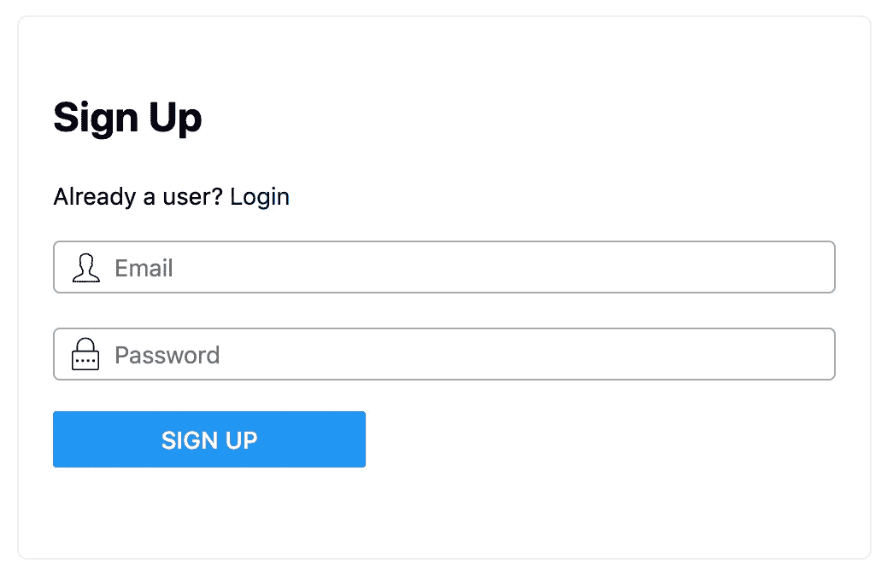
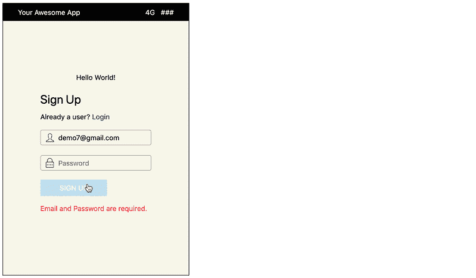

# 如何向 React 应用程序添加身份验证

> 原文：<https://javascript.plainenglish.io/how-to-add-authentication-to-your-react-app-20c8080ed1d6?source=collection_archive---------6----------------------->

当开始一个新项目时，需要花费一些精力来实现登录/注册屏幕。我们经常不得不一次又一次地重复相同的实现。

*   认证应该是简单的，以消除摩擦，建立一个 MVP(最可行的产品)或让用户开始。
*   应该重用身份验证逻辑以节省开发时间。

有一些在线服务可以让您将应用程序与它们的身份验证 API 集成在一起。但是，当我们必须通过冗长的文档来理解它，然后花更多的时间学习和集成时，它并没有真正节省多少时间。

身份验证服务应该易于集成。下面是一个例子:

## 第一步。导入和使用登录组件

```
$ npm install **authui-ui**import **LoginBox** from "authui-ui/dist/js/components/LoginBox/LoginBox";<**LoginBox** accountId="MyProductName" afterSubmit={afterSubmitHandler} />
```



LoginBox Component

[LoginBox 源代码](https://github.com/authui/authui)也可以定制直接使用。

## 第二步。处理响应

用户提交表单(注册或登录)后，将调用“afterSubmit”回调函数。在这里，您可以通过将用户重定向到主页、仪表板等来处理响应(完整的用户对象)。

```
const afterSubmitHandler = (jwtData) => {
  if (jwtData && jwtData.email) {
    alert('jwtData: ' + JSON.stringify(jwtData))
  }
}
```

是用户对象，它有如下属性:用户 uuid，访问令牌，电子邮件，名字，图片等等。它可以在应用程序中使用(或存储在 localStorage 中)。

就是这样！没有第三步😀

在下一篇文章中，我将写更多关于它是如何工作的。同时，以下链接提供了更多信息:

[AuthUI Repos](https://github.com/authui/authui)—UI 和 API 都是开源的。

[实例](https://codesandbox.io/s/authui-example-with-login-component-source-code-8jswg?module=/src/LoginBox/LoginBox.tsx)

如果你是创客或者有需要认证的项目，那就试试吧。如果您需要帮助与它集成，请随时联系(通过 Github )!



LoginBox Component