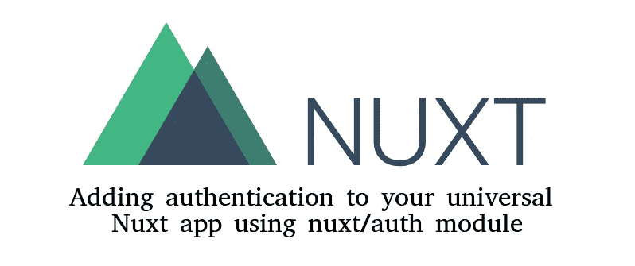

# 如何使用 nuxt/auth 模块向您的通用 Nuxt 应用程序添加身份验证

> 原文：<https://javascript.plainenglish.io/how-to-add-authentication-to-your-universal-nuxt-app-using-nuxt-auth-module-61dbc9aea2c2?source=collection_archive---------1----------------------->



最近，我在开发一个 Nuxt.js 应用程序，不得不为它添加认证。我想到的第一件事是使用 vuex 在一个州中存储两个字段:

*   **isLoggedIn** :表示用户是否登录的布尔值
*   **loggedInUser** :一个对象，包含我们从服务器获取的会话的用户详细信息

然后，我在页面上添加了一个中间件，我想将访问权限仅限于登录用户。这种方法的思路是正确的，但问题是当你刷新页面时，vuex 的状态会丢失。为了处理这个问题，你需要使用 **localStorage** ，但是只有当你的应用程序运行在 **spa** 模式下，也就是说，只在客户端运行。如果你在**通用**模式(服务器端渲染)下运行你的应用，那么你还需要使用 **cookies** 并编写一个自定义中间件来检查它是运行在客户端还是服务器端，然后相应地使用 **localStorage** 或 **cookies** 。做所有这些将是一个很好的练习来学习一切是如何工作的，但是在我看来，将它添加到一个多人工作的项目中可能不是一个好主意。Nuxt 有一个官方支持的模块就是为了这个目的。是[认证模块](https://auth.nuxtjs.org/)。在这篇文章中，我将讨论如何将**认证模块**集成到你的 nuxt 应用中，以支持使用**电子邮件**和**密码**的认证。

# 服务器 API 的假设

我们假设 API 服务器:

*   正在[上运行**http://localhost:8080/v1**上运行](http://localhost:8080/v1)
*   使用基于 cookie 的会话
*   有一个基于 JSON 的 API
*   具有以下 API 端点:
*   **POST /v1/auth/login** :在请求体中接受**电子邮件**和**密码**并认证用户
*   **POST /v1/auth/logout** :不需要请求体，从服务器中删除用户会话
*   **GET /v1/auth/profile** :返回登录用户的对象

# 所涉及步骤的概述

我们将这篇文章分为以下几个步骤:

*   安装**轴**和**授权**模块
*   在 **nuxt.config.js** 中需要配置
*   使用来自身份验证模块的状态来检查用户是否登录，并在我们的应用程序组件中访问登录的用户
*   使用认证模块通过基于电子邮件和密码的认证来认证用户
*   使用 auth 模块提供的中间件将对页面的访问仅限于登录用户

# 步骤 1:安装 axios 和 auth 模块

打开终端，导航到项目的根目录，然后运行以下命令:

```
npm install @nuxtjs/auth @nuxtjs/axios
```

# 步骤 2:配置 axios 和认证模块

打开您的 **nuxt.config.js** 文件，找到 **modules** 部分并包含 **axios** 和 **auth** 模块并添加它们的配置:

```
 modules: [
    '@nuxtjs/axios',
    '@nuxtjs/auth'
  ],

  auth: {
    strategies: {
      local: {
        endpoints: {
          login: {
            url: '/auth/login',
            method: 'post',
            propertyName: false
          },
          logout: { 
            url: '/auth/logout', 
            method: 'post' 
          },
          user: { 
            url: '/auth/profile', 
            method: 'get', 
            propertyName: false 
          }
        },
        tokenRequired: false,
        tokenType: false
      }
    }
  },

  axios: {
    baseURL: 'http://localhost:8080/v1',
    credentials: true
  },
```

这里的 **auth** 对象包括配置。 **auth** 模块支持**本地**策略以及 **OAuth2** 。因为在我们的例子中我们只有基于电子邮件和密码的认证，所以我们只需要为**本地**策略提供配置。

在**端点**部分，我们为登录、注销和已登录用户配置文件指定了 API 服务器端点的详细信息，每个配置如下所示:

```
 user: { 
    url: '/auth/profile', 
    method: 'get', 
    propertyName: false 
  }
```

**url** 和**方法**应该和你的服务器 API 一致。这里的 **url** 需要相对于 **baseUrl** 配置。 **propertyName** 告诉 auth 模块在响应对象中寻找哪个属性。例如，如果您的 API 服务器对`GET /auth/profile`的响应如下:

```
{
  "user": {
    "id: 1,
    "name": "Jon Snow",
    "email": "jon.snow@asoiaf.com"
  }
}
```

然后，您可以将 **propertyName** 设置为`user`，以便在 API 响应中只查找`user`键。如果要使用整个 API 响应，需要将 **propertyName** 设置为`false`。

因为我们的 API 服务器有基于 cookie 的会话，所以我们将**令牌要求**和**令牌类型**设置为`false`。

```
tokenRequired: false,
tokenType: false
```

关于 auth 模块支持的选项的完整列表，你可以访问他们的官方文档[这里](https://auth.nuxtjs.org/api/options.html#redirect)

上述配置中的 **axios** 对象用于提供 axios 配置。这里，我们设置以下属性:

```
 axios: {
    baseURL: 'http://localhost:8080/v1',
    credentials: true
  },
```

**baseUrl** 这是我们 API 的根 Url，我们在应用中使用 axios 点击的任何相对 url 都将与此 url 相关。将**凭证**设置为`true`可以确保我们在所有请求中将认证头发送到 API 服务器。

# 第三步:在你的应用中激活 vuex 商店

为了使用认证模块，我们需要激活应用程序中的 **vuex** 存储，因为会话相关信息将存储在那里。这可以通过添加任何**来完成。js** 文件在你的应用程序的**存储**目录中，nuxt 会用这个文件的名字注册一个命名空间的 vuex 模块。让我们继续将一个名为 **index.js** 的空白文件添加到我们应用程序的 **store** 目录中。不强制添加 **index.js** 文件。您可以在 **store** 目录中添加任何文件，例如 **xyz.js** ，这将在您的应用程序中激活 vuex store。

我们包含在项目中的 auth 模块将自动向 vuex 商店注册一个名为 **auth** 的命名空间模块。它在状态中有以下字段:

*   **登录**:表示用户是否登录的布尔值
*   **用户**:从我们的 **nuxt.config.js** 文件中配置的**auth . strategies . local . user**端点接收的用户对象。
*   **策略**:在我们的例子中，这将是`local`

它还为设置状态添加了必要的突变。所以，即使我们还没有在我们应用程序的**存储**目录中创建任何 **auth.js** 文件，auth 模块已经自动处理了这一切。如果有助于理解的话，想象一下，一个名为 **auth.js** 的文件是由应用程序的 **store** 目录中的 auth 模块自动创建的，尽管这个文件实际上并不存在。这意味着在 vuex 商店的 **auth** 模块上使用 **mapState** 将会有效。例如，您可以在任何组件或页面中使用它:

```
 computed: {
    ...mapState('auth', ['loggedIn', 'user'])
  },
```

下面是使用这些属性的组件的完整示例:

```
<template>
  <b-navbar type="dark" variant="dark">
    <b-navbar-brand to="/">NavBar</b-navbar-brand>
    <b-navbar-nav class="ml-auto">
      <b-nav-item v-if="!loggedIn" to="/login">Login</b-nav-item>
      <b-nav-item v-if="!loggedIn" to="/register">Register</b-nav-item>
      <b-nav-item v-if="loggedIn" @click="logout">
        <em>Hello {{ user.name }}</em>
      </b-nav-item>
      <b-nav-item v-if="loggedIn" @click="logout">Logout</b-nav-item>
    </b-navbar-nav>
  </b-navbar>
</template>

<script>
import { mapState } from 'vuex'
export default {
  name: 'NavBar',
  computed: {
    ...mapState('auth', ['loggedIn', 'user'])
  },
  methods: {
    async logout() {
      await this.$auth.logout()
      this.$router.push('/login')
    }
  }
}
</script>

<style></style>
```

## 替代方法

除了使用**映射状态**，你也可以通过**引用**登录**和**用户**。$auth.loggedIn** 和 **this。$auth.user** 。因此，在上面的示例中，您可以按如下所述重写计算的属性，它仍然可以正常工作:

```
 computed: {
    loggedIn() {
      return this.$auth.loggedIn
    },
    user() {
      return this.$auth.user
    }
  },
```

# 步骤 4:使用认证模块认证用户

我们知道如何使用 auth 模块的 API 来检查用户是否登录，或者访问登录用户的详细信息。但是我们还没有涉及如何认证用户的部分。这是通过使用**这个。$auth.loginWith** 方法由您的任何组件或页面中的 **auth** 模块提供。该函数的第一个参数是策略的名称。在我们的例子中，这将是`local`。这是一个异步函数，它返回一个承诺。以下是如何使用它的示例:

```
 try {
    await this.$auth.loginWith('local', {
      data: {
        email: 'email@xyz.com'
        password: 'password',
      }
    })
    // do something on success
  } catch (e) {    
    // do something on failure 
  }
```

因此，通常你会有一个带有表单的登录页面，表单中的**电子邮件**和**密码**字段映射到使用 **v-model** 的组件的**数据**。一旦您提交了表单，您就可以使用 **auth** 模块运行这个函数来进行身份验证。以下是登录页面的示例:

```
<template>
  <div class="row">
    <div class="mx-auto col-md-4 mt-5">
      <b-card>
        <b-form @submit="submitForm">
          <b-form-group
            id="input-group-1"
            label="Email address:"
            label-for="email"
          >
            <b-form-input
              id="email"
              v-model="email"
              type="email"
              required
              placeholder="Enter email"
            ></b-form-input>
          </b-form-group>

          <b-form-group
            id="input-group-2"
            label="Password:"
            label-for="password"
          >
            <b-form-input
              id="password"
              v-model="password"
              type="password"
              required
              placeholder="Enter password"
            ></b-form-input>
          </b-form-group>

          <b-button type="submit" variant="primary">Login</b-button>
        </b-form>
      </b-card>
    </div>
  </div>
</template>

<script>
export default {
  name: 'LoginPage',
  data() {
    return {
      email: '',
      password: ''
    }
  },
  methods: {
    async submitForm(evt) {
      evt.preventDefault()
      const credentials = {
        email: this.email,
        password: this.password
      }
      try {
        await this.$auth.loginWith('local', {
          data: credentials
        })
        this.$router.push('/')
      } catch (e) {
        this.$router.push('/login')
      }
    }
  }
}
</script>

<style></style>
```

为了注销一个已登录的用户，可以使用**这个。由 **auth** 模块提供的$auth.logout** 方法。这个不需要任何论证。这里有一个例子:

```
 methods: {
    async logout() {
      await this.$auth.logout()
      this.$router.push('/login')
    }
  }
```

# 步骤 5:使用认证中间件来限制对某些页面的访问

auth 模块还提供中间件来限制登录用户的访问。因此，例如，如果您想将应用程序的 **/profile** 路由限制为仅允许登录的用户使用，您可以将身份验证中间件添加到 **profile.vue** 页面，如下所示:

```
export default {
  name: 'ProfilePage',
  middleware: ['auth']
}
```

关于如何配置您的组件和页面以使用`auth`中间件的更多细节，您可以在这里查看官方文档。

# 结论和参考文献

这是一篇关于带有 **NuxtJS** 的 **axios** 和 **auth** 模块的入门文章。我们只讨论了本地策略，但 auth 模块也支持 **OAuth2** ，并可用于支持使用 **Auth0** 、**脸书**、 **Github** 和 **Google** 的登录。我强烈建议查看认证模块的**指南**和 **API** 部分:

[https://auth.nuxtjs.org/](https://auth.nuxtjs.org/)

axios 模块也为我们提供了许多配置选项。虽然我们在这篇文章中没有涉及太多，但是我也强烈建议查看一下官方文档:

[https://axios.nuxtjs.org/](https://axios.nuxtjs.org/)

我希望这篇文章有助于理解 Nuxt 中 auth 模块的基础知识，并让你更容易自己浏览其余的官方文档。

快乐编码:-)

*原载于 2019 年 9 月 29 日*[*【http://codingfundas.com】*](http://codingfundas.com/how-to-add-auth-to-your-nuxt-app/index.html)*。*