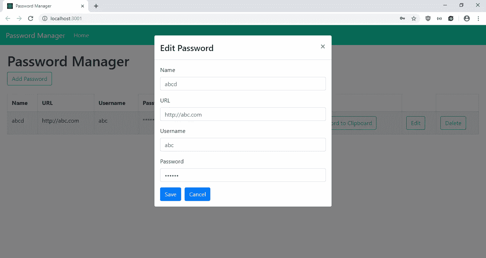
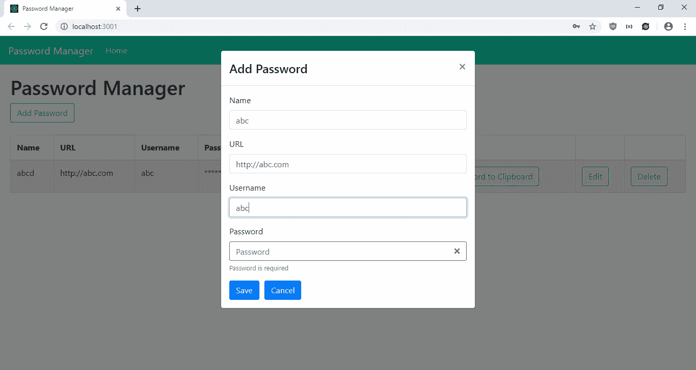
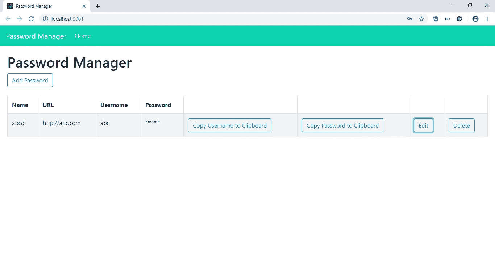

# 如何向 React 应用程序添加浏览器通知

> 原文：<https://javascript.plainenglish.io/how-to-add-browser-notifications-to-your-react-app-79d901458f56?source=collection_archive---------0----------------------->


Photo by [Jamie Street](https://unsplash.com/@jamie452?utm_source=medium&utm_medium=referral) on [Unsplash](https://unsplash.com?utm_source=medium&utm_medium=referral)

通过 HTML5 通知 API，浏览器可以向用户显示本地弹出通知。使用通知，您可以显示文本和图标，还可以播放声音。选项的完整列表位于[https://developer . Mozilla . org/en-US/docs/Web/API/notification](https://developer.mozilla.org/en-US/docs/Web/API/notification)。当用户访问 web 应用程序以查看浏览器通知时，他们必须授予显示通知的权限。

如果我们使用 React，开发人员已经为我们做了艰苦的工作，因为 React 组件是为了显示浏览器通知而创建的。位于[https://www.npmjs.com/package/react-web-notification](https://www.npmjs.com/package/react-web-notification)的 React-Web-Notification 包可以让我们显示弹出窗口，并处理与显示通知相关的事件，如用户点击通知或处理显示通知的许可或授予或拒绝的情况。

在这篇文章中，我们将建立一个密码管理器，让您输入，编辑和删除网站的密码，并在采取这些行动时显示通知。我们将使用 React 来构建应用程序。

首先，我们将运行 Create React App 来创建应用程序。运行:

```
npx create-react-app password-manager
```

来创建应用程序。接下来，我们添加自己的库，我们将使用 Axios 向后端发出 HTTP 请求，Formik 和 Yup 分别用于表单值处理和表单验证，MobX 用于状态管理，React Bootstrap 用于样式化，React-Copy-To-Clipboard 用于将数据复制到剪贴板，React Router 用于路由。

我们通过运行以下命令来安装它们:

```
npm i axios formik mobx mobx-react react-bootstrap react-copy-to-clipboard react-router-fom yup react-web-notifications
```

安装好所有的库之后，我们就可以开始构建我们的应用程序了。除非另有说明，否则我们在`src`文件夹中创建所有文件。

首先，我们用以下代码替换`App.css`中的现有代码:

```
.bg-primary {
  background-color: #09d3ac !important;
}
```

更改顶栏的背景色。接下来在`App.js`中，将当前代码替换为:

```
import React from "react";
import { Router, Route } from "react-router-dom";
import HomePage from "./HomePage";
import { createBrowserHistory as createHistory } from "history";
import Navbar from "react-bootstrap/Navbar";
import Nav from "react-bootstrap/Nav";
import "./App.css";
const history = createHistory();function App({ passwordsStore }) {
  return (
    <div className="App">
      <Router history={history}>
        <Navbar bg="primary" expand="lg" variant="dark">
          <Navbar.Brand href="#home">Password Manager</Navbar.Brand>
          <Navbar.Toggle aria-controls="basic-navbar-nav" />
          <Navbar.Collapse id="basic-navbar-nav">
            <Nav className="mr-auto">
              <Nav.Link href="/" active>Home</Nav.Link>
            </Nav>
          </Navbar.Collapse>
        </Navbar>
        <Route
          path="/"
          exact
          component={props => (
            <HomePage {...props} passwordsStore={passwordsStore} />
          )}
        />
      </Router>
    </div>
  );
}export default App;
```

将我们的 React 引导顶部栏和我们的路线添加到主页。`passwordStore`是我们的 MobX 存储，用于在前端存储我们的密码列表。

接下来创建`HomePage.css`并添加:

```
.home-page {
  padding: 20px;
}
```

给我们的页面添加一些填充。

然后创建`HomePage.js`并添加:

```
import React from "react";
import { useState, useEffect } from "react";
import Table from "react-bootstrap/Table";
import ButtonToolbar from "react-bootstrap/ButtonToolbar";
import Button from "react-bootstrap/Button";
import Modal from "react-bootstrap/Modal";
import PasswordForm from "./PasswordForm";
import "./HomePage.css";
import { deletePassword, getPasswords } from "./requests";
import { observer } from "mobx-react";
import { CopyToClipboard } from "react-copy-to-clipboard";
import Notification from "react-web-notification";function HomePage({ passwordsStore }) {
  const [openAddModal, setOpenAddModal] = useState(false);
  const [openEditModal, setOpenEditModal] = useState(false);
  const [initialized, setInitialized] = useState(false);
  const [selectedPassword, setSelectedPassword] = useState({});
  const [notificationTitle, setNotificationTitle] = React.useState(""); const openModal = () => {
    setOpenAddModal(true);
  }; const closeModal = () => {
    setOpenAddModal(false);
    setOpenEditModal(false);
    getData();
  }; const cancelAddModal = () => {
    setOpenAddModal(false);
  }; const editPassword = contact => {
    setSelectedPassword(contact);
    setOpenEditModal(true);
  }; const cancelEditModal = () => {
    setOpenEditModal(false);
  }; const getData = async () => {
    const response = await getPasswords();
    passwordsStore.setPasswords(response.data);
    setInitialized(true);
  }; const deleteSelectedPassword = async id => {
    await deletePassword(id);
    setNotificationTitle("Password deleted");
    getData();
  }; useEffect(() => {
    if (!initialized) {
      getData();
    }
  }); return (
    <div className="home-page">
      <h1>Password Manager</h1>
      <Modal show={openAddModal} onHide={closeModal}>
        <Modal.Header closeButton>
          <Modal.Title>Add Password</Modal.Title>
        </Modal.Header>
        <Modal.Body>
          <PasswordForm
            edit={false}
            onSave={closeModal.bind(this)}
            onCancelAdd={cancelAddModal}
            passwordsStore={passwordsStore}
          />
        </Modal.Body>
      </Modal> <Modal show={openEditModal} onHide={closeModal}>
        <Modal.Header closeButton>
          <Modal.Title>Edit Password</Modal.Title>
        </Modal.Header>
        <Modal.Body>
          <PasswordForm
            edit={true}
            onSave={closeModal.bind(this)}
            contact={selectedPassword}
            onCancelEdit={cancelEditModal}
            passwordsStore={passwordsStore}
          />
        </Modal.Body>
      </Modal>
      <ButtonToolbar onClick={openModal}>
        <Button variant="outline-primary">Add Password</Button>
      </ButtonToolbar>
      <br />
      <div className="table-responsive">
        <Table striped bordered hover>
          <thead>
            <tr>
              <th>Name</th>
              <th>URL</th>
              <th>Username</th>
              <th>Password</th>
              <th></th>
              <th></th>
              <th></th>
              <th></th>
            </tr>
          </thead>
          <tbody>
            {passwordsStore.passwords.map(c => (
              <tr key={c.id}>
                <td>{c.name}</td>
                <td>{c.url}</td>
                <td>{c.username}</td>
                <td>******</td>
                <td>
                  <CopyToClipboard text={c.username}>
                    <Button
                      variant="outline-primary"
                      onClick={() => setNotificationTitle("Username copied")}
                    >
                      Copy Username to Clipboard
                    </Button>
                  </CopyToClipboard>
                </td>
                <td>
                  <CopyToClipboard text={c.password}>
                    <Button
                      variant="outline-primary"
                      onClick={() => setNotificationTitle("Password copied")}
                    >
                      Copy Password to Clipboard
                    </Button>
                  </CopyToClipboard>
                </td>
                <td>
                  <Button
                    variant="outline-primary"
                    onClick={editPassword.bind(this, c)}
                  >
                    Edit
                  </Button>
                </td>
                <td>
                  <Button
                    variant="outline-primary"
                    onClick={deleteSelectedPassword.bind(this, c.id)}
                  >
                    Delete
                  </Button>
                </td>
              </tr>
            ))}
          </tbody>
        </Table>
      </div> {notificationTitle ? (
        <Notification
          title={notificationTitle}
          options={{
            icon:
              "[http://mobilusoss.github.io/react-web-notification/example/Notifications_button_24.png](http://mobilusoss.github.io/react-web-notification/example/Notifications_button_24.png)"
          }}
          onClose={() => setNotificationTitle(undefined)}
        />
      ) : null}
    </div>
  );
}
export default observer(HomePage);
```

这个组件是我们应用程序的主页。我们有一个显示密码列表的表格，一个添加登录和密码条目的按钮，以及表格每一行中复制用户名和密码、编辑和删除每个条目的按钮。我们有名称、URL、用户名和密码列。`CopyToClipboard`组件允许我们将复制的数据复制到组件的`text`属性中。任何组件都可以在这个组件中。我们有一个 React 引导模式用于添加密码，另一个用于编辑。`PasswordForm`是我们添加密码条目的表单，我们将稍后创建。

每当复制用户名或密码时，以及删除条目时，我们都会显示通知。我们通过用`setNotificationTitle`函数设置通知标题来做到这一点。我们在`Notification`组件中添加了一个`onClose`处理程序，这样通知一旦关闭就会再次显示。

我们有`openModal`、`closeModal`、`cancelAddModal`和`cancelEditModal`函数来打开和关闭模态。在`editPassword`函数中，我们调用`setSelectedPassword`函数来设置要编辑的密码条目。

我们包装在`HomePage`组件周围的`observer`是为了让我们观察来自`passwordsStore`的最新值。

接下来，我们将`index.js`修改为:

```
import React from "react";
import ReactDOM from "react-dom";
import "./index.css";
import App from "./App";
import * as serviceWorker from "./serviceWorker";
import { PasswordsStore } from "./store";
const passwordsStore = new PasswordsStore();ReactDOM.render(
  <App passwordsStore={passwordsStore} />,
  document.getElementById("root")
);// If you want your app to work offline and load faster, you can change
// unregister() to register() below. Note this comes with some pitfalls.
// Learn more about service workers: [https://bit.ly/CRA-PWA](https://bit.ly/CRA-PWA)
serviceWorker.unregister();
```

我们在这里传入我们的`PasswordStore` MobX 存储，它将把它传递给所有其他组件。

接下来，我们创建`PasswordForm.js`并添加:

```
import React from "react";
import { Formik } from "formik";
import Form from "react-bootstrap/Form";
import Col from "react-bootstrap/Col";
import Button from "react-bootstrap/Button";
import * as yup from "yup";
import PropTypes from "prop-types";
import { addPassword, getPasswords, editPassword } from "./requests";
import Notification from "react-web-notification";const schema = yup.object({
  name: yup.string().required("Name is required"),
  url: yup
    .string()
    .url()
    .required("URL is required"),
  username: yup.string().required("Username is required"),
  password: yup.string().required("Password is required")
});function PasswordForm({
  edit,
  onSave,
  contact,
  onCancelAdd,
  onCancelEdit,
  passwordsStore
}) {
  const [notificationTitle, setNotificationTitle] = React.useState(""); const handleSubmit = async evt => {
    const isValid = await schema.validate(evt);
    if (!isValid) {
      return;
    }
    if (!edit) {
      await addPassword(evt);
      setNotificationTitle("Password added");
    } else {
      await editPassword(evt);
      setNotificationTitle("Password edited");
    }
    const response = await getPasswords();
    passwordsStore.setPasswords(response.data);
    onSave();
  }; return (
    <>
      <Formik
        validationSchema={schema}
        onSubmit={handleSubmit}
        initialValues={contact || {}}
      >
        {({
          handleSubmit,
          handleChange,
          handleBlur,
          values,
          touched,
          isInvalid,
          errors
        }) => (
          <Form noValidate onSubmit={handleSubmit}>
            <Form.Row>
              <Form.Group as={Col} md="12" controlId="name">
                <Form.Label>Name</Form.Label>
                <Form.Control
                  type="text"
                  name="name"
                  placeholder="Name"
                  value={values.name || ""}
                  onChange={handleChange}
                  isInvalid={touched.name && errors.name}
                />
                <Form.Control.Feedback type="invalid">
                  {errors.name}
                </Form.Control.Feedback>
              </Form.Group> <Form.Group as={Col} md="12" controlId="url">
                <Form.Label>URL</Form.Label>
                <Form.Control
                  type="text"
                  name="url"
                  placeholder="URL"
                  value={values.url || ""}
                  onChange={handleChange}
                  isInvalid={touched.url && errors.url}
                />
                <Form.Control.Feedback type="invalid">
                  {errors.url}
                </Form.Control.Feedback>
              </Form.Group> <Form.Group as={Col} md="12" controlId="username">
                <Form.Label>Username</Form.Label>
                <Form.Control
                  type="text"
                  name="username"
                  placeholder="Username"
                  value={values.username || ""}
                  onChange={handleChange}
                  isInvalid={touched.username && errors.username}
                />
                <Form.Control.Feedback type="invalid">
                  {errors.username}
                </Form.Control.Feedback>
              </Form.Group> <Form.Group as={Col} md="12" controlId="password">
                <Form.Label>Password</Form.Label>
                <Form.Control
                  type="password"
                  name="password"
                  placeholder="Password"
                  value={values.password || ""}
                  onChange={handleChange}
                  isInvalid={touched.password && errors.password}
                />
                <Form.Control.Feedback type="invalid">
                  {errors.password}
                </Form.Control.Feedback>
              </Form.Group>
            </Form.Row>
            <Button type="submit" style={{ marginRight: "10px" }}>
              Save
            </Button>
            <Button type="button" onClick={edit ? onCancelEdit : onCancelAdd}>
              Cancel
            </Button>
          </Form>
        )}
      </Formik>
      {notificationTitle ? (
        <Notification
          title={notificationTitle}
          options={{
            icon:
              "[http://mobilusoss.github.io/react-web-notification/example/Notifications_button_24.png](http://mobilusoss.github.io/react-web-notification/example/Notifications_button_24.png)"
          }}
          onClose={() => setNotificationTitle(undefined)}
        />
      ) : null}
    </>
  );
}PasswordForm.propTypes = {
  edit: PropTypes.bool,
  onSave: PropTypes.func,
  onCancelAdd: PropTypes.func,
  onCancelEdit: PropTypes.func,
  contact: PropTypes.object,
  contactsStore: PropTypes.object
};export default PasswordForm;
```

在这里，我们添加表单，让用户输入他们网站的用户名和密码。我们使用在代码顶部创建的 Yup `schema`对象来确保所有字段都已输入，并检查输入的 URL 是否确实是一个 URL。我们使用`Formik`组件来处理输入变化的形式，并获得最新的值。

一旦表单被`schema.validate` promise 检查为有效，解析为`true`，那么来自`requests.js`的`addPassword`或`editPassword`函数(我们稍后将创建)将被调用，这取决于用户是添加还是编辑条目。一旦成功，就调用同一个文件中的`getPasswords`,然后调用`passwordsStore`中的`setPasswords`,将密码存储在存储器中。最后，从`HomePage`组件中的道具传入的`onSave`被调用来关闭模态。

每当添加或编辑条目时，以及删除条目时，我们都会显示通知。我们通过用`setNotificationTitle`函数设置通知标题来做到这一点。我们在`Notification`组件中添加了一个`onClose`处理程序，这样通知一旦关闭就会再次显示。

接下来，创建`requests.js`并添加:

```
const APIURL = '[http://localhost:3000'](http://localhost:3000');
const axios = require('axios');export const getPasswords = () => axios.get(`${APIURL}/passwords`);export const addPassword = (data) => axios.post(`${APIURL}/passwords`, data);export const editPassword = (data) => axios.put(`${APIURL}/passwords/${data.id}`, data);export const deletePassword = (id) => axios.delete(`${APIURL}/passwords/${id}`);
```

让我们向后端发出保存密码条目的请求。

然后，我们通过创建`store.js`来创建我们的 MobX 商店，并添加:

```
import { observable, action, decorate } from "mobx";class PasswordsStore {
  passwords = [];setPasswords(passwords) {
    this.passwords = passwords;
  }
}PasswordsStore = decorate(PasswordsStore, {
  passwords: observable,
  setPasswords: action
});export { PasswordsStore };
```

如果我们将 MobX 提供的`observer`函数包装在一个组件之外，我们可以观察到最新值的`passwords`字段。`setPasswords`用于设置存储中的最新密码条目，以便它们可以传播到组件。

最后，在`index.html`中，我们将现有代码替换为:

```
<!DOCTYPE html>
<html lang="en">
  <head>
    <meta charset="utf-8" />
    <link rel="shortcut icon" href="%PUBLIC_URL%/favicon.ico" />
    <meta name="viewport" content="width=device-width, initial-scale=1" />
    <meta name="theme-color" content="#000000" />
    <meta
      name="description"
      content="Web site created using create-react-app"
    />
    <link rel="apple-touch-icon" href="logo192.png" />
    <!--
      manifest.json provides metadata used when your web app is installed on a
      user's mobile device or desktop. See [https://developers.google.com/web/fundamentals/web-app-manifest/](https://developers.google.com/web/fundamentals/web-app-manifest/)
    -->
    <link rel="manifest" href="%PUBLIC_URL%/manifest.json" />
    <!--
      Notice the use of %PUBLIC_URL% in the tags above.
      It will be replaced with the URL of the `public` folder during the build.
      Only files inside the `public` folder can be referenced from the HTML.Unlike "/favicon.ico" or "favicon.ico", "%PUBLIC_URL%/favicon.ico" will
      work correctly both with client-side routing and a non-root public URL.
      Learn how to configure a non-root public URL by running `npm run build`.
    -->
    <title>Password Manager</title>
    <link
      rel="stylesheet"
      href="[https://maxcdn.bootstrapcdn.com/bootstrap/4.3.1/css/bootstrap.min.css](https://maxcdn.bootstrapcdn.com/bootstrap/4.3.1/css/bootstrap.min.css)"
      integrity="sha384-ggOyR0iXCbMQv3Xipma34MD+dH/1fQ784/j6cY/iJTQUOhcWr7x9JvoRxT2MZw1T"
      crossorigin="anonymous"
    />
  </head>
  <body>
    <noscript>You need to enable JavaScript to run this app.</noscript>
    <div id="root"></div>
    <!--
      This HTML file is a template.
      If you open it directly in the browser, you will see an empty page.You can add webfonts, meta tags, or analytics to this file.
      The build step will place the bundled scripts into the <body> tag.To begin the development, run `npm start` or `yarn start`.
      To create a production bundle, use `npm run build` or `yarn build`.
    -->
  </body>
</html>
```

更改标题并添加引导 CSS。

现在，我们可以通过在 Windows 上运行`set PORT=3001 && react-scripts start`或在 Linux 上运行`PORT=3006 react-scripts start`来运行应用程序。

为了启动后端，我们首先通过运行`npm i json-server`来安装`json-server`包。然后，转到我们的项目文件夹并运行:

```
json-server --watch db.json
```

在`db.json`中，将文本改为:

```
{
  "passwords": [
  ]
}
```

所以我们有了在`requests.js`中定义的`passwords` 端点。

经过所有的努力，我们得到了:

