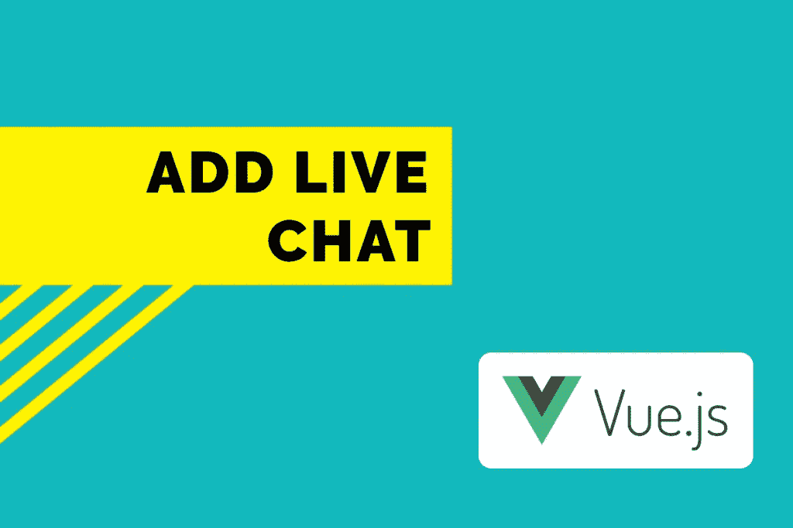
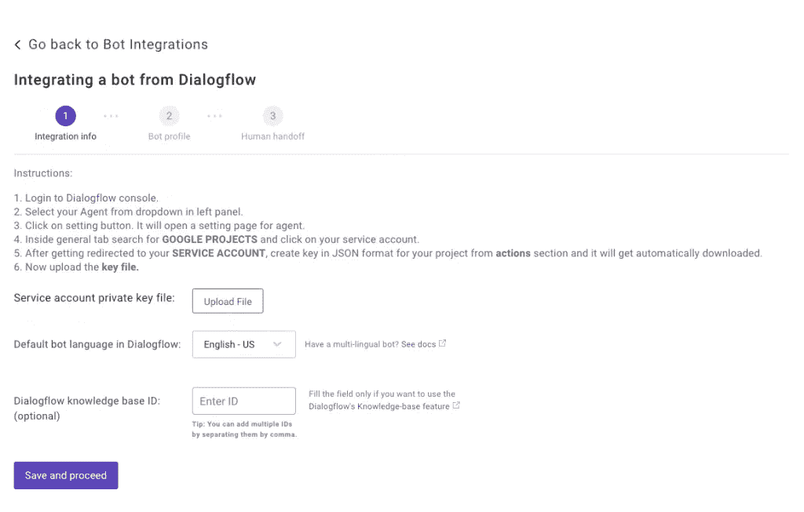

# 如何将聊天机器人添加到 Vue.js 应用程序中

> 原文：<https://javascript.plainenglish.io/how-to-add-chatbot-in-vue-js-apps-39f71882103e?source=collection_archive---------8----------------------->



在本帖中，我们将学习如何在 Vue.js 应用中添加聊天机器人。Vue.js 是一个开源的 JavaScript 框架，用于构建用户界面和单页面应用。

# 先决条件

首先，你需要一个 [Dialogflow](https://dialogflow.com/) 聊天机器人或者 Dialogflow 和 Vue JS 的工作知识。要将聊天机器人与 Vue.js 整合，你需要一个[通信](https://dashboard.kommunicate.io/signup?product=kommunicate)账户。所有上述工具都可以免费试用。

如果您没有 Dialogflow 聊天机器人，我们可以为您提供服务。点击从[下载免费样品。](https://docs.kommunicate.io/docs/bot-samples)

# 在 Vue 中添加 Dialogflow 聊天机器人的步骤。Js 应用程序

这里给出的说明解释了 Dialogflow 和 Vue js 是如何在 Kommunicate 的帮助下集成的。

注意:为了保持简单明了，本教程用非常基础和简单的代码开发来解释。我的 [Github](https://github.com/harishbala1o/chatwidget_vue) 上也有这个项目。要获得关于如何将机器人集成到网站的深入教程，你可以点击这里查看。

# 1.创建您的对话流聊天机器人

您可以在 Dialogflow 中轻松创建聊天机器人，或者编辑他们的[示例聊天机器人模板](https://cloud.google.com/dialogflow/docs/tutorials/samples)，或者下载我们的示例聊天机器人。更进一步，你可以创建你自己的意图实体。

如果你想了解更多关于 Dialogflow 聊天机器人开发的信息，请点击查看 Dialogflow [入门指南。](https://www.kommunicate.io/blog/beginners-guide-to-creating-chatbots-using-dialogflow/)

# 2.集成 Dialogflow 聊天机器人和通信

登录到您的通信仪表板，打开[机器人](https://dashboard.kommunicate.io/bots/bot-integrations)部分。如果您没有帐户，您可以在这里创建一个[。找到“对话流”部分，然后单击“设置”。](https://dashboard.kommunicate.io/signup?product=kommunicate)



# 3.集成聊天机器人—在 vue.js 应用程序中添加聊天机器人

现在，导航到您的 Dialogflow 控制台并下载服务帐户密钥文件。您可以在上面的图像/模式中找到下载服务密钥文件的步骤。

设置您的机器人的名称和个人资料图片，并选择是否允许机器人向人类移交。单击“完成 bot 集成设置”以完成集成。您的机器人现已集成。

您可以创建新的工作区并初始化 Vue.js 应用程序项目，或者通过使用 CLI 命令启动服务器来直接运行现有项目:

```
npm run serve
```

# 在 vue.js 组件中安装聊天机器人

要在 Vue.js 组件中安装聊天小部件，您可以创建一个新的组件文件，或者在现有的组件文件中添加[komunicate 安装代码](https://dashboard.kommunicate.io/settings/install)。解决这个问题的一个简单而有效的方法是将外部脚本添加到组件的“Vue mounted()”部分。

运行任何代码编辑器并打开您的工作区文件夹，以进一步导航到组件文件。

*注意:Vue 组件是创建自定义元素的 Vue.js 的重要特性之一，可以在 HTML 中重用。*

要安装聊天机器人，请打开 Kommunicate 并导航至仪表板→设置。点击配置部分下的[安装](https://dashboard.kommunicate.io/settings/install)。复制代码并将其添加到您的网站或应用程序中。

将 javascript 代码粘贴到组件文件中的 **<脚本>** 标签内。组件的代码应该如下所示:

```
<script>
export default {
    methods: {
    },
    mounted (){
      (function(d, m){
        var kommunicateSettings = {"appId":"YOUR_APP_ID","popupWidget":true,"automaticChatOpenOnNavigation":true};
        var s = document.createElement("script"); s.type = "text/javascript"; s.async = true;
        s.src = "https://widget.kommunicate.io/v2/kommunicate.app";
        var h = document.getElementsByTagName("head")[0]; h.appendChild(s);
        window.kommunicate = m; m._globals = kommunicateSettings;
      })(document, window.kommunicate || {});
    },
    data: function(){
    }
}
</script>
```

*注意:确保用安装部分*中提供的应用 Id 替换“您的应用 ID”。

npm run serve 命令启动服务器，监视您的文件，并在您对这些文件进行更改时重建应用程序。应用程序托管在您的本地主机上。

如果你运行浏览器，你应该看到一个聊天窗口弹出，这意味着你的聊天机器人准备好了。这就是如何在 Vue.js 应用程序中添加聊天机器人。

感谢阅读！

最初发表于 2020 年 3 月 17 日[https://www.kommunicate.io/blog/add-chatbot-vue-js-apps/](https://www.kommunicate.io/blog/add-chatbot-vue-js-apps/)