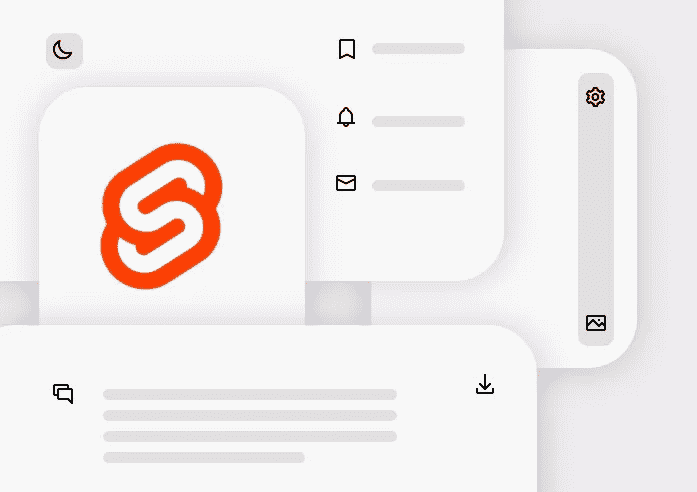
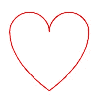

# 如何在 Svelte JS 应用程序中添加可定制的 SVG 图标

> 原文：<https://javascript.plainenglish.io/how-to-add-customizable-svg-icons-in-svelte-js-app-488648d302c8?source=collection_archive---------0----------------------->

## 创建您自己的图标包，并根据您的喜好进行定制



在设计应用程序的用户界面时，图标是最重要的使用元素。对图标使用 SVG 可以灵活地填充自定义颜色，使我们的应用程序更加独特。在本文中，我们可以看到如何使用 Svelte JS 以更好的方式使用 SVG 图标。

# 背后的想法

在 SVG 文件中，路径标签有一个名为**‘d’**的属性，用于绘制图标的路径和形状。签出创建心形路径图标的示例 SVG 文件。

```
<svg viewBox="0 0 100 100" >
  <path fill="none" stroke="red"
    d="M 10,30
       A 20,20 0,0,1 50,30
       A 20,20 0,0,1 90,30
       Q 90,60 50,90
       Q 10,60 10,30 z" />
</svg>
```



heart.svg

现在大多数开源图标包都支持 SVG。

在本文中，我使用了[英雄形象](https://github.com/refactoringui/heroicons)。我们可以使用任何图标包，也可以根据指导方针使用自己的 SVG 绘图插图。

我们的应用程序不需要所有的图标，这就是为什么只使用特定的图标更好。

> 💡所以,“T4”d,“T5”是我们创建可定制图标组件的关键。

让我们看看如何在 Svelte JS 应用程序中逐步实现它。

## **第 1 步:创建一个具有自定义属性 d 的苗条组件并填充**

SvgIcon.svelte

SvgIcon.svelte 组件具有可定制的填充属性，可以填充任何颜色。基于我们的用例，我们可以根据自己的需要定制其他属性。

## **第 2 步:创建我们自己的图标包 JS 文件**

AppIcons.js

我们使用 **d** 值，并使用图标名称导出

## **第 3 步:使用内注射成分**

TopBar.svelte

通过一点点的工作，我们可以用干净的代码以更好的方式使用 SVG 图标。

# 基本定制提示

当开始考虑定制时，有一些基本的事情需要考虑。

1.  大小
2.  颜色
3.  风格

## 大小

大多数情况下，我们必须使用文本图标，这与元素的字体大小有关。所以我们必须在 ***em 单位中定义默认大小，即 1em。***

图标是用基本的正方形尺寸绘制的，因此宽度和高度是相同的值。

大小与父字体的大小有关。

## 颜色

当基本样式都是相同颜色时，有填充颜色和描边颜色

## 风格

简单的两种风格填充和轮廓，采取轮廓图标和简单的填充颜色将工作的大部分时间。一些图标需要调整，这导致了高级思维风格。

基于这个基本参数，组件将…

Icon.svelte

用法为:

User.svelte

很简单！😎

# 接下来呢？

有很多我们可以做的 SVG 图标，其中一些对您的兴趣，多色图标，混合两种形状，添加填充模式，过渡动画，和 SVG 渐变等…

# 结论

考虑这样的方式，我们可以添加 SVG 图标来美化我们的 Svelte JS 应用程序，对 SVG 进行大量定制，并且零级依赖第三方。