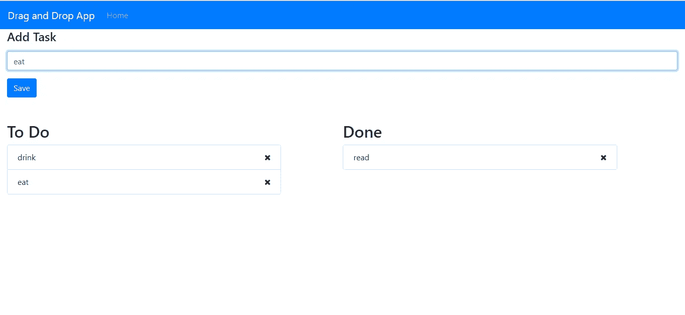

# 如何向 React 应用程序添加拖放功能

> 原文：<https://javascript.plainenglish.io/how-to-add-drag-and-drop-feature-to-your-react-app-20cb22fb180?source=collection_archive---------0----------------------->

**现在在**[**http://jauyeung.net/subscribe/**](http://jauyeung.net/subscribe/)**订阅我的邮件列表。**

**在推特上关注我**[**https://twitter.com/AuMayeung**](https://twitter.com/AuMayeung)

拖放是 web 应用程序中常用的功能。它提供了一种直观的数据操作方式。React 是一个用于构建 web UI 的优秀库，因为它以 React 组件的形式提供了高质量的拖放库。react-beautiful-dnd 是 JIRA 任务管理系统的创建者 Atlassian 写的。这是一个拖放库，是最容易集成到应用程序中的库之一。

在这个故事中，我们将构建一个包含拖放功能的待办事项列表。我们有一个主页，在顶部创建一个任务的表单，然后在它下面，将有两个并排的列表，左边的列表显示待办事项，右边的列表显示已完成的项目。也将有一个用户从 2 个列表中删除任务的方法。Redux 存储将用于存储整个待办事项列表。

为了开始构建应用程序，我们使用了一种最简单的方法，来自脸书的 Create React 应用程序。为了使用它，我们运行`npx create-react-app todo-app`。这将创建包含初始应用程序代码的项目文件夹。

接下来，我们安装一些我们需要的库。我们需要一个 HTTP 客户端，react-beautiful-dnd 库，Bootstrap，Redux 和 react 路由器。我们需要一个 HTTP 客户端来发出 HTTP 请求，Bootstrap 使样式变得容易，我们使用 React 路由器进行客户端路由。我们运行`npm i axios bootstrap react-bootstrap formik yup react-beautiful-dnd react-router-dom react-redux`来安装库。Axios 是我们的 HTTP 客户端，Formik 和 Yup 是表单验证库，可以与 React Bootstrap 一起使用，以节省创建表单的工作量。

安装好我们需要的所有库后，我们就可以开始编写应用程序了。我们把所有东西都放在`src`文件夹里，除非另有说明。首先，我们创建一个名为`actionCreator.js`的文件，并添加:

```
import { SET_TASKS } from './actions';const setTasks = (tasks) => {
    return {
        type: SET_TASKS,
        payload: tasks
    }
};export { setTasks };
```

我们创造了`action.js`,我们在里面放了:

```
const SET_TASKS = 'SET_TASKS';export { SET_TASKS };
```

这两个文件一起创建了我们分派给 Redux 存储的操作，我们将很快构建这个存储。

接下来在`App.js`中，我们用以下内容替换现有内容:

```
import React from 'react';
import { Router, Route, Link } from "react-router-dom";
import HomePage from './HomePage';
import { createBrowserHistory as createHistory } from 'history'
import Navbar from 'react-bootstrap/Navbar';
import Nav from 'react-bootstrap/Nav';
import './App.css';
const history = createHistory();function App() {
  return (
    <div className="App">
      <Router history={history}>
        <Navbar bg="primary" expand="lg" variant="dark" >
          <Navbar.Brand href="#home">Drag and Drop App</Navbar.Brand>
          <Navbar.Toggle aria-controls="basic-navbar-nav" />
          <Navbar.Collapse id="basic-navbar-nav">
            <Nav className="mr-auto">
              <Nav.Link href="/">Home</Nav.Link>
            </Nav>
          </Navbar.Collapse>
        </Navbar>
        <Route path="/" exact component={HomePage} />
      </Router>
    </div>
  );
}export default App;
```

这将在顶部添加导航栏，并让我们在底部显示我们定义的路线。主页应该是唯一的途径。

在`HomePage.js`中，我们输入:

```
import React from 'react';
import { useState, useEffect } from 'react';
import './HomePage.css';
import { DragDropContext, Droppable, Draggable } from 'react-beautiful-dnd';
import { connect } from 'react-redux';
import TaskForm from './TaskForm';
import { editTask, getTasks, deleteTask } from './requests';function HomePage({ tasks }) {
  const [items, setItems] = useState([]);
  const [todoItems, setTodoItems] = useState([]);
  const [doneItems, setDoneItems] = useState([]);
  const [initialized, setInitialized] = useState(false);const onDragEnd = async (evt) => {
    const { source } = evt;
    let item = {};
    if (source.droppableId == "todoDroppable") {
      item = todoItems[source.index];
      item.done = true;
    }
    else {
      item = doneItems[source.index];
      item.done = false;
    }
    await editTask(item);
    await getTodos();
  };const setAllItems = (data) => {
    if (!Array.isArray(data)) {
      return;
    }
    setItems(data);
    setTodoItems(data.filter(i => !i.done));
    setDoneItems(data.filter(i => i.done));
  }const getTodos = async () => {
    const response = await getTasks();
    setAllItems(response.data);
    setInitialized(true);
  }const removeTodo = async (task) => {
    await deleteTask(task.id);
    await getTodos();
  }useEffect(() => {
    setAllItems(tasks);
    if (!initialized) {
      getTodos();
    }
  }, [tasks]);return (
    <div className="App">
      <div className='col-12'>
        <TaskForm />
        <br />
      </div>
      <div className='col-12'>
        <div className='row list'>
          <DragDropContext onDragEnd={onDragEnd}>
            <Droppable droppableId="todoDroppable">
              {(provided, snapshot) => (
                <div
                  className='droppable'
                  ref={provided.innerRef}
                >
                  &nbsp;
                  <h2>To Do</h2>
                  <div class="list-group">
                    {todoItems.map((item, index) => (
                      <Draggable
                        key={item.id}
                        draggableId={item.id}
                        index={index}
                      >
                        {(provided, snapshot) => (
                          <div
                            className='list-group-item '
                            ref={provided.innerRef}
                            {...provided.draggableProps}
                            {...provided.dragHandleProps}
                          >
                            {item.description}
                            <a onClick={removeTodo.bind(this, item)}>
                              <i class="fa fa-close"></i>
                            </a>
                          </div>
                        )}
                      </Draggable>
                    ))}
                  </div>
                  {provided.placeholder}
                </div>
              )}
            </Droppable>
            <Droppable droppableId="doneDroppable">
              {(provided, snapshot) => (
                <div
                  className='droppable'
                  ref={provided.innerRef}
                >
                  &nbsp;
                  <h2>Done</h2>
                  <div class="list-group">
                    {doneItems.map((item, index) => (
                      <Draggable
                        key={item.id}
                        draggableId={item.id}
                        index={index}
                      >
                        {(provided, snapshot) => (
                          <div
                            className='list-group-item'
                            ref={provided.innerRef}
                            {...provided.draggableProps}
                            {...provided.dragHandleProps}
                          >
                            {item.description}
                            <a onClick={removeTodo.bind(this, item)}>
                              <i class="fa fa-close"></i>
                            </a>
                          </div>
                        )}
                      </Draggable>
                    ))}
                  </div>
                  {provided.placeholder}
                </div>
              )}
            </Droppable>
          </DragDropContext>
        </div>
      </div>
    </div>
  );
}const mapStateToProps = state => {
  return {
    tasks: state.tasks,
  }
}export default connect(
  mapStateToProps,
  null
)(HomePage);
```

这就是拖放逻辑所在的地方。我们有 2 个`Droppable`组件，其中有 2 个列表来存储待办事项和已完成事项。我们唯一需要的拖放处理程序是`onDragEnd`处理程序。这就是我们根据拖动项目的`source`更新任务项目的`done`标志的地方。如果我们从带有`todoDroppable`的`droppableId`的`Droppable`组件拖动，那么我们将`done`设置为`true`。否则，我们将`done`设置为`false`。完成之后，我们更新任务，然后获取最新的任务，并显示它们。我们还有一个删除任务的函数，叫做`removeTodo`，我们可以在这里删除一个任务。一旦它被删除，最新的名单将从后端获得。我们有`setAllItems`功能将任务分配到待办事项和已完成事项列表中。

在`useEffect`函数中，我们有第二个参数，数组的参数是`tasks`。这是为了触发被称为`tasks`变化的`useEffect`回调。如果你用其他道具替换`tasks`，同样的事情可以用于处理任何道具的改变。

在`HomePage.css`中，我们输入:

```
.item {
  padding: 20px;
  border: 1px solid black;
  width: 40vw;
}.list {
  margin-left: 0px;
}.list-group-item {
  display: flex;
  justify-content: space-between;
}.list-group-item a {
  cursor: pointer;
}.droppable {
  min-height: 100px;
  width: 40vw;
  margin-right: 9vw;
}
```

通过给列表增加一些间距来改变列表的风格。

对于添加任务，我们有一个专用的`TaskForm`组件来添加任务。我们创建一个名为`TaskForm.js`的文件，并添加:

```
import React from 'react';
import { Formik } from 'formik';
import Form from 'react-bootstrap/Form';
import Col from 'react-bootstrap/Col';
import Button from 'react-bootstrap/Button';
import * as yup from 'yup';
import { addTask, getTasks } from './requests';
import { connect } from 'react-redux';
import { setTasks } from './actionCreators';
import './TaskForm.css';const schema = yup.object({
    description: yup.string().required('Description is required'),
});function ContactForm({ setTasks }) {
    const handleSubmit = async (evt) => {
        const isValid = await schema.validate(evt);
        if (!isValid) {
            return;
        }
        await addTask(evt);
        const response = await getTasks();
        setTasks(response.data);
    }return (
        <div className="form">
            <Formik
                validationSchema={schema}
                onSubmit={handleSubmit}
            >
                {({
                    handleSubmit,
                    handleChange,
                    handleBlur,
                    values,
                    touched,
                    isInvalid,
                    errors,
                }) => (
                        <Form noValidate onSubmit={handleSubmit}>
                            <Form.Row>
                                <Form.Group as={Col} md="12" controlId="firstName">
                                    <Form.Label>
                                        <h4>Add Task</h4>
                                    </Form.Label>
                                    <Form.Control
                                        type="text"
                                        name="description"
                                        placeholder="Task Description"
                                        value={values.description || ''}
                                        onChange={handleChange}
                                        isInvalid={touched.description && errors.description}
                                    />
                                    <Form.Control.Feedback type="invalid">
                                        {errors.description}
                                    </Form.Control.Feedback>
                                </Form.Group>
                            </Form.Row>
                            <Button type="submit" style={{ 'marginRight': '10px' }}>Save</Button>
                        </Form>
                    )}
            </Formik>
        </div>
    );
}ContactForm.propTypes = {
}const mapStateToProps = state => {
    return {
        tasks: state.tasks,
    }
}const mapDispatchToProps = dispatch => ({
    setTasks: tasks => dispatch(setTasks(tasks))
})export default connect(
    mapStateToProps,
    mapDispatchToProps
)(ContactForm);
```

我们有带表单验证的添加任务表单，用于检查描述是否已填写。一旦它有效，我们就把它提交给后端，然后获取最新的任务，并把它们存储在我们的 Redux 存储中。这些都在`handleSubmit`函数中完成。注意，我们只是用 Yup 库创建了一个`schema`对象，然后将它传递给`Formik`组件的`validationSchema`对象，然后`Formik`组件提供了`handleChange`函数、`values`对象和`errors`对象，我们可以直接在 React Bootstrap 表单中使用它们，这样我们就不用自己编写所有的更改处理程序代码了。我们还需要在`values`属性的末尾添加`|| ‘’`，以便`value`属性始终保持定义，防止触发不受控制的输入错误。文件底部的`mapStateToProps`将商店中的`tasks`状态映射到我们组件的`tasks`道具，而`mapDispatchToProps`将我们的`setTasks`分派函数映射到`TaskForm`组件的道具，我们使用该函数来更新带有任务的商店。

接下来在`index.js`中，我们将现有代码替换为:

```
import React from 'react';
import ReactDOM from 'react-dom';
import './index.css';
import App from './App';
import * as serviceWorker from './serviceWorker';
import { tasksReducer } from './reducers';
import { Provider } from 'react-redux'
import { createStore, combineReducers } from 'redux'const taskskApp = combineReducers({
    tasks: tasksReducer,
})const store = createStore(taskskApp);ReactDOM.render(
    <Provider store={store}>
        <App />
    </Provider>
    , document.getElementById('root'));// If you want your app to work offline and load faster, you can change
// unregister() to register() below. Note this comes with some pitfalls.
// Learn more about service workers: [https://bit.ly/CRA-PWA](https://bit.ly/CRA-PWA)
serviceWorker.unregister();
```

以便我们可以使用我们在应用程序中创建的 Redux 商店。

然后我们创建一个名为`reducers.js`的文件，并添加:

```
import { SET_TASKS } from './actions';function tasksReducer(state = {}, action) {
    switch (action.type) {
        case SET_TASKS:
            state = JSON.parse(JSON.stringify(action.payload));
            return state;
        default:
            return state
    }
}export { tasksReducer };
```

以便我们可以将任务存储到存储中。

接下来，我们创建一个名为`requests.js`的文件来存储我们发出的 HTTP 请求的函数代码。我们补充:

```
const APIURL = '[http://localhost:3000'](http://localhost:3000');
const axios = require('axios');
export const getTasks = () => axios.get(`${APIURL}/tasks`);export const addTask = (data) => axios.post(`${APIURL}/tasks`, data);export const editTask = (data) => axios.put(`${APIURL}/tasks/${data.id}`, data);export const deleteTask = (id) => axios.delete(`${APIURL}/tasks/${id}`);
```

让我们对我们的任务进行 CRUD 操作。用于`HomePage`和`TaskForm`组件。

在`public/index.html`中，我们将现有代码替换为:

```
<!DOCTYPE html>
<html lang="en"><head>
  <meta charset="utf-8" />
  <link rel="shortcut icon" href="%PUBLIC_URL%/favicon.ico" />
  <meta name="viewport" content="width=device-width, initial-scale=1" />
  <meta name="theme-color" content="#000000" />
  <meta name="description" content="Web site created using create-react-app" />
  <link rel="apple-touch-icon" href="logo192.png" />
  <!--
      manifest.json provides metadata used when your web app is installed on a
      user's mobile device or desktop. See [https://developers.google.com/web/fundamentals/web-app-manifest/](https://developers.google.com/web/fundamentals/web-app-manifest/)
    -->
  <link rel="manifest" href="%PUBLIC_URL%/manifest.json" />
  <!--
      Notice the use of %PUBLIC_URL% in the tags above.
      It will be replaced with the URL of the `public` folder during the build.
      Only files inside the `public` folder can be referenced from the HTML.Unlike "/favicon.ico" or "favicon.ico", "%PUBLIC_URL%/favicon.ico" will
      work correctly both with client-side routing and a non-root public URL.
      Learn how to configure a non-root public URL by running `npm run build`.
    -->
  <title>React Drag and Drop App</title>
  <link rel="stylesheet" href="[https://maxcdn.bootstrapcdn.com/bootstrap/4.3.1/css/bootstrap.min.css](https://maxcdn.bootstrapcdn.com/bootstrap/4.3.1/css/bootstrap.min.css)"
    integrity="sha384-ggOyR0iXCbMQv3Xipma34MD+dH/1fQ784/j6cY/iJTQUOhcWr7x9JvoRxT2MZw1T" crossorigin="anonymous" />
  <link href="[https://stackpath.bootstrapcdn.com/font-awesome/4.7.0/css/font-awesome.min.css](https://stackpath.bootstrapcdn.com/font-awesome/4.7.0/css/font-awesome.min.css)" rel="stylesheet"
    integrity="sha384-wvfXpqpZZVQGK6TAh5PVlGOfQNHSoD2xbE+QkPxCAFlNEevoEH3Sl0sibVcOQVnN" crossorigin="anonymous">
</head><body>
  <noscript>You need to enable JavaScript to run this app.</noscript>
  <div id="root"></div>
  <!--
      This HTML file is a template.
      If you open it directly in the browser, you will see an empty page.You can add webfonts, meta tags, or analytics to this file.
      The build step will place the bundled scripts into the <body> tag.To begin the development, run `npm start` or `yarn start`.
      To create a production bundle, use `npm run build` or `yarn build`.
    -->
</body></html>
```

我们添加了 Bootstrap CSS 和字体 Awesome 图标，这样我们就得到了在`HomePage`的`i`标签中使用的 Bootstrap 样式和`close`图标。

要启动后端，我们首先通过运行`npm i json-server`来安装`json-server`包。然后转到我们的项目文件夹并运行:

```
json-server --watch db.json
```

在`db.json`中，将文本更改为:

```
{
  "tasks": [
  ]
}
```

这样我们就有了在`requests.js`中定义的`tasks`端点可用。

