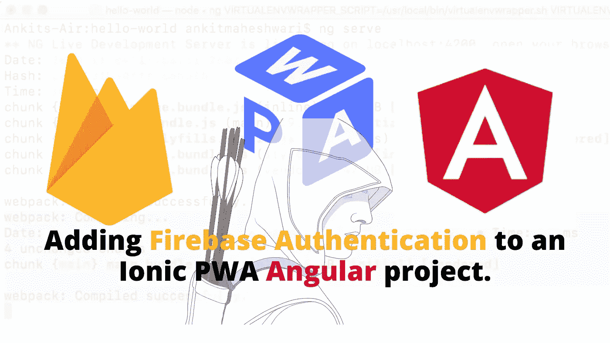
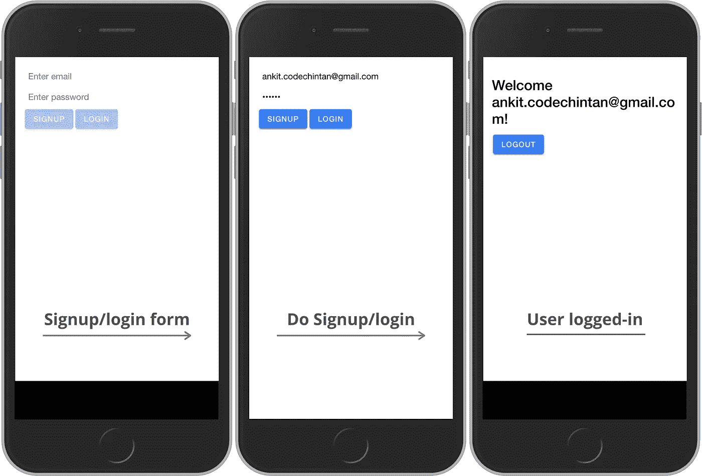

# 如何使用 AngularFire 为 PWA 或 Angular 项目添加 Firebase 认证？

> 原文：<https://javascript.plainenglish.io/how-to-add-firebase-authentication-to-pwa-or-angular-project-using-angularfire-83a8f61d367c?source=collection_archive---------0----------------------->

学习使用 Firebase 认证服务在你的 PWA ( [渐进式网络应用](https://medium.com/@AnkitMaheshwariIn/how-to-build-pwas-progressive-web-apps-using-angular-ionic-framework-and-firebase-hosting-bfe43e025eba))或 [Angular 应用](https://medium.com/@AnkitMaheshwariIn/how-to-build-pwas-progressive-web-apps-using-angular-ionic-framework-and-firebase-hosting-bfe43e025eba)中实现注册/登录——它支持使用密码、电话、谷歌、脸书、Twitter 等其他提供商的*认证。*

**

> ****了解 AngularFireAuth****:
> 我们将使用 AngularFireAuth 进行认证——AngularFireAuth 是 AngularFire 的一个库，官方支持 AngularJS 绑定 Firebase。**

*`AngularFireAuth.user`为我们提供了一个`Observable<User|null>`来监控我们的应用程序的认证状态。*

*`AngularFireAuth.auth`返回一个初始化的`firebase.auth.Auth`实例，允许我们让用户登录、退出等。[有关可用方法的更多信息，请参见 Firebase 文档。](https://firebase.google.com/docs/reference/js/firebase.auth.Auth)*

***如果你已经有了自己的项目，那很好。**
如果没有，请跟随[链接](https://medium.com/@AnkitMaheshwariIn/how-to-build-pwas-progressive-web-apps-using-angular-ionic-framework-and-firebase-hosting-bfe43e025eba)。
[点击此处👆](https://medium.com/@AnkitMaheshwariIn/how-to-build-pwas-progressive-web-apps-using-angular-ionic-framework-and-firebase-hosting-bfe43e025eba)创建您的[新 PWA/Angular 项目](https://medium.com/@AnkitMaheshwariIn/how-to-build-pwas-progressive-web-apps-using-angular-ionic-framework-and-firebase-hosting-bfe43e025eba)。*

> *在第一步中，我们将添加 Firebase 到一个角度项目(#1)*
> 
> *然后启用电子邮件/密码登录方法(#2)*
> 
> *跟我来，我会告诉你我们如何做...*

# *#1 将 Firebase 添加到 Angular 项目中。*

*在开始之前，我们需要通过添加 Firebase 在我们的项目中设置 Firebase 配置。点击链接添加 Firebase —点击此处👇👇*

*[](https://medium.com/@AnkitMaheshwariIn/how-to-add-firebase-in-pwa-or-angular-project-using-angularfire-b0379c08249d) [## 如何使用 AngularFire 在 PWA 或 Angular project 中添加 Firebase？

### 使用 AngularFire 在 PWA/ion/Angular 项目中设置 Firebase 配置。

medium.com](https://medium.com/@AnkitMaheshwariIn/how-to-add-firebase-in-pwa-or-angular-project-using-angularfire-b0379c08249d) 

将 Firebase/AngularFire 添加到项目中后，请遵循#2。* 

# *#2 在 Firebase 控制台的身份验证部分启用电子邮件/密码登录方法。*

*[点击这里打开 Firebase 控制台](https://console.firebase.google.com/)然后在你的 Firebase 项目下点击`Authentication`然后点击`Sign-in method`然后在`Sign-in providers`下 T25【启用邮箱/密码】状态。*

*接下来…我们将使用`AngularFireAuthModule`模块配置我们的应用程序模块。让我们通过在我们的`app.module.ts`文件中导入相应的 AngularFireAuthModule(AngularFireAuthModule)来完成这个:*

*(还要注意，我们正在导入并提供一个`AuthService`。接下来我们将创建该服务。我们还需要导入`FormsModule`来使用`ngModel` [指令](https://medium.com/@AnkitMaheshwariIn/angular-template-syntax-directive-interpolation-property-binding-event-binding-part-4-547e2512d8fe)，我们将在本文后面使用它。)*

```
*import { AngularFireModule } from '@angular/fire';
import { AngularFireAuthModule } from '@angular/fire/auth';
import { FormsModule } from '@angular/forms';
import { AuthService } from './auth.service';
...
imports: [
    BrowserModule,
    AngularFireModule.initializeApp(environment.firebase),
    AngularFireAuthModule,
    FormsModule
  ],
providers: [
    ...
    AuthService
],
...*
```

# *#3 创建授权服务。*

*我们的服务将是一个允许我们`login`、`signup`或`logout`用户的中心位置，因此我们将为这 3 个动作定义方法。所有的认证逻辑都在`AuthService`中，这将允许我们创建不需要实现任何认证逻辑的组件，并有助于保持组件的简单性。*

*我们可以使用 Angular CLI 为服务创建框架，运行以下命令:*

```
*ng g s service/auth*
```

*(其中`g` *→生成，* `*s*` *→服务，* `*auth*` *→服务名，* `*service/auth*` *表示将* `AuthService`创建到`service`文件夹中)*

*接下来，打开您的`src/app/service/**auth.service.ts**`文件并添加以下代码:*

```
*// auth.service.ts
import { Injectable } from '@angular/core';
import { AngularFireAuth } from '@angular/fire/auth';
import { Observable } from 'rxjs';

@Injectable({
  providedIn: 'root'
})
export class AuthService {
  user: Observable<firebase.User>;

  constructor(private firebaseAuth: AngularFireAuth) {
    this.user = firebaseAuth.authState;
  }

  signup(email: string, password: string) {
    this.firebaseAuth
      .createUserWithEmailAndPassword(email, password)
      .then(value => {
        console.log('Success!', value);
      })
      .catch(err => {
        console.log('Something went wrong:',err.message);
      });
  }

  login(email: string, password: string) {
    this.firebaseAuth
      .signInWithEmailAndPassword(email, password)
      .then(value => {
        console.log('Nice, it worked!');
      })
      .catch(err => {
        console.log('Something went wrong:',err.message);
      });
  }

  logout() {
    this.firebaseAuth.signOut();
  }
}*
```

*你会注意到`**AngularFireAuth.auth**`(`auth.service.ts`的第 18、30 行)上可用的方法都返回承诺，所以我们可以使用`then`和`catch`分别处理成功和错误状态。*

*我们使用`createUserWithEmailAndPassword`(`auth.service.ts`的第 18 行)和`signInWithEmailAndPassword`(`auth.service.ts`的第 30 行)在这里我们设置了电子邮件/密码认证——等同的方法也可用于 Twitter、脸书和谷歌的认证。*

# *#4 组件类和模板。*

*现在我们已经准备好了身份验证服务，创建一个允许我们登录、注册或注销组件非常简单:*

*打开您的`src/app/**app.component.ts**`文件并添加以下代码:*

```
*/*
  file-name: app.component.ts
  *****
  The important code for logging-in, signing-up or logging-out are:
  — import 'AuthService'
  — declare variable 'email' and 'password'
  — inject service 'authService' at constructor
  — method for signup()
  — method for login()
  — method for logout()
*/

...
import { AuthService } from './service/auth.service';

@Component({
  selector: 'app-root',
  templateUrl: 'app.component.html',
  styleUrls: ['app.component.scss']
})
export class AppComponent {
  email: string;
  password: string;
  ...

  constructor(public authService: AuthService) {
    ...
  }

  signup() {
    this.authService.signup(this.email, this.password);
    this.email = this.password = '';
  }

  login() {
    this.authService.login(this.email, this.password);
    this.email = this.password = '';    
  }

  logout() {
    this.authService.logout();
  }
}*
```

*我们在组件的构造函数中注入服务(`authService` at constructor)，然后定义调用 auth 服务上的等效方法的本地方法。*

*我们用关键字`public`而不是`private`注入服务(`authService`，这样我们也可以直接从模板中访问服务属性。*

*该模板非常简单，使用 authService 的用户对象上的[](https://medium.com/@AnkitMaheshwariIn/use-promises-async-await-in-place-of-javascript-callbacks-5460ee7aa260)****(**[**单击此处**](https://medium.com/@AnkitMaheshwariIn/use-promises-async-await-in-place-of-javascript-callbacks-5460ee7aa260) **)** 来确定用户是否登录:***

***打开您的`src/app/**app.component.html**`文件并更新代码:***

***我们的输入字段有双向绑定 **(** [**点击这里**](https://medium.com/@AnkitMaheshwariIn/use-promises-async-await-in-place-of-javascript-callbacks-5460ee7aa260) **)** 到我们的组件类中的 email 和密码值，使用`ngModel`和 box of bananas [ `**(**` ngModel `**)**`。***

******

# ***搞定了。🤩添加 Firebase 身份验证就是这么简单。***

***再见👋👋***

# ***接下来，您可以涵盖:***

1.  ***如何使用 Firestore 在 Firebase 中进行 [CRUD 操作。(](https://medium.com/@AnkitMaheshwariIn/how-to-do-crud-query-operations-in-firebase-with-firestore-angular-ionic-web-cfd662165fd7)[点击这里👆](https://medium.com/@AnkitMaheshwariIn/how-to-do-crud-query-operations-in-firebase-with-firestore-angular-ionic-web-cfd662165fd7))***
2.  ***[将项目](https://medium.com/@AnkitMaheshwariIn/deploy-project-to-firebase-hosting-ce6acbd06435)部署到 Firebase 主机。([点击这里👆](https://medium.com/@AnkitMaheshwariIn/deploy-project-to-firebase-hosting-ce6acbd06435))***

> ***请在评论框中随意评论…如果我错过了什么，或者什么是不正确的，或者什么对你不起作用:)***
> 
> ***更多文章敬请关注:【https://medium.com/@AnkitMaheshwariIn】***

***如果你不介意给它一些掌声👏 👏既然有帮助，我会非常感谢:)帮助别人找到这篇文章，所以它可以帮助他们！***

***永远鼓掌…***

******

****原载于 2019 年 12 月 20 日*[*https://www.codewithchintan.com*](https://www.codewithchintan.com/how-to-add-firebase-authentication-to-pwa-or-angular-project-using-angularfire-with-ionic4-and-angular/)*。****

***【JavaScript 用简单英语写的一句话:我们总是对帮助推广优质内容感兴趣。如果你有一篇文章想用简单的英语提交给 JavaScript，用你的中级用户名发邮件到 submissions@javascriptinplainenglish.com，我们会把你添加为作者。***