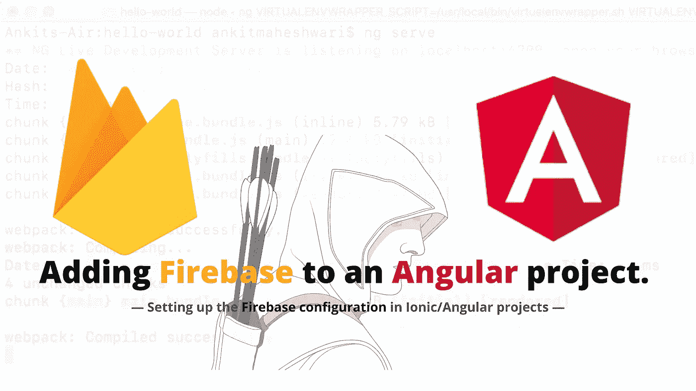
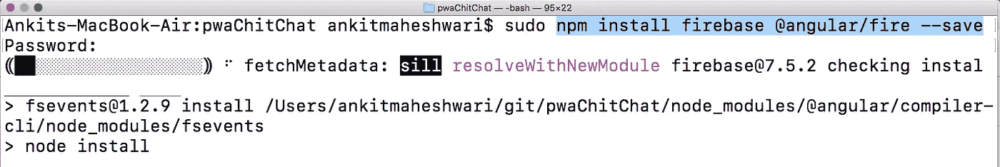
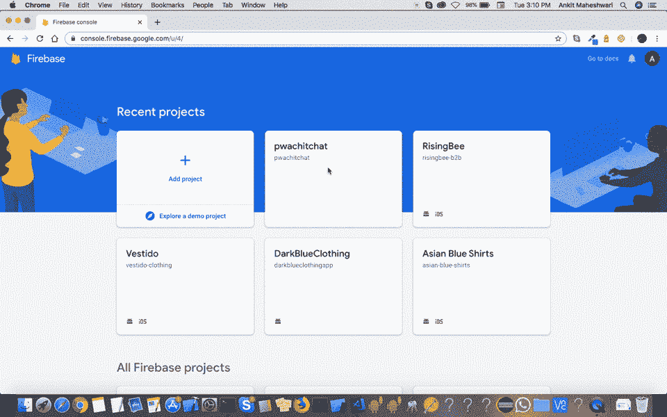

# 如何使用 AngularFire 在 PWA 或 Angular 项目中添加 Firebase。

> 原文：<https://javascript.plainenglish.io/how-to-add-firebase-in-pwa-or-angular-project-using-angularfire-b0379c08249d?source=collection_archive---------2----------------------->



使用 AngularFire 在 PWA/ion/Angular 项目中设置 Firebase 配置。

**AngularFire 是连接 Angular 和 Firebase 的官方图书馆。**
angral fire 包括实时数据库、Firebase 身份验证、云 Firestore 和云存储模块。

**如果你已经有了自己的项目，那就太好了。**如果没有，请按照[链接](https://medium.com/@AnkitMaheshwariIn/how-to-build-pwas-progressive-web-apps-using-angular-ionic-framework-and-firebase-hosting-bfe43e025eba)。
[点击此处👆](https://medium.com/@AnkitMaheshwariIn/how-to-build-pwas-progressive-web-apps-using-angular-ionic-framework-and-firebase-hosting-bfe43e025eba)创建您的[新 PWA/Angular 项目](https://medium.com/@AnkitMaheshwariIn/how-to-build-pwas-progressive-web-apps-using-angular-ionic-framework-and-firebase-hosting-bfe43e025eba)。

# 开始前..

**我们需要创建** [**并设置一个**](https://medium.com/@AnkitMaheshwariIn/steps-to-setup-firebase-firestore-instruction-to-setup-firebase-firestore-database-c7cc49ce96de)**Firebase 项目。**
[点击此处👆](https://medium.com/@AnkitMaheshwariIn/steps-to-setup-firebase-firestore-instruction-to-setup-firebase-firestore-database-c7cc49ce96de)获取设置 Firebase 的步骤-通过 web 在 Firebase Firestore 中创建新数据库。

> 好吧，我假设你已经按照上面链接的每一步来建立一个 Firebase 项目。

#接下来要安装依赖项，在您的项目根目录下运行以下命令:(从 npm 安装 Firebase 和 AngularFire)

```
sudo npm install firebase @angular/fire --save
```

(将`sudo`置为管理员执行该命令-对于 **Mac/Linux 用户**和 **Windows 用户** *→搜索命令提示符→右键单击然后单击“以管理员身份运行”* | `**sudo**`对于 Windows 用户来说不是必需的)



Run: [ **npm install firebase @angular/fire — save** ] in your terminal/command-prompt

#接下来，我们需要在我们的 Angular 环境文件中设置 firebase 配置。要添加 firebase 配置详细信息，请打开您的环境文件:

```
(for local👇) YOUR-PROJECT-DIRECTORY/src/environments/environment.ts (for production👇) YOUR-PROJECT-DIRECTORY/src/environments/environment.prod.ts
```

在`environment`中增加`firebase`配置参数:

```
export const environment = {
  production: false,
  firebase: {
    apiKey: 'YOUR_API_KEY',
    authDomain: 'YOUR_AUTH_DOMAIN',
    databaseURL: 'YOUR_DATABASE_URL',
    projectId: 'YOUR_PROJECT_ID',
    storageBucket: 'YOUR_STORAGE_BUCKET',
    messagingSenderId: 'YOUR_SENDER_ID'
  }
};
```

将以上**环境**配置分别添加到您的 project_directory/ **环境中，ts** 和 project_directory/ **环境中，产品 ts** 文件分别用于测试和生产环境。

打开`[Overview](https://console.firebase.google.com/)`*→*`Select Your Project`*→*`Project Overview`*→*`Click over 'Add app'`*→*`Click over Web`*→*`Then Add details to get your configurations`，可以在 firebase 控制台中**找到你的 Firebase 配置。**



Follow this to get **firebase configuration** details.

**在`app.module.ts`文件中导入相应的 AngularFire 模块，完成设置**:

```
import { AngularFireModule } from '@angular/fire';
import { AngularFirestore } from '@angular/fire/firestore';
import { AngularFireAuthModule } from '@angular/fire/auth';
import { AngularFireMessagingModule } from '@angular/fire/messaging';
import { AngularFireStorageModule, StorageBucket } from '@angular/fire/storage';

...
imports: [
    BrowserModule,
    AngularFireModule.initializeApp(environment.firebase),
    AngularFireAuthModule,
    AngularFireMessagingModule,
    AngularFireStorageModule,
    ...
  ],
  providers: [
    ...
    AngularFirestore,
    { provide: StorageBucket },
    ...
  ],
...
```

> 接下来，在使用 Firestore 数据库时，您可能会遇到一个错误。
> **错误:“云 Firestore API 不可用于云数据存储项目。”**
> **要避免此错误:您必须“启用并创建 Firestore 数据库”。**
> 这样做**检查这段视频**👇👇
> (你可以在 [**Firebase 控制台**](https://console.firebase.google.com/) **找到你的 Firebase 项目数据库)。)**

# 搞定了。🤩添加和配置 Firebase 就是这么简单。

再见👋👋

# 接下来，您可以涵盖:

1.  如何使用 Firestore 在 Firebase 中进行 [CRUD 操作。(](https://medium.com/@AnkitMaheshwariIn/how-to-do-crud-query-operations-in-firebase-with-firestore-angular-ionic-web-cfd662165fd7)[点击这里👆](https://medium.com/@AnkitMaheshwariIn/how-to-do-crud-query-operations-in-firebase-with-firestore-angular-ionic-web-cfd662165fd7))
2.  [使用 AngularFire 将 Firebase 认证](https://medium.com/@AnkitMaheshwariIn/how-to-add-firebase-authentication-to-pwa-or-angular-project-using-angularfire-83a8f61d367c)添加到 PWA 或 Angular 项目。([点击这里👆](https://medium.com/@AnkitMaheshwariIn/how-to-add-firebase-authentication-to-pwa-or-angular-project-using-angularfire-83a8f61d367c))
3.  [将项目](https://medium.com/@AnkitMaheshwariIn/deploy-project-to-firebase-hosting-ce6acbd06435)部署到 Firebase 主机。([点击这里👆](https://medium.com/@AnkitMaheshwariIn/deploy-project-to-firebase-hosting-ce6acbd06435))

> 请在评论框中随意评论…如果我错过了什么，或者什么是不正确的，或者什么对你不起作用:)
> 
> 更多文章敬请关注:
> [https://medium.com/@AnkitMaheshwariIn](https://medium.com/@AnkitMaheshwariIn)

如果你不介意给它一些掌声👏 👏既然有帮助，我会非常感谢:)帮助别人找到这篇文章，所以它可以帮助他们！

永远鼓掌…


*原载于 2019 年 12 月 20 日*[*【https://www.codewithchintan.com*](https://www.codewithchintan.com/how-to-add-firebase-to-pwa-or-an-angular-project-using-angularfire)*。*