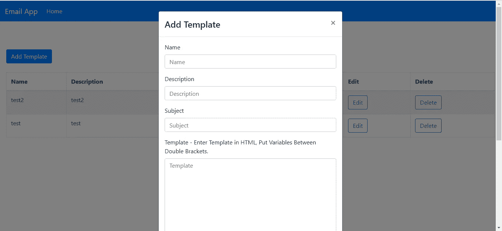
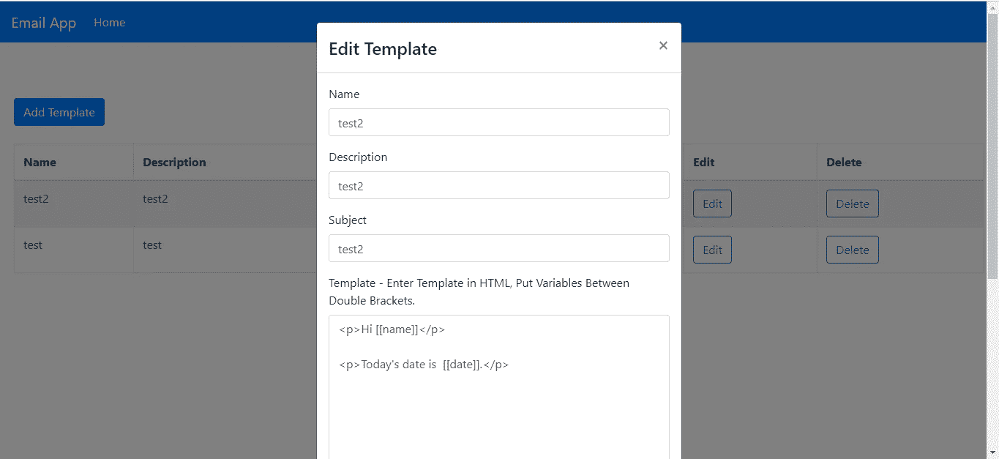
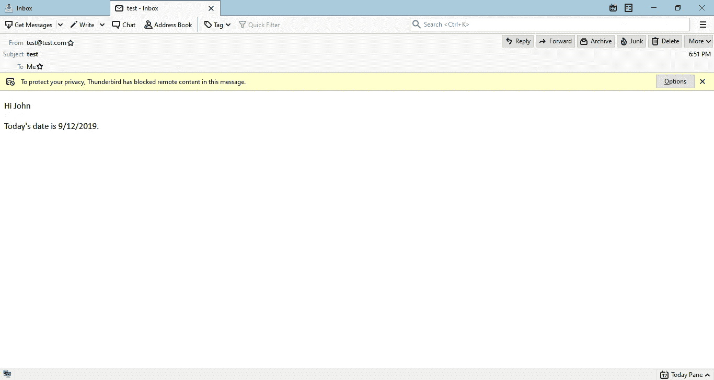
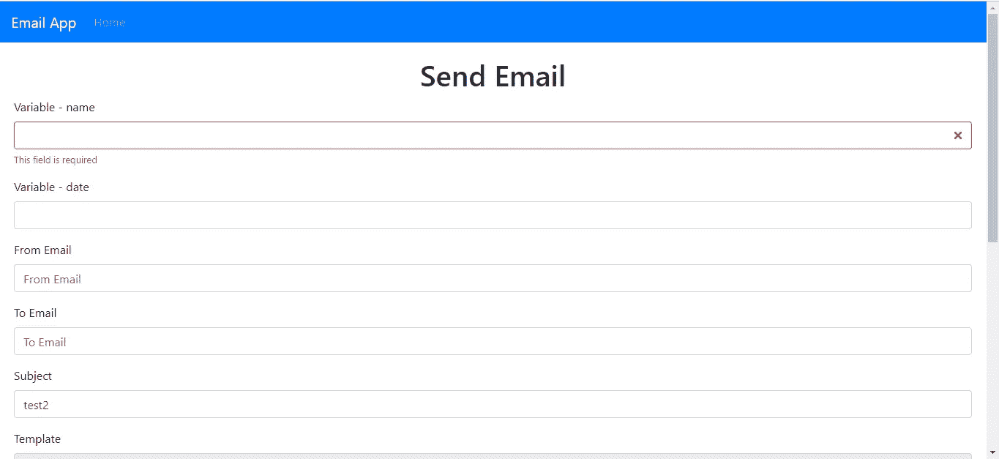

# 如何添加表单验证来反应动态表单

> 原文：<https://javascript.plainenglish.io/how-to-add-form-validation-to-dynamic-forms-1a3dbddb80f?source=collection_archive---------0----------------------->


Photo by [Martin Schmidli](https://unsplash.com/@martin_schmidli?utm_source=medium&utm_medium=referral) on [Unsplash](https://unsplash.com?utm_source=medium&utm_medium=referral)

动态表单是从一些动态数据派生的表单。它们没有被硬编码到代码中。通常，它们是通过遍历一些数据并从数据中呈现表单来显示的。

使用 Yup 可以很容易地遍历对象的字段，然后将它们添加到您的验证模式中，从而允许您验证没有固定字段的表单。

可以像这样构建一个示例 Yup 模式:

```
let schemaObj = {
  to: yup.string().required("This field is required"),
  from: yup.string().required("This field is required"),
  subject: yup.string().required("This field is required")
};fields.forEach(f => {
  schemaObj[f] = yup.string().required("This field is required");
});let newSchema = yup.object(schemaObj);
```

我们遍历`fields` 来获取占位符，并将它们添加到`schema` 对象中。这就是使用 Yup 添加动态字段进行验证所需的全部内容。

在本文中，我们将构建一个允许用户输入电子邮件模板的应用程序。然后，他们可以使用这些模板通过 SendGrid API 向不同的电子邮件地址发送电子邮件。我们的应用程序将包括后端和前端。前端会用 React 构建，后端会用 Express 构建。

SendGrid 是 Twilio 为发送电子邮件提供的一项出色服务。我们使用 SendGrid 来为我们做艰苦的工作，而不是建立自己的电子邮件服务器来发送带有应用程序的电子邮件。它还减少了电子邮件成为垃圾邮件的机会，因为它是一项众所周知的值得信赖的服务。

它也有很容易使用的各种平台发送电子邮件的图书馆。Node.js 是受支持的平台之一。

要使用 SendGrid 发送电子邮件，运行`npm i @sendgrid/mail`安装 SendGrid SDK 包。然后在您的代码中，添加`const sgMail = require(‘@sendgrid/mail’);`来导入已安装的包。

然后，在您的代码中，您通过以下方式发送电子邮件:

```
sgMail.setApiKey(process.env.SENDGRID_API_KEY);
const msg = {
  to: email,
  from: 'email@example.com',
  subject: 'Example Email',
  text: `
    Dear user,    Here is your email.
  `,
  html: `
    <p>Dear user,</p>    <p>Here is your email.</p>
  `,
};
sgMail.send(msg);
```

其中`process.env.SENDGRID_API_KEY`是 SendGrid 的 API，它应该作为一个环境变量存储，因为它是一个秘密。

# 后端

首先，我们将创建一个项目文件夹，并在其中添加一个`backend`文件夹。我们将使用 Express Generator 为我们的项目生成代码。为此，运行`backend`文件夹中的`npx express-generator`。然后运行`npm i`安装`package.json`中列出的软件包。

接下来，我们安装自己的软件包。我们将使用 Sequelize 作为我们的 ORM，Babel 用于使用最新的 JavaScript 特性，Dotenv 用于存储环境变量，SendGrid Nodejs 用于发送电子邮件，CORS 用于支持前端的跨域请求，SQLite3 用于数据库。

要安装它们，运行`npm i @babel/cli @babel/core @babel/node @babel/preset-env @sendgrid/mail cors sendgrid-nodejs sequelize sqlite3`。

安装好这些之后，我们就可以开始构建后端了。首先，我们添加`.babelrc`来使我们的应用程序中的 Babel 能够使用最新的 JavaScript 解释器运行应用程序。为此，将`.babelrc`添加到`backend`文件夹中，并添加:

```
{
    "presets": [
        "[@babel/preset-env](http://twitter.com/babel/preset-env)"
    ]
}
```

然后在`package.json`中，在`scripts`部分用以下代码替换现有代码:

```
"start": "nodemon --exec npm run babel-node --  ./bin/www",
"babel-node": "babel-node"
```

这让我们可以运行最新的 Babel Node 运行时，而不是常规的 Node 运行时，这样我们就可以使用最新的 JavaScript 特性，比如`import`

接下来，运行 Sequelize CLI 来创建数据库样板代码，并为创建数据库进行迁移。运行`backend`文件夹中的`npx sequelize-cli init`，就会得到`config.json`。在`config.json`中，将现有代码改为:

```
{
  "development": {
    "dialect": "sqlite",
    "storage": "development.db"
  },
  "test": {
    "dialect": "sqlite",
    "storage": "test.db"
  },
  "production": {
    "dialect": "sqlite",
    "storage": "production.db"
  }
}
```

然后我们创建我们的数据迁移。运行:

```
npx sequelize-cli model:create --name EmailTemplate --attributes name:string,type:string,template:text,subject,previewText:string
```

在 SQLite 数据库中创建`EmailTemplates`表。上面的命令也应该为这个表创建相应的模型。

接下来运行`npx sequelize-cli db:migrate`创建数据库。

现在我们可以继续创建我们的路线。在`routes`文件夹中创建一个名为`email.js`的文件，并添加:

```
var express = require("express");
const models = require("../models");
const sgMail = require("[@sendgrid/mail](http://twitter.com/sendgrid/mail)");
sgMail.setApiKey(process.env.SENDGRID_API_KEY);
var router = express.Router();router.get("/templates", async (req, res, next) => {
  const templates = await models.EmailTemplate.findAll();
  res.json(templates);
});router.get("/template/:id", async (req, res, next) => {
  const id = req.params.id;
  const templates = await models.EmailTemplate.findAll({ where: { id } });
  res.json(templates[0]);
});router.post("/template", async (req, res, next) => {
  try {
    const template = await models.EmailTemplate.create(req.body);
    res.json(template);
  } catch (ex) {
    res.json(ex);
  }
});router.put("/template/:id", async (req, res, next) => {
  try {
    const id = req.params.id;
    const { name, description, template, subject } = req.body;
    const temp = await models.EmailTemplate.update(
      {
        name,
        description,
        template,
        subject
      },
      {
        where: { id }
      }
    );
    res.json(temp);
  } catch (ex) {
    res.json(ex);
  }
});router.delete("/template/:id", async (req, res, next) => {
  try {
    const id = req.params.id;
    await models.EmailTemplate.destroy({ where: { id } });
    res.json({});
  } catch (ex) {
    res.json(ex);
  }
});router.post("/send", async (req, res, next) => {
  try {
    const { template, variables, to, subject, from } = req.body;
    let html = template;
    Object.keys(variables).forEach(variable => {
      html = html.replace(`[[${variable}]]`, variables[variable]);
    });
    const msg = {
      to,
      from,
      subject,
      html
    };
    sgMail.send(msg);
    res.json({});
  } catch (ex) {
    res.json(ex);
  }
});module.exports = router;
```

这些都是保存我们的模板和用模板发送电子邮件的方法。GET `templates`路线获取我们保存的所有模板。`templates/:id`路由通过 ID 获取模板。我们使用带有 where 语句`id = {id}`的`findAll`来获取结果，并且只获取第一个通过 ID 获取的结果。

POST `template` route 用`create`函数创建我们的模板。PUR `template`路由使用`update`功能更新通过 ID 查找找到的条目。第二个参数有我们的选择条件。删除`template`路线通过使用`destroy`功能查找要删除的 ID 条目进行删除。

`send`路由调用 SendGrid API 发送电子邮件，邮件模板中声明的变量用用户设置的值填充。请求体有一个`variables`字段来发送变量和值，其中键是变量名，值是值。

作为模型的一部分，Sequelize 提供了`create`、`findAll`、`update`和`destroy`功能。

在`app.js`中，我们将现有代码替换为:

```
require('dotenv').config();
const createError = require("http-errors");
const express = require("express");
const path = require("path");
const cookieParser = require("cookie-parser");
const logger = require("morgan");
const cors = require("cors");const indexRouter = require("./routes/index");
const emailRouter = require("./routes/email");const app = express();// view engine setup
app.set("views", path.join(__dirname, "views"));
app.set("view engine", "jade");app.use(logger("dev"));
app.use(express.json());
app.use(express.urlencoded({ extended: false }));
app.use(cookieParser());
app.use(express.static(path.join(__dirname, "public")));
app.use(cors());app.use("/", indexRouter);
app.use("/email", emailRouter);// catch 404 and forward to error handler
app.use(function(req, res, next) {
  next(createError(404));
});// error handler
app.use(function(err, req, res, next) {
  // set locals, only providing error in development
  res.locals.message = err.message;
  res.locals.error = req.app.get("env") === "development" ? err : {};// render the error page
  res.status(err.status || 500);
  res.render("error");
});module.exports = app;
```

我们通过添加以下内容来支持 CORS:

```
app.use(cors());
```

我们增加了我们的路线:

```
const emailRouter = require("./routes/email");
app.use("/email", emailRouter);
```

这就完成了我们的电子邮件应用程序的后端。

# 前端

接下来，我们继续讨论前端。我们通过运行`npx create-react-app frontend`在`project`文件夹中启动一个新的 React 项目。

然后我们需要安装一些软件包。我们需要用于样式化的 Bootstrap、用于状态管理的 MobX、用于发出 HTTP 请求的 Axios、分别用于表单值处理和表单验证的 Formik 和 Yup，以及用于将 URL 路由到页面的 React Router。

要安装软件包，运行`npm i axios bootstrap formik mobx mobx-react react-bootstrap react-router-dom yup`。

安装完所有的包之后，我们就可以开始构建应用程序了。首先我们用我们的代码替换现有的代码`App.js`:

```
import React from "react";
import HomePage from "./HomePage";
import { Router, Route } from "react-router-dom";
import { createBrowserHistory as createHistory } from "history";
import "./App.css";
import TopBar from "./TopBar";
import EmailPage from "./EmailPage";
import { EmailTemplateStore } from "./store";
const history = createHistory();
const emailTemplateStore = new EmailTemplateStore();function App() {
  return (
    <div className="App">
      <Router history={history}>
        <TopBar />
        <Route
          path="/"
          exact
          component={props => (
            <HomePage {...props} emailTemplateStore={emailTemplateStore} />
          )}
        />
        <Route
          path="/email/:id"
          exact
          component={props => (
            <EmailPage {...props} emailTemplateStore={emailTemplateStore} />
          )}
        />
      </Router>
    </div>
  );
}export default App;
```

这是我们的应用程序的入口组件，它包含我们将添加的路线。路线有`emailTemplateStore`，这是我们将创建的一个 MobX 商店。

在`App.css`中，将现有代码替换为:

```
.page {
  padding: 20px;
}
```

给我们的页面添加一些填充。

接下来，我们创建一个用于添加和编辑电子邮件模板的表单。在`src`文件夹中创建一个名为`EmailForm.js`的文件，并添加:

```
import React from "react";
import * as yup from "yup";
import Form from "react-bootstrap/Form";
import Col from "react-bootstrap/Col";
import Button from "react-bootstrap/Button";
import { observer } from "mobx-react";
import { Formik } from "formik";
import { addTemplate, getTemplates, editTemplate } from "./request";const schema = yup.object({
  name: yup.string().required("Name is required"),
  template: yup.string().required("Template is required"),
  subject: yup.string().required("Subject is required")
});function EmailForm({ emailTemplateStore, edit, onSave, template }) {
  const handleSubmit = async evt => {
    const isValid = await schema.validate(evt);
    if (!isValid) {
      return;
    }
    if (!edit) {
      await addTemplate(evt);
    } else {
      await editTemplate(evt);
    }
    getAllTemplates();
  }; const getAllTemplates = async () => {
    const response = await getTemplates();
    emailTemplateStore.setTemplates(response.data);
    onSave();
  }; return (
    <>
      <Formik
        validationSchema={schema}
        onSubmit={handleSubmit}
        initialValues={edit ? template : {}}
      >
        {({
          handleSubmit,
          handleChange,
          handleBlur,
          values,
          touched,
          isInvalid,
          errors
        }) => (
          <Form noValidate onSubmit={handleSubmit}>
            <Form.Row>
              <Form.Group as={Col} md="12" controlId="name">
                <Form.Label>Name</Form.Label>
                <Form.Control
                  type="text"
                  name="name"
                  placeholder="Name"
                  value={values.name || ""}
                  onChange={handleChange}
                  isInvalid={touched.name && errors.name}
                />
                <Form.Control.Feedback type="invalid">
                  {errors.name}
                </Form.Control.Feedback>
              </Form.Group><Form.Group as={Col} md="12" controlId="description">
                <Form.Label>Description</Form.Label>
                <Form.Control
                  type="text"
                  name="description"
                  placeholder="Description"
                  value={values.description || ""}
                  onChange={handleChange}
                  isInvalid={touched.description && errors.description}
                /> <Form.Control.Feedback type="invalid">
                  {errors.description}
                </Form.Control.Feedback>
              </Form.Group> <Form.Group as={Col} md="12" controlId="subject">
                <Form.Label>Subject</Form.Label>
                <Form.Control
                  type="text"
                  name="subject"
                  placeholder="Subject"
                  value={values.subject || ""}
                  onChange={handleChange}
                  isInvalid={touched.subject && errors.subject}
                /><Form.Control.Feedback type="invalid">
                  {errors.subject}
                </Form.Control.Feedback>
              </Form.Group><Form.Group as={Col} md="12" controlId="template">
                <Form.Label>
                  Template - Enter Template in HTML, Put Variables Between
                  Double Brackets.
                </Form.Label>
                <Form.Control
                  as="textarea"
                  rows="20"
                  name="template"
                  placeholder="Template"
                  value={values.template || ""}
                  onChange={handleChange}
                  isInvalid={touched.template && errors.template}
                /> <Form.Control.Feedback type="invalid">
                  {errors.template}
                </Form.Control.Feedback>
              </Form.Group>
            </Form.Row>
            <Button type="submit" style={{ marginRight: 10 }}>
              Save
            </Button>
            <Button type="button">Cancel</Button>
          </Form>
        )}
      </Formik>
    </>
  );
}export default observer(EmailForm);
```

这是我们输入电子邮件模板的表单。我们将“名称”和“模板”字段作为必填字段，将“描述”作为可选字段。我们使用 Formik 自动更新表单值，并将它们填充到`handleSubmit`函数的`evt`参数中。通过消除我们自己为每个字段编写`onChange`处理程序的需要，这为我们节省了很多工作。

对于表单验证，我们定义用`yup`制作的`schema`对象，并将其传递给`Formik`组件。一旦在`Form.Control.Feedback`组件中输入无效值，表单验证会自动进行，并显示错误。

`Form`组件由 React Boostrap 提供。如果我们在`Formik`组件中设置了`initialialValues`，那么`edit`属性会告诉我们。只有当我们`edit`为`true`时，我们才将其设置为`template`道具，因为只有这样我们才有东西可编辑。

提交表单时会调用`handleSubmit`函数，它包含所有表单字段的值。我们调用`schema.validate`在提交表单之前根据模式验证表单值。如果它们有效，那么我们调用`addTemplate`或`editTemplate`，这取决于你是否想要添加或编辑模板。`edit`将区分它们。如果成功，我们调用`getAllTemplates`来获取所有的模板，并将它们放入我们的商店。

我们将`observer`包装在`EmailForm`组件之外，以便在 MobX 存储更新后立即获取最新的值。

接下来，我们添加一个发送电子邮件的页面。在`src`文件夹中添加一个名为`EmailPage.js`的文件，并添加:

```
import React, { useState, useEffect } from "react";
import { withRouter } from "react-router-dom";
import { getTemplate, sendEmail } from "./request";
import * as yup from "yup";
import Form from "react-bootstrap/Form";
import Col from "react-bootstrap/Col";
import Button from "react-bootstrap/Button";
import { Formik } from "formik";function EmailPage({ match: { params } }) {
  const [template, setTemplate] = useState({});
  const [schema, setSchema] = useState(yup.object({}));
  const [variables, setVariables] = useState([]);
  const [initialized, setInitialized] = useState(false); const handleSubmit = async evt => {
    const isValid = await schema.validate(evt);
    if (!isValid) {
      return;
    }
    let data = { variables: {} };
    data.template = evt.template;
    variables.forEach(v => {
      const variable = v.replace("[[", "").replace("]]", "");
      data.variables[variable] = evt[variable];
    });
    data.to = evt.to;
    data.from = evt.from;
    data.subject = evt.subject;
    await sendEmail(data);
    alert("Email sent");
  }; const getSingleTemplate = async () => {
    const response = await getTemplate(params.id);
    setTemplate(response.data);
    const placeholders = response.data.template.match(/\[\[(.*?)\]\]/g);
    setVariables(placeholders);
    let schemaObj = {
      to: yup.string().required("This field is required"),
      from: yup.string().required("This field is required"),
      subject: yup.string().required("This field is required")
    };
    placeholders.forEach(p => {
      p = p.replace("[[", "").replace("]]", "");
      schemaObj[p] = yup.string().required("This field is required");
    });
    let newSchema = yup.object(schemaObj);
    setSchema(newSchema);
    setInitialized(true);
  }; useEffect(() => {
    if (!initialized) {
      getSingleTemplate();
    }
  }); return (
    <div className="page">
      <h1 className="text-center">Send Email</h1>
      <Formik
        validationSchema={schema}
        onSubmit={handleSubmit}
        enableReinitialize={true}
        initialValues={template}
      >
        {({
          handleSubmit,
          handleChange,
          handleBlur,
          values,
          touched,
          isInvalid,
          errors
        }) => (
          <Form noValidate onSubmit={handleSubmit}>
            {variables.map((v, i) => {
              const variable = v.replace("[[", "").replace("]]", "");
              return (
                <Form.Row key={i}>
                  <Form.Group as={Col} md="12" controlId="name">
                    <Form.Label>Variable - {variable}</Form.Label>
                    <Form.Control
                      type="text"
                      name={variable}
                      value={values[variable] || ""}
                      onChange={handleChange}
                      isInvalid={touched[variable] && errors[variable]}
                    />
                    <Form.Control.Feedback type="invalid">
                      {errors[variable]}
                    </Form.Control.Feedback>
                  </Form.Group>
                </Form.Row>
              );
            })} <Form.Row>
              <Form.Group as={Col} md="12" controlId="from">
                <Form.Label>From Email</Form.Label>
                <Form.Control
                  type="text"
                  name="from"
                  placeholder="From Email"
                  value={values.from || ""}
                  onChange={handleChange}
                  isInvalid={touched.from && errors.from}
                /> <Form.Control.Feedback type="invalid">
                  {errors.from}
                </Form.Control.Feedback>
              </Form.Group>
            </Form.Row> <Form.Row>
              <Form.Group as={Col} md="12" controlId="to">
                <Form.Label>To Email</Form.Label>
                <Form.Control
                  type="text"
                  name="to"
                  placeholder="To Email"
                  value={values.to || ""}
                  onChange={handleChange}
                  isInvalid={touched.to && errors.to}
                /> <Form.Control.Feedback type="invalid">
                  {errors.to}
                </Form.Control.Feedback>
              </Form.Group>
            </Form.Row> <Form.Row>
              <Form.Group as={Col} md="12" controlId="subject">
                <Form.Label>Subject</Form.Label>
                <Form.Control
                  type="text"
                  name="subject"
                  placeholder="Subject"
                  value={values.subject || ""}
                  onChange={handleChange}
                  isInvalid={touched.subject && errors.subject}
                /> <Form.Control.Feedback type="invalid">
                  {errors.subject}
                </Form.Control.Feedback>
              </Form.Group>
            </Form.Row> <Form.Row>
              <Form.Group as={Col} md="12" controlId="template">
                <Form.Label>Template</Form.Label>
                <Form.Control
                  as="textarea"
                  rows="20"
                  name="template"
                  placeholder="Template"
                  value={values.template || ""}
                  onChange={handleChange}
                  isInvalid={touched.template && errors.template}
                  readOnly
                /> <Form.Control.Feedback type="invalid">
                  {errors.template}
                </Form.Control.Feedback>
              </Form.Group>
            </Form.Row>
            <Button type="submit" style={{ marginRight: 10 }}>
              Send
            </Button>
          </Form>
        )}
      </Formik>
    </div>
  );
}export default withRouter(EmailPage);
```

在这个组件中，我们通过 ID 获取电子邮件模板，并在`getSingleTemplate`函数中从模板文本中提取变量。我们还使用 Yup 创建了一个验证模式:

```
let schemaObj = {
  to: yup.string().required("This field is required"),
  from: yup.string().required("This field is required"),
  subject: yup.string().required("This field is required")
};
placeholders.forEach(p => {
  p = p.replace("[[", "").replace("]]", "");
  schemaObj[p] = yup.string().required("This field is required");
});
let newSchema = yup.object(schemaObj);
```

为了构建 Yup 模式，我们首先添加静态字段`to`、`from`和`subject`进行验证。然后我们遍历`response.data`对象的`variable`字段的键，并通过删除括号然后使用每个占位符条目作为键来动态构建 Yup 表单验证模式。

在`Formik`组件中，我们把道具:

```
enableReinitialize={true}
```

这样我们就可以用`name` prop `template`填充表单字段中的模板文本。

在`Form`组件中，我们有:

```
{variables.map((v, i) => {
   const variable = v.replace("[[", "").replace("]]", "");
      return (
        <Form.Row key={i}>
          <Form.Group as={Col} md="12" controlId="name">
            <Form.Label>Variable - {variable}</Form.Label>
            <Form.Control
              type="text"
              name={variable}
              value={values[variable] || ""}
              onChange={handleChange}
              isInvalid={touched[variable] && errors[variable]}
          />
          <Form.Control.Feedback type="invalid">
              {errors[variable]}
          </Form.Control.Feedback>
        </Form.Group>
    </Form.Row>
    );
})}
```

动态循环通过我们在`getSingleTemplate`函数中设置的`variables`，并使用表单验证消息呈现表单字段。我们将`name`道具设置为`variable`，以便显示正确的信息。A `variable`与 a `placeholder`相同，但去掉了支架。

我们需要将`withRouter`函数包装在`EmailPage`之外，这样我们就可以获得`match`属性，从而从 URL 中获得电子邮件模板的 ID。

接下来，我们构建主页，它将有一个显示保存的模板列表的表格，并且在每个表格行中有按钮，让用户发送带有模板的电子邮件，或者删除或编辑模板。还会有一个按钮，让用户添加一个电子邮件模板。

```
import React, { useState, useEffect } from "react";
import { withRouter } from "react-router-dom";
import EmailForm from "./EmailForm";
import Modal from "react-bootstrap/Modal";
import ButtonToolbar from "react-bootstrap/ButtonToolbar";
import Button from "react-bootstrap/Button";
import Table from "react-bootstrap/Table";
import { observer } from "mobx-react";
import { getTemplates, deleteTemplate } from "./request";function HomePage({ emailTemplateStore, history }) {
  const [openAddModal, setOpenAddModal] = useState(false);
  const [openEditModal, setOpenEditModal] = useState(false);
  const [initialized, setInitialized] = useState(false);
  const [template, setTemplate] = useState([]);const openAddTemplateModal = () => {
    setOpenAddModal(true);
  };const closeAddModal = () => {
    setOpenAddModal(false);
    setOpenEditModal(false);
  };const cancelAddModal = () => {
    setOpenAddModal(false);
  };const cancelEditModal = () => {
    setOpenEditModal(false);
  };const getAllTemplates = async () => {
    const response = await getTemplates();
    emailTemplateStore.setTemplates(response.data);
    setInitialized(true);
  }; const editTemplate = template => {
    setTemplate(template);
    setOpenEditModal(true);
  }; const onSave = () => {
    cancelAddModal();
    cancelEditModal();
  }; const deleteSelectedTemplate = async id => {
    await deleteTemplate(id);
    getAllTemplates();
  }; const sendEmail = template => {
    history.push(`/email/${template.id}`);
  }; useEffect(() => {
    if (!initialized) {
      getAllTemplates();
    }
  }); return (
    <div className="page">
      <h1 className="text-center">Templates</h1>
      <ButtonToolbar onClick={openAddTemplateModal}>
        <Button variant="primary">Add Template</Button>
      </ButtonToolbar> <Modal show={openAddModal} onHide={closeAddModal}>
        <Modal.Header closeButton>
          <Modal.Title>Add Template</Modal.Title>
        </Modal.Header>
        <Modal.Body>
          <EmailForm
            onSave={onSave.bind(this)}
            cancelModal={cancelAddModal.bind(this)}
            emailTemplateStore={emailTemplateStore}
          />
        </Modal.Body>
      </Modal> <Modal show={openEditModal} onHide={cancelEditModal}>
        <Modal.Header closeButton>
          <Modal.Title>Edit Template</Modal.Title>
        </Modal.Header>
        <Modal.Body>
          <EmailForm
            edit={true}
            template={template}
            onSave={onSave.bind(this)}
            cancelModal={cancelEditModal.bind(this)}
            emailTemplateStore={emailTemplateStore}
          />
        </Modal.Body>
      </Modal>
      <br />
      <Table striped bordered hover>
        <thead>
          <tr>
            <th>Name</th>
            <th>Description</th>
            <th>Subject</th>
            <th>Send Email</th>
            <th>Edit</th>
            <th>Delete</th>
          </tr>
        </thead>
        <tbody>
          {emailTemplateStore.templates.map(t => (
            <tr key={t.id}>
              <td>{t.name}</td>
              <td>{t.description}</td>
              <td>{t.subject}</td>
              <td>
                <Button
                  variant="outline-primary"
                  onClick={sendEmail.bind(this, t)}
                >
                  Send Email
                </Button>
              </td>
              <td>
                <Button
                  variant="outline-primary"
                  onClick={editTemplate.bind(this, t)}
                >
                  Edit
                </Button>
              </td>
              <td>
                <Button
                  variant="outline-primary"
                  onClick={deleteSelectedTemplate.bind(this, t.id)}
                >
                  Delete
                </Button>
              </td>
            </tr>
          ))}
        </tbody>
      </Table>
    </div>
  );
}export default withRouter(observer(HomePage));
```

我们有 React Boostrap 提供的`Table`。同样，我们将`withRouter`函数包装在底部的`HomePage`组件之外，以便在 props 中获得`history`对象，这让我们可以调用`history.push`来重定向到我们的电子邮件页面。

我们有`openAddTemplateModal`、`closeAddModal`、`cancelAddModal`、`cancelEditModal`和`onSave`功能来打开或关闭添加或编辑模式。`onSave`被`EmailForm`组件作为道具传递给`EmailForm`使用。我们有一个`getAllTemplates`函数来获取我们保存的模板。我们使用`useEffect`的回调函数，通过检查`initialized`变量在第一次加载时获取模板，如果为假，则`getAllTemplates`加载并将`initialized`设置为`false`，这样就不会再次加载。

`Modal`组件由 React Bootstrap 提供。在添加和编辑模式中，我们使用相同的`EmailForm`来保存模板。我们可以通过使用`edit`道具来判断用户是在添加还是编辑。

接下来，创建一个名为`requests.js`的文件并添加:

```
const APIURL = "[http://localhost:3000](http://localhost:3000)";
const axios = require("axios");export const getTemplates = () => axios.get(`${APIURL}/email/templates`);export const getTemplate = id => axios.get(`${APIURL}/email/template/${id}`);export const addTemplate = data => axios.post(`${APIURL}/email/template`, data);export const editTemplate = data =>
  axios.put(`${APIURL}/email/template/${data.id}`, data);export const deleteTemplate = id =>
  axios.delete(`${APIURL}/email/template/${id}`);export const sendEmail = data => axios.post(`${APIURL}/email/send`, data);
```

让用户向我们的后端发出 HTTP 请求。

然后我们在`src`中创建`store.js`并放入:

```
import { observable, action, decorate } from "mobx";class EmailTemplateStore {
  templates = [];setTemplates(templates) {
    this.templates = templates;
  }
}EmailTemplateStore = decorate(EmailTemplateStore, {
  templates: observable,
  setTemplates: action
});export { EmailTemplateStore };
```

让我们将模板数组存储在一个中心位置，以便于所有组件访问。我们通过组件的`emailTemplateStore`属性在组件中传递一个这样的实例来调用`setTemplates`函数来设置模板，并通过使用`emailTemplateStore.templates`来访问模板。这就是为什么我们将`observable`函数包装在我们的组件周围。我们需要最新的值，因为它们在此处更新。此外，我们在`decorate`函数中将`templates`指定为`observable`，以允许`templates`字段在被访问时拥有最新的值。`setTemplates`被指定为`action`这样我们就可以调用它来操纵商店。

接下来，创建`TopBar.js`并添加:

```
import React from "react";
import Navbar from "react-bootstrap/Navbar";
import Nav from "react-bootstrap/Nav";
import { withRouter } from "react-router-dom";function TopBar({ location }) {
  return (
    <Navbar bg="primary" expand="lg" variant="dark">
      <Navbar.Brand href="#home">Email App</Navbar.Brand>
      <Navbar.Toggle aria-controls="basic-navbar-nav" />
      <Navbar.Collapse id="basic-navbar-nav">
        <Nav className="mr-auto">
          <Nav.Link href="/" active={location.pathname == "/"}>
            Home
          </Nav.Link>
        </Nav>
      </Navbar.Collapse>
    </Navbar>
  );
}export default withRouter(TopBar);
```

使用 React Boostrap 提供的`Navbar`组件创建一个顶栏。我们检查`pathname`以通过设置`active`属性来突出显示正确的链接。

最后，在`index.html`中，将现有代码替换为:

```
<!DOCTYPE html>
<html lang="en">
  <head>
    <meta charset="utf-8" />
    <link rel="shortcut icon" href="%PUBLIC_URL%/favicon.ico" />
    <meta name="viewport" content="width=device-width, initial-scale=1" />
    <meta name="theme-color" content="#000000" />
    <meta
      name="description"
      content="Web site created using create-react-app"
    />
    <link rel="apple-touch-icon" href="logo192.png" />
    <!--
      manifest.json provides metadata used when your web app is installed on a
      user's mobile device or desktop. See [https://developers.google.com/web/fundamentals/web-app-manifest/](https://developers.google.com/web/fundamentals/web-app-manifest/)
    -->
    <link rel="manifest" href="%PUBLIC_URL%/manifest.json" />
    <!--
      Notice the use of %PUBLIC_URL% in the tags above.
      It will be replaced with the URL of the `public` folder during the build.
      Only files inside the `public` folder can be referenced from the HTML.Unlike "/favicon.ico" or "favicon.ico", "%PUBLIC_URL%/favicon.ico" will
      work correctly both with client-side routing and a non-root public URL.
      Learn how to configure a non-root public URL by running `npm run build`.
    -->
    <title>Email App</title>
    <link
      rel="stylesheet"
      href="[https://stackpath.bootstrapcdn.com/bootstrap/4.3.1/css/bootstrap.min.css](https://stackpath.bootstrapcdn.com/bootstrap/4.3.1/css/bootstrap.min.css)"
      integrity="sha384-ggOyR0iXCbMQv3Xipma34MD+dH/1fQ784/j6cY/iJTQUOhcWr7x9JvoRxT2MZw1T"
      crossorigin="anonymous"
    />
  </head>
  <body>
    <noscript>You need to enable JavaScript to run this app.</noscript>
    <div id="root"></div>
    <!--
      This HTML file is a template.
      If you open it directly in the browser, you will see an empty page.You can add webfonts, meta tags, or analytics to this file.
      The build step will place the bundled scripts into the <body> tag.To begin the development, run `npm start` or `yarn start`.
      To create a production bundle, use `npm run build` or `yarn build`.
    -->
  </body>
</html>
```

添加引导 CSS 并更改应用程序的标题。

一旦完成所有操作，进入`backend`文件夹并运行`npm start`启动后端，进入`frontend`文件夹并运行相同的命令。如果问你是否想从不同的端口运行应用程序，请回答`yes`。

最后，我们得到:

