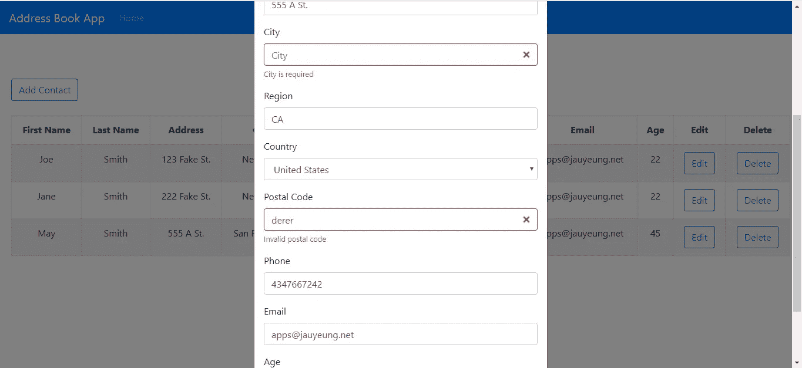
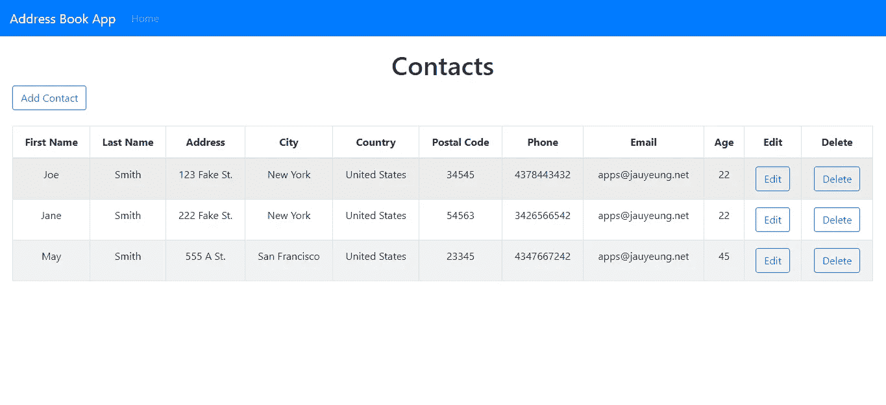

# 如何使用 Redux Form 向 React 应用程序添加表单验证

> 原文：<https://javascript.plainenglish.io/how-to-add-form-validation-to-your-react-app-with-redux-form-42d6ccc85305?source=collection_archive---------0----------------------->

表单验证是 web 应用程序中经常需要的功能。React 没有自带表单验证，因为它应该是一个视图库，为开发人员提供代码结构。幸运的是，开发人员已经提出了许多表单验证解决方案。其中一个是 Redux Form，位于[https://redux-form.com/8.2.2/](https://redux-form.com/8.2.2/)。

顾名思义，Redux Form 使用 Redux 来存储表单数据。它需要自己的 reducer 来存储表单数据。您编写的表单组件连接到内置的 reducer 来存储数据。如果您想获得初始数据，您可以将数据加载到您的 Redux 存储中，然后 Redux Form 可以检索它。

表单值检查和表单验证错误由您提供。你可以在需要的时候从商店获取表单值。通过将我们的定制组件传递到 Redux Form 提供的`Field`组件中，可以很容易地定制表单输入组件。

在本文中，我们将编写一个地址簿应用程序来说明使用 Redux Form 进行表单验证。我们需要有一个 Redux 存储来存储表单数据，编辑时选择的联系人数据，以及联系人列表。首先，我们将通过运行`npx create-react-app address-book`来创建应用程序，从而运行 Create React App。

运行之后，我们添加自己的库。我们需要 Axios 进行 HTTP 请求，React Bootstrap 进行样式化，React Redux 和 Redux 进行状态管理，React Router 进行路由，当然还有 Redux Form 进行表单验证。

我们通过运行以下命令来安装它们:

```
npm i axios react-bootstrap react-redux react-router-fom redux redux-form
```

安装好库后，我们就可以开始编写应用程序了。我们在`src`文件夹中创建所有文件，除非另有说明。首先，我们在`src`文件夹中创建`actionCreators.js`，并添加:

```
import { SET_CONTACTS, LOAD } from "./actions";const setContacts = contacts => {
  return {
    type: SET_CONTACTS,
    payload: contacts
  };
};const setCurrentContact = contact => {
  return {
    type: LOAD,
    data: contact
  };
};export { setContacts, setCurrentContact };
```

这些是我们分派给 Redux 存储的动作和负载。`setContacts`用于设置联系人列表，`setCurrentContact`用于加载联系人进行编辑。

接下来，我们创建`actions.js`并添加:

```
const SET_CONTACTS = "SET_CONTACTS";
const LOAD = "LOAD";export { SET_CONTACTS, LOAD };
```

这些是我们的商店配送行动的行动类型的常数。接下来在`App.js`中，我们将现有代码替换为:

```
import React from "react";
import { Router, Route, Link } from "react-router-dom";
import HomePage from "./HomePage";
import { createBrowserHistory as createHistory } from "history";
import Navbar from "react-bootstrap/Navbar";
import Nav from "react-bootstrap/Nav";
import "./App.css";
const history = createHistory();function App() {
  return (
    <div className="App">
      <Router history={history}>
        <Navbar bg="primary" expand="lg" variant="dark">
          <Navbar.Brand href="#home">Address Book App</Navbar.Brand>
          <Navbar.Toggle aria-controls="basic-navbar-nav" />
          <Navbar.Collapse id="basic-navbar-nav">
            <Nav className="mr-auto">
              <Nav.Link href="/">Home</Nav.Link>
            </Nav>
          </Navbar.Collapse>
        </Navbar>
        <Route path="/" exact component={HomePage} />
      </Router>
    </div>
  );
}export default App;
```

将 React Bootstrap `Navbar`组件添加到页面顶部。我们还为将要创建的主页添加了 React 路由器路由。

接下来，我们创建`ContactForm.js`并添加:

```
import React from "react";
import Form from "react-bootstrap/Form";
import Button from "react-bootstrap/Button";
import PropTypes from "prop-types";
import { addContact, editContact, getContacts } from "./requests";
import { connect } from "react-redux";
import { setContacts, setCurrentContact } from "./actionCreators";
import { Field, reduxForm } from "redux-form";
import { renderInputField } from "./RenderInputField";
import { renderCountryField } from "./RenderCountryField";
import { getFormValues, isInvalid } from "redux-form";const validate = values => {
  const errors = {};
  if (!values.firstName) {
    errors.firstName = "Required";
  }
  if (!values.lastName) {
    errors.lastName = "Required";
  }
  if (!values.city) {
    errors.city = "Required";
  }
  if (!values.address) {
    errors.address = "Required";
  }
  if (!values.region) {
    errors.region = "Required";
  }
  if (!values.postalCode) {
    errors.postalCode = "Required";
  } else {
    if (
      (values.country == "United States" &&
        !/^[0-9]{5}(?:-[0-9]{4})?$/.test(values.postalCode)) ||
      (values.country == "Canada" &&
        !/^[A-Za-z]\d[A-Za-z][ -]?\d[A-Za-z]\d$/.test(values.postalCode))
    ) {
      errors.postalCode = "Invalid postal code";
    }
  }if (!values.phone) {
    errors.phone = "Required";
  } else {
    if (
      (values.country == "United States" || values.country == "Canada") &&
      !/^[2-9]\d{2}[2-9]\d{2}\d{4}$/.test(values.phone)
    ) {
      errors.phone = "Invalid phone";
    }
  }if (!/[^@]+@[^\.]+\..+/.test(values.email)) {
    errors.email = "Invalid email";
  }
  if (Number.isNaN(+values.age) || values.age < 0 || values.age > 200) {
    errors.age = "Age must be between 0 and 200";
  }
  if (!values.country) {
    errors.country = "Required";
  }
  return errors;
};function ContactForm({
  edit,
  onSave,
  setContacts,
  contact,
  onCancelAdd,
  onCancelEdit,
  invalid,
  values,
  currentContact,
  ...props
}) {
  const handleSubmit = async event => {
    if (invalid) {
      return;
    }
    if (!edit) {
      await addContact(values);
    } else {
      await editContact(values);
    }
    const response = await getContacts();
    setContacts(response.data);
    onSave();
  };return (
    <div className="form">
      <Form noValidate onSubmit={props.handleSubmit(handleSubmit.bind(this))}>
        <Field
          name="firstName"
          type="text"
          component={renderInputField}
          label="First Name"
        /><Field
          name="lastName"
          type="text"
          component={renderInputField}
          label="Last Name"
        /><Field
          name="address"
          type="text"
          component={renderInputField}
          label="Address"
        /><Field
          name="city"
          type="text"
          component={renderInputField}
          label="City"
        /><Field
          name="region"
          type="text"
          component={renderInputField}
          label="Region"
        /><Field name="country" component={renderCountryField} label="Country" /><Field
          name="postalCode"
          type="text"
          component={renderInputField}
          label="Postal Code"
        /><Field
          name="phone"
          type="text"
          component={renderInputField}
          label="Phone"
        /><Field
          name="email"
          type="email"
          component={renderInputField}
          label="Email"
        /><Field
          name="age"
          type="text"
          component={renderInputField}
          label="Age"
        /><Button type="submit" style={{ marginRight: "10px" }}>
          Save
        </Button>
        <Button type="button" onClick={edit ? onCancelEdit : onCancelAdd}>
          Cancel
        </Button>
      </Form>
    </div>
  );
}ContactForm.propTypes = {
  edit: PropTypes.bool,
  onSave: PropTypes.func,
  onCancelAdd: PropTypes.func,
  onCancelEdit: PropTypes.func,
  contact: PropTypes.object
};const mapStateToProps = state => {
  return {
    contacts: state.contacts
  };
};const mapDispatchToProps = dispatch => ({
  setContacts: contacts => dispatch(setContacts(contacts))
});ContactForm = connect(state => ({
  values: getFormValues("syncValidation")(state),
  invalid: isInvalid("syncValidation")(state)
}))(ContactForm);ContactForm = connect(
  mapStateToProps,
  mapDispatchToProps
)(ContactForm);ContactForm = reduxForm({
  form: "syncValidation",
  validate,
  enableReinitialize: true
})(ContactForm);ContactForm = connect(state => {
  return {
    initialValues: state.currentContact.data
  };
})(ContactForm);export default ContactForm;
```

这是用于编辑和添加我们的联系人的表单。我们在这里大量使用重叠形式。`Form`组件由 React Bootstrap 提供。`Field`组件来自 Redux 表单。我们将自定义输入字段组件传入字段的`component`道具，以及输入的`name`、`type`和`label`。我们将在我们的定制字段组件`renderInputField`和`renderCountryField`中使用它们。

在`Form`组件的`onSubmit` prop 中，我们将自己的`handleSubmit`函数与`props`中提供的 Redux Form 的`handleSubmit`函数包装在一起，这样我们就可以使用自己的表单提交处理程序，而不是 Redux Form 的`handleSubmit`函数来处理表单提交。

在我们的`handleSubmit`函数中，我们通过从道具中获取`invalid`道具来检查表单的有效性。验证规则在代码顶部的`validate`函数中，我们将它传递给代码底部的`reduxForm`函数。在`validate`函数中，我们在`values`参数中获取表单输入值，并用每个字段的错误信息设置`errors`对象。在这个函数中，我们可以很容易地检查依赖于其他字段的有效性。

一旦表单被检查为有效，其中`invalid`是`false`，那么我们通过传递从 Redux 表单的`connect`函数得到的`value`属性来调用`addContact`或`editContact`，这取决于我们是否在添加并保存数据。然后我们从`mapDispatchToProps`调用`getContacts`和`setContacts`来用后端最新的联系人条目更新我们的 Redux 存储。然后调用从我们将创建的`HomePage.js`传入的`onSave`来关闭模态。

`invalid`和`values`道具是通过运行:

```
ContactForm = connect(state => ({
  values: getFormValues("syncValidation")(state),
  invalid: isInvalid("syncValidation")(state)
}))(ContactForm);
```

此区块:

```
ContactForm = reduxForm({
  form: "syncValidation",
  validate,
  enableReinitialize: true
})(ContactForm);
```

该组件为我们提供了 Redux Form 的表单验证功能，并且通过运行以下命令从我们的存储中检索编辑表单的初始值:

```
ContactForm = connect(state => {
  return {
    initialValues: state.currentContact.data
  };
})(ContactForm);
```

接下来，创建`exports.js`并添加:

```
export const COUNTRIES = [
  "Afghanistan",
  "Albania",
  "Algeria",
  "Andorra",
  "Angola",
  "Anguilla",
  "Antigua &amp; Barbuda",
  "Argentina",
  "Armenia",
  "Aruba",
  "Australia",
  "Austria",
  "Azerbaijan",
  "Bahamas",
  "Bahrain",
  "Bangladesh",
  "Barbados",
  "Belarus",
  "Belgium",
  "Belize",
  "Benin",
  "Bermuda",
  "Bhutan",
  "Bolivia",
  "Bosnia &amp; Herzegovina",
  "Botswana",
  "Brazil",
  "British Virgin Islands",
  "Brunei",
  "Bulgaria",
  "Burkina Faso",
  "Burundi",
  "Cambodia",
  "Cameroon",
  "Canada",
  "Cape Verde",
  "Cayman Islands",
  "Chad",
  "Chile",
  "China",
  "Colombia",
  "Congo",
  "Cook Islands",
  "Costa Rica",
  "Cote D Ivoire",
  "Croatia",
  "Cruise Ship",
  "Cuba",
  "Cyprus",
  "Czech Republic",
  "Denmark",
  "Djibouti",
  "Dominica",
  "Dominican Republic",
  "Ecuador",
  "Egypt",
  "El Salvador",
  "Equatorial Guinea",
  "Estonia",
  "Ethiopia",
  "Falkland Islands",
  "Faroe Islands",
  "Fiji",
  "Finland",
  "France",
  "French Polynesia",
  "French West Indies",
  "Gabon",
  "Gambia",
  "Georgia",
  "Germany",
  "Ghana",
  "Gibraltar",
  "Greece",
  "Greenland",
  "Grenada",
  "Guam",
  "Guatemala",
  "Guernsey",
  "Guinea",
  "Guinea Bissau",
  "Guyana",
  "Haiti",
  "Honduras",
  "Hong Kong",
  "Hungary",
  "Iceland",
  "India",
  "Indonesia",
  "Iran",
  "Iraq",
  "Ireland",
  "Isle of Man",
  "Israel",
  "Italy",
  "Jamaica",
  "Japan",
  "Jersey",
  "Jordan",
  "Kazakhstan",
  "Kenya",
  "Kuwait",
  "Kyrgyz Republic",
  "Laos",
  "Latvia",
  "Lebanon",
  "Lesotho",
  "Liberia",
  "Libya",
  "Liechtenstein",
  "Lithuania",
  "Luxembourg",
  "Macau",
  "Macedonia",
  "Madagascar",
  "Malawi",
  "Malaysia",
  "Maldives",
  "Mali",
  "Malta",
  "Mauritania",
  "Mauritius",
  "Mexico",
  "Moldova",
  "Monaco",
  "Mongolia",
  "Montenegro",
  "Montserrat",
  "Morocco",
  "Mozambique",
  "Namibia",
  "Nepal",
  "Netherlands",
  "Netherlands Antilles",
  "New Caledonia",
  "New Zealand",
  "Nicaragua",
  "Niger",
  "Nigeria",
  "Norway",
  "Oman",
  "Pakistan",
  "Palestine",
  "Panama",
  "Papua New Guinea",
  "Paraguay",
  "Peru",
  "Philippines",
  "Poland",
  "Portugal",
  "Puerto Rico",
  "Qatar",
  "Reunion",
  "Romania",
  "Russia",
  "Rwanda",
  "Saint Pierre &amp; Miquelon",
  "Samoa",
  "San Marino",
  "Satellite",
  "Saudi Arabia",
  "Senegal",
  "Serbia",
  "Seychelles",
  "Sierra Leone",
  "Singapore",
  "Slovakia",
  "Slovenia",
  "South Africa",
  "South Korea",
  "Spain",
  "Sri Lanka",
  "St Kitts &amp; Nevis",
  "St Lucia",
  "St Vincent",
  "St. Lucia",
  "Sudan",
  "Suriname",
  "Swaziland",
  "Sweden",
  "Switzerland",
  "Syria",
  "Taiwan",
  "Tajikistan",
  "Tanzania",
  "Thailand",
  "Timor L'Este",
  "Togo",
  "Tonga",
  "Trinidad &amp; Tobago",
  "Tunisia",
  "Turkey",
  "Turkmenistan",
  "Turks &amp; Caicos",
  "Uganda",
  "Ukraine",
  "United Arab Emirates",
  "United Kingdom",
  "United States",
  "United States Minor Outlying Islands",
  "Uruguay",
  "Uzbekistan",
  "Venezuela",
  "Vietnam",
  "Virgin Islands (US)",
  "Yemen",
  "Zambia",
  "Zimbabwe"
];
```

所以我们在国家字段下拉列表中得到一系列国家。

接下来在`HomePage.css`中，我们添加:

```
.home-page {
    padding: 20px;
}
```

给我们的页面加些填充。

然后我们创建`HomePage.js`并添加:

```
import React from "react";
import { useState, useEffect } from "react";
import Table from "react-bootstrap/Table";
import ButtonToolbar from "react-bootstrap/ButtonToolbar";
import Button from "react-bootstrap/Button";
import Modal from "react-bootstrap/Modal";
import ContactForm from "./ContactForm";
import "./HomePage.css";
import { connect } from "react-redux";
import { getContacts, deleteContact } from "./requests";
import { setCurrentContact } from "./actionCreators";function HomePage({ setCurrentContact }) {
  const [openAddModal, setOpenAddModal] = useState(false);
  const [openEditModal, setOpenEditModal] = useState(false);
  const [initialized, setInitialized] = useState(false);
  const [selectedContact, setSelectedContact] = useState({});
  const [contacts, setContacts] = useState([]); const openModal = () => {
    setOpenAddModal(true);
  }; const closeModal = () => {
    setOpenAddModal(false);
    setOpenEditModal(false);
    getData();
  }; const cancelAddModal = () => {
    setOpenAddModal(false);
  }; const editContact = contact => {
    setSelectedContact(contact);
    setCurrentContact(contact);
    setOpenEditModal(true);
  }; const cancelEditModal = () => {
    setOpenEditModal(false);
  }; const getData = async () => {
    const response = await getContacts();
    setContacts(response.data);
    setInitialized(true);
  }; const deleteSelectedContact = async id => {
    await deleteContact(id);
    getData();
  }; useEffect(() => {
    if (!initialized) {
      getData();
    }
  }); return (
    <div className="home-page">
      <h1>Contacts</h1>
      <Modal show={openAddModal} onHide={closeModal}>
        <Modal.Header closeButton>
          <Modal.Title>Add Contact</Modal.Title>
        </Modal.Header>
        <Modal.Body>
          <ContactForm
            edit={false}
            onSave={closeModal.bind(this)}
            onCancelAdd={cancelAddModal}
          />
        </Modal.Body>
      </Modal> <Modal show={openEditModal} onHide={closeModal}>
        <Modal.Header closeButton>
          <Modal.Title>Edit Contact</Modal.Title>
        </Modal.Header>
        <Modal.Body>
          <ContactForm
            edit={true}
            onSave={closeModal.bind(this)}
            contact={selectedContact}
            onCancelEdit={cancelEditModal}
          />
        </Modal.Body>
      </Modal>
      <ButtonToolbar onClick={openModal}>
        <Button variant="outline-primary">Add Contact</Button>
      </ButtonToolbar>
      <br />
      <div className="table-responsive">
        <Table striped bordered hover>
          <thead>
            <tr>
              <th>First Name</th>
              <th>Last Name</th>
              <th>Address</th>
              <th>City</th>
              <th>Country</th>
              <th>Postal Code</th>
              <th>Phone</th>
              <th>Email</th>
              <th>Age</th>
              <th>Edit</th>
              <th>Delete</th>
            </tr>
          </thead>
          <tbody>
            {contacts.map(c => (
              <tr key={c.id}>
                <td>{c.firstName}</td>
                <td>{c.lastName}</td>
                <td>{c.address}</td>
                <td>{c.city}</td>
                <td>{c.country}</td>
                <td>{c.postalCode}</td>
                <td>{c.phone}</td>
                <td>{c.email}</td>
                <td>{c.age}</td>
                <td>
                  <Button
                    variant="outline-primary"
                    onClick={editContact.bind(this, c)}
                  >
                    Edit
                  </Button>
                </td>
                <td>
                  <Button
                    variant="outline-primary"
                    onClick={deleteSelectedContact.bind(this, c.id)}
                  >
                    Delete
                  </Button>
                </td>
              </tr>
            ))}
          </tbody>
        </Table>
      </div>
    </div>
  );
}const mapStateToProps = state => {
  return {
    contacts: state.contacts
  };
};const mapDispatchToProps = dispatch => ({
  setCurrentContact: contact => dispatch(setCurrentContact(contact))
});export default connect(
  mapStateToProps,
  mapDispatchToProps
)(HomePage);
```

这是我们应用程序的主页。我们有一个打开模态的按钮和一个显示地址簿条目的表格。此外，我们还有用`openModal`、`closeModal`、`cancelAddModal`和`cancelEditModal`功能打开和关闭模态的功能。我们有一个用于添加的模块和一个用于编辑联系人的模块，它们打开相同的表单。当使用`editContact`函数打开编辑模式时，运行由`mapDispatchToProps`函数通过 props 提供的`setCurrentContact`，设置正在编辑的当前触点，以便可以像我们所做的那样通过调用`connect`函数为我们的`ContactForm`组件的`initialValues`检索它。我们有编辑和删除按钮分别调用`editContact`和`deleteSelectedContact`。

在`index.js`中，将现有代码替换为:

```
import React from "react";
import ReactDOM from "react-dom";
import "./index.css";
import App from "./App";
import * as serviceWorker from "./serviceWorker";
import { createStore, combineReducers } from "redux";
import { reducer as formReducer } from "redux-form";
import { Provider } from "react-redux";
import { contactsReducer, currentContactReducer } from "./reducers";const rootReducer = combineReducers({
  form: formReducer,
  contacts: contactsReducer,
  currentContact: currentContactReducer
});const store = createStore(rootReducer);ReactDOM.render(
  <Provider store={store}>
    <App />
  </Provider>,
  document.getElementById("root")
);// If you want your app to work offline and load faster, you can change
// unregister() to register() below. Note this comes with some pitfalls.
// Learn more about service workers: [https://bit.ly/CRA-PWA](https://bit.ly/CRA-PWA)
serviceWorker.unregister();
```

注入我们的 Redux 商店，使其在我们的应用程序中可用。

然后创建`reducers.js`并添加:

```
import { SET_CONTACTS, LOAD } from "./actions";function contactsReducer(state = {}, action) {
  switch (action.type) {
    case SET_CONTACTS:
      state = JSON.parse(JSON.stringify(action.payload));
      return state;
    default:
      return state;
  }
}function currentContactReducer(state = {}, action) {
  switch (action.type) {
    case LOAD:
      return {
        data: action.data
      };
    default:
      return state;
  }
}export { contactsReducer, currentContactReducer };
```

来制造我们之前提到的两个减速器。

接下来，创建`RenderCountryField.js`并添加:

```
import React from "react";
import Form from "react-bootstrap/Form";
import Col from "react-bootstrap/Col";
import { COUNTRIES } from "./exports";export const renderCountryField = ({
  input,
  label,
  type,
  meta: { touched, error, warning }
}) => (
  <Form.Row>
    <Form.Group as={Col} md="12" controlId="country">
      <Form.Label>{label}</Form.Label>
      <Form.Control
        as="select"
        type={type}
        placeholder={label}
        {...input}
        isInvalid={touched && error}
      >
        {COUNTRIES.map(c => (
          <option key={c} value={c}>
            {c}
          </option>
        ))}
      </Form.Control>
      <Form.Control.Feedback type="invalid">
        {touched && error}
      </Form.Control.Feedback>
    </Form.Group>
  </Form.Row>
);
```

创建带有表单验证的国家下拉列表，我们将它传递到`ContactForm.js`中`Field`组件的`component`属性中。

接下来创建`RenderInputField.js`并添加:

```
import React from "react";
import Form from "react-bootstrap/Form";
import Col from "react-bootstrap/Col";export const renderInputField = ({
  input,
  label,
  type,
  meta: { touched, error, warning }
}) => (
  <Form.Row>
    <Form.Group as={Col} md="12">
      <Form.Label>{label}</Form.Label>
      <Form.Control
        type={type}
        placeholder={label}
        {...input}
        isInvalid={touched && error}
      />
      <Form.Control.Feedback type="invalid">
        {touched &&
          ((error && <span>{error}</span>) ||
            (warning && <span>{warning}</span>))}
      </Form.Control.Feedback>
    </Form.Group>
  </Form.Row>
);
```

为我们的联系表单创建文本输入。

两个输入都使用 React Bootstrap 的`Form`组件。

接下来，创建`requests.js`并添加:

```
const APIURL = '[http://localhost:3000'](http://localhost:3000');
const axios = require('axios');
export const getContacts = () => axios.get(`${APIURL}/contacts`);export const addContact = (data) => axios.post(`${APIURL}/contacts`, data);export const editContact = (data) => axios.put(`${APIURL}/contacts/${data.id}`, data);export const deleteContact = (id) => axios.delete(`${APIURL}/contacts/${id}`);
```

创建向我们的后端发出 HTTP 请求的函数，以保存我们的联系数据。

最后，在`index.html`中，将现有代码替换为:

```
<!DOCTYPE html>
<html lang="en">
  <head>
    <meta charset="utf-8" />
    <link rel="shortcut icon" href="%PUBLIC_URL%/favicon.ico" />
    <meta name="viewport" content="width=device-width, initial-scale=1" />
    <meta name="theme-color" content="#000000" />
    <meta
      name="description"
      content="Web site created using create-react-app"
    />
    <link rel="apple-touch-icon" href="logo192.png" />
    <!--
      manifest.json provides metadata used when your web app is installed on a
      user's mobile device or desktop. See [https://developers.google.com/web/fundamentals/web-app-manifest/](https://developers.google.com/web/fundamentals/web-app-manifest/)
    -->
    <link rel="manifest" href="%PUBLIC_URL%/manifest.json" />
    <!--
      Notice the use of %PUBLIC_URL% in the tags above.
      It will be replaced with the URL of the `public` folder during the build.
      Only files inside the `public` folder can be referenced from the HTML.Unlike "/favicon.ico" or "favicon.ico", "%PUBLIC_URL%/favicon.ico" will
      work correctly both with client-side routing and a non-root public URL.
      Learn how to configure a non-root public URL by running `npm run build`.
    -->
    <title>React Address Book App</title>
    <link
      rel="stylesheet"
      href="[https://maxcdn.bootstrapcdn.com/bootstrap/4.3.1/css/bootstrap.min.css](https://maxcdn.bootstrapcdn.com/bootstrap/4.3.1/css/bootstrap.min.css)"
      integrity="sha384-ggOyR0iXCbMQv3Xipma34MD+dH/1fQ784/j6cY/iJTQUOhcWr7x9JvoRxT2MZw1T"
      crossorigin="anonymous"
    />
  </head>
  <body>
    <noscript>You need to enable JavaScript to run this app.</noscript>
    <div id="root"></div>
    <!--
      This HTML file is a template.
      If you open it directly in the browser, you will see an empty page.You can add webfonts, meta tags, or analytics to this file.
      The build step will place the bundled scripts into the <body> tag.To begin the development, run `npm start` or `yarn start`.
      To create a production bundle, use `npm run build` or `yarn build`.
    -->
  </body>
</html>
```

更改我们的应用程序标题并添加我们的引导 CSS。

现在，我们可以通过在 Windows 上运行`set PORT=3001 && react-scripts start`或在 Linux 上运行`PORT=3006 react-scripts start`来运行应用程序。

为了启动后端，我们首先通过运行`npm i json-server`来安装`json-server`包。然后，转到我们的项目文件夹并运行:

```
json-server --watch db.json
```

在`db.json`中，将文本改为:

```
{
  "contacts": [
  ]
}
```

所以我们有了定义在可用的`requests.js`中的`contacts`端点。

