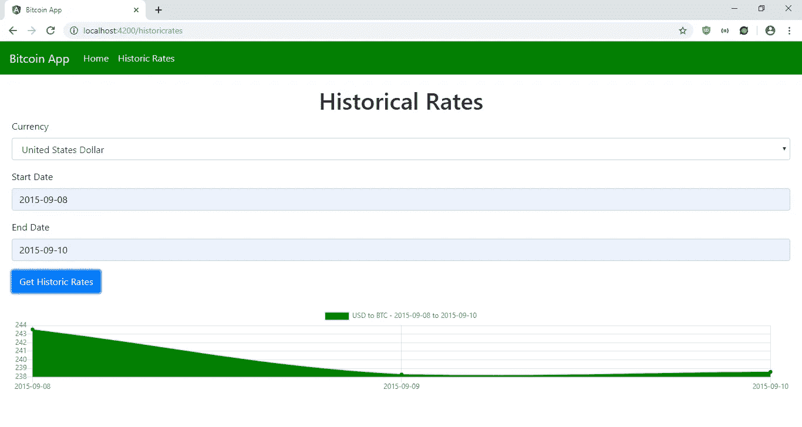
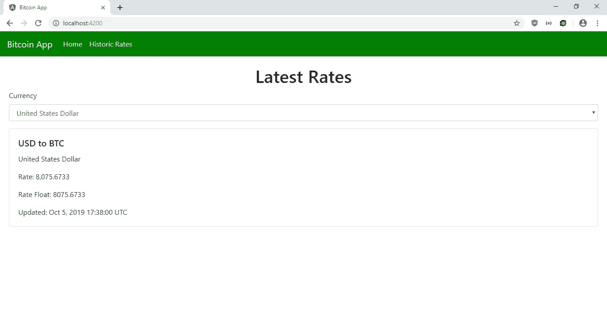

# 如何向 Angular 应用程序添加图形和图表

> 原文：<https://javascript.plainenglish.io/how-to-add-graphs-and-charts-to-an-angular-app-508ac895067f?source=collection_archive---------4----------------------->

图形和图表是许多应用程序的常见功能。从零开始制作它们会非常困难，因为有这么多类型的图形和图表，你必须得到数据并把它们都画在屏幕上。还需要将它们缩放到不同的屏幕尺寸，这增加了从头制作图表的难度。

幸运的是，许多人已经走到一起解决这个问题。在 Angular 中，我们可以使用基于角度图表的图表库 angular2-charts，位于[https://github.com/emn178/angular2-chartjs](https://github.com/emn178/angular2-chartjs)。

它基于许多 web 应用程序使用的流行的 Chart.js 库。它支持添加折线图、条形图、饼图、圆环图，以及不同种类的填充和颜色。完整的图表列表在 https://www.chartjs.org/samples/latest/上。

在本文中，我们将构建一个有角度的比特币 app，显示不同国家的货币与比特币之间的最新和历史汇率。我们将显示历史汇率的折线图。用户可以按不同的货币和日期范围过滤历史汇率。

为了获得货币列表，我们使用位于[https://docs.openexchangerates.org/docs/currencies-json](https://docs.openexchangerates.org/docs/currencies-json)的开放汇率 API `currencies`端点。我们从位于 https://www.coindesk.com/api 的 Coindesk API 获取比特币数据。

首先，我们将通过运行以下命令创建一个 Angular 应用程序:

```
ng new bitcoin-app
```

当向导运行时，我们选择包含路由，并为 CSS 预处理程序选择 SCSS。接下来，我们安装一些我们需要的包。我们需要`angular2-chartjs`用于图表，MobX 用于状态管理，Ngx-Bootstrap 用于样式化。要安装它们，我们运行:

```
npm i angular2-chartjs mobx mobx-angular ngx-bootstrap
```

现在我们准备开始构建应用程序。我们通过运行以下命令来创建组件、服务和 MobX 商店:

```
ng g component historicRatesPage
ng g component homePage
ng g service bitcoin
ng g class currenciesStore
```

创建好一切后，我们准备添加一些代码。首先，我们转到`historic-rates-page.component.html`文件并添加:

```
<form
  (ngSubmit)="getHistoricRates(historicRateForm)"
  #historicRateForm="ngForm"
>
  <h1 class="text-center">Historical Rates</h1>
  <div class="form-group">
    <label>Currency</label>
    <select
      class="form-control"
      #currency="ngModel"
      name="currency"
      [(ngModel)]="form.currency"
      required
    >
      <option *ngFor="let c of currencies" [value]="c.value">
        {{ c.name }}
      </option>
    </select>
    <div *ngIf="currency?.invalid && (currency.dirty || currency.touched)">
      <div *ngIf="currency.errors.required">
        Currency is required.
      </div>
    </div>
  </div><div class="form-group">
    <label>Start Date</label>
    <input
      type="text"
      class="form-control"
      placeholder="Start Date"
      #startDate="ngModel"
      name="startDate"
      [(ngModel)]="form.startDate"
      required
      pattern="([12]\d{3}-(0[1-9]|1[0-2])-(0[1-9]|[12]\d|3[01]))"
    />
    <div *ngIf="startDate?.invalid && (startDate.dirty || startDate.touched)">
      <div *ngIf="startDate.errors.required">
        Start date is required.
      </div>
      <div *ngIf="startDate.invalid">
        Start date is invalid.
      </div>
    </div>
  </div><div class="form-group">
    <label>End Date</label>
    <input
      type="text"
      class="form-control"
      placeholder="End Date"
      #endDate="ngModel"
      name="endDate"
      [(ngModel)]="form.endDate"
      required
      pattern="([12]\d{3}-(0[1-9]|1[0-2])-(0[1-9]|[12]\d|3[01]))"
    />
    <div *ngIf="endDate?.invalid && (endDate.dirty || endDate.touched)">
      <div *ngIf="endDate.errors.required">
        End date is required.
      </div>
      <div *ngIf="endDate.invalid">
        End date is invalid.
      </div>
    </div>
  </div><button class="btn btn-primary">Get Historic Rates</button>
</form><br />
<chart type="line" [data]="data" [options]="options"></chart>
```

这个文件的表单允许用户输入货币和日期范围，以便查找历史汇率。`chart`组件是我们用来显示折线图的`angular2-chartjs`组件。我们指定我们想要一个折线图。`data` 和`options`在我们将要编写的组件代码中。

在表单中，我们在开始和结束日期输入中使用了该模式，以确保用户在提交日期之前以 YYYY-MM-DD 模式输入日期。我们还要求所有的表单字段。

接下来在`historic-rates-page.component.ts`中，我们替换现有代码:

```
import { Component, OnInit } from '[@angular/core](http://twitter.com/angular/core)';
import { currenciesStore } from '../currencies-store';
import { BitcoinService } from '../bitcoin.service';
import { NgForm } from '[@angular/forms](http://twitter.com/angular/forms)';[@Component](http://twitter.com/Component)({
  selector: 'app-historic-rates-page',
  templateUrl: './historic-rates-page.component.html',
  styleUrls: ['./historic-rates-page.component.scss']
})
export class HistoricRatesPageComponent implements OnInit {
  store = currenciesStore;
  form: any = <any>{
    currency: 'USD',
    startDate: '',
    endDate: ''
  }
  currencies: any[] = [];
  data: any = <any>{
    labels: [],
    datasets: []
  };
  options = {
    responsive: true,
    maintainAspectRatio: false
  }; constructor(private bitcoinService: BitcoinService) { } ngOnInit() {
    if (Object.keys(this.store.currencies).length == 0) {
      this.getCurrencies();
    }
    else {
      this.currencies = Object.keys(this.store.currencies).map(key => ({
        name: this.store.currencies[key],
        value: key
      }))
    }
  } getCurrencies() {
    this.bitcoinService.getCurrencies()
      .subscribe(res => {
        this.store.setCurrencies(res);
        this.currencies = Object.keys(this.store.currencies).map(key => ({
          name: this.store.currencies[key],
          value: key
        }))
      }, err => {}, () => {})
  } getHistoricRates(historicRateForm: NgForm) {
    if (historicRateForm.invalid) {
      return;
    }
    const { currency, startDate, endDate } = this.form;
    this.bitcoinService.getHistoricRates(currency, startDate, endDate)
      .subscribe((res: any) => {
        this.data = {
          labels: Object.keys(res.bpi),
          datasets: [
            {
              label: `${currency} to BTC - ${startDate} to ${endDate}`,
              data: Object.keys(res.bpi).map(key => res.bpi[key]),
              backgroundColor: 'green'
            }
          ]
        }
      })
  }}
```

在这里，我们从我们的 MobX 商店获取货币，如果它们被加载的话。如果不是，我们会把它们拿到店里。我们将 store 对象映射到`this.currencies`,这样我们得到的是一个数组而不是一个对象，我们用它来填充货币下拉列表。

如果需要，我们运行`getCurrencies`函数来获取货币。当用户提交表单时，我们运行`getHistoricRates`函数来获取数据并对其进行处理，这样它们就可以用`angular2-chartjs.`显示出来。数据必须与我们在代码中的结构相同。

`datasets`数组可以有多个条目，具有相同结构的对象显示多行。`backgroundColor`是可选的。

接下来，我们修改`home-page.component.html`，将现有代码替换为:

```
<form>
  <h1 class="text-center">Latest Rates</h1>
  <div class="form-group">
    <label>Currency</label>
    <select
      class="form-control"
      #currency="ngModel"
      name="currency"
      [(ngModel)]="form.currency"
      required
      (change)="getLatestRates()"
    >
      <option *ngFor="let c of currencies" [value]="c.value">
        {{ c.name }}
      </option>
    </select>
    <div *ngIf="currency?.invalid && (currency.dirty || currency.touched)">
      <div *ngIf="currency.errors.required">
        Currency is required.
      </div>
    </div>
  </div>
</form><div class="card" *ngIf="rate?.bpi">
  <div class="card-body">
    <h5 class="card-title">{{ form.currency }} to BTC</h5>
    <p class="card-text">
      {{ rate.bpi[form.currency].description }}
    </p>
    <p class="card-text">Rate: {{ rate.bpi[form.currency].rate }}</p>
    <p class="card-text">
      Rate Float: {{ rate.bpi[form.currency].rate_float }}
    </p>
    <p class="card-text">Updated: {{ rate.time.updated }}</p>
  </div>
</div>
```

我们有一个货币下拉菜单，用户可以选择。当选择改变时，我们得到所选货币和比特币之间的最新汇率。价格显示在卡片上。

接下来在`home-page.component.ts`中，我们将现有代码替换为:

```
import { Component, OnInit } from '[@angular/core](http://twitter.com/angular/core)';
import { currenciesStore } from '../currencies-store';
import { BitcoinService } from '../bitcoin.service';[@Component](http://twitter.com/Component)({
  selector: 'app-home-page',
  templateUrl: './home-page.component.html',
  styleUrls: ['./home-page.component.scss']
})
export class HomePageComponent implements OnInit {
  store = currenciesStore;
  form: any = <any>{}
  currencies: any[] = [];
  rate: any = <any>{};constructor(private bitcoinService: BitcoinService) { } ngOnInit() {
    this.form.currency = 'USD';
    if (Object.keys(this.store.currencies).length == 0) {
      this.getCurrencies();
    }
    else {
      this.currencies = Object.keys(this.store.currencies).map(key => ({
        name: this.store.currencies[key],
        value: key
      }))
      this.getLatestRates();
    }
  } getCurrencies() {
    this.bitcoinService.getCurrencies()
      .subscribe(res => {
        this.store.setCurrencies(res);
        this.currencies = Object.keys(this.store.currencies).map(key => ({
          name: this.store.currencies[key],
          value: key
        }))
      }, err => {}, () => {
        this.getLatestRates()
      })
  } getLatestRates() {
    this.bitcoinService.getLatestRates(this.form.currency)
      .subscribe(res => {
        this.rate = res;
      })
  }}
```

我们有与`historic-rates-page`组件工作方式相同的`getCurrencies`函数，以及我们在`change`事件的模板中引用的`getLatestRates`。

在`app-routing.module.ts`中，我们输入:

```
import { NgModule } from '[@angular/core](http://twitter.com/angular/core)';
import { Routes, RouterModule } from '[@angular/router](http://twitter.com/angular/router)';
import { HomePageComponent } from './home-page/home-page.component';
import { HistoricRatesPageComponent } from './historic-rates-page/historic-rates-page.component';const routes: Routes = [
  { path: '', component: HomePageComponent },
  { path: 'historicrates', component: HistoricRatesPageComponent },
];[@NgModule](http://twitter.com/NgModule)({
  imports: [RouterModule.forRoot(routes)],
  exports: [RouterModule]
})
export class AppRoutingModule { }
```

因此，当用户点击链接或输入 URL 时，他们可以看到我们刚刚添加的页面。

接下来在`app.component.html`中，我们放入:

```
<nav class="navbar navbar-expand-lg navbar-light bg-light">
  <a class="navbar-brand" routerLink="/">Bitcoin App</a>
  <button
    class="navbar-toggler"
    type="button"
    data-toggle="collapse"
    data-target="#navbarSupportedContent"
    aria-controls="navbarSupportedContent"
    aria-expanded="false"
    aria-label="Toggle navigation"
  >
    <span class="navbar-toggler-icon"></span>
  </button> <div class="collapse navbar-collapse" id="navbarSupportedContent">
    <ul class="navbar-nav mr-auto">
      <li class="nav-item active">
        <a class="nav-link" routerLink="/">Home </a>
      </li>
      <li class="nav-item active">
        <a class="nav-link" routerLink="/historicrates">Historic Rates </a>
      </li>
    </ul>
  </div>
</nav><div class="page">
  <router-outlet></router-outlet>
</div>
```

向我们的页面添加链接，并暴露`router-outlet`以便用户可以看到我们的页面。

然后在`app.component.scss`中，我们添加:

```
.page {
  padding: 20px;
}nav {
  background-color: green !important;
  .navbar-brand,
  .nav-link,
  .navbar-toggler-icon {
    color: white !important;
  }}
```

添加填充到我们的页面，并改变我们的引导导航栏的颜色。

接下来在`app.component.ts`中，我们放入:

```
import { Component } from '[@angular/core](http://twitter.com/angular/core)';[@Component](http://twitter.com/Component)({
  selector: 'app-root',
  templateUrl: './app.component.html',
  styleUrls: ['./app.component.scss']
})
export class AppComponent {
  constructor() {
    (window as any).Chart.defaults.global.defaultFontFamily = `
    -apple-system, BlinkMacSystemFont, "Segoe UI", "Roboto", "Oxygen",
    "Ubuntu", "Cantarell", "Fira Sans", "Droid Sans", "Helvetica Neue",
    sans-serif`;
  }
}
```

来改变我们的图表的字体，以匹配应用程序的其余部分。

在`app.module.ts`中，我们将现有代码替换为:

```
import { BrowserModule } from '[@angular/platform-browser](http://twitter.com/angular/platform-browser)';
import { NgModule } from '[@angular/core](http://twitter.com/angular/core)';import { AppRoutingModule } from './app-routing.module';
import { AppComponent } from './app.component';
import { HomePageComponent } from './home-page/home-page.component';
import { HistoricRatesPageComponent } from './historic-rates-page/historic-rates-page.component';
import { ModalModule } from 'ngx-bootstrap/modal';
import { MobxAngularModule } from 'mobx-angular';
import { BitcoinService } from './bitcoin.service';
import { FormsModule } from '[@angular/forms](http://twitter.com/angular/forms)';
import { HttpClientModule } from '[@angular/common](http://twitter.com/angular/common)/http';
import { ChartModule } from 'angular2-chartjs';[@NgModule](http://twitter.com/NgModule)({
  declarations: [
    AppComponent,
    HomePageComponent,
    HistoricRatesPageComponent
  ],
  imports: [
    BrowserModule,
    AppRoutingModule,
    FormsModule,
    HttpClientModule,
    ModalModule.forRoot(),
    MobxAngularModule,
    ChartModule
  ],
  providers: [
    BitcoinService
  ],
  bootstrap: [AppComponent]
})
export class AppModule { }
```

我们添加我们在应用中使用的组件、服务和库。

在`bitcoin.service.ts`中，我们将代码替换为:

```
import { Injectable } from '[@angular/core](http://twitter.com/angular/core)';
import { HttpClient } from '[@angular/common](http://twitter.com/angular/common)/http';
import { environment } from 'src/environments/environment';[@Injectable](http://twitter.com/Injectable)({
  providedIn: 'root'
})
export class BitcoinService { constructor(private http: HttpClient) { } getCurrencies() {
    return this.http.get('[https://openexchangerates.org/api/currencies.json'](https://openexchangerates.org/api/currencies.json'))
  } getLatestRates(code) {
    return this.http.get(`${environment.coinDeskUrl}/currentprice/${code}.json`)
  } getHistoricRates(currency, startDate, endDate) {
    return this.http.get(`${environment.coinDeskUrl}/historical/close.json?currency=${currency}&start=${startDate}&end=${endDate}`)
  }
}
```

让我们在组件中发出请求以获取必要的数据。

接下来在`currencies-store.ts`中，我们添加:

```
import { observable, action } from 'mobx-angular';class CurrenciesStore {
    [@observable](http://twitter.com/observable) currencies = [];
    [@action](http://twitter.com/action) setCurrencies(currencies) {
        this.currencies = currencies;
    }
}export const currenciesStore = new CurrenciesStore();
```

创建 MobX store 来让我们的组件共享数据。每当我们在组件中调用`this.store.setCurrencies`时，我们就在这个存储中设置货币数据，因为我们在它之前添加了`@action`装饰器。当我们在组件代码中调用`this.store.cuurencies`时，我们总是从这个商店获得最新的值，因为它有`@observable`装饰器。

接下来在`environment.ts`和`environment.prod.ts`中，我们将现有代码替换为:

```
export const environment = {
  production: true,
  coinDeskUrl: '[https://api.coindesk.com/v1/bpi'](https://api.coindesk.com/v1/bpi')
};
```

把我们的 API URLs 放在一个共享的地方。

最后，在`index.html`中，我们将代码替换为:

```
<!DOCTYPE html>
<html lang="en">
  <head>
    <meta charset="utf-8" />
    <title>Bitcoin App</title>
    <base href="/" />
    <link
      href="[https://maxcdn.bootstrapcdn.com/bootstrap/4.0.0/css/bootstrap.min.css](https://maxcdn.bootstrapcdn.com/bootstrap/4.0.0/css/bootstrap.min.css)"
      rel="stylesheet"
    />
    <script
      src="[https://code.jquery.com/jquery-3.3.1.slim.min.js](https://code.jquery.com/jquery-3.3.1.slim.min.js)"
      integrity="sha384-q8i/X+965DzO0rT7abK41JStQIAqVgRVzpbzo5smXKp4YfRvH+8abtTE1Pi6jizo"
      crossorigin="anonymous"
    ></script>
    <script
      src="[https://cdnjs.cloudflare.com/ajax/libs/popper.js/1.14.7/umd/popper.min.js](https://cdnjs.cloudflare.com/ajax/libs/popper.js/1.14.7/umd/popper.min.js)"
      integrity="sha384-UO2eT0CpHqdSJQ6hJty5KVphtPhzWj9WO1clHTMGa3JDZwrnQq4sF86dIHNDz0W1"
      crossorigin="anonymous"
    ></script>
    <script
      src="[https://stackpath.bootstrapcdn.com/bootstrap/4.3.1/js/bootstrap.min.js](https://stackpath.bootstrapcdn.com/bootstrap/4.3.1/js/bootstrap.min.js)"
      integrity="sha384-JjSmVgyd0p3pXB1rRibZUAYoIIy6OrQ6VrjIEaFf/nJGzIxFDsf4x0xIM+B07jRM"
      crossorigin="anonymous"
    ></script><meta name="viewport" content="width=device-width, initial-scale=1" />
    <link rel="icon" type="image/x-icon" href="favicon.ico" />
  </head>
  <body>
    <app-root></app-root>
  </body>
</html>
```

将引导 CSS 和 JavaScript 依赖项添加到我们的应用程序中，并更改标题。

做完所有工作，我们就可以运行`ng serve`来运行 app 了。那么我们应该得到:

